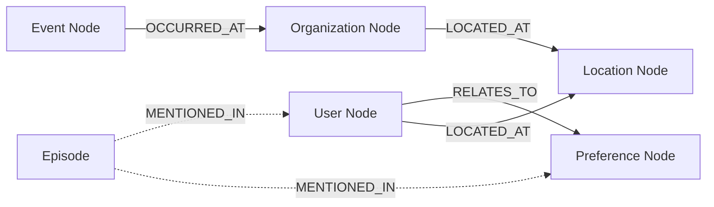

# zep-graph — Data Model

> **Database**: Neo4j (primary graph store)

## Neo4j Node Types

| Node Type | Labels | Properties |
|-----------|--------|------------|
| EntityNode | `:Entity:{type}` | uuid, name, node_type, group_id, summary, labels[], properties{}, created_at |
| Episode | `:Episode` | uuid, name, content, group_id, source_id, created_at |

## Neo4j Relationship Types

| Relationship | Properties | Description |
|--------------|------------|-------------|
| `:RELATES_TO` | uuid, name, fact, edge_type, valid_at, invalid_at, expired_at | Temporal fact edge |
| `:LOCATED_AT` | — | Entity → Location |
| `:OCCURRED_AT` | — | Event → Entity/Location |
| `:MENTIONED_IN` | — | Entity/Edge → Episode |

## Temporal Annotations

```
valid_at   → when the fact became true
invalid_at → when the fact ceased to be true
expired_at → when the fact was superseded by a newer fact

Example:
  "Alice worked at Acme" → valid_at: 2020-01-01, invalid_at: 2023-06-30
  "Alice works at Beta"  → valid_at: 2023-07-01 (current)
```

## Group ID Strategy

```
GroupID = user_id | session_id
Episode source_id = {groupID}-{messageUUID}  (prefixed for namespace isolation)
```

## Entity-Relationship Diagram (Neo4j)



## Node Ontology Priority

| Priority | Types | Extraction Threshold |
|----------|-------|---------------------|
| 1 | User, Assistant | Singleton (always extract) |
| 2 | Preference | LOW threshold |
| 3 | Organization, Event | MEDIUM threshold |
| 4 | Location, Document | HIGH threshold |
| 5 | Topic | HIGH threshold |
| 6 | Object | Last resort |
