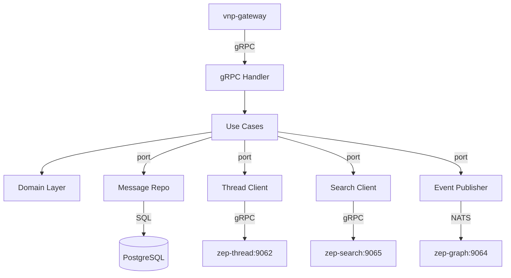

# zep-memory — Service Architecture

> **Group**: Zep | **Pattern**: 4-layer Clean Architecture | **Role**: Core Orchestrator

## Layer Structure

```
services/zep-memory/
├── cmd/server/main.go
├── internal/
│   ├── domain/
│   │   ├── memory.go              # Memory entity (messages + facts overlay)
│   │   ├── message.go             # Message entity
│   │   ├── role_type.go           # RoleType enum (norole|system|assistant|user|function|tool)
│   │   ├── fact.go                # Fact value object (from Graphiti)
│   │   ├── event.go               # MessagesIngested, MemoryDeleted events
│   │   └── errors.go              # ErrSessionEnded, ErrEmptyMessages
│   ├── usecase/
│   │   ├── put_memory.go          # PutMemory — ingest + trigger extraction
│   │   ├── get_memory.go          # GetMemory — assemble context
│   │   ├── delete_memory.go       # DeleteMemory — soft delete messages
│   │   ├── get_messages.go        # GetMessagesForSession — paginated
│   │   ├── get_message.go         # GetMessage by UUID
│   │   ├── update_message.go      # UpdateMessageMetadata
│   │   ├── get_user_context.go    # GetUserContext — formatted for LLMs
│   │   ├── port/
│   │   │   ├── input.go           # MemoryService interface
│   │   │   └── output.go          # MessageRepository, ThreadClient, SearchClient, EventPublisher
│   │   └── dto/
│   ├── adapter/
│   │   ├── grpc/handler.go, mapper.go
│   │   ├── repository/postgres/message_repo.go, model.go
│   │   ├── client/
│   │   │   ├── thread_client.go   # gRPC → zep-thread
│   │   │   └── search_client.go   # gRPC → zep-search
│   │   └── event/publisher.go     # NATS → zep-graph
│   └── infra/config, server, wire
```

## Key Design Decisions

| Decision | Rationale |
|----------|-----------|
| Async graph extraction via NATS | PutMemory latency < 200ms; extraction takes 10-20s |
| Graceful degradation | GetMemory returns messages-only if search unavailable |
| `min(4)` messages for fact query | At least 4 messages needed for meaningful KG search |
| GroupID = user_id ?? session_id | Cross-session fact retrieval when user linked |

## Component Diagram



## External Dependencies

| Service | Protocol | Purpose |
|---------|----------|---------|
| zep-thread | gRPC | UpsertSession, GetSession |
| zep-search | gRPC | GetRelevantFacts (context assembly) |
| zep-graph | NATS | PublishMessagesIngested (async) |
| PostgreSQL | SQL | Message persistence |
