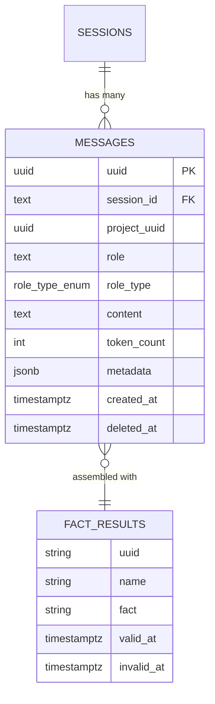

# zep-memory — Data Model

> **Database**: PostgreSQL

## Tables

### messages

| Column | Type | Constraints | Description |
|--------|------|-------------|-------------|
| `uuid` | UUID | PK, DEFAULT gen_random_uuid() | Internal unique identifier |
| `session_id` | TEXT | NOT NULL, FK → sessions.session_id | Session association |
| `project_uuid` | UUID | NOT NULL | Multi-tenant isolation key |
| `role` | TEXT | NOT NULL | Role label ("user", "assistant", "system") |
| `role_type` | role_type_enum | NOT NULL, DEFAULT 'norole' | Enum: norole/system/assistant/user/function/tool |
| `content` | TEXT | NOT NULL | Message content |
| `token_count` | INTEGER | DEFAULT 0 | Token count for context window management |
| `metadata` | JSONB | DEFAULT '{}' | Arbitrary metadata |
| `created_at` | TIMESTAMPTZ | NOT NULL, DEFAULT now() | Creation timestamp |
| `updated_at` | TIMESTAMPTZ | NOT NULL, DEFAULT now() | Last update timestamp |
| `deleted_at` | TIMESTAMPTZ | nullable | Soft delete marker |

### Custom Types

```sql
CREATE TYPE role_type_enum AS ENUM (
    'norole', 'system', 'assistant', 'user', 'function', 'tool'
);
```

## Entity-Relationship Diagram



## Index Strategy

```sql
CREATE INDEX memstore_session_id_idx ON messages(session_id) WHERE deleted_at IS NULL;
CREATE INDEX memstore_id_idx ON messages(uuid) WHERE deleted_at IS NULL;
CREATE INDEX memstore_composite_idx ON messages(session_id, project_uuid, deleted_at);
CREATE INDEX memstore_created_at_idx ON messages(created_at DESC) WHERE deleted_at IS NULL;
```

## Query Patterns

| Query | Index Used | Description |
|-------|-----------|-------------|
| GetLastN messages | `memstore_session_id_idx` + `created_at DESC` | Fetch recent messages for session |
| Batch insert | — | Bulk INSERT for PutMemory flow |
| Soft delete by session | `memstore_composite_idx` | DeleteMemory (all messages in session) |

## Migration History

| Version | Date | Description |
|---------|------|-------------|
| 1.0.0 | 2026-05-09 | Initial schema — messages table with role_type_enum |
| 1.1.0 | 2026-05-10 | Added partial indexes, composite index for tenant queries |
