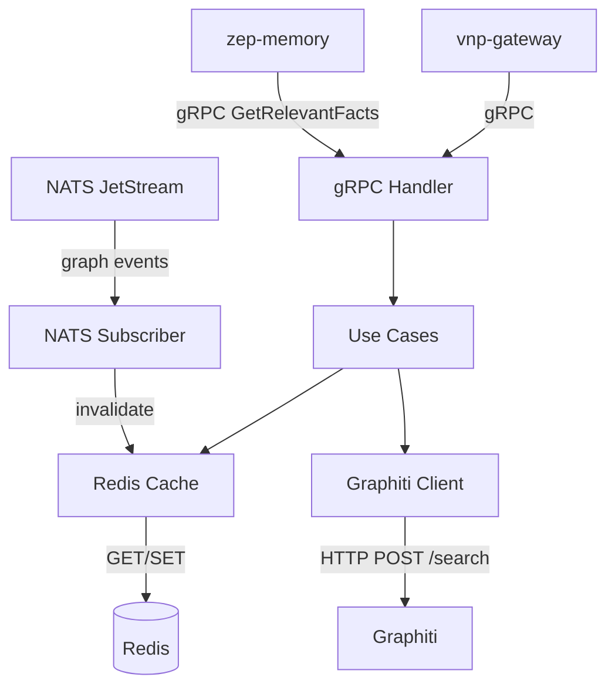

# zep-search — Service Architecture

> **Group**: Zep | **Pattern**: 4-layer Clean Architecture

## Layer Structure

```
services/zep-search/
├── cmd/server/main.go
├── internal/
│   ├── domain/
│   │   ├── search_query.go        # GraphSearchQuery, SessionSearchQuery
│   │   ├── search_result.go       # SearchResult, ranked items
│   │   ├── reranker.go            # RerankerType enum + strategy interface
│   │   ├── search_scope.go        # SearchScope (edges|nodes|episodes)
│   │   ├── search_filter.go       # Filters (labels, types, rating, lambda)
│   │   └── errors.go
│   ├── usecase/
│   │   ├── graph_search.go        # Multi-scope search + cache
│   │   ├── session_search.go      # Cross-session search
│   │   ├── get_relevant_facts.go  # Context assembly support
│   │   └── port/ + dto/
│   ├── adapter/
│   │   ├── grpc/handler.go, mapper.go
│   │   ├── client/graphiti_client.go  # HTTP → Graphiti search
│   │   ├── repository/redis/cache.go  # Search result cache
│   │   └── event/subscriber.go        # NATS cache invalidation
│   └── infra/
```

## Component Diagram



## External Dependencies

| Service | Protocol | Purpose |
|---------|----------|---------|
| Graphiti | HTTP | Search and get-memory endpoints |
| Redis | TCP | Search result caching (30s TTL) |
| NATS JetStream | Sub | Cache invalidation from zep-graph |
