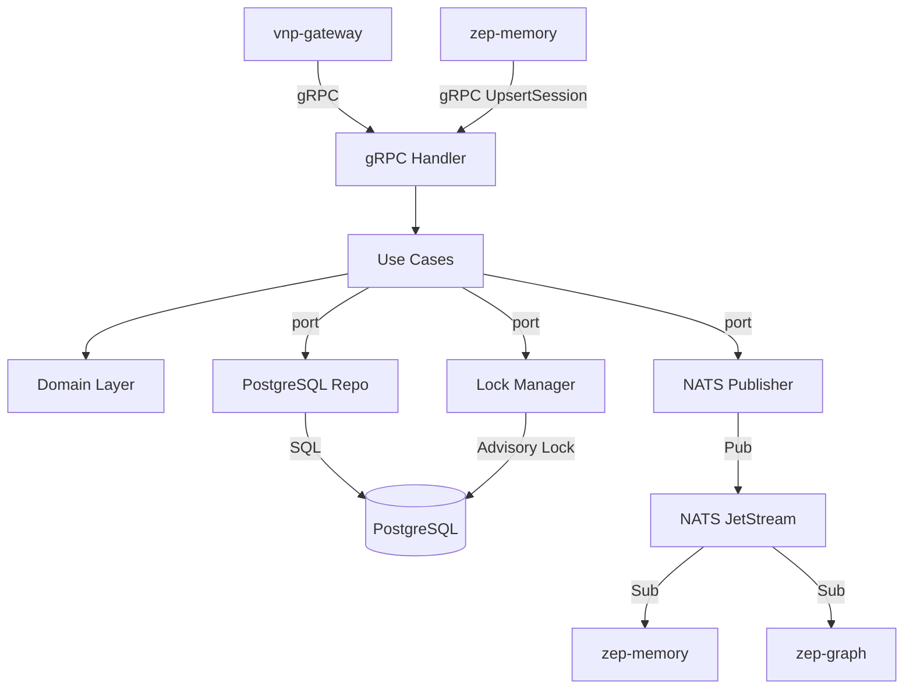

# zep-thread — Service Architecture

> **Group**: Zep | **Pattern**: 4-layer Clean Architecture

## Layer Structure

```
services/zep-thread/
├── cmd/server/main.go
├── internal/
│   ├── domain/
│   │   ├── session.go             # Session/Thread entity
│   │   ├── session_id.go          # SessionID value object
│   │   ├── metadata.go            # Metadata value object (JSONB merge)
│   │   ├── advisory_lock.go       # AdvisoryLockKey (SHA-256 hash of session_id)
│   │   ├── event.go               # SessionCreated, SessionEnded, SessionUpdated
│   │   └── errors.go              # ErrSessionNotFound, ErrSessionEnded, ErrLockTimeout
│   ├── usecase/
│   │   ├── create_session.go      # Create session, optional user_id link
│   │   ├── get_session.go         # Get by session_id
│   │   ├── update_session.go      # Patch metadata with advisory lock
│   │   ├── list_sessions.go       # List with pagination
│   │   ├── list_ordered.go        # Ordered list (created_at desc)
│   │   ├── list_user_sessions.go  # List sessions for a user
│   │   ├── upsert_session.go      # Create-or-update (used by PutMemory)
│   │   ├── end_session.go         # Set ended_at, block future ingestion
│   │   ├── port/
│   │   │   ├── input.go           # ThreadService interface
│   │   │   └── output.go          # SessionRepository, LockManager, EventPublisher
│   │   └── dto/
│   ├── adapter/
│   │   ├── grpc/handler.go, mapper.go
│   │   ├── repository/postgres/session_repo.go, lock_manager.go, model.go
│   │   └── event/publisher.go
│   └── infra/
│       ├── config/config.go
│       ├── server/grpc.go
│       └── wire/wire.go
```

## Key Design Decisions

| Decision | Rationale |
|----------|-----------|
| Advisory locks (SHA-256 hash) | PostgreSQL-native concurrent metadata protection |
| Session `ended_at` flag | Clean session boundary detection without message-level checks |
| Upsert pattern | Critical for PutMemory flow — avoids race conditions |
| Exponential backoff retry | Handles transient lock contention gracefully |

## Component Diagram



## External Dependencies

| Service | Protocol | Purpose |
|---------|----------|---------|
| PostgreSQL | SQL | Session persistence, advisory locks |
| NATS JetStream | Pub | Publish session lifecycle events |

## Known Limitations

- Advisory lock retry (200ms→30s, 15 retries) adds latency under contention
- No optimistic concurrency — relies on advisory locks for all metadata updates
