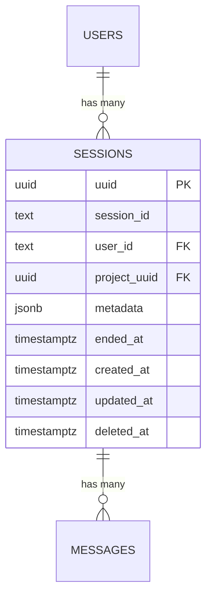

# zep-thread — Data Model

> **Database**: PostgreSQL

## Tables

### sessions

| Column | Type | Constraints | Description |
|--------|------|-------------|-------------|
| `uuid` | UUID | PK, DEFAULT gen_random_uuid() | Internal unique identifier |
| `session_id` | TEXT | NOT NULL | Human-readable thread identifier |
| `user_id` | TEXT | nullable, FK → users.user_id | Optional user association |
| `project_uuid` | UUID | NOT NULL | Multi-tenant isolation key |
| `metadata` | JSONB | DEFAULT '{}' | Arbitrary metadata (merge-patch) |
| `ended_at` | TIMESTAMPTZ | nullable | Session closure marker — blocks new messages |
| `created_at` | TIMESTAMPTZ | NOT NULL, DEFAULT now() | Creation timestamp |
| `updated_at` | TIMESTAMPTZ | NOT NULL, DEFAULT now() | Last update timestamp |
| `deleted_at` | TIMESTAMPTZ | nullable | Soft delete marker |

**Unique Constraint**: `UNIQUE (session_id, project_uuid)`

## Entity-Relationship Diagram



## Index Strategy

```sql
CREATE INDEX session_user_id_idx ON sessions(user_id) WHERE deleted_at IS NULL;
CREATE INDEX session_project_uuid_idx ON sessions(project_uuid) WHERE deleted_at IS NULL;
CREATE INDEX session_composite_idx ON sessions(session_id, project_uuid, deleted_at);
CREATE INDEX session_created_at_idx ON sessions(created_at DESC) WHERE deleted_at IS NULL;
```

## Advisory Lock Mechanism

```go
// Lock key = SHA-256 hash of session_id → int64
// Used for: UpdateSession metadata merge-patch
// Retry policy: 200ms → 30s exponential backoff, max 15 retries, 2x multiplier
AdvisoryLockKey = int64(sha256(session_id)[:8])
```

## Migration History

| Version | Date | Description |
|---------|------|-------------|
| 1.0.0 | 2026-05-09 | Initial schema — sessions table |
| 1.1.0 | 2026-05-10 | Added composite and partial indexes |
