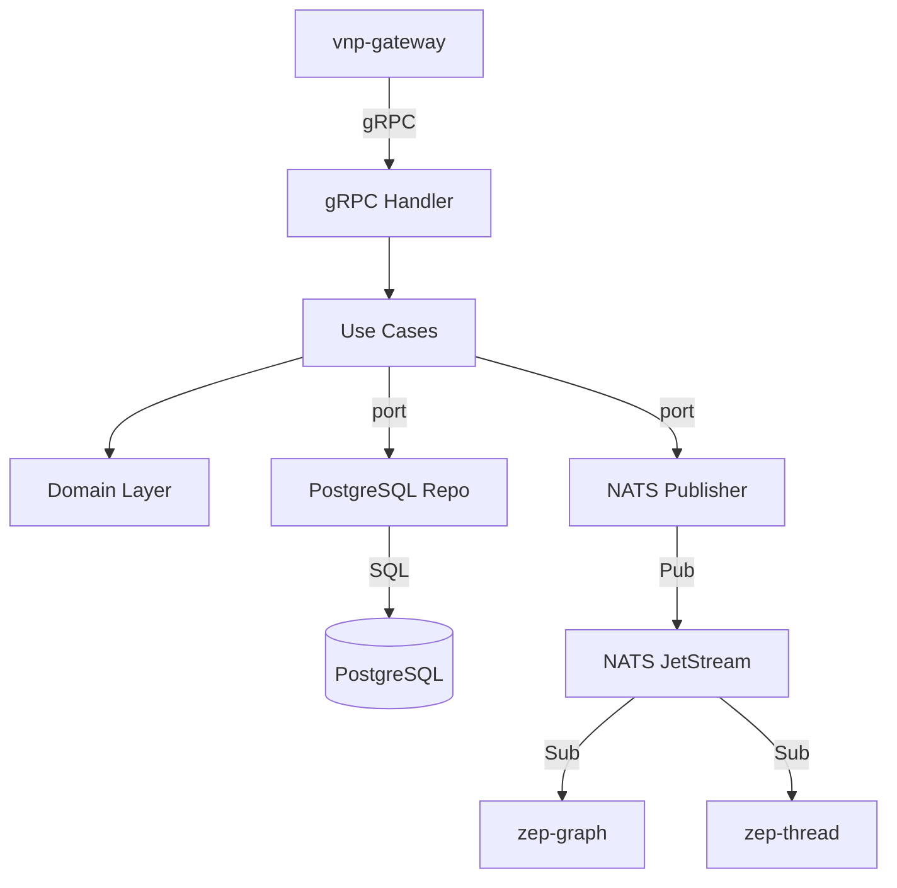

# zep-user — Service Architecture

> **Group**: Zep | **Pattern**: 4-layer Clean Architecture

## Layer Structure

```
services/zep-user/
├── cmd/server/main.go                  # Entry point, Wire injection
├── internal/
│   ├── domain/                         # Layer 1: ZERO external imports
│   │   ├── user.go                     #   User entity (UUID, UserID, Email, etc.)
│   │   ├── user_id.go                  #   UserID value object (alphanumeric validation)
│   │   ├── project.go                  #   ProjectUUID value object
│   │   ├── metadata.go                 #   Metadata value object (JSONB merge-patch)
│   │   ├── event.go                    #   UserCreated, UserUpdated, UserDeleted events
│   │   └── errors.go                   #   ErrUserNotFound, ErrUserAlreadyExists, ErrInvalidUserID
│   │
│   ├── usecase/                        # Layer 2: imports domain only
│   │   ├── create_user.go             #   Create user with validation
│   │   ├── get_user.go                #   Get user by user_id
│   │   ├── update_user.go            #   Patch metadata via JSONB merge with advisory lock
│   │   ├── delete_user.go            #   Soft delete (set deleted_at)
│   │   ├── list_users.go             #   List with pagination + ordering
│   │   ├── port/
│   │   │   ├── input.go              #   UserService interface
│   │   │   └── output.go             #   UserRepository, EventPublisher
│   │   └── dto/
│   │       ├── request.go
│   │       └── response.go
│   │
│   ├── adapter/                        # Layer 3: implements ports
│   │   ├── grpc/
│   │   │   ├── handler.go            #   gRPC UserServiceServer implementation
│   │   │   └── mapper.go             #   Proto ↔ Domain mapping
│   │   ├── repository/
│   │   │   └── postgres/
│   │   │       ├── user_repo.go      #   PostgreSQL CRUD (uptrace/bun)
│   │   │       └── model.go          #   bun table model
│   │   └── event/
│   │       └── publisher.go          #   NATS event publisher
│   │
│   └── infra/                          # Layer 4: Frameworks & Drivers
│       ├── config/config.go
│       ├── server/grpc.go
│       └── wire/wire.go
├── Dockerfile
└── README.md
```

## Dependency Rule

```
domain ← usecase ← adapter ← infra
 (inner)                     (outer)

✅ domain: ZERO external imports (no gRPC, no DB, no framework)
✅ usecase: imports domain only; defines port interfaces
✅ adapter: imports usecase(ports) + domain; implements interfaces
✅ infra: imports everything; wires via Google Wire
```

## Key Design Decisions

| Decision | Rationale |
|----------|-----------|
| JSONB metadata merge-patch | Flexible schema-less metadata without schema migration |
| Advisory locks for concurrent updates | PostgreSQL-native locking without external infrastructure |
| Soft deletes (`deleted_at`) | Preserves audit trail and enables temporal analysis |
| `user_id` as human-readable identifier | Separate from internal UUID for developer ergonomics |
| NATS event publishing | Decouples user lifecycle from downstream graph operations |

## Component Diagram



## External Dependencies

| Service | Protocol | Purpose |
|---------|----------|---------|
| PostgreSQL | SQL | User persistence with JSONB metadata, advisory locks |
| NATS JetStream | Pub | Publish user lifecycle events |

## Known Limitations / Technical Debt

- Advisory lock retry policy (200ms→30s, 15 retries) may cause latency spikes under high concurrency
- No read replica support yet — all reads go to primary
- `ListUserSessions` requires cross-service gRPC call to zep-thread (potential latency)
