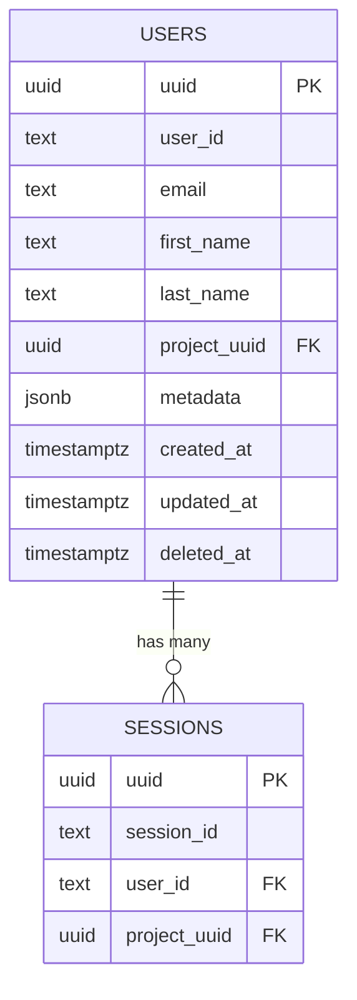

# zep-user — Data Model

> **Database**: PostgreSQL + pgvector

## Tables

### users

| Column | Type | Constraints | Description |
|--------|------|-------------|-------------|
| `uuid` | UUID | PK, DEFAULT gen_random_uuid() | Internal unique identifier |
| `user_id` | TEXT | NOT NULL | Human-readable identifier (alphanumeric + underscores) |
| `email` | TEXT | nullable | User email address |
| `first_name` | TEXT | nullable | User first name |
| `last_name` | TEXT | nullable | User last name |
| `project_uuid` | UUID | NOT NULL, FK | Multi-tenant isolation key |
| `metadata` | JSONB | DEFAULT '{}' | Arbitrary metadata (merge-patch supported) |
| `created_at` | TIMESTAMPTZ | NOT NULL, DEFAULT now() | Creation timestamp |
| `updated_at` | TIMESTAMPTZ | NOT NULL, DEFAULT now() | Last update timestamp |
| `deleted_at` | TIMESTAMPTZ | nullable | Soft delete marker |

**Unique Constraint**: `UNIQUE (user_id, project_uuid)`

## Entity-Relationship Diagram



## Index Strategy

```sql
CREATE INDEX user_user_id_idx ON users(user_id) WHERE deleted_at IS NULL;
CREATE INDEX user_email_idx ON users(email) WHERE deleted_at IS NULL;
CREATE INDEX user_project_uuid_idx ON users(project_uuid) WHERE deleted_at IS NULL;
```

### Index Rationale

| Index | Purpose |
|-------|---------|
| `user_user_id_idx` | Fast lookup by human-readable user_id (filtered by not deleted) |
| `user_email_idx` | Email-based user discovery |
| `user_project_uuid_idx` | Tenant-scoped listing queries |

## Metadata Merge-Patch

```go
// Example: existing metadata = {"lang": "en", "tier": "pro"}
// Patch = {"tier": null, "country": "VN"}
// Result = {"lang": "en", "country": "VN"}  (tier removed, country added)
```

## Migration History

| Version | Date | Description |
|---------|------|-------------|
| 1.0.0 | 2026-05-09 | Initial schema — users table with JSONB metadata |
| 1.1.0 | 2026-05-10 | Added partial indexes for soft-delete filtering |
