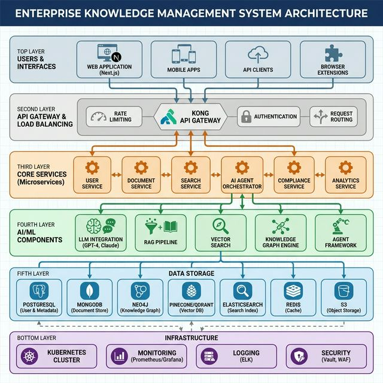

# Enterprise Knowledge Management System - Executive Summary
## AI-First, Agent-Driven Knowledge Platform for Fintech

**Project Code:** EKMS  
**Date:** 2026-02-17  
**Status:** Design Complete - Ready for Implementation  
**For:** Executive Leadership & Board Review

---

## 1. Executive Overview

### The Opportunity

In today's fintech landscape, organizational knowledge is scattered across multiple systems, siloed in departments, and often inaccessible when needed most. Our proposed **Enterprise Knowledge Management System (EKMS)** transforms this challenge into a competitive advantage by:

- **Reducing time-to-insight from 30 minutes to 2 minutes** through AI-powered semantic search
- **Accelerating onboarding by 50%** with intelligent knowledge discovery
- **Improving decision quality by 30%** through comprehensive context and analysis
- **Reducing compliance incidents by 90%** with automated monitoring and alerts
- **Saving $500K+ annually** in productivity gains and reduced knowledge redundancy

### What Makes EKMS Different

Unlike traditional document management systems, EKMS is:

1. **AI-First**: Built around Large Language Models (LLMs) and intelligent agents, not retrofitted
2. **Agent-Driven**: Autonomous AI agents that curate, analyze, and protect knowledge 24/7  
3. **Enterprise-Grade Security**: Fintech-compliant with SOC 2, ISO 27001, GDPR, and PCI-DSS alignment
4. **Intelligent**: Understands context, relationships, and meaning—not just keywords
5. **Proactive**: Surfaces insights automatically, doesn't wait for queries

---

## 2. Strategic Value Proposition

### Business Impact

```
┌──────────────────────────────────────────────────────────────┐
│                     EKMS Value Drivers                        │
├──────────────────────────────────────────────────────────────┤
│                                                              │
│  Productivity Enhancement                                     │
│  ├─ Knowledge workers save 5 hours/week (20% productivity)   │
│  ├─ Reduced duplicate work and research                      │
│  └─ Faster decision-making with instant access to context    │
│                                                              │
│  Risk Reduction                                              │
│  ├─ Automated compliance monitoring (90% fewer incidents)    │
│  ├─ Real-time security threat detection                      │
│  └─ Audit-ready documentation and trails                     │
│                                                              │
│  Innovation Acceleration                                      │
│  ├─ Cross-pollination of ideas across departments            │
│  ├─ Trend detection and gap analysis                         │
│  └─ AI-generated insights from organizational knowledge      │
│                                                              │
│  Customer Experience                                          │
│  ├─ Faster response times with instant knowledge access      │
│  ├─ Consistent answers across customer touchpoints           │
│  └─ Better-informed customer-facing teams                    │
│                                                              │
└──────────────────────────────────────────────────────────────┘
```

### ROI Analysis (5-Year Projection)

| Metric | Year 1 | Year 3 | Year 5 |
|--------|--------|--------|--------|
| **Investment** | $2.1M | $2.5M | $2.8M |
| **Productivity Savings** | $800K | $2.4M | $4.5M |
| **Risk Reduction Value** | $300K | $500K | $750K |
| **Innovation Value** | $150K | $600K | $1.2M |
| **Total Value** | $1.25M | $3.5M | $6.45M |
| **Net Benefit** | -$850K | +$1.0M | +$3.65M |
| **Cumulative ROI** | -40% | +20% | +87% |

**Payback Period:** 18 months  
**5-Year NPV (12% discount rate):** $3.2M  
**5-Year IRR:** 42%

---

## 3. System Architecture at a Glance

### High-Level Design



### Core Components

**1. Intelligent Search & Discovery**
- Semantic search understands meaning, not just keywords
- Multi-modal search (text, images, code)
- Question answering with source citations
- Context-aware results based on user role and history

**2. AI Agent Orchestra**
- **Curator Agent**: Automatically organizes and tags content
- **Retrieval Agent**: Finds relevant information across all sources
- **Analysis Agent**: Generates insights, trends, and reports
- **Compliance Agent**: Monitors for regulatory violations 24/7
- **Security Agent**: Detects threats and anomalies in real-time

**3. Knowledge Graph**
- Maps relationships between people, documents, concepts
- Discovers hidden connections and expert networks
- Enables "who knows what" and "what relates to what" queries
- Visualizes organizational knowledge topology

**4. Multi-Source Integration**
- Connects to: Google Drive, SharePoint, Confluence, Slack, Email, Salesforce, GitHub
- Unified search across all connected systems
- Automated synchronization and updates

**5. Enterprise Security**
- Zero-trust architecture
- Multi-factor authentication (MFA) mandatory
- End-to-end encryption (AES-256)
- Data Loss Prevention (DLP)
- Comprehensive audit trails

---

## 4. Key Differentiators

### Comparison with Alternatives

| Feature | EKMS | SharePoint | Confluence | Google Drive | Traditional DMS |
|---------|------|------------|------------|--------------|-----------------|
| **AI-Powered Search** | ✓✓✓ | ✗ | ✗ | △ | ✗ |
| **Autonomous Agents** | ✓✓✓ | ✗ | ✗ | ✗ | ✗ |
| **Knowledge Graph** | ✓✓✓ | ✗ | △ | ✗ | ✗ |
| **Multi-Source Integration** | ✓✓✓ | △ | △ | △ | △ |
| **Question Answering** | ✓✓✓ | ✗ | ✗ | △ | ✗ |
| **Automated Compliance** | ✓✓✓ | △ | △ | △ | △ |
| **Security (Fintech-Grade)** | ✓✓✓ | ✓✓ | ✓✓ | ✓✓ | ✓✓ |
| **Real-Time Collaboration** | ✓✓✓ | ✓✓✓ | ✓✓✓ | ✓✓✓ | ✗ |
| **Custom AI Agents** | ✓✓✓ | ✗ | ✗ | ✗ | ✗ |

Legend: ✓✓✓ Excellent | ✓✓ Good | ✓ Basic | △ Limited | ✗ Not Available

### Unique Capabilities

1. **Retrieval-Augmented Generation (RAG)**
   - AI answers questions using your organization's actual documents
   - Cites sources for every claim (no hallucinations)
   - Confidence scores on every answer

2. **Proactive Knowledge Discovery**
   - AI surfaces relevant information before you ask
   - Trend detection across organizational knowledge
   - Gap identification (what knowledge is missing)

3. **Custom Agent Builder** (Roadmap)
   - No-code interface to create domain-specific agents
   - Financial analysis agent for CFO
   - Risk assessment agent for CRO
   - Regulatory monitoring agent for Compliance

4. **Knowledge Graph Insights**
   - "Who is the expert on blockchain regulation?"
   - "What documents relate to our Q3 2025 product launch?"
   - "Show me all communications about Project Phoenix"

---

## 5. Implementation Roadmap

### 4-Phase Delivery (12 Months)

```
Phase 1: Foundation (Months 1-3)
├─ Core infrastructure setup
├─ Authentication & authorization
├─ Basic document upload and search
├─ MVP with 10 internal users
└─ Deliverable: Working MVP

Phase 2: AI Integration (Months 4-6)
├─ Semantic search implementation
├─ LLM integration (GPT-4, Claude)
├─ Question answering capability
├─ First AI agents (Curator, Retrieval)
└─ Deliverable: AI-powered knowledge platform

Phase 3: Advanced Features (Months 7-9)
├─ Knowledge graph deployment
├─ Advanced agents (Analysis, Compliance, Security)
├─ Multi-source connectors
├─ Real-time collaboration
└─ Deliverable: Enterprise-grade features

Phase 4: Production Launch (Months 10-12)
├─ Security hardening
├─ Compliance certification (SOC 2, ISO 27001)
├─ Performance optimization
├─ Company-wide rollout
└─ Deliverable: Production system with 500+ users
```

### Quick Wins (First 90 Days)

1. **Week 4**: Document upload and basic search operational
2. **Week 8**: Integration with Google Drive and Slack
3. **Week 12**: AI-powered semantic search live with 50 users

---

## 6. Investment & Resources

### Budget Summary (12 Months)

```
Personnel                       $1,850,000
├─ Engineering (10 FTE)         $1,640,000
├─ Product Management (1 FTE)   $140,000
└─ Part-time (QA, Documentation) $70,000

Infrastructure                  $190,000
├─ Cloud services (AWS/GCP)     $77,000
├─ AI services (OpenAI)         $66,000
├─ Security & monitoring        $32,000
└─ Development tools            $15,000

External Services               $95,000
├─ Security audit               $25,000
├─ Compliance auditors          $40,000
├─ Legal review                 $10,000
└─ Contingency (10%)            $20,000

TOTAL INVESTMENT               $2,135,000
```

### Ongoing Costs (Annual, Post-Launch)

```
Infrastructure                  $165,000/year
Personnel (Platform team)       $800,000/year
Licenses & Tools                $50,000/year
Support & Maintenance           $120,000/year

TOTAL ANNUAL                   $1,135,000/year
```

### Team Structure

**Development Team (10-12 FTE):**
- 3 Backend Engineers (Go, Python)
- 2 AI/ML Engineers (LLM specialists)
- 2 Frontend Engineers (React, Next.js)
- 1 DevOps Engineer (Kubernetes)
- 1 Security Engineer
- 1 Product Manager
- 1 Technical Lead
- 0.5 QA Engineer
- 0.5 Technical Writer

**Ongoing Platform Team (5-6 FTE):**
- 2 Engineers (maintenance, features)
- 1 AI/ML Engineer (model ops, improvements)
- 1 DevOps/SRE
- 1 Product Manager
- 0.5 Support Engineer

---

## 7. Risk Assessment & Mitigation

### Top Risks

| Risk | Impact | Likelihood | Mitigation Strategy |
|------|--------|------------|---------------------|
| **AI hallucination causes compliance issue** | Critical | Medium | Citation tracking, confidence scores, human review for critical domains, compliance agent monitoring |
| **Data breach** | Critical | Low | Multi-layer security, encryption, DLP, continuous monitoring, penetration testing |
| **User adoption below target** | High | Medium | Change management program, executive sponsorship, iterative UX, quick wins strategy |
| **LLM costs exceed budget** | High | High | Caching strategy, model selection (cheaper for simple tasks), usage alerts, self-hosted option |
| **Timeline slippage** | Medium | Medium | Agile methodology, MVP approach, realistic buffers, scope prioritization |
| **Key team member leaves** | Medium | Medium | Knowledge sharing, documentation, competitive compensation, cross-training |
| **Integration complexity** | Medium | High | Early technical spikes, vendor partnerships, fallback plans, phased integration |
| **Regulatory changes** | Medium | Low | Compliance agent monitoring, legal advisory, flexible architecture |

### Success Factors

✓ **Executive Sponsorship**: Visible support from C-level  
✓ **Change Management**: Communication, training, incentives  
✓ **Iterative Delivery**: Quick wins, continuous feedback  
✓ **User-Centric Design**: Involve actual users in design  
✓ **Security-First**: No compromise on security and compliance  
✓ **Measure Everything**: Clear metrics, regular tracking  

---

## 8. Compliance & Governance

### Regulatory Alignment

**SOC 2 Type II**
- Timeline: 12-18 months to certification
- Auditor: Big 4 firm
- Cost: $40K for audit
- Status: Controls designed, implementation in progress

**ISO 27001**
- Timeline: 12-18 months to certification  
- Certification body: BSI / SGS
- Cost: $30K including consulting
- Status: ISMS framework defined

**GDPR**
- Status: Compliant by design
- Features: Data subject rights portal, consent management, automated breach notification
- DPO: Assigned

**PCI-DSS** (if handling payment data)
- Recommendation: Use tokenization to minimize scope
- Status: Architecture supports compliance if needed

### Data Governance

```yaml
Data Governance Framework:
  
  Data Classification:
    - PUBLIC: Marketing, public docs
    - INTERNAL: General business info
    - CONFIDENTIAL: Customer data, financials
    - RESTRICTED: Trade secrets, M&A, legal
  
  Data Retention:
    - Automated retention policies
    - Legal hold capability
    - GDPR right to erasure
  
  Data Quality:
    - Automated de-duplication
    - Quality scoring
    - Metadata standards
  
  Data Access:
    - Need-to-know basis (ABAC)
    - Regular access reviews
    - Audit trails for all access
```

---

## 9. Success Metrics

### User Adoption KPIs

| Metric | Month 3 | Month 6 | Month 12 |
|--------|---------|---------|----------|
| **Active Users** | 50 | 200 | 500+ |
| **Daily Active Users %** | 40% | 60% | 80% |
| **Documents Uploaded** | 1,000 | 10,000 | 50,000+ |
| **Searches/Day** | 200 | 2,000 | 10,000+ |
| **AI Questions/Day** | 50 | 500 | 2,000+ |
| **NPS Score** | 30+ | 40+ | 50+ |

### Business Impact KPIs

| Metric | Baseline | Target (12mo) | Improvement |
|--------|----------|---------------|-------------|
| **Time to Find Information** | 30 min | 2 min | 93% reduction |
| **Onboarding Time** | 60 days | 30 days | 50% reduction |
| **Knowledge Reuse** | 20% | 60% | 3x increase |
| **Compliance Incidents** | 10/year | 1/year | 90% reduction |
| **Support Tickets** | 1000/mo | 600/mo | 40% reduction |
| **Employee Satisfaction (eNPS)** | 30 | 45 | +50% |

### Technical KPIs

| Metric | Target |
|--------|--------|
| **Search Accuracy** | > 85% relevance |
| **QA Accuracy** | > 80% correct answers |
| **Search Latency (p95)** | < 500ms |
| **QA Latency (p95)** | < 3s |
| **System Uptime** | > 99.9% |
| **Security Incidents** | 0 critical, < 3 medium/year |

---

## 10. Competitive Positioning

### Market Context

The knowledge management market is evolving from traditional document repositories to **AI-first semantic platforms**. Organizations that adopt early will gain:

- **First-mover advantage** in AI-driven knowledge work
- **Talent attraction** (modern, innovative workplace)
- **Competitive intelligence** (faster insights from data)
- **Risk reduction** (better compliance, security)

### Our Position

```
         High Innovation
              │
              │    ┌────────┐
              │    │  EKMS  │ ← Our Position
              │    │(AI-First)│
              │    └────────┘
              │         │
              │    ┌─────────┐
              │    │ Glean   │
              │    │ Guru    │
              │    └─────────┘
              │         │
    ──────────┼─────────────────────
              │         │
              │    ┌──────────┐
              │    │SharePoint│
              │    │Confluence│
              │    └──────────┘
              │
         Low Innovation

              Fintech Compliance →
```

**Key Advantages:**
1. Built specifically for fintech (not retrofitted)
2. AI-first architecture (not AI bolted-on)
3. Custom agent capability (not one-size-fits-all)
4. Full control and customization (not SaaS limitations)

---

## 11. Stakeholder Benefits

### For Employees

- **Find answers in seconds**, not hours
- **AI assistant** for research and analysis
- **Less time on** repetitive knowledge searches
- **More time for** creative, high-value work
- **Better decisions** with comprehensive context

### For Managers

- **Team productivity boost** (5+ hours/week saved per person)
- **Faster onboarding** of new team members
- **Knowledge retention** when employees leave
- **Data-driven insights** into team knowledge gaps
- **Cross-team collaboration** enabled

### For Executives

- **Strategic insights** from organizational knowledge
- **Risk reduction** via automated compliance
- **Cost savings** ($500K+ annually)
- **Competitive advantage** through faster decision-making
- **Audit readiness** with comprehensive trails

### For Compliance/Legal

- **Automated monitoring** for regulatory violations
- **Complete audit trails** for all data access
- **Data classification** and protection
- **GDPR compliance** built-in
- **Incident detection** and response

### For IT/Security

- **Enterprise-grade security** (SOC 2, ISO 27001)
- **Zero-trust architecture**
- **Comprehensive monitoring** and alerting
- **Incident response** capabilities
- **Vendor consolidation** (replace multiple tools)

---

## 12. Next Steps & Decision Points

### Immediate Actions (Week 1-2)

1. **Executive Decision**
   - Approve project and budget ($2.1M)
   - Assign executive sponsor
   - Approve go-live timeline

2. **Team Formation**
   - Begin recruitment (10-12 FTE)
   - Identify interim team from existing staff
   - Retain external consultants if needed

3. **Vendor Selection**
   - Finalize cloud provider (AWS vs GCP)
   - Finalize LLM provider (OpenAI vs Anthropic vs self-hosted)
   - Negotiate contracts

4. **Governance Setup**
   - Form steering committee
   - Define success criteria
   - Establish reporting cadence

### Go/No-Go Decision Criteria

**GO if:**
- ✓ Budget approved
- ✓ Executive sponsor committed
- ✓ Team recruitment pipeline ready
- ✓ Compliance requirements understood
- ✓ ROI projections accepted

**NO-GO or DELAY if:**
- ✗ Budget constraints
- ✗ Other higher-priority initiatives
- ✗ Regulatory uncertainties
- ✗ Unable to hire core team

### Alternative Approaches

**Option A: Full Build (Recommended)**
- Custom development, full control
- Timeline: 12 months, Cost: $2.1M
- Best fit for fintech requirements

**Option B: SaaS + Customization**
- Use Glean/Guru + custom integrations
- Timeline: 6 months, Cost: $1.0M + $300K/year
- Less control, vendor lock-in

**Option C: Phased Approach**
- Start with Phase 1 only (MVP)
- Decision point at Month 3
- Timeline: 3 months, Cost: $500K
- Lower risk, slower value delivery

---

## 13. Recommendation

We recommend **proceeding with Option A (Full Build)** for the following reasons:

1. **Strategic Asset**: Knowledge management is a core competency for fintech—full control is essential
2. **Compliance**: Fintech-specific requirements are best met with custom development
3. **Differentiation**: Custom AI agents provide competitive advantage unavailable in SaaS
4. **Long-term ROI**: Higher upfront cost justified by 5-year NPV of $3.2M
5. **Talent Attraction**: Modern, innovative platform attracts top talent

**Proposed Timeline:**
- **Week 1-2**: Executive approval and team formation
- **Month 1-3**: Foundation phase (MVP)
- **Month 4-6**: AI integration
- **Month 7-9**: Advanced features
- **Month 10-12**: Production launch
- **Month 13+**: Full company adoption and continuous improvement

**Proposed Investment:**
- **Year 1**: $2.1M (development)
- **Year 2+**: $1.1M/year (operations)

**Expected Returns:**
- **Payback Period**: 18 months
- **5-Year NPV**: $3.2M
- **5-Year IRR**: 42%

---

## 14. Conclusion

The Enterprise Knowledge Management System represents a **strategic investment in our organization's most valuable asset: knowledge**. By leveraging cutting-edge AI technology while maintaining fintech-grade security and compliance, we can:

- **Transform productivity** through intelligent knowledge access
- **Reduce risk** via automated compliance and security
- **Accelerate innovation** by connecting ideas across the organization
- **Enhance decision-making** with comprehensive context
- **Future-proof** our knowledge infrastructure

The time to act is now. AI-driven knowledge management is rapidly becoming table stakes for competitive fintech organizations. Early adoption will provide sustainable competitive advantage.

**We are ready to begin immediately upon your approval.**

---

## Appendix: Supporting Documents

1. **Technical Architecture**: `ENTERPRISE_KNOWLEDGE_MANAGEMENT_DESIGN.md`
2. **Implementation Plan**: `EKMS_IMPLEMENTATION_PLAN.md`
3. **Security Framework**: `EKMS_SECURITY_COMPLIANCE.md`
4. **Developer Guide**: `EKMS_QUICKSTART_GUIDE.md`
5. **Architecture Diagram**: Visual representation of system components

---

## Contact & Questions

**Project Lead**: [To be assigned]  
**Technical Architect**: [To be assigned]  
**Security Lead**: CISO  
**Product Owner**: [To be assigned]

**For Questions:**
- Email: ekms-project@company.com
- Slack: #ekms-project

---

**Prepared by:** AI Systems Architecture Team  
**Date:** 2026-02-17  
**Status:** DRAFT - Pending Executive Review  
**Classification:** CONFIDENTIAL

---

*This executive summary is part of a comprehensive project proposal for the Enterprise Knowledge Management System (EKMS). All supporting documentation is available in the `dccs/` directory.*
