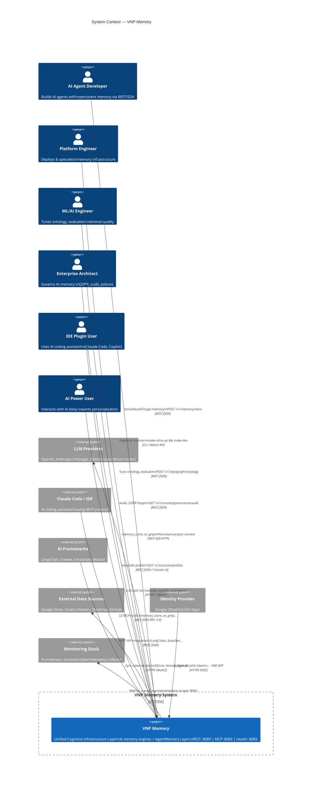

# C1 — System Context Diagram

> **C4 Level 1:** VNP Memory trong hệ sinh thái AI — Ai tương tác với hệ thống và hệ thống nào bên ngoài được kết nối.

---

## Diagram

---

## Actors (8 personas)

| Actor | Vai trò | Điểm vào chính |
|---|---|---|
| **P1** AI Agent Developer | Xây dựng AI agents với persistent memory | REST API :8080 hoặc SDK |
| **P2** Platform Engineer | Deploy, vận hành, monitor | Admin API, `make` commands |
| **P3** ML/AI Engineer | Tối ưu retrieval, ontology | REST API + Console |
| **P4** Enterprise Architect | Governance, GDPR, audit | Console Governance |
| **P5** IDE Plugin User | AI coding assistant context | MCP Server :8082 |
| **P6** Framework Integrator | LangChain, AutoGen integration | REST API / MCP |
| **P7** AI Power User | Personalization, profile control | Console UI |
| **P8** Product Manager | Analytics từ conversations | Console Dashboard |

## External Systems

| System | Mục đích | Protocol |
|---|---|---|
| **LLM Providers** | Extraction, classification, summarization | HTTPS → Bifrost multi-provider router |
| **Claude Code / IDE** | MCP client — AI assistant integration | MCP JSON-RPC 2.0 over SSE/HTTP |
| **AI Frameworks** | LangChain, CrewAI, AutoGen, Mastra | REST JSON |
| **Google Drive/Gmail/Notion** | External data connectors (Supermemory) | HTTPS OAuth2 |
| **Google OAuth2** | SSO authentication | OIDC |
| **Prometheus/Grafana** | Metrics scraping | HTTP pull |
| **OpenTelemetry Collector** | Distributed tracing | OTLP gRPC/HTTP |

---

*[← README](./README.md) | [→ C2 Container](./C2-container.md)*
