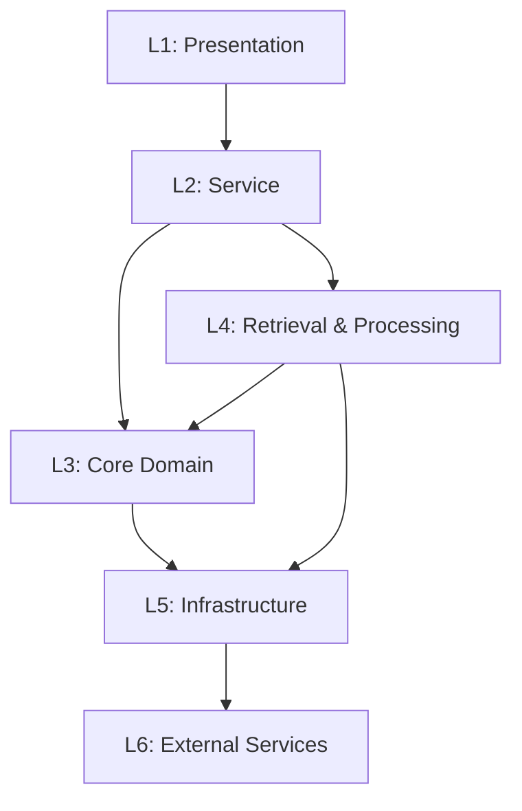

# OpenViking — Functional Layer Architecture

> **Version**: 1.0  
> **Date**: 2026-05-07  
> **Source**: Codebase analysis of `volcengine/OpenViking` v0.1.x

---

## 1. Tổng Quan Kiến Trúc

OpenViking sử dụng kiến trúc **6-layer phân tầng** (top-down dependency), mỗi tầng có trách nhiệm rõ ràng.

```
┌─────────────────────────────────────────────────────────────────┐
│  L1 — PRESENTATION LAYER                                        │
│  FastAPI REST (17 routers) · MCP Endpoint · WebDAV · CLI (Rust) │
│  Python SDK (Sync/Async) · VikingBot Gateway                    │
├─────────────────────────────────────────────────────────────────┤
│  L2 — SERVICE LAYER                                              │
│  FSService · SearchService · SessionService · ResourceService    │
│  RelationService · PackService · DebugService · TaskTracker      │
├─────────────────────────────────────────────────────────────────┤
│  L3 — CORE DOMAIN LAYER                                          │
│  Context · Namespace · ContextType/Level · URI Resolution        │
│  DirectoryInitializer · RequestContext · Identity/Role            │
├─────────────────────────────────────────────────────────────────┤
│  L4 — RETRIEVAL & PROCESSING LAYER                               │
│  HierarchicalRetriever · Session (commit/WMv2/memory extract)    │
│  ResourceProcessor · SkillProcessor · ContentWriter              │
│  Parse (tree-sitter/VLM) · Summarizer · EmbeddingUtils           │
├─────────────────────────────────────────────────────────────────┤
│  L5 — INFRASTRUCTURE LAYER                                       │
│  VikingFS · VikingDBManager · VectorIndexBackend · QueueManager  │
│  LockManager · FileEncryptor · Embedder · VLM · Rerank           │
│  RAGFS (Rust) · Telemetry · Metrics · CircuitBreaker             │
├─────────────────────────────────────────────────────────────────┤
│  L6 — EXTERNAL SERVICES                                          │
│  OpenAI/Volcengine/Gemini/Jina/Cohere (Embedding + VLM)         │
│  HashiCorp Vault · Volcengine KMS · Prometheus · OTLP backends   │
│  Telegram/Feishu/Slack/Discord (Bot channels)                    │
└─────────────────────────────────────────────────────────────────┘
```

### Dependency Flow



**Quy tắc:**
- Tầng trên chỉ gọi tầng dưới trực tiếp
- L2 gọi L3 (domain types) và L4 (processing logic)
- L4 gọi cả L3 (domain model) và L5 (storage/AI adapters)
- L5 là boundary duy nhất tương tác L6

### Ánh Xạ Tầng → Mã Nguồn

| Layer | Path | Files/Dirs | Trách nhiệm |
|-------|------|------------|--------------|
| L1 | `server/`, `crates/ov_cli/`, SDK files | 25+ | HTTP endpoints, MCP, WebDAV, CLI |
| L2 | `service/` | 10 | Business operations orchestration |
| L3 | `core/`, `server/identity.py` | 6 | Domain model, namespace, access control |
| L4 | `retrieve/`, `session/`, `parse/`, `resource/`, `utils/` | 35+ | Search, session, parsing, processing |
| L5 | `storage/`, `models/`, `crypto/`, `telemetry/`, `pyagfs/` | 40+ | FS, vector DB, AI models, encryption |
| L6 | External packages | — | OpenAI, Vault, Prometheus, bot channels |

---

## 2. L1 — Presentation Layer

**Trách nhiệm:** Expose capabilities ra ngoài qua 6 interface song song.

| Interface | Path | Protocol | Entry point |
|-----------|------|----------|-------------|
| **REST API** | `server/routers/` | HTTP/JSON (FastAPI) | `http://localhost:1933` |
| **MCP Endpoint** | `server/mcp_endpoint.py` | Streamable HTTP | `/mcp` |
| **WebDAV** | `server/routers/webdav.py` | WebDAV | `/webdav` |
| **CLI** | `crates/ov_cli/` | Terminal (Rust) | `ov` binary |
| **Python SDK** | `sync_client.py`, `async_client.py` | Python import | `from openviking import OpenViking` |
| **Bot Gateway** | `bot/vikingbot/` | Multi-channel | `:18790` |

### REST API Routes (17 routers)

| Router | Prefix | Methods | Chức năng |
|--------|--------|---------|-----------|
| `filesystem` | `/api/v1/filesystem` | GET/POST | ls, tree, mkdir, rm |
| `content` | `/api/v1/content` | GET/POST | read, write, mv, cp |
| `search` | `/api/v1/search` | POST | find, grep, glob |
| `sessions` | `/api/v1/sessions` | POST/GET/DELETE | Session lifecycle, commit |
| `resources` | `/api/v1/resources` | POST/GET/DELETE | Resource ingestion |
| `relations` | `/api/v1/relations` | GET/POST/DELETE | Context relations |
| `admin` | `/api/v1/admin` | POST/GET/DELETE | Account/user/key CRUD |
| `observer` | `/api/v1/observer` | GET | Retrieval stats/replay |
| `privacy_configs` | `/api/v1/privacy-configs` | GET/POST | Privacy config CRUD |
| `tasks` | `/api/v1/tasks` | GET | Background task status |
| `system` | `/api/v1/system` | GET | Status, wait, debug |
| `debug` | `/api/v1/debug` | GET/POST | IO recording, diagnostics |
| `bot` | `/api/v1/bot` | POST/GET | VikingBot control |
| `pack` | `/api/v1/pack` | POST | Context packing |
| `maintenance` | `/api/v1/maintenance` | POST | Storage maintenance |
| `stats` | `/api/v1/stats` | GET | Usage statistics |
| `metrics` | `/metrics` | GET | Prometheus metrics |

### MCP Tools (9 tools)

| Tool | Chức năng |
|------|-----------|
| `search` | Semantic search with scope/limit/score filter |
| `read` | Read single or batch URIs |
| `list` | Directory listing (recursive optional) |
| `store` | Create session → add messages → commit |
| `add_resource` | Async resource ingestion (URL) |
| `grep` | Regex content search |
| `glob` | Filename pattern matching |
| `forget` | Permanent deletion |
| `health` | Server health check |

### Python SDK

```python
# Sync client
from openviking import OpenViking
client = OpenViking(url="http://localhost:1933")
results = client.find("authentication flow", limit=5)

# Async client
from openviking import AsyncOpenViking
client = AsyncOpenViking(url="http://localhost:1933")
results = await client.find("authentication flow", limit=5)

# Session management
session = client.create_session()
session.add_message("user", "How does auth work?")
session.commit()
```

### Auth Middleware

| Mode | Mechanism | Identity Source |
|------|-----------|-----------------|
| `DEV` | No auth | Implicit ROOT, localhost only |
| `API_KEY` | Root + per-user keys | `APIKeyManager.resolve()` |
| `TRUSTED` | Gateway trust | HTTP headers (`X-OpenViking-*`) |

**RBAC Roles:** ROOT > ADMIN > USER  
**Request headers:** `X-OpenViking-Account`, `X-OpenViking-User`, `X-OpenViking-Agent`, `X-Api-Key`

---

## 3. L2 — Service Layer

**Trách nhiệm:** Business logic cấp cao — mỗi service là một domain capability.  
**Path:** `openviking/service/`

### Service Map (8 services + core)

| Service | File | Size | Chức năng |
|---------|------|------|-----------|
| **OpenVikingService** | `core.py` | 16KB | Composition root, lifecycle management |
| **FSService** | `fs_service.py` | 10KB | File CRUD qua VikingFS |
| **SearchService** | `search_service.py` | 4KB | Semantic search (find/search) |
| **SessionService** | `session_service.py` | 10KB | Session lifecycle, commit, memory |
| **ResourceService** | `resource_service.py` | 21KB | Resource ingestion pipeline |
| **RelationService** | `relation_service.py` | 3KB | Context relation CRUD |
| **PackService** | `pack_service.py` | 2KB | Context packing/export |
| **DebugService** | `debug_service.py` | 7KB | IO recording, diagnostics |
| **TaskTracker** | `task_tracker.py` | 13KB | Background task tracking |

### OpenVikingService — Composition Root

```python
class OpenVikingService:
    # Infrastructure
    _agfs_client          # RAGFS binding
    _queue_manager        # Async task queue
    _vikingdb_manager     # Vector index
    _viking_fs            # Virtual filesystem
    _embedder             # Embedding model
    _resource_processor   # Resource pipeline
    _skill_processor      # Skill loading
    _session_compressor   # VLM-based WM compression
    _lock_manager         # Distributed locks
    _encryptor            # File encryption
    _watch_scheduler      # Resource auto-refresh
    _privacy_config_service  # Privacy configs

    # Sub-services
    _fs_service           # FSService()
    _search_service       # SearchService()
    _session_service      # SessionService()
    _resource_service     # ResourceService()
    _relation_service     # RelationService()
    _pack_service         # PackService()
    _debug_service        # DebugService()
```

### Initialization Sequence

```
OpenVikingService.__init__()
  1. Load config (ov.conf)
  2. Init storage (RAGFS client)
  3. Init embedder

OpenVikingService.initialize()
  4. Acquire data directory lock
  5. Bootstrap encryption (key provider)
  6. Init VikingFS singleton
  7. Create VikingDB vector collection
  8. Start QueueManager workers
  9. Init resource/skill processors
  10. Create session compressor (VLM)
  11. Init directory structure (root dirs)
  12. Start watch scheduler
  13. Set initialized = True
```

### Key Data Flows

```
FSService.read(uri):
  validate_access → VikingFS.read → decrypt → return content

SearchService.find(query):
  validate_query → VikingFS.find → HierarchicalRetriever → QueryResult

SessionService.commit(session_id):
  load_session → Phase1 (archive) → Phase2 (background memory extract)

ResourceService.add_resource(url):
  detect_type → clone/download → parse → queue (embed + summarize + store)
```

---

## 4. L3 — Core Domain Layer

**Trách nhiệm:** Domain model, URI resolution, access control.  
**Path:** `openviking/core/`, `openviking/server/identity.py`

### Module Map

| Module | File | Chức năng |
|--------|------|-----------|
| **Context** | `core/context.py` | Primary record type (URI, type, level, owner) |
| **Namespace** | `core/namespace.py` | URI resolution, ownership, canonical roots |
| **Directories** | `core/directories.py` | Bootstrap root dirs, load skills |
| **URI Validation** | `core/uri_validation.py` | Input sanitization |
| **Identity** | `server/identity.py` | RequestContext, Role, UserIdentifier |
| **Error Types** | `openviking_cli/exceptions.py` | Domain exception hierarchy |

### Context — Primary Record

```python
@dataclass
class Context:
    uri: str                  # viking:// URI (PK)
    parent_uri: str           # Parent directory
    context_type: ContextType # MEMORY | RESOURCE | SKILL | SESSION
    level: int                # 0=Abstract, 1=Overview, 2=Detail
    owner_account_id: str     # Tenant
    owner_user_id: str        # User
    owner_agent_id: str       # Agent
    abstract: str             # L0 text (~100 tokens)
    category: str             # Sub-classification
    active_count: int         # Usage counter (hotness)
    created_at: datetime
    updated_at: datetime
    meta: Dict[str, Any]      # Extensible metadata
```

### ContextType Enum

| Type | Scope | Mô tả |
|------|-------|--------|
| `MEMORY` | user/agent | Long-term extracted memories |
| `RESOURCE` | shared | Project documents, repos, web |
| `SKILL` | agent | Agent tools/capabilities |
| `SESSION` | session | Active conversation data |

### Namespace Topology

```
viking://
├── resources/                          # Shared (ContextType.RESOURCE)
├── user/{account}/{user}/              # User space (ContextType.MEMORY)
│   ├── memories/{category}/
│   └── privacy/{category}/{target}/
├── agent/{account}/{user}/{agent}/     # Agent space
│   ├── skills/                        # ContextType.SKILL
│   ├── memories/                      # ContextType.MEMORY
│   └── instructions/
├── session/{session_id}/               # ContextType.SESSION
└── temp/                               # Staging area (ROOT-only write)
```

### Access Control Rules

| Role | Access Scope |
|------|--------------|
| ROOT | Everything |
| ADMIN | Own account + managed users |
| USER | `resources/*` (read) + `user/{own}/*` + `agent/{own}/*` |

URI traversal protection: rejects `..`, `\`, drive-letter prefixes (`C:`).

---

## 5. L4 — Retrieval & Processing Layer

**Trách nhiệm:** Retrieval algorithms, session management, content processing.

### Module Map

| Module | Path | Size | Chức năng |
|--------|------|------|-----------|
| **HierarchicalRetriever** | `retrieve/hierarchical_retriever.py` | 627 lines | Core retrieval algorithm |
| **MemoryLifecycle** | `retrieve/memory_lifecycle.py` | — | Hotness scoring |
| **Session** | `session/session.py` | 2629 lines | Session lifecycle, 2-phase commit |
| **SessionCompressor** | `session/compressor.py` | — | WM v2 generation (VLM) |
| **ResourceProcessor** | `utils/resource_processor.py` | 16KB | Resource ingestion pipeline |
| **SkillProcessor** | `utils/skill_processor.py` | 12KB | Skill loading & indexing |
| **ContentWriter** | `storage/content_write.py` | 22KB | Content write + embed + summarize |
| **Parse Engine** | `parse/` | 9 files | File parsing (tree-sitter, VLM, registry) |
| **EmbeddingUtils** | `utils/embedding_utils.py` | 17KB | Chunk + embed orchestration |
| **Summarizer** | `utils/summarizer.py` | 5KB | L0/L1 summary generation |
| **SearchFilters** | `utils/search_filters.py` | 6KB | Query filter construction |
| **WatchManager** | `resource/watch_manager.py` | 27KB | Resource auto-refresh |

### HierarchicalRetriever — 6-Step Algorithm

```
Step 1: Parse query → TypedQuery
  ├── query text
  ├── context_type (MEMORY/RESOURCE/SKILL/None)
  └── target_directories (explicit scope)

Step 2: Embed query
  ├── dense_vector (float32, 768-3072 dim)
  └── sparse_vector (BM25/SPLADE-style)

Step 3: Global vector search
  └── top-K across all L0/L1 nodes in tenant

Step 4: Merge starting points
  ├── Root URIs from context_type
  ├── Global hits (excluding L2)
  └── Optional rerank on merged set

Step 5: Recursive directory search (priority queue)
  ┌─────────────────────────────────────┐
  │ while queue not empty:              │
  │   pop highest-score directory       │
  │   search_children_in_tenant()       │
  │   optional rerank                   │
  │   score = α·child + (1-α)·parent    │
  │   collect L2 files as candidates    │
  │   push sub-directories to queue     │
  │   check convergence (3 stable rounds)│
  └─────────────────────────────────────┘

Step 6: Post-processing
  ├── Hotness blending: (1-α)·semantic + α·hotness
  ├── Dedup by URI (keep highest)
  └── Return QueryResult(matched_contexts, searched_dirs)
```

### Session — Two-Phase Commit

```
Phase 1 (Lock-Protected, Synchronous):
  1. Acquire PathLock on session directory
  2. Split messages: [archive | retained_tail]
  3. Write retained → messages.jsonl
  4. Write archive → history/archive_NNN/messages.jsonl
  5. Update .meta.json
  6. Release lock

Phase 2 (Background, asyncio.create_task):
  1. Write redo-log (crash safety)
  2. Generate Working Memory v2 (7-section doc)
  3. Extract memories via VLM (8 categories):
     profile, preferences, entities, events,
     cases, patterns, tools, skills
  4. Upsert memories → viking://user/{id}/memories/
  5. Update active_count on used URIs
  6. Mark redo-log committed
```

### Parse Engine — File Type Registry

| Parser | File Types | Technology |
|--------|-----------|------------|
| Tree-sitter | `.py`, `.js`, `.ts`, `.go`, `.rs`, `.java`, etc. | tree-sitter grammars |
| VLM Parser | Images, complex PDFs, PPTX | Vision-Language Model |
| Document | PDF, DOCX, XLSX, EPUB | docling/python-docx |
| Markdown | `.md` | Native parser |
| Directory Scanner | Directories | Recursive scan + .gitignore |

---

## 6. L5 — Infrastructure Layer

**Trách nhiệm:** Storage, AI model adapters, encryption, observability.

### Module Map

```
storage/
├── viking_fs.py              # 82KB — Virtual filesystem (2199 lines)
├── vikingdb_manager.py       # 18KB — Vector collection management
├── viking_vector_index_backend.py  # 39KB — Vector search backend
├── collection_schemas.py     # 29KB — Vector collection schemas
├── content_write.py          # 22KB — Content write pipeline
├── local_fs.py               # 13KB — Local filesystem helpers
├── queuefs/                  # Async task queue (QueueManager)
├── transaction/              # LockManager + redo log
├── vectordb/                 # Vector DB core
├── vectordb_adapters/        # VectorDB adapter implementations
└── observers/                # IO recording

models/
├── embedder/                 # 13 files — 11 embedding providers
├── vlm/                      # Vision-Language Model providers
└── rerank/                   # Reranking providers

crypto/
├── encryptor.py              # 324 lines — AES-256-GCM envelope
├── config.py                 # Encryption config + bootstrap
└── providers.py              # KMS adapters (Local, Vault, Volcengine)

telemetry/                    # OpenTelemetry integration
metrics/                      # Prometheus metrics
pyagfs/                       # RAGFS Python bindings
```

### VikingFS — Virtual Filesystem (2199 lines)

**Singleton pattern:** `init_viking_fs()` → `get_viking_fs()`

| Category | Methods | Notes |
|----------|---------|-------|
| Basic CRUD | `read`, `write`, `mkdir`, `rm`, `mv`, `stat`, `exists` | Delegate to RAGFS + encrypt/decrypt |
| Directory | `ls`, `tree` (original/agent format) | depth/node limits |
| Tiered Read | `abstract`, `overview`, `read_batch` (level-aware) | L0/L1/L2 reads |
| Pattern | `grep`, `glob` | Regex + filename matching |
| Semantic | `find`, `search` | → HierarchicalRetriever |
| Relations | `get_relations`, `add_relation`, `remove_relation` | `.relations.json` |

**Transparent encryption:** Every `read()` auto-decrypts, every `write()` auto-encrypts.

### Embedding Providers (11 modules)

| Provider | Dense | Sparse | Hybrid | File |
|----------|-------|--------|--------|------|
| OpenAI | ✅ | ❌ | ❌ | `openai_embedders.py` (18KB) |
| Volcengine | ✅ | ✅ | ✅ | `volcengine_embedders.py` (24KB) |
| Gemini | ✅ | ❌ | ❌ | `gemini_embedders.py` (18KB) |
| DashScope | ✅ | ✅ | ✅ | `dashscope_embedders.py` (17KB) |
| VikingDB | ✅ | ✅ | ✅ | `vikingdb_embedders.py` (23KB) |
| Jina | ✅ | ❌ | ❌ | `jina_embedders.py` (12KB) |
| Local (ONNX) | ✅ | ❌ | ❌ | `local_embedders.py` (12KB) |
| MiniMax | ✅ | ❌ | ❌ | `minimax_embedders.py` (11KB) |
| Cohere | ✅ | ❌ | ❌ | `cohere_embedders.py` (10KB) |
| LiteLLM | ✅ | ❌ | ❌ | `litellm_embedders.py` (10KB) |
| Voyage | ✅ | ❌ | ❌ | `voyage_embedders.py` (8KB) |

**Unified interface:** `BaseEmbedder` → `embed()` / `embed_batch()` → `EmbedResult(dense, sparse)`

### Encryption — Envelope Format (OVE1)

```
Root Key (KMS) → Account Key → File Key (random 32B per file)
                                   │
                                   ▼
                          AES-256-GCM encrypt
                                   │
                          ┌────────▼────────┐
                          │ OVE1 Binary     │
                          │ Magic(4B)       │
                          │ Version(1B)     │
                          │ Provider(1B)    │
                          │ EFK + KIV + DIV │
                          │ Ciphertext      │
                          └─────────────────┘
```

### Concurrency Primitives

| Primitive | Module | Purpose |
|-----------|--------|---------|
| Data Dir Lock | `utils/process_lock.py` | Single-instance guard |
| PathLock | `storage/transaction/` | Point/subtree/mv locking |
| Redo Log | `storage/transaction/` | Phase 2 crash recovery |
| QueueManager | `storage/queuefs/` | Async background tasks |
| CircuitBreaker | `utils/circuit_breaker.py` | External API resilience |
| ModelRetry | `utils/model_retry.py` | LLM/Embedding retry logic |

---

## 7. L6 — External Services

**Trách nhiệm:** Third-party services — OpenViking chỉ tương tác qua APIs.

### Service Catalog

| Category | Services |
|----------|----------|
| **Embedding** | OpenAI, Volcengine, Gemini, Jina, Cohere, DashScope, MiniMax, Voyage, VikingDB, LiteLLM, Local ONNX |
| **VLM** | OpenAI, Volcengine, Gemini, Kimi, GLM, LiteLLM |
| **Reranking** | Volcengine, OpenAI, Cohere, Jina, local models |
| **KMS** | Local file, HashiCorp Vault, Volcengine KMS |
| **Observability** | Prometheus, OTLP-compatible backends |
| **Bot Channels** | Telegram, Feishu/Lark, DingTalk, Slack, QQ, Discord |

### Default Stack (Minimal Config)

| Component | Default | Cần cấu hình |
|-----------|---------|---------------|
| Storage | RAGFS (embedded) | Workspace path |
| Vector Index | Embedded | Không |
| Embedding | (must configure) | Provider + API key |
| VLM | (must configure) | Provider + API key |
| Auth | DEV mode | Không |

---

## 8. Cross-Cutting Concerns

| Concern | Module(s) | Layer |
|---------|-----------|-------|
| **Authentication** | `server/auth.py`, `server/api_keys.py` | L1 |
| **Authorization** | `core/namespace.py`, `server/identity.py` | L1 + L3 |
| **Encryption** | `crypto/encryptor.py`, `crypto/providers.py` | L5 |
| **Observability** | `telemetry/`, `metrics/`, request timing MW | L1 + L5 |
| **Error Handling** | `openviking_cli/exceptions.py`, `server/error_mapping.py` | All |
| **Privacy** | `privacy/service.py` | L2 + L5 |
| **Multi-tenancy** | Namespace isolation, RequestContext | L3 |
| **Rate Control** | `utils/circuit_breaker.py`, `utils/model_retry.py` | L4 + L5 |
| **Configuration** | `openviking_cli/utils/config/` | L5 |

---

## 9. Key Design Decisions

1. **Filesystem paradigm** — `viking://` URI protocol replaces fragmented vector stores. Natural hierarchy enables directory-scoped search and human-readable browsing.
2. **Three-tier context (L0/L1/L2)** — Abstract→Overview→Detail loading reduces token consumption by 80-90%.
3. **Score propagation** — Parent directory relevance boosts child discovery, solving the "needle in haystack" problem.
4. **Two-phase session commit** — Phase 1 (lock-protected) ensures data safety; Phase 2 (background) avoids blocking API.
5. **Envelope encryption per file** — Each file gets independent random key; KMS rotation only re-wraps, not re-encrypts.
6. **RAGFS in Rust** — Performance-critical filesystem operations in Rust; Python for business logic and AI orchestration.
7. **Deferred initialization** — Heavy infra setup happens after server starts accepting health checks.
8. **Convergence detection** — Retriever stops after 3 stable rounds to prevent infinite traversal.

---

## 10. Related Documents

| Document | Nội dung |
|----------|----------|
| [architecture.md](./architecture.md) | System architecture, deployment models, data flows |
| [technical_design.md](./technical_design.md) | Component deep-dives, algorithms, implementation |
| [L1-presentation-layer.md](./L1-presentation-layer.md) | REST (17 routers), MCP (9 tools), WebDAV, CLI, SDK, Auth |
| [L2-service-layer.md](./L2-service-layer.md) | 8 sub-services, composition root, initialization |
| [L3-core-domain-layer.md](./L3-core-domain-layer.md) | Context model, Namespace, RBAC, exception hierarchy |
| [L4-retrieval-processing-layer.md](./L4-retrieval-processing-layer.md) | HierarchicalRetriever, Session 2-phase commit, Parse engine |
| [L5-infrastructure-layer.md](./L5-infrastructure-layer.md) | VikingFS, vector index, embedding providers, encryption |
| [L6-external-services-layer.md](./L6-external-services-layer.md) | AI APIs, KMS, observability, bot channels, deployment |
