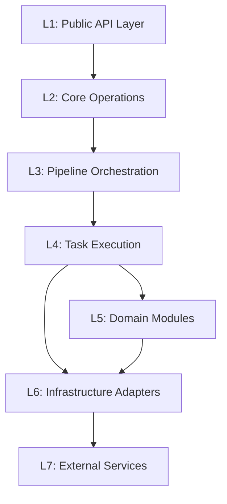

# Cognee — System Overview: Functional Layer Architecture

> **Version**: 1.0  
> **Date**: 2026-05-07  
> **Source**: Derived from codebase analysis of `topoteretes/cognee`

---

## 1. Tổng Quan Kiến Trúc Phân Tầng

Cognee được tổ chức thành **7 tầng chức năng (functional layers)** từ cao xuống thấp, mỗi tầng đảm nhận một vai trò rõ ràng và tương tác theo hướng top-down:

```
┌─────────────────────────────────────────────────────────────────┐
│  L1 — PUBLIC API LAYER                                          │
│  Python SDK · FastAPI REST · CLI · MCP Server                   │
├─────────────────────────────────────────────────────────────────┤
│  L2 — CORE OPERATIONS LAYER                                     │
│  V1 API (add/cognify/search/memify/delete)                      │
│  V2 Memory API (remember/recall/improve/forget/serve)           │
├─────────────────────────────────────────────────────────────────┤
│  L3 — PIPELINE ORCHESTRATION LAYER                              │
│  Task · BoundTask · TaskSpec · run_pipeline                     │
│  Pipeline Execution Mode · Pipeline Queue · Pipeline Context    │
├─────────────────────────────────────────────────────────────────┤
│  L4 — TASK EXECUTION LAYER                                      │
│  ingestion · graph extraction · storage · summarization         │
│  documents · temporal · chunks · completion · web_scraper       │
├─────────────────────────────────────────────────────────────────┤
│  L5 — DOMAIN MODULES LAYER                                      │
│  retrieval · chunking · ontology · users/permissions            │
│  search · cognify · memify · agent_memory · observability       │
│  data · session_lifecycle · visualization · settings · sync     │
├─────────────────────────────────────────────────────────────────┤
│  L6 — INFRASTRUCTURE ADAPTERS LAYER                             │
│  LLM Gateway · Graph DB Interface · Vector DB Interface         │
│  Relational DB · File Loaders · Embedding Engine                │
│  Session · Context Variables · Engine Models                    │
├─────────────────────────────────────────────────────────────────┤
│  L7 — EXTERNAL SERVICES & STORAGE                               │
│  OpenAI/Anthropic/Gemini/Ollama · Kuzu/Neo4j/Neptune            │
│  LanceDB/ChromaDB/PGVector · SQLite/PostgreSQL · S3/LocalFS    │
└─────────────────────────────────────────────────────────────────┘
```

---

## 2. Dependency Flow



**Quy tắc phụ thuộc:**
- Tầng trên chỉ gọi tầng dưới trực tiếp (không bỏ cách tầng)
- Ngoại lệ: L4 (Tasks) có thể gọi trực tiếp cả L5 (Domain Modules) và L6 (Infrastructure)
- L5 và L6 là **ngang hàng về mặt phụ thuộc** — L5 sử dụng interface của L6

---

## 3. Bảng Ánh Xạ Tầng — Thư Mục Mã Nguồn

| Layer | Path | Files/Dirs | Trách nhiệm |
|-------|------|------------|-------------|
| L1 | `cognee/api/` · `cognee/cli/` · `cognee-mcp/` | 35+ | Endpoint HTTP, SDK export, CLI commands, MCP tools |
| L2 | `cognee/api/v1/{add,cognify,search,remember,recall,...}/` | 31 dirs | Hàm nghiệp vụ cấp cao: add(), cognify(), search(), remember() |
| L3 | `cognee/modules/pipelines/` | 8 dirs | Task wrapper, pipeline runner, queue, execution mode |
| L4 | `cognee/tasks/` | 16 dirs | Các hàm atomic: ingest, extract_graph, add_data_points, summarize |
| L5 | `cognee/modules/` (trừ pipelines) | 23 dirs | Retrieval, chunking, ontology, users, search, observability |
| L6 | `cognee/infrastructure/` | 11 dirs | DB adapters, LLM gateway, file loaders, embedding engine |
| L7 | External packages | — | OpenAI, Kuzu, LanceDB, PostgreSQL, S3 |

---

## 4. Data Flow Chính

### 4.1 Ingestion Flow: `add()` → Storage

```
User Input (text/file/URL/DLT)
  → L1: Python SDK / REST endpoint
  → L2: add() — resolve user, dataset, permissions
  → L3: run_pipeline([resolve_data_directories, ingest_data])
  → L4: resolve_data_directories → ingest_data → save_data_item_to_storage
  → L6: Relational DB (Dataset, Data records) + File Storage
```

### 4.2 Processing Flow: `cognify()` → Knowledge Graph

```
Dataset with raw Data
  → L2: cognify() — resolve tasks, ontology config
  → L3: run_pipeline([classify, chunk, extract_graph, summarize, add_data_points])
  → L4: classify_documents → extract_chunks → extract_graph_from_data → summarize → add_data_points
  → L5: TextChunker, OntologyResolver, KnowledgeGraph model
  → L6: LLM Gateway (entity extraction) + Graph DB + Vector DB
```

### 4.3 Retrieval Flow: `search()` → Results

```
User Query + SearchType
  → L2: search() — resolve user, permissions, datasets
  → L5: search_function() → Retriever dispatcher
  → L5: BaseRetriever.get_completion() = get_retrieved_objects → get_context → get_completion
  → L6: Vector DB (semantic search) + Graph DB (traversal) + LLM (completion)
```

### 4.4 Memory Flow: `remember()` → `recall()`

```
remember(data):
  → L2: add() + cognify() + optional improve()
  → Session cache (fast) OR permanent graph (durable)

recall(query):
  → Session cache first → fall-through to graph search
  → Returns results from best available source
```

---

## 5. Danh Sách Spec Documents

| Document | Nội dung |
|----------|---------|
| [L1-public-api-layer.md](./L1-public-api-layer.md) | REST endpoints, SDK exports, CLI, MCP server |
| [L2-core-operations-layer.md](./L2-core-operations-layer.md) | V1 API (add/cognify/search) + V2 Memory API |
| [L3-pipeline-orchestration-layer.md](./L3-pipeline-orchestration-layer.md) | Task, run_pipeline, execution modes, queue |
| [L4-task-execution-layer.md](./L4-task-execution-layer.md) | Atomic pipeline tasks: ingestion, graph, storage |
| [L5-domain-modules-layer.md](./L5-domain-modules-layer.md) | Retrieval, chunking, ontology, users, search |
| [L6-infrastructure-adapters-layer.md](./L6-infrastructure-adapters-layer.md) | DB adapters, LLM gateway, embeddings, file loaders |
| [L7-external-services-layer.md](./L7-external-services-layer.md) | Supported backends, providers, deployment configs |

---

## 6. Cross-Cutting Concerns

| Concern | Module | Layer |
|---------|--------|-------|
| **Multi-Tenancy** | `modules/users/`, `context_global_variables.py` | L5 + L6 |
| **Observability** | `modules/observability/` (OpenTelemetry, Langfuse) | L5 |
| **Session Management** | `infrastructure/session/`, `modules/session_lifecycle/` | L5 + L6 |
| **Agent Memory** | `modules/agent_memory/` (decorator + runtime) | L5 |
| **Configuration** | `base_config.py`, `infrastructure/*/config.py` | L6 |
| **Error Handling** | `exceptions/` (per-module) | All layers |
| **Logging** | `shared/logging_utils.py` (structlog) | Shared |
| **Caching** | `shared/cache.py`, `infrastructure/databases/cache/` | L5 + L6 |
