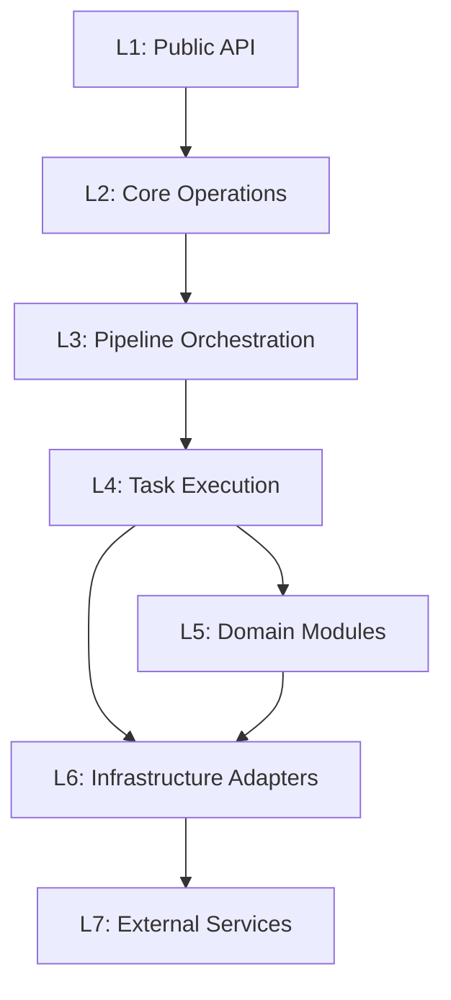

# Cognee — Functional Layer Architecture

> **Version**: 2.0  
> **Date**: 2026-05-07  
> **Source**: Codebase analysis of `topoteretes/cognee` v1.0.3

---

## 1. Tổng Quan Kiến Trúc

Cognee sử dụng kiến trúc **7-layer phân tầng** (top-down dependency), mỗi tầng có trách nhiệm rõ ràng và tương tác qua interface đã định nghĩa.

```
┌─────────────────────────────────────────────────────────────────┐
│  L1 — PUBLIC API LAYER                                          │
│  Python SDK · FastAPI REST · CLI · MCP Server                   │
├─────────────────────────────────────────────────────────────────┤
│  L2 — CORE OPERATIONS LAYER                                     │
│  V1 API (add/cognify/search/memify/delete)                      │
│  V2 Memory API (remember/recall/improve/forget/serve)           │
├─────────────────────────────────────────────────────────────────┤
│  L3 — PIPELINE ORCHESTRATION LAYER                              │
│  Task · BoundTask · TaskSpec · run_pipeline                     │
│  Pipeline Execution Mode · Pipeline Queue · Pipeline Context    │
├─────────────────────────────────────────────────────────────────┤
│  L4 — TASK EXECUTION LAYER                                      │
│  ingestion · graph extraction · storage · summarization         │
│  documents · temporal · chunks · completion · web_scraper       │
├─────────────────────────────────────────────────────────────────┤
│  L5 — DOMAIN MODULES LAYER                                      │
│  retrieval · chunking · ontology · users/permissions            │
│  search · cognify · memify · agent_memory · observability       │
│  data · session_lifecycle · visualization · settings · sync     │
├─────────────────────────────────────────────────────────────────┤
│  L6 — INFRASTRUCTURE ADAPTERS LAYER                             │
│  LLM Gateway · Graph DB Interface · Vector DB Interface         │
│  Relational DB · File Loaders · Embedding Engine                │
│  Session · Context Variables · Engine Models                    │
├─────────────────────────────────────────────────────────────────┤
│  L7 — EXTERNAL SERVICES & STORAGE                               │
│  OpenAI/Anthropic/Gemini/Ollama · Kuzu/Neo4j/Neptune            │
│  LanceDB/ChromaDB/PGVector · SQLite/PostgreSQL · S3/LocalFS    │
└─────────────────────────────────────────────────────────────────┘
```

### Dependency Flow



**Quy tắc:**
- Tầng trên chỉ gọi tầng dưới trực tiếp
- Ngoại lệ: L4 gọi cả L5 và L6 (tasks cần cả domain logic và DB adapters)
- L5 và L6 ngang hàng — L5 dùng interface của L6

### Ánh Xạ Tầng → Mã Nguồn

| Layer | Path | Dirs | Trách nhiệm |
|-------|------|------|-------------|
| L1 | `cognee/api/` · `cognee/cli/` · `cognee-mcp/` | 35+ | HTTP endpoints, SDK, CLI, MCP tools |
| L2 | `cognee/api/v1/{add,cognify,search,...}/` | 31 | Business operations: add, cognify, search, remember |
| L3 | `cognee/modules/pipelines/` | 8 | Task wrapper, pipeline runner, queue |
| L4 | `cognee/tasks/` | 16 | Atomic tasks: ingest, extract_graph, summarize |
| L5 | `cognee/modules/` (trừ pipelines) | 23 | Retrieval, chunking, ontology, users, search |
| L6 | `cognee/infrastructure/` | 11 | DB adapters, LLM gateway, file loaders |
| L7 | External packages | — | OpenAI, Kuzu, LanceDB, PostgreSQL, S3 |

---

## 2. L1 — Public API Layer

**Trách nhiệm:** Expose capabilities ra ngoài qua 4 interface song song.

| Interface | Path | Protocol | Entry point |
|-----------|------|----------|-------------|
| **Python SDK** | `cognee/__init__.py` | Python import | `import cognee` |
| **REST API** | `cognee/api/v1/` | HTTP/JSON (FastAPI) | `http://localhost:8000` |
| **CLI** | `cognee/cli/` | Terminal | `cognee-cli` |
| **MCP Server** | `cognee-mcp/` | SSE/stdio/HTTP | IDE integration |

### SDK Exports

```python
# V1 — granular control
from cognee import add, cognify, search, memify, delete, update, prune

# V2 — memory-oriented
from cognee import remember, recall, improve, forget, serve

# Observability
from cognee import enable_tracing, disable_tracing, get_last_trace

# Agent
from cognee import agent_memory  # decorator

# Types
from cognee import SearchType, MemoryEntry, QAEntry, TraceEntry, FeedbackEntry
```

### REST API Routes (26 endpoint groups)

| Route | Method | Chức năng |
|-------|--------|----------|
| `/api/v1/add` | POST | Data ingestion |
| `/api/v1/cognify` | POST | Knowledge graph construction |
| `/api/v1/search` | POST | Multi-mode search |
| `/api/v1/remember` | POST | V2: add + cognify atomic |
| `/api/v1/recall` | POST | V2: session-aware search |
| `/api/v1/improve` | POST | V2: self-improvement |
| `/api/v1/forget` | POST | V2: delete memory |
| `/api/v1/datasets` | CRUD | Dataset management |
| `/api/v1/auth` | POST | Login, register, API keys |
| `/api/v1/users` | CRUD | User management |
| `/api/v1/permissions` | CRUD | ACL management |
| `/api/v1/ontologies` | CRUD | Ontology management |
| `/api/v1/settings` | CRUD | Runtime configuration |
| `/api/v1/activity` | GET | Audit trail |
| `/api/v1/sessions` | GET | Session lifecycle |
| `/health` | GET | Health check |

**Auth:** JWT Bearer + API Key (`X-Api-Key`) + Cookie (via FastAPI Users)  
**CORS:** `CORS_ALLOWED_ORIGINS` env var

### MCP Tools

| Tool | Mô tả |
|------|-------|
| `cognify` | Transform data into knowledge graph |
| `search` | Query knowledge graph |
| `save_interaction` | Log user-agent interactions |
| `list_data` | List datasets and items |
| `delete_dataset` | Delete a dataset |
| `cognify_status` | Check background task status |

Transport: `stdio` (default), `sse`, `http` — Target: Cursor, Claude Desktop, VS Code

---

## 3. L2 — Core Operations Layer

**Trách nhiệm:** Business operations cấp cao, mỗi hàm là một thao tác hoàn chỉnh.

### V1 API — Granular Control

| Function | File | Chức năng |
|----------|------|----------|
| `add(data, dataset_name)` | `api/v1/add/` | Nhập dữ liệu → dataset |
| `cognify(datasets, graph_model)` | `api/v1/cognify/` | Xây dựng knowledge graph |
| `search(query, query_type)` | `api/v1/search/` | Multi-strategy retrieval |
| `memify(dataset)` | `modules/memify/` | Graph enrichment |
| `delete() / prune() / update()` | `api/v1/*/` | Data lifecycle |

### V2 Memory API — High-level

| Function | Behavior |
|----------|----------|
| `remember(data)` | `add()` + `cognify()` + optional `improve()` |
| `remember(data, session_id)` | Cache to session, background bridge to graph |
| `recall(query)` | Graph search |
| `recall(query, session_id)` | Session cache first → fall-through to graph |
| `improve(dataset)` | Triplet embedding + index refresh |
| `forget(dataset)` | Delete dataset + all data |
| `serve(url, api_key)` | Route SDK to Cognee Cloud |

**Remote-first routing:** Mọi function check `get_remote_client()` trước — nếu `serve()` đã gọi, delegate to cloud.

### Data Flow Chính

```
add() Flow:
  Input → resolve_user_dataset → resolve_dlt → run_pipeline([resolve_dirs, ingest]) → Storage

cognify() Flow:
  Dataset → run_pipeline([classify, chunk, extract_graph, summarize, add_data_points]) → Graph+Vector DB

search() Flow:
  Query + SearchType → resolve_permissions → Retriever(query) → Vector+Graph+LLM → Results

remember() Flow:
  Data → add() + cognify() + improve() OR session cache → Background bridge
```

---

## 4. L3 — Pipeline Orchestration Layer

**Trách nhiệm:** Workflow engine — nhận tasks, quản lý execution, batching, caching.  
**Path:** `cognee/modules/pipelines/`

### Task System (Class Hierarchy)

```
task() decorator/factory
  └─ TaskSpec (callable wrapper — dùng trong pipeline definition)
       └─ BoundTask (pre-bound kwargs — ready for chaining)
            └─ Task (core executor — runs the actual function)
```

### Task Types

| Type | Detection | Execution |
|------|-----------|-----------|
| Async Generator | `isasyncgenfunction` | Streaming yield |
| Generator | `isgeneratorfunction` | Sync streaming |
| Coroutine | `iscoroutinefunction` | Async await |
| Function | `isfunction` | Sync call |

### Key Features

| Feature | Mechanism |
|---------|-----------|
| **Batching** | `task_config={"batch_size": N}` — gom items trước khi yield |
| **Enrichment** | `enriches=True` — pass-through input khi output=None |
| **Drop** | `return Drop` — loại item khỏi pipeline |
| **Context** | `accepts_ctx=True` — nhận PipelineContext |
| **Summary** | `@task_summary("Processed {n} items")` — logging template |

### Pipeline Runner

```python
result = await run_pipeline(
    tasks=[Task(step1), Task(step2, param=val)],
    datasets=dataset_ids,
    pipeline_name="cognify_pipeline",
    use_pipeline_cache=True,
    incremental_loading=True,
)
```

**Execution modes:**
- `run_in_background=False` → blocking, wait for completion
- `run_in_background=True` → fire-and-forget, return immediately

### Pipeline Queue

`DatasetQueue` — concurrent access management, đảm bảo 1 pipeline / dataset tại 1 thời điểm.  
Config: `DATASET_QUEUE_ENABLED`, `DATASET_QUEUE_MAX_CONCURRENT`

---

## 5. L4 — Task Execution Layer

**Trách nhiệm:** Atomic async functions — mỗi hàm là 1 bước pipeline.  
**Path:** `cognee/tasks/`

### Task Directory (16 modules)

| Module | Chức năng chính |
|--------|----------------|
| `ingestion/` | Resolve paths, extract content, DLT sources |
| `documents/` | Document classification (50+ types), chunk extraction |
| `chunks/` | Chunk processing, merging, filtering |
| `graph/` | LLM entity & relationship extraction → KnowledgeGraph |
| `storage/` | Persist DataPoints to Graph DB + Vector DB |
| `summarization/` | LLM hierarchical summarization |
| `completion/` | LLM completion generation |
| `entity_completion/` | Entity-level completion |
| `temporal_awareness/` | Time-aware processing |
| `temporal_graph/` | Temporal event extraction + graph building |
| `memify/` | Graph enrichment tasks |
| `schema/` | Schema extraction |
| `translation/` | Text translation (LLM/Google/Azure) |
| `web_scraper/` | Web content extraction (BeautifulSoup/Tavily) |
| `cleanup/` | Data cleanup |
| `codingagents/` | Code-specific processing |

### Default Pipeline Sequences

**ADD Pipeline:**
```
resolve_data_directories → ingest_data
```

**COGNIFY Pipeline (Default):**
```
classify_documents
  → extract_chunks_from_documents (TextChunker, configurable chunk_size)
  → extract_graph_and_summarize (LLM entities + relationships + summaries)
  → add_data_points (write Graph DB + Vector DB, embed_triplets=True)
  → extract_dlt_fk_edges (FK-based edges for tabular data)
```

**COGNIFY Pipeline (Temporal):**
```
classify_documents
  → extract_chunks_from_documents
  → extract_events_and_timestamps
  → extract_knowledge_graph_from_events
  → add_data_points
```

---

## 6. L5 — Domain Modules Layer

**Trách nhiệm:** Business logic, domain models, strategy implementations.  
**Path:** `cognee/modules/` (trừ `pipelines/`)

### Module Map (23 modules)

| Module | Path | Chức năng |
|--------|------|----------|
| **retrieval** | `modules/retrieval/` | 14+ Retriever implementations per SearchType |
| **search** | `modules/search/` | SearchType registry + dispatcher |
| **chunking** | `modules/chunking/` | Text splitting strategies |
| **ontology** | `modules/ontology/` | OWL ontology resolver + entity grounding |
| **users** | `modules/users/` | Auth, roles, permissions, ACLs, tenants |
| **data** | `modules/data/` | Dataset + Data CRUD, authorization |
| **cognify** | `modules/cognify/` | Cognify configuration |
| **memify** | `modules/memify/` | Graph enrichment logic |
| **agent_memory** | `modules/agent_memory/` | Runtime memory injection decorator |
| **observability** | `modules/observability/` | OpenTelemetry tracing + spans |
| **session_lifecycle** | `modules/session_lifecycle/` | Session tracking + metrics |
| **graph** | `modules/graph/` | Graph operations + models |
| **engine** | `modules/engine/` | DB setup operations |
| **ingestion** | `modules/ingestion/` | Data classification + identification |
| **storage** | `modules/storage/` | Storage utilities |
| **visualization** | `modules/visualization/` | Network graph visualization (72KB) |
| **settings** | `modules/settings/` | Runtime settings CRUD |
| **sync** | `modules/sync/` | Data synchronization |
| **cloud** | `modules/cloud/` | Cloud service operations |
| **metrics** | `modules/metrics/` | System metrics |
| **notebooks** | `modules/notebooks/` | Jupyter integration |
| **run_custom_pipeline** | `modules/run_custom_pipeline/` | Custom pipeline runner |

### Retrieval System (Core)

```
BaseRetriever (ABC) — 3-step pipeline:
  ├── get_retrieved_objects()   → Step 1: Fetch raw data
  ├── get_context_from_objects() → Step 2: Format for LLM
  └── get_completion_from_context() → Step 3: LLM completion
```

**14 Retriever implementations:**

| Retriever | SearchType | Strategy |
|-----------|-----------|----------|
| GraphCompletionRetriever | `GRAPH_COMPLETION` | Vector → graph traversal → LLM |
| GraphCompletionCotRetriever | `GRAPH_COMPLETION_COT` | Chain-of-thought |
| GraphCompletionDecompositionRetriever | `GRAPH_COMPLETION_DECOMPOSITION` | Query decomposition |
| GraphCompletionContextExtensionRetriever | `GRAPH_COMPLETION_CONTEXT_EXTENSION` | Extended context |
| GraphSummaryCompletionRetriever | `GRAPH_SUMMARY_COMPLETION` | Summaries + graph |
| TripletRetriever | `TRIPLET_COMPLETION` | Subject-predicate-object |
| CompletionRetriever | `RAG_COMPLETION` | Traditional RAG |
| ChunksRetriever | `CHUNKS` | Vector similarity |
| LexicalRetriever | `CHUNKS_LEXICAL` | Jaccard token-based |
| SummariesRetriever | `SUMMARIES` | Pre-computed summaries |
| CypherSearchRetriever | `CYPHER` | Raw Cypher queries |
| NaturalLanguageRetriever | `NATURAL_LANGUAGE` | NL → structured query |
| TemporalRetriever | `TEMPORAL` | Time-aware traversal |
| CodingRulesRetriever | `CODING_RULES` | Code patterns |

Extension: `register_retriever("name", CustomRetriever)` cho community retrievers.

### Users & Permissions

```
Tenant (optional)
  └─ User → UserTenant, UserRole
       └─ Dataset (many) → Permission (read | write | delete | share)
            └─ Data (many) → Graph/Vector indices
```

Khi `ENABLE_BACKEND_ACCESS_CONTROL=True`: mỗi user+dataset → isolated DB instances.

### Agent Memory

```python
@agent_memory(with_memory=True, session_id="chat_1")
async def my_agent(query: str):
    ...  # LLMGateway auto-prepends memory context
```

Runtime flow: resolve user → resolve dataset → set context → retrieve memory → execute → persist trace.

---

## 7. L6 — Infrastructure Adapters Layer

**Trách nhiệm:** Abstract interfaces + concrete adapters (Adapter pattern).  
**Path:** `cognee/infrastructure/`

### Module Map (11 modules)

```
infrastructure/
├── databases/
│   ├── graph/           # GraphDBInterface + 4 adapters
│   ├── vector/          # VectorDBInterface + 3 adapters
│   ├── relational/      # SQLAlchemy (SQLite/PostgreSQL)
│   ├── hybrid/          # Combined query operations
│   ├── cache/           # Caching layer
│   ├── dataset_database_handler/   # Per-dataset DB routing
│   └── dataset_queue/   # Concurrent access queue
├── llm/
│   ├── LLMGateway.py    # Unified LLM interface
│   ├── config.py        # Provider config
│   ├── structured_output_framework/  # Instructor + BAML
│   └── prompts/         # Prompt templates
├── engine/models/       # DataPoint, Edge, FieldAnnotations
├── files/storage/       # Local FS + S3
├── loaders/             # PDF, DOCX, Audio, Image, Code loaders
├── session/             # Session management
├── context/             # Context management
└── locks/               # Distributed locking
```

### Graph DB (`GraphDBInterface` ABC — 30+ methods)

| Backend | Default | Extra | Isolation |
|---------|---------|-------|-----------|
| **Kuzu** | ✅ | built-in | Per-user embedded DB |
| **Neo4j** | — | `cognee[neo4j]` | Cypher native |
| **Neptune** | — | `cognee[neptune]` | AWS managed |
| **PostgreSQL** | — | `cognee[postgres]` | Adjacency tables |

Factory: `get_graph_engine()` → reads `GRAPH_DATABASE_PROVIDER`

Core methods: `add_node/nodes`, `add_edge/edges`, `get_node/nodes`, `get_neighbors`, `get_connections`, `get_neighborhood`, `get_graph_data`, `delete_graph`, `get_triplets_batch`, `get/set_node_feedback_weights`

### Vector DB (`VectorDBInterface` Protocol)

| Backend | Default | Extra |
|---------|---------|-------|
| **LanceDB** | ✅ | built-in |
| **PGVector** | — | `cognee[postgres]` |
| **ChromaDB** | — | `cognee[chromadb]` |

Factory: `get_vector_engine()` → reads `VECTOR_DB_PROVIDER`

Core methods: `has_collection`, `create_collection`, `create_data_points`, `search`, `batch_search`, `embed_data`, `prune`

### LLM Gateway (`LLMGateway` static class)

| Method | Chức năng |
|--------|----------|
| `acreate_structured_output()` | Entity extraction (Instructor/BAML) |
| `create_transcript()` | Audio transcription (Whisper) |
| `transcribe_image()` | OCR / image description |
| `_inject_agent_memory()` | Auto-prepend memory context |

**Providers:** OpenAI, Azure, Anthropic, Gemini, Ollama, Bedrock, Mistral, Groq, Custom  
**Rate limiting:** Token-bucket via `LLM_RATE_LIMIT_ENABLED/REQUESTS/INTERVAL`

### Context & Session

```python
# ContextVar-based DB config switching for async isolation
vector_db_config = ContextVar("vector_db_config", default=None)
graph_db_config = ContextVar("graph_db_config", default=None)
session_user = ContextVar("session_user", default=None)

# Scoped mode (preferred)
async with set_database_global_context_variables(dataset, user_id):
    # graph/vector config applied for this block
    ...
# Config released automatically
```

---

## 8. L7 — External Services Layer

**Trách nhiệm:** External third-party services — Cognee chỉ tương tác qua APIs.

### Service Catalog

| Category | Services |
|----------|----------|
| **LLM** | OpenAI, Azure, Anthropic, Gemini, Ollama, Bedrock, Mistral, Groq |
| **Graph DB** | Kuzu (embedded), Neo4j (Bolt), Neptune (AWS), PostgreSQL (AGE) |
| **Vector DB** | LanceDB (embedded), ChromaDB, PGVector, Qdrant, Weaviate, Milvus |
| **Relational** | SQLite (embedded), PostgreSQL (asyncpg) |
| **Storage** | Local FS, AWS S3 |
| **Embeddings** | OpenAI, Ollama, HuggingFace, Cohere |
| **Cache** | Redis |
| **Observability** | Langfuse, Sentry, PostHog, OTLP-compatible backends |
| **Data Integration** | Tavily, DLT, Docling, Unstructured |

### Default Stack (Zero Config)

| Component | Default | Cần cấu hình |
|-----------|---------|---------------|
| Relational | SQLite | Không |
| Vector | LanceDB | Không |
| Graph | Kuzu | Không |
| Storage | Local FS | Không |
| LLM | OpenAI `gpt-4o-mini` | `LLM_API_KEY` |

---

## 9. Cross-Cutting Concerns

| Concern | Module | Layer |
|---------|--------|-------|
| **Multi-Tenancy** | `modules/users/`, `context_global_variables.py` | L5 + L6 |
| **Observability** | `modules/observability/` (OpenTelemetry, Langfuse) | L5 |
| **Session Management** | `infrastructure/session/`, `modules/session_lifecycle/` | L5 + L6 |
| **Agent Memory** | `modules/agent_memory/` (decorator + runtime) | L5 |
| **Configuration** | `base_config.py`, `infrastructure/*/config.py` | L6 |
| **Error Handling** | `exceptions/` (per-module) | All |
| **Logging** | `shared/logging_utils.py` (structlog) | Shared |
| **Caching** | `shared/cache.py`, `infrastructure/databases/cache/` | L5 + L6 |
| **Migrations** | `cognee/alembic/` (Alembic) | L6 |
| **Rate Limiting** | `infrastructure/llm/` (token-bucket) | L6 |

---

## 10. Key Design Decisions

1. **ECL over RAG** — Extract-Cognify-Load tạo knowledge graph persistent thay vì transient chunks.
2. **Async-first** — Tất cả SDK functions là `async`. Pipeline hỗ trợ blocking + background.
3. **Adapter pattern** — Graph/Vector/LLM đều implement abstract interfaces → swap không đổi logic.
4. **Dual API surface** — V1 (granular) + V2 (memory-oriented `remember/recall/forget`) song song.
5. **Session-to-graph bridging** — Session memory (fast cache) auto-sync to permanent graph.
6. **Ontology grounding** — OWL ontology chuẩn hóa entity names, giảm graph fragmentation.
7. **Pipeline composability** — `Task` objects là pure functions, có thể compose/reorder/replace.

---

## 11. Related Documents

| Document | Nội dung |
|----------|---------|
| [L0-system-overview.md](./L0-system-overview.md) | Tổng quan kiến trúc + data flows |
| [L1-public-api-layer.md](./L1-public-api-layer.md) | REST endpoints, SDK, CLI, MCP |
| [L2-core-operations-layer.md](./L2-core-operations-layer.md) | V1 + V2 API chi tiết |
| [L3-pipeline-orchestration-layer.md](./L3-pipeline-orchestration-layer.md) | Task system, runner, queue |
| [L4-task-execution-layer.md](./L4-task-execution-layer.md) | 16 task modules chi tiết |
| [L5-domain-modules-layer.md](./L5-domain-modules-layer.md) | 23 domain modules, retrievers |
| [L6-infrastructure-adapters-layer.md](./L6-infrastructure-adapters-layer.md) | DB adapters, LLM gateway |
| [L7-external-services-layer.md](./L7-external-services-layer.md) | External services, deployment |
| [technical-design-document.md](./technical-design-document.md) | TDD toàn diện |
