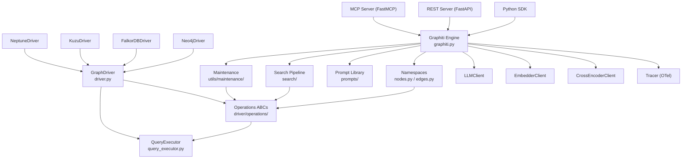

# Graphiti — Architecture Design Document

**Version:** 1.0 | **Date:** 2026-05-07 | **Source:** getzep/graphiti (Apache 2.0)

---

## 1. System Context

Graphiti is a **Temporal Context Graph Engine** for AI agents. It ingests unstructured/structured data as episodes, extracts entities and facts via LLM, maintains temporal validity windows, and provides hybrid retrieval (semantic + keyword + graph traversal).

```
┌─────────────────────────────────────────────────────────────────┐
│                        External Systems                         │
│  AI Agents │ Chat Apps │ Data Pipelines │ Claude/Cursor (MCP)   │
└──────┬─────────┬──────────────┬──────────────┬──────────────────┘
       │         │              │              │
┌──────▼─────────▼──────────────▼──────────────▼──────────────────┐
│                     Graphiti Platform                            │
│  ┌─────────────┐  ┌──────────────┐  ┌────────────────────────┐  │
│  │ Python SDK  │  │ REST Server  │  │ MCP Server             │  │
│  │ (graphiti_  │  │ (FastAPI)    │  │ (FastMCP)              │  │
│  │  core)      │  │ port 8000    │  │ port 8001              │  │
│  └──────┬──────┘  └──────┬───────┘  └──────────┬─────────────┘  │
│         └────────────────┼──────────────────────┘               │
│                    ┌─────▼──────┐                                │
│                    │  Graphiti  │                                │
│                    │  Core      │                                │
│                    │  Engine    │                                │
│                    └─────┬──────┘                                │
│         ┌────────────────┼────────────────┐                     │
│    ┌────▼────┐     ┌─────▼─────┐    ┌─────▼──────┐             │
│    │ LLM     │     │ Embedder  │    │ Cross-     │             │
│    │ Client  │     │ Client    │    │ Encoder    │             │
│    └────┬────┘     └─────┬─────┘    └─────┬──────┘             │
│         │                │                │                     │
│    ┌────▼────────────────▼────────────────▼──────┐              │
│    │           Graph Driver Layer                │              │
│    │  Neo4j │ FalkorDB │ Kuzu │ Neptune          │              │
│    └─────────────────────────────────────────────┘              │
└─────────────────────────────────────────────────────────────────┘
```

---

## 2. Layered Architecture

The system follows a strict **4-layer architecture** with unidirectional dependencies:

```
Layer 4: Public Interfaces     (SDK, REST, MCP)
    ↓
Layer 3: Core Engine           (Graphiti class, pipelines)
    ↓
Layer 2: Namespace + Services  (orchestration, embeddings, tracing)
    ↓
Layer 1: Operations + Driver   (pure DB I/O, query execution)
    ↓
Layer 0: Query Executor        (minimal ABC, no deps — breaks import cycles)
```

### 2.1 Layer 0 — Query Executor (Dependency Root)

Standalone ABCs with zero imports from upper layers. Breaks the circular dependency between drivers and operations.

| Component | File | Purpose |
|-----------|------|---------|
| `QueryExecutor` | `driver/query_executor.py` | Abstract `execute_query()` + `session()` |
| `Transaction` | `driver/query_executor.py` | Abstract `run(query)` for transactional ops |

### 2.2 Layer 1 — Operations ABCs + Driver

**Operations ABCs** (`driver/operations/`) define per-object-type DB contracts:

| Operations ABC | Object | Key Methods |
|----------------|--------|-------------|
| `EntityNodeOperations` | EntityNode | save, save_bulk, delete, get_by_uuid, load_embeddings |
| `EpisodeNodeOperations` | EpisodicNode | save, retrieve_episodes, get_by_entity_node_uuid |
| `CommunityNodeOperations` | CommunityNode | save, load_name_embedding |
| `SagaNodeOperations` | SagaNode | save, get_by_group_ids |
| `EntityEdgeOperations` | EntityEdge | save, get_between_nodes, get_by_node_uuid, load_embeddings |
| `EpisodicEdgeOperations` | EpisodicEdge | save, save_bulk |
| `CommunityEdgeOperations` | CommunityEdge | save, delete |
| `HasEpisodeEdgeOperations` | HasEpisodeEdge | save, save_bulk |
| `NextEpisodeEdgeOperations` | NextEpisodeEdge | save, save_bulk |
| `SearchOperations` | Search | node/edge/episode/community fulltext + similarity + bfs |
| `GraphMaintenanceOperations` | Maintenance | clear_data, build_indices, community_clusters |

**GraphDriver** (`driver/driver.py`) extends `QueryExecutor` and composes all operations:

```python
class GraphDriver(QueryExecutor, ABC):
    provider: GraphProvider           # NEO4J | FALKORDB | KUZU | NEPTUNE
    entity_node_ops → EntityNodeOperations
    episode_node_ops → EpisodeNodeOperations
    # ... all 11 operations interfaces
    transaction() → AsyncContextManager[Transaction]
```

**Driver Implementations:**

| Driver | Backend | Protocol | Specifics |
|--------|---------|----------|-----------|
| `Neo4jDriver` | Neo4j 5.x | Bolt (7687) | Full Cypher, native vector index, real transactions |
| `FalkorDBDriver` | FalkorDB | Redis (6379) | Custom fulltext syntax, graph per group_id |
| `KuzuDriver` | Kuzu | Embedded | Edges as `RelatesToNode_` intermediate nodes |
| `NeptuneDriver` | Neptune | HTTP | OpenSearch for fulltext, CSV-serialized embeddings |

### 2.3 Layer 2 — Namespaces (Orchestration)

Thin wrappers providing a clean API (`graphiti.nodes.entity.save(node)`) that handle cross-cutting concerns before delegating to operations:

```python
class EntityNodeNamespace:
    # 1. Generate embeddings (via EmbedderClient)
    # 2. Delegate to EntityNodeOperations.save()
    async def save(self, node, tx=None) → EntityNode
```

| Namespace | Accessed via | Wraps |
|-----------|-------------|-------|
| `EntityNodeNamespace` | `graphiti.nodes.entity` | `EntityNodeOperations` |
| `EpisodeNodeNamespace` | `graphiti.nodes.episode` | `EpisodeNodeOperations` |
| `CommunityNodeNamespace` | `graphiti.nodes.community` | `CommunityNodeOperations` |
| `SagaNodeNamespace` | `graphiti.nodes.saga` | `SagaNodeOperations` |
| `EdgeNamespace` | `graphiti.edges` | Edge operations |

### 2.4 Layer 3 — Core Engine

The `Graphiti` class (~1741 LOC) is the single orchestration point. On init, it assembles all clients into `GraphitiClients`:

```python
class GraphitiClients(BaseModel):
    driver: GraphDriver
    llm_client: LLMClient
    embedder: EmbedderClient
    cross_encoder: CrossEncoderClient
    tracer: Tracer
```

### 2.5 Layer 4 — Public Interfaces

| Interface | Technology | Serialization |
|-----------|-----------|---------------|
| **Python SDK** | Direct `Graphiti` class | Native Python objects |
| **REST Server** | FastAPI + Pydantic DTOs | JSON |
| **MCP Server** | FastMCP | MCP Protocol |

---

## 3. Graph Data Model

### 3.1 Node Types

```
┌──────────────┐     ┌──────────────┐     ┌──────────────┐     ┌──────────────┐
│ EpisodicNode │     │  EntityNode  │     │CommunityNode │     │   SagaNode   │
│ (Episodic)   │     │  (Entity)    │     │ (Community)  │     │   (Saga)     │
├──────────────┤     ├──────────────┤     ├──────────────┤     ├──────────────┤
│ content      │     │ summary      │     │ summary      │     │ summary      │
│ source       │     │ labels[]     │     │ name_embed.  │     │ first_ep_uuid│
│ valid_at     │     │ attributes{} │     │ group_id     │     │ last_ep_uuid │
│ entity_edges │     │ name_embed.  │     └──────────────┘     │ last_summ_at │
│ ep_metadata  │     │ group_id     │                          └──────────────┘
└──────────────┘     └──────────────┘
```

### 3.2 Edge Types

| Edge | Relationship | From → To | Purpose |
|------|-------------|-----------|---------|
| `EntityEdge` | `RELATES_TO` | Entity → Entity | Temporal fact with validity window |
| `EpisodicEdge` | `MENTIONS` | Episodic → Entity | Provenance link |
| `CommunityEdge` | `HAS_MEMBER` | Community → Entity | Cluster membership |
| `HasEpisodeEdge` | `HAS_EPISODE` | Saga → Episodic | Saga composition |
| `NextEpisodeEdge` | `NEXT_EPISODE` | Episodic → Episodic | Temporal ordering |

### 3.3 Bi-Temporal Model

`EntityEdge` carries four temporal dimensions:

| Field | Semantics | Set By |
|-------|-----------|--------|
| `valid_at` | When the fact became true (real-world) | Ingestion pipeline |
| `invalid_at` | When the fact stopped being true (real-world) | Conflict resolution |
| `expired_at` | When the record was logically superseded (system) | Edge resolution |
| `created_at` | When the record was written (system) | Auto-generated |

**Invalidation rule:** Old facts are **never deleted**. When contradicted, `invalid_at` is set → enabling point-in-time queries.

### 3.4 Multi-Tenancy via `group_id`

Every node/edge carries `group_id` as a partition key:
- **Neo4j/Neptune:** Filter property on queries
- **FalkorDB:** Separate graph per group_id
- **Kuzu:** Separate database per group_id

---

## 4. Episode Ingestion Pipeline

### 4.1 Single Episode Flow (`add_episode`)

```
Input (name, body, source, reference_time, group_id, entity_types?, edge_types?)
  │
  ├─1─► retrieve_episodes()          Fetch N previous episodes for context
  │
  ├─2─► extract_nodes() [LLM]       Identify entities from text
  │     └─ Prompt: extract_nodes.py → list[{name, label, summary}]
  │
  ├─3─► resolve_extracted_nodes()    Deduplicate against existing graph
  │     ├─ Semantic search (cosine + BM25)
  │     └─ LLM: dedupe_nodes.py → merge or keep-new decision
  │
  ├─4─► extract_edges() [LLM]       Identify fact triples (parallel with 5)
  │     └─ Prompt: extract_edges.py → list[{source, target, fact}]
  │
  ├─5─► extract_attributes_from_nodes() [LLM]  Update entity summaries
  │     └─ Prompt: summarize_nodes.py
  │
  ├─6─► resolve_extracted_edges()    Conflict resolution
  │     ├─ Match existing edges by similarity
  │     └─ LLM: dedupe_edges.py → resolve contradictions, set invalid_at
  │
  ├─7─► build_episodic_edges()       Link episode ↔ entities (MENTIONS)
  │
  ├─8─► add_nodes_and_edges_bulk()   Generate embeddings + upsert to DB
  │
  └─9─► update_community()           Determine/update community membership
```

All LLM calls use **Pydantic structured output** (`response_model`). Pipeline is fully `async` with `semaphore_gather()` bounding concurrency via `SEMAPHORE_LIMIT` (default: 20).

### 4.2 Bulk Episode Flow (`add_episode_bulk`)

1. **Parallel extraction** — `extract_nodes_and_edges_bulk()` for all episodes concurrently
2. **In-memory dedup** — `dedupe_nodes_bulk()` resolves duplicates across the batch before DB write
3. **Graph resolution** — `resolve_extracted_nodes/edges()` per episode against existing graph
4. **Bulk save** — Single `add_nodes_and_edges_bulk()` call
5. Community updates skipped (run `build_communities()` separately)

### 4.3 Content Chunking

Large/dense content is auto-chunked before entity extraction:

| Config | Env Var | Default | Purpose |
|--------|---------|---------|---------|
| Chunk size | `CHUNK_TOKEN_SIZE` | 3000 tokens | Max tokens per chunk |
| Overlap | `CHUNK_OVERLAP_TOKENS` | 200 tokens | Overlap between chunks |
| Min size | `CHUNK_MIN_TOKENS` | 1000 tokens | Skip chunking below this |
| Density threshold | `CHUNK_DENSITY_THRESHOLD` | 0.15 | Entity density trigger |

---

## 5. Search Architecture

### 5.1 Pipeline

```
Query
  │
  ├─► Generate query embedding (EmbedderClient)
  │
  ├─► Execute search methods in parallel:
  │     ├─ cosine_similarity (ANN over stored embeddings)
  │     ├─ bm25 (fulltext, provider-specific Lucene syntax)
  │     └─ bfs (graph traversal from matched nodes)
  │
  ├─► Merge results per entity type (edges, nodes, episodes, communities)
  │
  ├─► Apply reranking strategy:
  │     ├─ rrf (Reciprocal Rank Fusion — default)
  │     ├─ mmr (Maximal Marginal Relevance — diversity)
  │     ├─ cross_encoder (neural reranking)
  │     ├─ node_distance (graph proximity to center node)
  │     └─ episode_mentions (recency/frequency boost)
  │
  ├─► Apply filters (temporal, group_id, labels, uuid restrictions)
  │
  └─► Return SearchResults { edges, nodes, episodes, communities }
```

### 5.2 Search Configuration

```python
SearchConfig(
    edge_config     = EdgeSearchConfig(search_methods, reranker, sim_min_score, ...),
    node_config     = NodeSearchConfig(...),
    episode_config  = EpisodeSearchConfig(...),
    community_config= CommunitySearchConfig(...),
    limit           = 10,
)
```

**Pre-built recipes** in `search_config_recipes.py`:

| Recipe | Strategy |
|--------|----------|
| `EDGE_HYBRID_SEARCH_RRF` | BM25 + cosine, RRF rerank (default `search()`) |
| `EDGE_HYBRID_SEARCH_CROSS_ENCODER` | BM25 + cosine + BFS, cross-encoder |
| `COMBINED_HYBRID_SEARCH_CROSS_ENCODER` | All types, cross-encoder (default `search_()`) |
| `NODE_HYBRID_SEARCH_*` / `COMMUNITY_HYBRID_SEARCH_*` | Type-specific variants |

---

## 6. LLM Integration Architecture

### 6.1 Client Hierarchy

```
LLMClient (ABC)
  ├── OpenAIClient          (GPT-4o / gpt-4o-mini)
  ├── OpenAIGenericClient   (Ollama, LM Studio — OpenAI-compat)
  ├── AzureOpenAILLMClient  (Azure OpenAI)
  ├── AnthropicClient       (Claude)
  ├── GeminiClient          (Gemini 2.0 Flash)
  ├── GroqClient            (Groq)
  └── GLiNER2Client         (Local NER — extraction only)
```

**Features:** Retry with exponential backoff (4 attempts, 5-120s), optional file-based response caching, token usage tracking per prompt type, multilingual extraction.

### 6.2 Prompt Library

Central registry at `prompts/lib.py`, accessed as `prompt_library.<module>.<function>(context)`:

| Module | Purpose | Output Schema |
|--------|---------|---------------|
| `extract_nodes.py` | Entity extraction | `list[{name, label, summary}]` |
| `extract_edges.py` | Fact triple extraction | `list[{source, target, fact}]` |
| `extract_nodes_and_edges.py` | Combined (bulk path) | Merged schema |
| `dedupe_nodes.py` | Entity deduplication | Merge/keep decision |
| `dedupe_edges.py` | Edge conflict resolution | Invalidation decisions |
| `summarize_nodes.py` | Entity summary update | Updated summary |
| `summarize_sagas.py` | Incremental saga summary | Saga summary |

### 6.3 Embedder Hierarchy

```
EmbedderClient (ABC) → create(input) / create_bulk(inputs)
  ├── OpenAIEmbedder         (text-embedding-3-small)
  ├── AzureOpenAIEmbedder
  ├── GeminiEmbedder
  └── VoyageAIEmbedder
```

### 6.4 Cross-Encoder Hierarchy

```
CrossEncoderClient (ABC) → rank(query, passages) → list[float]
  ├── OpenAIRerankerClient   (log-prob classification)
  ├── GeminiRerankerClient
  └── LocalCrossEncoderClient (sentence-transformers/BGE)
```

---

## 7. Community Detection

Uses **Label Propagation Algorithm** (LPA):

1. `get_community_clusters()` — Build adjacency projection per `group_id`
2. `label_propagation()` — Iterative assignment: each node adopts the plurality community of its neighbors
3. `build_community()` — Hierarchical pairwise LLM summarization of cluster members
4. Persist `CommunityNode` + `CommunityEdge` (HAS_MEMBER) links
5. Generate `name_embedding` for community search

**Constraints:** O(N) in entities; intended as periodic batch job, not real-time. Max concurrency: 10.

---

## 8. Saga Management

```
SagaNode ──HAS_EPISODE──► EpisodicNode₁ ──NEXT_EPISODE──► EpisodicNode₂ ──► ...
```

- Auto-created on first `add_episode(..., saga="name")`
- Episodes linked in temporal order via `NEXT_EPISODE`
- `summarize_saga()` — Incremental LLM summary; only processes episodes added since `last_summarized_at`
- `saga_previous_episode_uuid` — Optimization to skip DB lookup when adding sequential episodes

---

## 9. Observability Stack

### 9.1 OpenTelemetry Tracing

```
Tracer (ABC)
  ├── NoOpTracer        (default — zero overhead)
  └── OpenTelemetryTracer
        └── OpenTelemetrySpan → add_attributes, set_status, record_exception
```

Instrumented: `llm.generate`, `embedder.create`, `driver.execute_query`, `search.*`

### 9.2 Token Usage Tracking

`TokenUsageTracker` aggregates per prompt type. Access: `graphiti.token_tracker.get_usage()`.

### 9.3 Telemetry

Anonymous PostHog on `Graphiti.__init__()`. Disable: `GRAPHITI_TELEMETRY_ENABLED=false`.

---

## 10. Concurrency Model

| Mechanism | Config | Default | Purpose |
|-----------|--------|---------|---------|
| `semaphore_gather()` | `SEMAPHORE_LIMIT` | 20 | Bound concurrent LLM/embedder calls |
| `AsyncWorker` (REST) | Internal queue | 1 consumer | Serialize episode processing per group |
| Community semaphore | Hardcoded | 10 | Limit concurrent community builds |

**Critical constraint:** `add_episode` must not be called concurrently for the same `group_id` — risks deduplication races. REST server enforces this via AsyncWorker; SDK users must manage externally.

---

## 11. Deployment Architecture

### 11.1 Docker Compose

```yaml
services:
  graphiti-server:    # FastAPI REST (port 8000)
  graphiti-mcp:       # MCP Server (port 8001)
  neo4j:              # Neo4j 5.x (ports 7474/7687)
  # OR
  falkordb:           # FalkorDB (port 6379) — via --profile falkordb
```

### 11.2 Environment Configuration

| Variable | Default | Purpose |
|----------|---------|---------|
| `OPENAI_API_KEY` | — | LLM/Embedder credential |
| `NEO4J_URI` | `bolt://localhost:7687` | Graph DB |
| `NEO4J_USER` / `NEO4J_PASSWORD` | `neo4j` / `password` | DB auth |
| `SEMAPHORE_LIMIT` | `20` | Max concurrent async ops |
| `CHUNK_TOKEN_SIZE` | `3000` | Content chunking |
| `GRAPHITI_TELEMETRY_ENABLED` | `true` | Opt-out telemetry |

### 11.3 Package Installation

```bash
pip install graphiti-core                          # Core (Neo4j)
pip install graphiti-core[falkordb]                # + FalkorDB
pip install graphiti-core[kuzu]                    # + Kuzu
pip install graphiti-core[neptune]                 # + Neptune
pip install graphiti-core[anthropic,google-genai]  # + LLM providers
```

---

## 12. Key Design Decisions

| Decision | Rationale |
|----------|-----------|
| **Async-first** | All I/O is async; `semaphore_gather` manages concurrency |
| **Pydantic structured output** | Enforces schema compliance from LLMs; fails loudly |
| **IoC Operations pattern** | Universal Cypher fallback + optimized per-driver implementations |
| **Invalidation over deletion** | Temporal history preserved; point-in-time queries possible |
| **`group_id` as partition key** | Simple multi-tenancy; maps to DB-level isolation where supported |
| **Sequential episode processing** | Graph consistency requires ordered ingestion per group |
| **Label Propagation for communities** | Simple, deterministic, no external dependencies |
| **NoOp defaults for tracing/telemetry** | Zero overhead when observability not configured |
| **Namespace pattern** | Clean API (`graphiti.nodes.entity.save()`) separating orchestration from DB I/O |

---

## 13. Module Dependency Graph



---

## 14. Source Tree Reference

```
graphiti_core/
├── graphiti.py                    # Core engine (Layer 3)
├── graphiti_types.py              # GraphitiClients dataclass
├── nodes.py                       # Node models
├── edges.py                       # Edge models
├── namespaces/                    # Layer 2 — Namespace wrappers
│   ├── nodes.py                   #   Entity/Episode/Community/Saga
│   └── edges.py                   #   Edge namespaces
├── driver/                        # Layer 1 — Driver + Operations
│   ├── query_executor.py          #   Layer 0 — QueryExecutor ABC
│   ├── driver.py                  #   GraphDriver ABC
│   ├── operations/                #   11 Operations ABCs
│   ├── neo4j_driver.py            #   Neo4j implementation
│   ├── neo4j/                     #   Neo4j-specific ops
│   ├── falkordb_driver.py         #   FalkorDB implementation
│   ├── falkordb/                  #   FalkorDB-specific ops
│   ├── kuzu_driver.py             #   Kuzu implementation
│   ├── kuzu/                      #   Kuzu-specific ops
│   ├── neptune_driver.py          #   Neptune implementation
│   └── neptune/                   #   Neptune-specific ops
├── llm_client/                    # LLM provider adapters
├── embedder/                      # Embedding providers
├── cross_encoder/                 # Reranker adapters
├── search/                        # Search pipeline
│   ├── search.py                  #   Core orchestrator
│   ├── search_config.py           #   Config structures
│   ├── search_config_recipes.py   #   Pre-built configs
│   └── search_filters.py          #   Query filters
├── prompts/                       # LLM prompt templates (13 modules)
├── utils/
│   ├── maintenance/               #   Node/edge extraction, dedup, community
│   ├── ontology_utils/            #   Custom entity-type validation
│   ├── bulk_utils.py              #   Batch processing helpers
│   └── content_chunking.py        #   Density-based chunking
├── helpers.py                     # semaphore_gather, validation, chunking config
├── tracer.py                      # OpenTelemetry integration
└── telemetry/                     # Anonymous PostHog telemetry

server/graph_service/              # Layer 4 — REST API
├── main.py                        #   FastAPI app
├── config.py                      #   Pydantic Settings
├── zep_graphiti.py                #   ZepGraphiti subclass
├── routers/{ingest,retrieve}.py   #   API endpoints
└── dto/{common,ingest,retrieve}.py#   Request/Response DTOs

mcp_server/src/
└── graphiti_mcp_server.py         # Layer 4 — MCP Server
```
