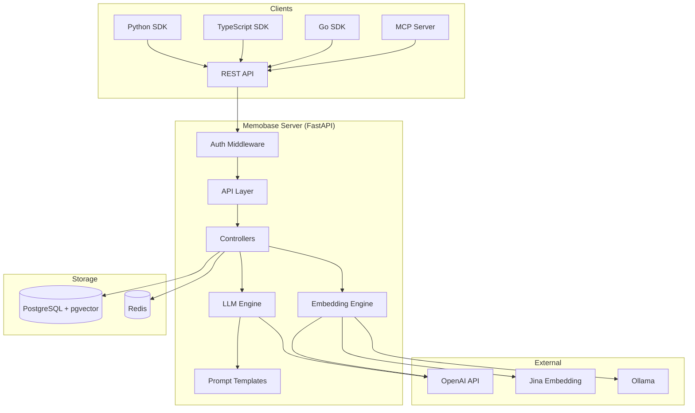
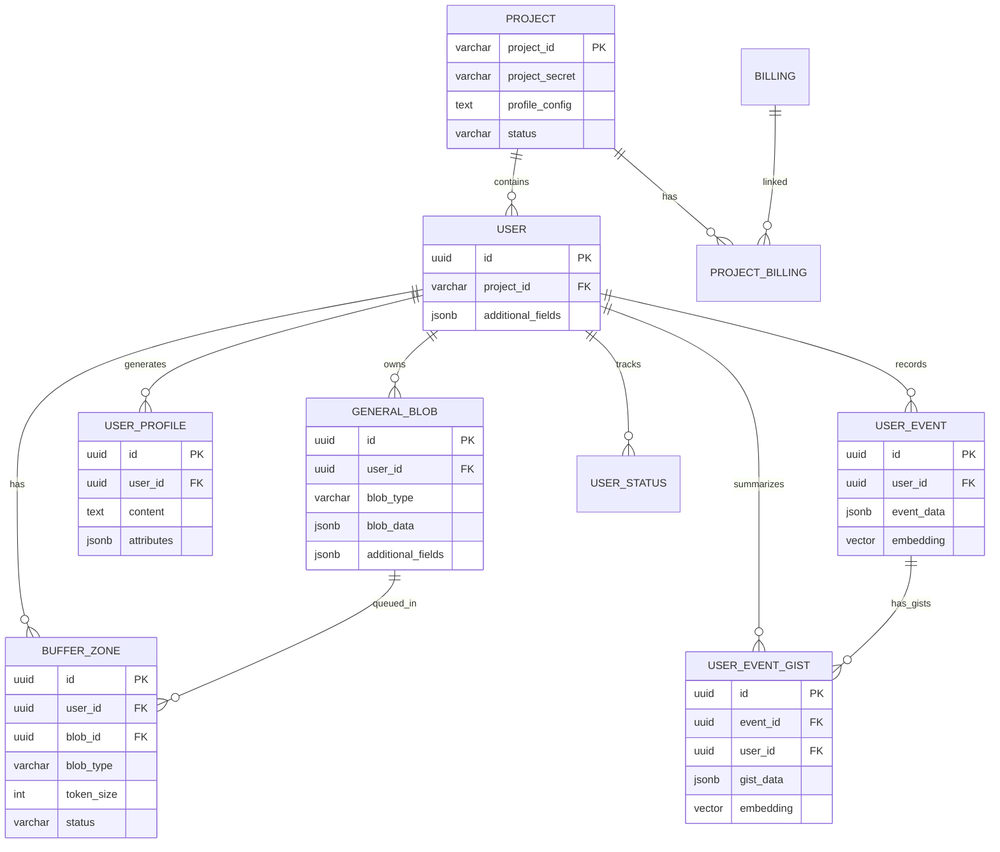
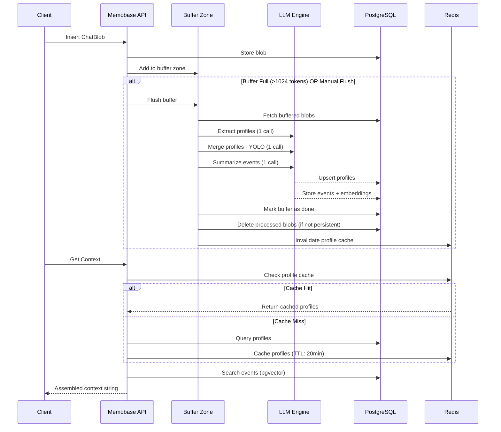

# PRD — Memobase: User Profile-Based Memory System for LLM Applications

| Field               | Value                                                      |
|---------------------|------------------------------------------------------------|
| **Product Name**    | Memobase                                                   |
| **Version**         | 0.0.40                                                     |
| **License**         | Apache 2.0                                                 |
| **Repository**      | [memodb-io/memobase](https://github.com/memodb-io/memobase)|
| **Document Version**| 1.0                                                        |
| **Date**            | 2026-05-09                                                 |
| **Status**          | Active                                                     |

---

## 1. Executive Summary

Memobase là một **hệ thống bộ nhớ dài hạn dựa trên user profile** được thiết kế để mang lại khả năng ghi nhớ, hiểu và tiến hóa cùng người dùng cho các ứng dụng LLM. Memobase tập trung vào việc xây dựng và duy trì profile người dùng có cấu trúc từ các cuộc hội thoại, cho phép AI cá nhân hóa trải nghiệm tương tác theo thời gian.

Khác với các giải pháp memory truyền thống tập trung vào RAG/search, Memobase tối ưu đồng thời ba chỉ số then chốt:
- **Performance**: SOTA trên benchmark LOCOMO
- **LLM Cost**: Giảm 40-50% token cost thông qua batch processing và YOLO profile merge
- **Latency**: < 100ms nhờ pre-computed user profiles và SQL operations

---

## 2. Problem Statement

### 2.1 Bối cảnh thị trường

Các ứng dụng LLM hiện đại (virtual companions, educational tools, personalized assistants) cần khả năng ghi nhớ thông tin người dùng qua nhiều phiên hội thoại. Các giải pháp hiện có gặp phải:

- **Mem0**: Chi phí LLM cao, thiếu cấu trúc profile
- **Zep**: Phức tạp trong triển khai, tập trung vào graph memory
- **LangMem**: Thiếu khả năng temporal memory

### 2.2 Pain Points

| # | Pain Point | Mô tả |
|---|-----------|-------|
| PP-1 | Context window limitation | LLM không thể nhớ thông tin vượt quá context window |
| PP-2 | High LLM costs | Việc xử lý memory trong hot path gây tốn kém token |
| PP-3 | Unstructured memories | Memories không có cấu trúc, khó kiểm soát và truy vấn |
| PP-4 | Temporal blindness | Thiếu khả năng trả lời câu hỏi liên quan đến thời gian |
| PP-5 | Integration complexity | Khó tích hợp vào stack LLM hiện có |

---

## 3. Product Vision & Goals

### 3.1 Vision Statement

> *"Mang lại bộ nhớ dài hạn có cấu trúc và controllable cho mọi ứng dụng LLM, giúp AI thực sự hiểu và tiến hóa cùng người dùng."*

### 3.2 Goals

| Goal ID | Mô tả | Đo lường |
|---------|-------|----------|
| G-1 | Cung cấp user profile có cấu trúc từ hội thoại | Profile accuracy trên LOCOMO benchmark |
| G-2 | Tối ưu chi phí LLM | ≤ 3 LLM calls cố định mỗi lần flush |
| G-3 | Latency cực thấp cho online serving | Context API < 100ms (không tính embedding API) |
| G-4 | Controllable memory | Developer tùy chỉnh profile schema |
| G-5 | Time-aware memory | Hỗ trợ truy vấn temporal thông qua event timeline |
| G-6 | Multi-language support | Hỗ trợ English và Chinese |

---

## 4. Target Users & Personas

### 4.1 Primary Personas

| Persona | Mô tả | Use Case |
|---------|-------|----------|
| **AI Application Developer** | Xây dựng chatbot, virtual companion, edu-tech | Tích hợp SDK vào ứng dụng LLM |
| **Product Manager** | Quản lý sản phẩm AI có tương tác người dùng | Phân tích hành vi, tracking user preference |
| **Data Scientist** | Phân tích dữ liệu người dùng từ conversation | Extract structured insights từ unstructured data |

### 4.2 Secondary Personas

| Persona | Mô tả | Use Case |
|---------|-------|----------|
| **Marketing Team** | Cá nhân hóa trải nghiệm, targeted advertising | Sử dụng profile để đề xuất sản phẩm phù hợp |
| **AI Agent Developer** | Xây dựng autonomous agents | MCP integration cho persistent memory |

---

## 5. Core Features

### 5.1 Feature Map

```
┌─────────────────────────────────────────────────────────────┐
│                        MEMOBASE                             │
├─────────────┬──────────────┬───────────────┬───────────────┤
│  User Mgmt  │ Data Ingestion│ Memory Engine │  Retrieval    │
│             │              │               │               │
│ • Create    │ • ChatBlob   │ • Profile     │ • Context API │
│ • Update    │ • DocBlob    │   Extraction  │ • Profile API │
│ • Delete    │ • SummaryBlob│ • Profile     │ • Event Search│
│ • Get       │ • Buffer     │   Merge (YOLO)│ • Event Gist  │
│             │   Zone       │ • Event       │   Search      │
│             │              │   Summary     │ • Tag Filter  │
│             │              │ • Event       │               │
│             │              │   Tagging     │               │
├─────────────┴──────────────┴───────────────┴───────────────┤
│                    Platform Services                        │
│ • Multi-Project │ • Auth (Bearer Token) │ • Telemetry     │
│ • Billing       │ • Redis Caching       │ • OpenTelemetry │
│ • Profile Config│ • CORS Support        │ • DB Migration  │
└─────────────────────────────────────────────────────────────┘
```

### 5.2 Feature Details

#### F-1: User Management
- CRUD operations cho users trong project scope
- Custom metadata (additional_fields) per user
- Multi-project isolation (project_id partitioning)

#### F-2: Data Ingestion (Blob System)
- **ChatBlob**: Hội thoại user/assistant theo format OpenAI Compatible
- **DocBlob**: Tài liệu văn bản
- **SummaryBlob**: Tóm tắt người dùng đã có
- Buffer Zone mechanism: batch processing thay vì hot-path processing
- Configurable buffer flush: theo token size threshold (default: 1024 tokens) hoặc idle time (default: 1 hour)

#### F-3: Memory Engine — Profile Extraction & Management
- **Profile Extraction**: Trích xuất structured profile từ conversations sử dụng LLM
- **Profile Merge (YOLO)**: Hợp nhất profiles mới với profiles hiện có, giảm LLM calls từ 3-10 xuống cố định 3 lần
- **Controllable Schema**: Developer định nghĩa profile topics và subtopics
- **Profile Validation**: Kiểm tra và loại bỏ meaningless profile slots
- **Profile Strict Mode**: Chỉ thu thập profiles theo schema đã định nghĩa
- **Multi-language prompts**: Hỗ trợ English và Chinese

#### F-4: Memory Engine — Event Timeline
- **Event Summary**: Tóm tắt sự kiện từ conversations
- **Event Gist**: Fine-grained event descriptions cho detailed search
- **Event Tags**: Custom temporal attributes (emotion, goal, etc.)
- **Event Embedding**: Vector embedding cho semantic search (OpenAI, Jina, Ollama)
- **Time-aware filtering**: Truy vấn events theo time range

#### F-5: Context Retrieval API
- Đóng gói profile + events thành prompt-ready string
- Configurable token budget (max_token_size)
- Profile/event ratio tuning (profile_event_ratio)
- Topic preferences và filtering (prefer_topics, only_topics)
- Custom prompt template support
- Semantic search events dựa trên latest chat context

#### F-6: Project & Configuration Management
- Per-project profile configuration (overwrite qua API)
- Environment variable overrides (MEMOBASE_* prefix)
- Billing & usage tracking (token consumption monitoring)
- YAML-based configuration system

#### F-7: MCP (Model Context Protocol) Server
- Three core tools: `save_memory`, `get_user_profiles`, `search_memories`
- SSE & Stdio transport support
- Integration với Cursor, Claude Desktop, Windsurf, n8n

---

## 6. Architecture Overview

### 6.1 System Architecture



### 6.2 Technology Stack

| Layer | Technology | Version |
|-------|-----------|---------|
| API Framework | FastAPI | ≥ 0.116.1 |
| Database | PostgreSQL + pgvector | PG17 |
| Cache | Redis | 7.4 |
| ORM | SQLAlchemy | ≥ 2.0.41 |
| LLM Client | OpenAI SDK | ≥ 1.97.0 |
| Tokenizer | tiktoken | ≥ 0.9.0 |
| Telemetry | OpenTelemetry + Prometheus | ≥ 1.35.0 |
| Deployment | Docker Compose | - |
| Language | Python | ≥ 3.12 |

### 6.3 Data Model



---

## 7. API Surface

### 7.1 REST API Endpoints

| Category | Method | Endpoint | Mô tả |
|----------|--------|----------|-------|
| **Chore** | GET | `/api/v1/healthcheck` | Health check (no auth) |
| **Admin** | GET | `/api/v1/admin/status_check` | System status (root only) |
| **Project** | POST | `/api/v1/project/profile_config` | Update profile config |
| **Project** | GET | `/api/v1/project/profile_config` | Get profile config |
| **Project** | GET | `/api/v1/project/billing` | Get billing info |
| **Project** | GET | `/api/v1/project/users` | List project users |
| **Project** | GET | `/api/v1/project/usage` | Get usage statistics |
| **User** | POST | `/api/v1/users` | Create user |
| **User** | GET | `/api/v1/users/{user_id}` | Get user |
| **User** | PUT | `/api/v1/users/{user_id}` | Update user |
| **User** | DELETE | `/api/v1/users/{user_id}` | Delete user |
| **Blob** | POST | `/api/v1/blobs/insert/{user_id}` | Insert blob |
| **Blob** | GET | `/api/v1/blobs/{user_id}/{blob_id}` | Get blob |
| **Blob** | DELETE | `/api/v1/blobs/{user_id}/{blob_id}` | Delete blob |
| **Profile** | GET | `/api/v1/users/profile/{user_id}` | Get user profiles |
| **Profile** | POST | `/api/v1/users/profile/{user_id}` | Add user profile |
| **Profile** | PUT | `/api/v1/users/profile/{user_id}/{profile_id}` | Update profile |
| **Profile** | DELETE | `/api/v1/users/profile/{user_id}/{profile_id}` | Delete profile |
| **Buffer** | POST | `/api/v1/users/buffer/{user_id}/{buffer_type}` | Flush buffer |
| **Buffer** | GET | `/api/v1/users/buffer/capacity/{user_id}/{buffer_type}` | Get buffer capacity |
| **Event** | GET | `/api/v1/users/event/{user_id}` | Get user events |
| **Event** | PUT | `/api/v1/users/event/{user_id}/{event_id}` | Update event |
| **Event** | DELETE | `/api/v1/users/event/{user_id}/{event_id}` | Delete event |
| **Event** | GET | `/api/v1/users/event/search/{user_id}` | Semantic search events |
| **Event Gist** | GET | `/api/v1/users/event_gist/search/{user_id}` | Search event gists |
| **Event Tags** | GET | `/api/v1/users/event_tags/search/{user_id}` | Filter by event tags |
| **Context** | GET | `/api/v1/users/context/{user_id}` | Get assembled context |
| **Roleplay** | POST | `/api/v1/users/roleplay/proactive/{user_id}` | Infer proactive topics |

### 7.2 Authentication

- **Bearer Token Authentication**: Tất cả endpoints (trừ healthcheck) yêu cầu `Authorization: Bearer <token>`
- **Root Access**: ACCESS_TOKEN environment variable cho root-level access
- **Project Token**: `sk-proj-*` format cho multi-tenant project isolation

---

## 8. Memory Processing Pipeline

### 8.1 Workflow



### 8.2 Buffer Status Lifecycle

```
idle → processing → done
                  → failed (retry-able)
```

---

## 9. Configuration System

### 9.1 Key Configuration Parameters

| Parameter | Default | Mô tả |
|-----------|---------|-------|
| `persistent_chat_blobs` | `false` | Lưu trữ raw chat sau processing |
| `buffer_flush_interval` | 3600s | Auto-flush interval |
| `max_chat_blob_buffer_token_size` | 1024 | Buffer threshold trigger flush |
| `max_profile_subtopics` | 15 | Giới hạn subtopics per topic |
| `max_pre_profile_token_size` | 128 | Max token per profile entry |
| `best_llm_model` | gpt-4o-mini | Primary LLM model |
| `enable_event_embedding` | true | Toggle semantic search |
| `embedding_model` | text-embedding-3-small | Embedding model |
| `embedding_dim` | 1536 | Vector dimension |
| `language` | en | Prompt language (en/zh) |
| `profile_strict_mode` | false | Only collect defined profiles |
| `profile_validate_mode` | true | Validate extracted profiles |
| `cache_user_profiles_ttl` | 1200s | Redis cache TTL |

---

## 10. Multi-SDK Support

| SDK | Package | Registry |
|-----|---------|----------|
| Python | `memobase` | PyPI |
| TypeScript | `@memobase/memobase` | npm, JSR |
| Go | `github.com/memodb-io/memobase/src/client/memobase-go` | Go Modules |

### 10.1 SDK Core Operations

```python
# Python SDK Pattern
client = MemoBaseClient(project_url, api_key)
uid = client.add_user({"key": "value"})
u = client.get_user(uid)
bid = u.insert(ChatBlob(messages=[...]))
u.flush(sync=True)
profiles = u.profile(need_json=True)
context = u.context(max_token_size=500, prefer_topics=["basic_info"])
```

---

## 11. Deployment Model

### 11.1 Docker Compose Stack

| Service | Image | Port |
|---------|-------|------|
| memobase-server-db | pgvector/pgvector:pg17 | 15432 |
| memobase-server-redis | redis:7.4 | 16379 |
| memobase-server-api | ghcr.io/memodb-io/memobase | 8019 |

### 11.2 Cloud Offering

- **Memobase Cloud**: `https://api.memobase.dev` với free tier
- **Self-hosted**: Docker image `ghcr.io/memodb-io/memobase:latest`

---

## 12. Roadmap

### Q3 2025
- [ ] Reduce Token Cost
- [ ] Multi-Profile Schema in one project
- [ ] Social Graph (clients, friends, items entities)
- [ ] Data type support for Profile Slot (number, bool, date)

### Q4 2025
- TBD

---

## 13. Success Metrics

| Metric | Target | Đo lường |
|--------|--------|----------|
| LOCOMO Benchmark | SOTA | Accuracy vs mem0, zep, langmem |
| LLM Calls per Flush | Fixed 3 | Count per buffer processing |
| Context API Latency | < 100ms | P99 (excluding embedding API) |
| Token Cost Reduction | 40-50% vs v0.0.39 | Total token consumption |
| Profile Cache Hit Rate | > 80% | Redis cache statistics |

---

## 14. Risks & Mitigations

| Risk | Impact | Mitigation |
|------|--------|------------|
| LLM API dependency | Service degradation | Multi-provider support (OpenAI, Ollama, Doubao) |
| Embedding dimension mismatch | Data corruption | Runtime validation tại startup |
| Buffer parallel flush | Duplicate processing | Status-based concurrency control |
| Profile quality | Poor user experience | Validation mode + strict mode |
| PostgreSQL connection exhaustion | Service outage | Pool monitoring + configurable pool size (75+50) |
