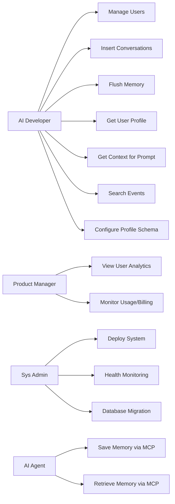
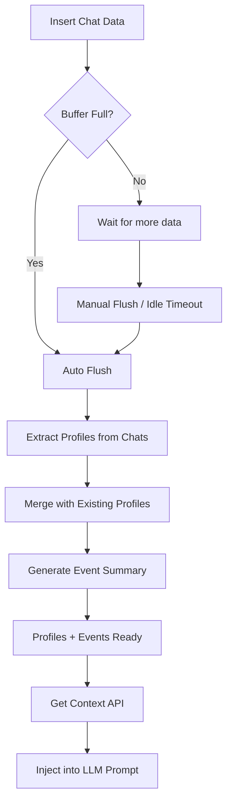

# URD — Memobase: User Requirements Document

| Field | Value |
|-------|-------|
| **Product** | Memobase |
| **Version** | 1.0 |
| **Date** | 2026-05-09 |

---

## 1. Giới thiệu

### 1.1 Mục đích
Tài liệu này mô tả yêu cầu người dùng (User Requirements) cho Memobase — hệ thống bộ nhớ dài hạn dựa trên user profile cho ứng dụng LLM. Tài liệu xác định các stakeholder, user stories, và acceptance criteria.

### 1.2 Phạm vi
Memobase cung cấp khả năng ghi nhớ, hiểu và tiến hóa cùng người dùng cho AI applications thông qua user profile extraction, event timeline, và context retrieval API.

### 1.3 Đối tượng người dùng

| ID | Persona | Vai trò |
|----|---------|---------|
| U1 | AI App Developer | Tích hợp memory vào ứng dụng LLM |
| U2 | Product Manager | Phân tích hành vi người dùng qua profiles |
| U3 | Data Scientist | Khai thác insights từ conversation data |
| U4 | Marketing Team | Cá nhân hóa trải nghiệm, targeted ads |
| U5 | AI Agent Developer | Tích hợp persistent memory qua MCP |
| U6 | System Administrator | Triển khai và vận hành hệ thống |

---

## 2. User Stories

### 2.1 User Management

| ID | User Story | Priority | Acceptance Criteria |
|----|-----------|----------|-------------------|
| US-001 | Là developer, tôi muốn tạo user mới với metadata tùy chỉnh để theo dõi người dùng trong ứng dụng | P0 | - Tạo user thành công trả về UUID - Hỗ trợ additional_fields dạng JSON - User gắn với project scope |
| US-002 | Là developer, tôi muốn CRUD users để quản lý vòng đời người dùng | P0 | - GET/PUT/DELETE user by ID - Xóa user cascade xóa tất cả data liên quan |
| US-003 | Là PM, tôi muốn liệt kê tất cả users trong project để giám sát quy mô | P1 | - API trả về danh sách users với count - Phân trang kết quả |

### 2.2 Data Ingestion

| ID | User Story | Priority | Acceptance Criteria |
|----|-----------|----------|-------------------|
| US-010 | Là developer, tôi muốn gửi chat conversations vào hệ thống để AI ghi nhớ người dùng | P0 | - Nhận ChatBlob với messages format OpenAI Compatible - Trả về blob_id - Blob được đưa vào buffer zone |
| US-011 | Là developer, tôi muốn gửi document hoặc summary có sẵn vào hệ thống | P1 | - Hỗ trợ DocBlob và SummaryBlob - Xử lý tương tự ChatBlob |
| US-012 | Là developer, tôi muốn hệ thống tự động xử lý memory khi buffer đầy | P0 | - Auto flush khi vượt 1024 tokens - Auto flush khi idle > 1 hour - Hỗ trợ manual flush |
| US-013 | Là developer, tôi muốn kiểm tra trạng thái buffer để biết khi nào cần flush | P2 | - API trả về số lượng buffer items đang chờ |

### 2.3 Memory & Profile

| ID | User Story | Priority | Acceptance Criteria |
|----|-----------|----------|-------------------|
| US-020 | Là developer, tôi muốn lấy structured profile từ conversations để hiểu người dùng | P0 | - Profile có cấu trúc topic/sub_topic/content - Profiles tự động merge khi có thông tin mới - Cố định 3 LLM calls per flush |
| US-021 | Là developer, tôi muốn định nghĩa profile schema để kiểm soát loại thông tin cần thu thập | P0 | - Config additional_user_profiles trong YAML - Hỗ trợ overwrite_user_profiles - Profile strict mode chỉ collect schema đã định |
| US-022 | Là developer, tôi muốn CRUD profiles để chỉnh sửa thủ công khi cần | P1 | - GET/POST/PUT/DELETE user profiles - Validate profile attributes (topic, sub_topic) |
| US-023 | Là developer, tôi muốn profile validation tự động loại bỏ thông tin vô nghĩa | P1 | - profile_validate_mode = true mặc định - Phát hiện và loại bỏ meaningless slots |
| US-024 | Là developer, tôi muốn import user context có sẵn vào hệ thống | P2 | - API nhận context string - Parse thành profiles tự động |

### 2.4 Event Timeline

| ID | User Story | Priority | Acceptance Criteria |
|----|-----------|----------|-------------------|
| US-030 | Là developer, tôi muốn hệ thống ghi lại timeline sự kiện từ conversations | P0 | - Tự động extract events khi flush - Events có event_data và embedding |
| US-031 | Là developer, tôi muốn tìm kiếm events bằng semantic search | P0 | - Cosine similarity search qua pgvector - Configurable similarity threshold - Top-k kết quả |
| US-032 | Là developer, tôi muốn filter events theo custom tags | P1 | - Event tags với tag/value pairs - Filter bằng has_event_tag hoặc event_tag_equal |
| US-033 | Là developer, tôi muốn search fine-grained event gists | P1 | - Event gists là detailed descriptions - Hỗ trợ embedding search trên gists |
| US-034 | Là developer, tôi muốn filter events theo time range | P1 | - time_range_in_days parameter - Default 21 days |

### 2.5 Context Retrieval

| ID | User Story | Priority | Acceptance Criteria |
|----|-----------|----------|-------------------|
| US-040 | Là developer, tôi muốn lấy assembled context string để đưa vào prompt LLM | P0 | - Context API trả về string sẵn sàng inject - Configurable max_token_size - Kết hợp profiles + events |
| US-041 | Là developer, tôi muốn ưu tiên certain topics trong context | P1 | - prefer_topics parameter - only_topics filter - topic_limits cho per-topic control |
| US-042 | Là developer, tôi muốn tùy chỉnh prompt template cho context | P2 | - customize_context_prompt parameter - Template nhận {profile_section} và {event_section} |
| US-043 | Là developer, tôi muốn context tự động search events liên quan đến cuộc trò chuyện hiện tại | P1 | - Truyền chats parameter - Auto semantic search events relevant |

### 2.6 Project & Configuration

| ID | User Story | Priority | Acceptance Criteria |
|----|-----------|----------|-------------------|
| US-050 | Là admin, tôi muốn cấu hình hệ thống qua YAML file | P0 | - config.yaml cho LLM, embedding, memory settings - Environment variable overrides (MEMOBASE_* prefix) |
| US-051 | Là admin, tôi muốn update profile config per project qua API | P1 | - POST /project/profile_config - Override language, strict_mode, profiles per project |
| US-052 | Là PM, tôi muốn theo dõi usage và billing | P1 | - Daily usage statistics (insert count, token consumption) - Billing info với token_left và next_refill |
| US-053 | Là admin, tôi muốn health check và status monitoring | P0 | - /healthcheck endpoint (no auth) - /admin/status_check (root auth) |

### 2.7 SDK & Integration

| ID | User Story | Priority | Acceptance Criteria |
|----|-----------|----------|-------------------|
| US-060 | Là developer, tôi muốn SDK đơn giản để tích hợp nhanh | P0 | - Python: `pip install memobase` - TypeScript: `npm install @memobase/memobase` - Go: `go get` |
| US-061 | Là developer, tôi muốn dùng MCP để tích hợp với AI agents (Cursor, Claude) | P1 | - MCP server với SSE/Stdio transport - 3 tools: save_memory, get_user_profiles, search_memories |
| US-062 | Là developer, tôi muốn dùng OpenAI SDK trực tiếp với Memobase | P2 | - Hướng dẫn integration pattern - Compatible message format |

### 2.8 Deployment & Operations

| ID | User Story | Priority | Acceptance Criteria |
|----|-----------|----------|-------------------|
| US-070 | Là admin, tôi muốn triển khai bằng Docker Compose một lệnh | P0 | - `docker-compose build && docker-compose up` - Tự động setup DB, Redis, API |
| US-071 | Là admin, tôi muốn chạy standalone với existing PG/Redis | P1 | - Docker image riêng cho API - Config qua env.list + config.yaml mount |
| US-072 | Là admin, tôi muốn migrate database khi upgrade version | P1 | - Alembic migration support - Step-by-step guide |
| US-073 | Là admin, tôi muốn giám sát hệ thống qua metrics | P1 | - OpenTelemetry instrumentation - Prometheus exporter - Request latency, count, pool status |

---

## 3. Non-Functional Requirements (User Perspective)

### 3.1 Performance

| ID | Yêu cầu | Target |
|----|---------|--------|
| NFR-001 | Context API response time | < 100ms (excluding embedding API) |
| NFR-002 | Concurrent users per instance | Hỗ trợ pool_size=75, max_overflow=50 |
| NFR-003 | Profile cache effectiveness | TTL 20 phút, > 80% hit rate |

### 3.2 Reliability

| ID | Yêu cầu | Target |
|----|---------|--------|
| NFR-010 | Buffer processing failure handling | Status rollback to "failed", retry-able |
| NFR-011 | Database connection resilience | pool_pre_ping=True, auto reconnect |
| NFR-012 | Graceful degradation khi LLM unavailable | Log error, skip embedding, continue |

### 3.3 Security

| ID | Yêu cầu | Target |
|----|---------|--------|
| NFR-020 | API authentication | Bearer token required trên mọi endpoint |
| NFR-021 | Data isolation | Multi-project via project_id partitioning |
| NFR-022 | Data privacy | Default xóa raw chat sau processing |

### 3.4 Usability

| ID | Yêu cầu | Target |
|----|---------|--------|
| NFR-030 | SDK simplicity | < 10 lines code cho basic integration |
| NFR-031 | Configuration simplicity | Single YAML file + env overrides |
| NFR-032 | Documentation | OpenAPI/Swagger auto-generated docs |

---

## 4. Use Case Diagrams

### 4.1 Core Use Cases

### 4.2 Memory Processing Flow (User View)

---

## 5. Acceptance Test Scenarios

### AT-001: Basic Memory Flow
1. Tạo user mới → nhận UUID
2. Insert 5 ChatBlobs → nhận blob_ids
3. Flush buffer (sync=True) → thành công
4. Get user profile → nhận structured profiles với topic/sub_topic/content
5. Get context → nhận prompt-ready string

### AT-002: Profile Schema Control
1. Configure additional_user_profiles với custom topics
2. Insert conversations chứa thông tin liên quan
3. Flush → profiles chỉ chứa defined topics (strict mode)

### AT-003: Semantic Event Search
1. Insert nhiều conversations về các chủ đề khác nhau
2. Flush tất cả
3. Search events với query → nhận relevant events sorted by similarity

### AT-004: Multi-Project Isolation
1. Tạo 2 projects với different tokens
2. Insert data vào mỗi project
3. Verify data isolation — project A không thấy data project B

### AT-005: Context Token Budget
1. Insert nhiều data cho rich profile
2. Get context với max_token_size=200 → output ≤ 200 tokens
3. Get context với prefer_topics → prioritized topics appear first
