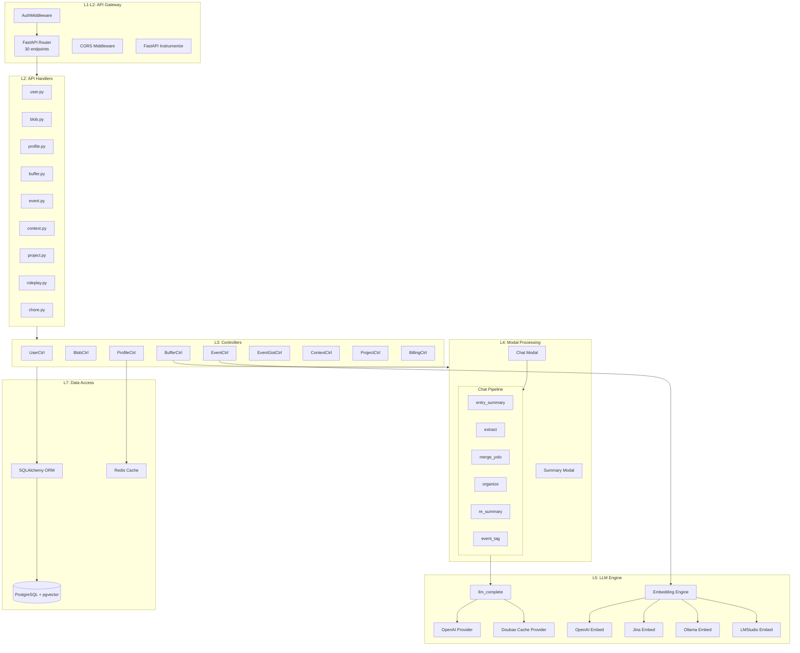
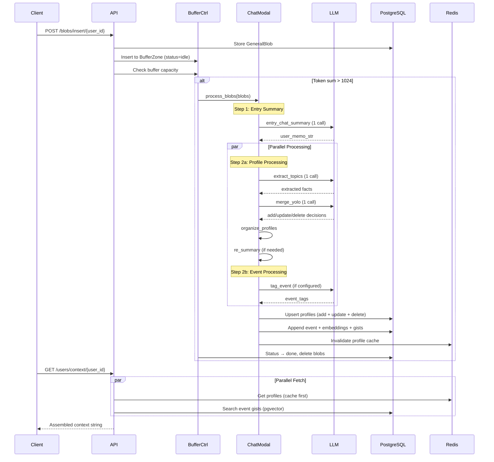

# Architecture Document — Memobase

| Field | Value |
|-------|-------|
| **Product** | Memobase v0.0.40 |
| **Date** | 2026-05-09 |
| **Status** | Active |

---

## 1. System Overview

Memobase là hệ thống bộ nhớ dài hạn dựa trên user profile cho ứng dụng LLM. Kiến trúc được thiết kế theo mô hình **layered monolith** với 5 tầng chính, triển khai dưới dạng Docker Compose stack gồm 3 services.

```
┌─────────────────────────────────────────────────────┐
│                  CLIENT TIER                        │
│   Python SDK │ TypeScript SDK │ Go SDK │ MCP Server │
└───────────────────────┬─────────────────────────────┘
                        │ HTTPS / Bearer Token
┌───────────────────────▼─────────────────────────────┐
│                  APPLICATION TIER                    │
│             FastAPI (Uvicorn ASGI)                   │
│  ┌─────────┐ ┌──────────┐ ┌──────────┐ ┌─────────┐│
│  │  Auth   │→│ API Layer│→│Controller│→│  LLM    ││
│  │Midleware│ │ (Routes) │ │  (Logic) │ │ Engine  ││
│  └─────────┘ └──────────┘ └──────────┘ └─────────┘│
│             OpenTelemetry + Prometheus               │
└───────────┬─────────────────────────┬───────────────┘
            │                         │
┌───────────▼──────────┐  ┌───────────▼───────────────┐
│    DATA TIER         │  │    EXTERNAL SERVICES      │
│ PostgreSQL + pgvector│  │  OpenAI / Jina / Ollama   │
│ Redis                │  │  (LLM + Embedding APIs)   │
└──────────────────────┘  └───────────────────────────┘
```

---

## 2. Architectural Principles

| # | Principle | Implementation |
|---|-----------|----------------|
| AP-1 | **Cold-path memory processing** | Buffer zone batches data, tránh hot-path LLM calls |
| AP-2 | **Structured over unstructured** | Profile schema (topic/sub_topic/content) thay vì free-form memories |
| AP-3 | **Stateless application tier** | Server không lưu state, shared PG + Redis cho horizontal scaling |
| AP-4 | **Data isolation by project** | Composite PK `(id, project_id)` trên mọi table, FK CASCADE |
| AP-5 | **Configurable everything** | YAML config + env overrides + per-project API config |
| AP-6 | **Fail gracefully** | Embedding fail → skip search, LLM fail → buffer remains "failed", retry-able |

---

## 3. Layer Architecture

### 3.1 Layer Diagram

```
┌──────────────────────────────────────────────────────────┐
│ L1: API Gateway Layer                                     │
│     FastAPI Router + AuthMiddleware + CORS                │
│     File: api.py, api_layer/middleware.py                 │
├──────────────────────────────────────────────────────────┤
│ L2: API Handler Layer                                     │
│     Request/Response mapping, validation                  │
│     Files: api_layer/{user,blob,profile,buffer,           │
│            event,context,project,roleplay}.py             │
├──────────────────────────────────────────────────────────┤
│ L3: Controller Layer (Business Logic)                     │
│     Memory pipeline, CRUD operations                     │
│     Files: controllers/{user,blob,buffer,profile,         │
│            event,event_gist,context,project,billing}.py   │
├──────────────────────────────────────────────────────────┤
│ L4: Modal Processing Layer                                │
│     Memory extraction & merge pipeline                   │
│     Files: controllers/modal/{chat,summary}/              │
│     Sub-steps: extract → merge_yolo → organize → summary │
├──────────────────────────────────────────────────────────┤
│ L5: LLM & Embedding Layer                                │
│     External AI service abstraction                      │
│     Files: llms/{__init__,openai_model_llm,               │
│            doubao_cache_llm}.py                           │
│     Files: llms/embeddings/{openai,jina,ollama,lmstudio}  │
├──────────────────────────────────────────────────────────┤
│ L6: Prompt Layer                                          │
│     LLM prompt templates (EN/ZH)                         │
│     Files: prompts/{extract_profile,merge_profile_yolo,   │
│            summary_entry_chats,organize_profile,...}.py    │
├──────────────────────────────────────────────────────────┤
│ L7: Data Access Layer                                     │
│     ORM models, connectors, caching                      │
│     Files: models/database.py, connectors.py              │
│     Redis caching: user profiles (TTL 20min)             │
├──────────────────────────────────────────────────────────┤
│ L8: Infrastructure Layer                                  │
│     PostgreSQL + pgvector, Redis, Docker                 │
│     Files: docker-compose.yml, Dockerfile, alembic.ini    │
└──────────────────────────────────────────────────────────┘
```

### 3.2 Dependency Direction

```
L1 → L2 → L3 → L4 → L5 → L6
                ↓         ↓
                L7 ←──────┘
                ↓
                L8
```

**Rules**:
- Mỗi layer chỉ gọi layer dưới trực tiếp hoặc L7 (Data Access)
- L4 (Modal) gọi L5 (LLM) và L6 (Prompt) để xử lý memory
- L3 (Controller) có thể gọi L4 (Modal) cho processing pipeline
- L7 không gọi bất kỳ layer nào khác

---

## 4. Component Architecture

### 4.1 Server Components



### 4.2 Client SDK Components

```
memobase (Python SDK)
├── core/
│   ├── entry.py          — Synchronous MemoBaseClient
│   ├── async_entry.py    — Async MemoBaseClient
│   ├── blob.py           — Blob data types
│   ├── user.py           — User operations wrapper
│   └── type.py           — Shared type definitions
├── network.py            — HTTP client (requests)
├── patch/                — Monkey patches
└── utils.py              — Helpers

memobase-ts (TypeScript SDK)
├── src/                  — Core implementation
├── tests/                — Jest test suite
└── scripts/              — Build scripts

memobase-go (Go SDK)
├── core/                 — Client implementation
├── blob/                 — Blob types
├── network/              — HTTP client
├── error/                — Error handling
└── examples/             — Usage examples
```

### 4.3 MCP Server Component

```
mcp/
├── src/
│   └── main.py           — MCP server entry point
│       Tools:
│       - save_memory      → Insert ChatBlob + Flush
│       - get_user_profiles → Get user profiles
│       - search_memories   → Semantic event search
├── Dockerfile            — Container build
└── .env.example          — Configuration
Transport: SSE (HTTP) | Stdio (pipe)
```

---

## 5. Data Architecture

### 5.1 Database Schema (PostgreSQL + pgvector)

```
┌──────────────┐     ┌──────────────────┐     ┌──────────────┐
│   projects   │────<│ project_billings │>────│   billings   │
│──────────────│     └──────────────────┘     │──────────────│
│ project_id PK│                              │ id PK        │
│ project_secret│                             │ usage_left   │
│ profile_config│                             │ next_refill  │
│ status       │                              └──────────────┘
└──────┬───────┘
       │ 1:N
┌──────▼───────┐
│    users     │
│──────────────│
│ id PK        │──────────────────────────────────────────┐
│ project_id PK│                                          │
│ add_fields   │                                          │
└──┬───┬───┬───┘                                          │
   │   │   │ 1:N                                          │
   │   │   │                                              │
   │   │   ├──────────┐     ┌──────────────────┐          │
   │   │   │          ▼     │                  │          │
   │   │ ┌─▼────────────┐ ┌▼────────────────┐ │          │
   │   │ │general_blobs │ │ buffer_zones    │ │          │
   │   │ │──────────────│ │────────────────│ │          │
   │   │ │ blob_type    │<│ blob_id FK     │ │          │
   │   │ │ blob_data    │ │ blob_type      │ │          │
   │   │ │ add_fields   │ │ token_size     │ │          │
   │   │ └──────────────┘ │ status (FSM)   │ │          │
   │   │                  └────────────────┘ │          │
   │   │ 1:N                                  │          │
   │ ┌─▼────────────────┐                     │          │
   │ │  user_profiles   │                     │          │
   │ │──────────────────│                     │          │
   │ │ content          │                     │          │
   │ │ attributes{topic,│                     │          │
   │ │   sub_topic}     │                     │          │
   │ └─────────────────┘                     │          │
   │ 1:N                                      │          │
 ┌─▼─────────────────┐  1:N ┌───────────────────┐       │
 │   user_events     │──────│ user_event_gists  │       │
 │───────────────────│      │───────────────────│       │
 │ event_data (JSONB)│      │ gist_data (JSONB) │       │
 │ embedding (vector)│      │ embedding (vector) │       │
 └───────────────────┘      │ event_id FK        │       │
                            └───────────────────┘       │
                                                         │
 ┌────────────────────┐                                  │
 │  user_statuses     │──────────────────────────────────┘
 │────────────────────│
 │ type               │
 │ attributes (JSONB) │
 └────────────────────┘
```

### 5.2 Indexing Strategy

| Table | Index Name | Columns | Purpose |
|-------|-----------|---------|---------|
| users | idx_users_id_project_id | (id, project_id) | PK lookup |
| general_blobs | idx_..._user_id_blob_type | (user_id, project_id, blob_type) | Filter by type |
| buffer_zones | idx_..._user_id_blob_type | (user_id, project_id, blob_type, status) | Buffer query with status filter |
| user_profiles | idx_..._user_id_project_id | (user_id, project_id) | Profile retrieval |
| user_events | idx_..._user_id_project_id | (user_id, project_id) | Event listing |
| user_event_gists | idx_..._event_id | (user_id, project_id, event_id) | Gist by event |

Vector indexes sử dụng pgvector mặc định (IVFFlat hoặc HNSW tùy version).

### 5.3 Caching Architecture (Redis)

```
┌─────────────────────────────────────┐
│            Redis Cache              │
│                                     │
│  Key Pattern:                       │
│  user_profiles::{project}::{user}   │
│                                     │
│  Value: JSON serialized profiles    │
│  TTL: 1200s (20 minutes)           │
│                                     │
│  Invalidation Triggers:             │
│  • Profile add/update/delete        │
│  • Buffer flush completion          │
│  • User deletion                    │
└─────────────────────────────────────┘
```

---

## 6. Memory Processing Pipeline Architecture

### 6.1 Pipeline Flow



### 6.2 Chat Modal Sub-steps

| Step | Function | LLM Call | Purpose |
|------|---------|----------|---------|
| 1 | `entry_chat_summary` | Yes (1) | Tóm tắt conversations thành memo string |
| 2a | `extract_topics` | Yes (1) | Extract structured profile facts |
| 2b | `merge_yolo` | Yes (1) | Merge facts với existing profiles (add/update/delete) |
| 2c | `organize_profiles` | No | Reorganize subtopics nếu vượt limit |
| 2d | `re_summary` | Conditional | Re-summarize nếu profile slot quá dài |
| 3 | `tag_event` | Conditional | Tag events nếu event_tags configured |
| 4 | `append_user_event` | Embedding | Store event + generate embeddings |

**Total LLM calls**: Cố định 3 (entry_summary + extract + merge_yolo)

---

## 7. Authentication & Security Architecture

### 7.1 Auth Flow

```
Request → AuthMiddleware.dispatch()
  │
  ├── Path = /healthcheck → ALLOW (no auth)
  │
  ├── No Bearer token → 401 UNAUTHORIZED
  │
  ├── Token = ACCESS_TOKEN env → ROOT access
  │   └── project_id = "__root__"
  │
  └── Token = sk-proj-* → parse_project_id()
      ├── verify project_secret in DB
      ├── check project_status ≠ "suspended"
      └── Set request.state.memobase_project_id
```

### 7.2 Data Protection

| Mechanism | Implementation |
|-----------|----------------|
| Transport | HTTPS (via reverse proxy) |
| Auth | Bearer token per request |
| Isolation | Composite PK + FK constraints per project_id |
| Minimization | Raw blobs deleted after processing (default) |
| Immutability | Project table protected by SQLAlchemy event listeners |

---

## 8. Observability Architecture

### 8.1 Telemetry Stack

```
Application → OpenTelemetry SDK → Prometheus Exporter → :9464
                                                          │
FastAPI Instrumentor ──────────────────────────────────────┘
```

### 8.2 Metrics Catalog

| Type | Metric Name | Labels | Description |
|------|------------|--------|-------------|
| Counter | `memobase_server_requests_total` | project_id, path, method | Request count |
| Counter | `memobase_server_llm_invocations_total` | project_id | LLM call count |
| Counter | `memobase_server_llm_input_tokens_total` | project_id | Input tokens |
| Counter | `memobase_server_llm_output_tokens_total` | project_id | Output tokens |
| Counter | `memobase_server_embedding_tokens_total` | project_id | Embedding tokens |
| Histogram | `memobase_server_request_latency` | project_id, path, method | Request latency (ms) |
| Histogram | `memobase_server_llm_latency` | project_id | LLM latency (ms) |
| Histogram | `memobase_server_embedding_latency` | project_id | Embedding latency (ms) |
| Gauge | `memobase_server_input_token_count_per_call` | - | Tokens per LLM call |

### 8.3 Logging

| Format | Implementation | Use Case |
|--------|---------------|----------|
| Plain | Python logging + ColorFormatter | Development |
| JSON | structlog + contextvars | Production (K8s) |

Context variables: `request_id`, `project_id`, `memobase_version`

---

## 9. Deployment Architecture

### 9.1 Docker Compose Topology

```
┌─────────────────────────────────────────────────┐
│                 Docker Network                  │
│                                                 │
│  ┌────────────────┐                             │
│  │ memobase-api   │ :8000 ──→ :${API_PORT}     │
│  │ (FastAPI)      │                             │
│  │ + Prometheus   │ :9464                       │
│  └────┬─────┬─────┘                             │
│       │     │                                   │
│  ┌────▼──┐ ┌▼──────────┐                       │
│  │ Redis │ │ PostgreSQL │                       │
│  │ :6379 │ │ :5432      │                       │
│  │       │ │ + pgvector │                       │
│  └───────┘ └────────────┘                       │
└─────────────────────────────────────────────────┘
```

### 9.2 Scaling Strategy

| Strategy | Mechanism |
|----------|-----------|
| **Horizontal** | Multiple API instances behind load balancer |
| **DB Connection Pool** | pool_size=75, max_overflow=50 per instance |
| **Cache** | Shared Redis, profile cache TTL=20min |
| **Stateless** | No in-memory state, all via PG + Redis |

---

## 10. Technology Stack Summary

| Component | Technology | Justification |
|-----------|-----------|---------------|
| API Framework | FastAPI + Uvicorn | Async, high-performance, auto OpenAPI |
| ORM | SQLAlchemy 2.0 | Mature, type-safe mapped dataclasses |
| Database | PostgreSQL 17 + pgvector | JSONB + vector search trong cùng DB |
| Cache | Redis 7.4 | Profile caching, connection pooling |
| LLM Client | OpenAI SDK | Standard interface, multi-provider |
| Tokenizer | tiktoken (gpt-4o) | Accurate token counting |
| Telemetry | OpenTelemetry + Prometheus | Cloud-native observability |
| Logging | structlog | Structured JSON logging for K8s |
| Migration | Alembic | SQLAlchemy-native schema migration |
| Container | Docker Compose | Single-command deployment |
| Language | Python ≥ 3.12 | Async/await, type hints |
