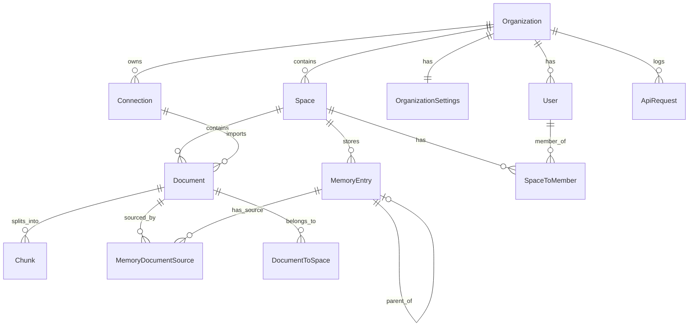

# Software Requirements Specification (SRS)

## Supermemory — Memory & Context Engine for AI

| Metadata | Value |
|----------|-------|
| **Product** | Supermemory |
| **Version** | 4.0.0 |
| **Date** | 2026-05-09 |
| **Standard** | IEEE 830 |

---

## 1. Giới Thiệu

### 1.1. Mục Đích
Tài liệu đặc tả yêu cầu phần mềm cho Supermemory — engine bộ nhớ và ngữ cảnh cho AI, bao gồm Memory Engine, Hybrid Search, User Profiles, Connectors, MCP Server, và Web Console.

### 1.2. Phạm Vi
Hệ thống Turbo monorepo gồm: API backend (Cloudflare Workers/Hono), Web Console (Next.js), MCP Server, SDK clients (TypeScript/Python), và framework integrations.

### 1.3. Thuật Ngữ

| Thuật Ngữ | Định Nghĩa |
|-----------|------------|
| **Memory** | Đơn vị kiến thức được trích xuất từ nội dung, embedded và indexed |
| **Document** | Nội dung đầu vào thô (text, PDF, URL, image, video) |
| **Chunk** | Phân đoạn document với vector embedding |
| **Container Tag** | Tag phân nhóm memories (user ID, project ID) |
| **Space** | Project/workspace chứa documents và memories |
| **Memory Relation** | Quan hệ giữa memories: updates, extends, derives |
| **Profile** | Hồ sơ người dùng tự động (static facts + dynamic context) |

---

## 2. Yêu Cầu Chức Năng

### 2.1. Memory Management (FR-MEM)

| ID | Yêu Cầu | Input | Output | Priority |
|----|---------|-------|--------|----------|
| FR-MEM-01 | Thêm memory từ text, URL, hoặc file | `{ content, containerTags, metadata, customId }` | `{ id, status }` | P0 |
| FR-MEM-02 | Lấy chi tiết memory theo ID | Document ID | Full MemorySchema object | P0 |
| FR-MEM-03 | Liệt kê memories với pagination | `{ page, limit, sort, order, containerTags, filters }` | `{ memories[], pagination }` | P0 |
| FR-MEM-04 | Xóa memory theo ID | Document ID | 204 No Content | P0 |
| FR-MEM-05 | Xóa hàng loạt theo IDs hoặc containerTags | `{ ids[] }` or `{ containerTags[] }` | `{ deletedCount, errors[] }` | P1 |
| FR-MEM-06 | Cập nhật memory | `{ content, metadata, containerTags }` | `{ id, status }` | P1 |
| FR-MEM-07 | Content hashing để ngăn duplicate | contentHash field | Reject nếu trùng hash | P1 |

### 2.2. Document Processing Pipeline (FR-DOC)

| ID | Yêu Cầu | Chi Tiết | Priority |
|----|---------|----------|----------|
| FR-DOC-01 | Xử lý qua các stage: queued → extracting → chunking → embedding → indexing → done | Status tracked trong DocumentStatusEnum | P0 |
| FR-DOC-02 | Hỗ trợ 11 content types | text, pdf, tweet, google_doc, google_slide, google_sheet, image, video, notion_doc, webpage, onedrive | P0 |
| FR-DOC-03 | Trích xuất OCR từ images | Input: image URL/file → Output: text content | P1 |
| FR-DOC-04 | Transcription từ videos | Input: video URL → Output: text transcript | P1 |
| FR-DOC-05 | AST-aware chunking cho code | Code files chunked theo cấu trúc AST | P2 |
| FR-DOC-06 | Processing metadata tracking | `{ startTime, endTime, duration, steps[], chunkingStrategy, tokenCount }` | P1 |
| FR-DOC-07 | Liệt kê documents đang processing | Filter by containerTags | P1 |

### 2.3. Memory Engine — Knowledge Graph (FR-KG)

| ID | Yêu Cầu | Chi Tiết | Priority |
|----|---------|----------|----------|
| FR-KG-01 | Tự động trích xuất facts từ content | AI-powered fact extraction | P0 |
| FR-KG-02 | Xây dựng quan hệ **Updates** | Khi info mới mâu thuẫn info cũ → mark isLatest | P0 |
| FR-KG-03 | Xây dựng quan hệ **Extends** | Khi info mới bổ sung chi tiết | P0 |
| FR-KG-04 | Xây dựng quan hệ **Derives** | Suy luận liên kết mới từ patterns | P1 |
| FR-KG-05 | Version control cho memory entries | version, parentMemoryId, rootMemoryId tracking | P0 |
| FR-KG-06 | Automatic forgetting (time-based) | forgetAfter date → isForgotten = true | P1 |
| FR-KG-07 | Contradiction resolution | Tự động xác định isLatest khi facts mâu thuẫn | P0 |
| FR-KG-08 | Static vs Dynamic memory classification | isStatic field, isInference field | P1 |
| FR-KG-09 | Source tracking | sourceCount, memoryDocumentSource (many-to-many) | P1 |
| FR-KG-10 | Entity context support | entityContext (max 1500 chars) hướng dẫn extraction | P2 |

### 2.4. Search (FR-SEARCH)

| ID | Yêu Cầu | Chi Tiết | Priority |
|----|---------|----------|----------|
| FR-SEARCH-01 | Semantic search với vector similarity | Embedding-based search trên chunks | P0 |
| FR-SEARCH-02 | Hybrid search (RAG + Memory) | Kết hợp document chunks + memory entries | P0 |
| FR-SEARCH-03 | Memory-only search (v4 API) | Search chỉ trên memory entries với similarity scores | P0 |
| FR-SEARCH-04 | Configurable thresholds | chunkThreshold, documentThreshold (0.0–1.0) | P1 |
| FR-SEARCH-05 | Query rewriting | AI rewrite query để cải thiện kết quả (+~400ms) | P2 |
| FR-SEARCH-06 | Result reranking | Rerank kết quả dựa trên query relevance | P2 |
| FR-SEARCH-07 | Metadata filtering | AND/OR filters với string/numeric/boolean operators | P1 |
| FR-SEARCH-08 | Include full documents | includeFullDocs flag trong search results | P1 |
| FR-SEARCH-09 | Include summaries | includeSummary flag | P1 |
| FR-SEARCH-10 | Related memories context | parents/children chain với relation types | P1 |
| FR-SEARCH-11 | Pagination (limit 1–100) | Default 10, max 100 results | P0 |
| FR-SEARCH-12 | Container tag scoping | Filter search bởi containerTag | P0 |

### 2.5. User Profiles (FR-PROF)

| ID | Yêu Cầu | Chi Tiết | Priority |
|----|---------|----------|----------|
| FR-PROF-01 | Tự động build static profile | Long-term stable facts | P0 |
| FR-PROF-02 | Tự động build dynamic profile | Recent context & activities | P0 |
| FR-PROF-03 | Profile + search trong một call | `client.profile({ containerTag, q })` | P0 |
| FR-PROF-04 | Profile retrieval < 100ms | Optimized for latency | P0 |
| FR-PROF-05 | Memory deduplication | Priority: Static > Dynamic > Search Results | P1 |

### 2.6. Connectors (FR-CONN)

| ID | Yêu Cầu | Chi Tiết | Priority |
|----|---------|----------|----------|
| FR-CONN-01 | Google Drive connector | OAuth, real-time webhooks, auto-sync | P0 |
| FR-CONN-02 | Notion connector | OAuth, workspace sync | P1 |
| FR-CONN-03 | OneDrive connector | OAuth, cloud storage sync | P1 |
| FR-CONN-04 | Connection CRUD operations | Create, list, get, delete | P0 |
| FR-CONN-05 | Document limit per connection | Max 10,000 documents | P1 |
| FR-CONN-06 | Cron trigger mỗi 4 giờ | Scheduled connection imports | P1 |
| FR-CONN-07 | Custom OAuth keys per org | googleDriveClientId/Secret, notionClientId/Secret, onedriveClientId/Secret | P2 |
| FR-CONN-08 | Container tag scoping per connection | Scope imported docs theo containerTags | P1 |

### 2.7. MCP Server (FR-MCP)

| ID | Yêu Cầu | Chi Tiết | Priority |
|----|---------|----------|----------|
| FR-MCP-01 | Tool `memory` — save/forget | Content max 200,000 chars, action: save/forget | P0 |
| FR-MCP-02 | Tool `recall` — search + profile | Query max 1,000 chars, includeProfile option | P0 |
| FR-MCP-03 | Tool `listProjects` | List available projects với cache TTL 5 phút | P1 |
| FR-MCP-04 | Tool `whoAmI` | Return userId, email, name, client info, sessionId | P1 |
| FR-MCP-05 | Tool `memory-graph` | Interactive force-directed graph visualization | P2 |
| FR-MCP-06 | Prompt `context` | System context injection với profile data | P0 |
| FR-MCP-07 | Resource `supermemory://profile` | User profile resource | P1 |
| FR-MCP-08 | OAuth + API Key authentication | Bearer token hoặc OAuth flow | P0 |
| FR-MCP-09 | Client info capture | Capture MCP client name/version | P1 |
| FR-MCP-10 | Container tag auto-scope | Root containerTag per MCP session | P1 |

### 2.8. Authentication & Authorization (FR-AUTH)

| ID | Yêu Cầu | Chi Tiết | Priority |
|----|---------|----------|----------|
| FR-AUTH-01 | Better Auth session authentication | Session cookie based | P0 |
| FR-AUTH-02 | API Key authentication | `Authorization: Bearer sm_xxx` | P0 |
| FR-AUTH-03 | Organization management | Multi-user organizations | P0 |
| FR-AUTH-04 | RBAC | Roles: owner, admin, editor, viewer | P1 |
| FR-AUTH-05 | Middleware auth enforcement | Public paths whitelist, 401 cho unauthorized | P0 |

### 2.9. Analytics (FR-ANAL)

| ID | Yêu Cầu | Chi Tiết | Priority |
|----|---------|----------|----------|
| FR-ANAL-01 | Usage analytics by operation type | Count per type: add, search, delete, update, chat | P1 |
| FR-ANAL-02 | Analytics by API key | Per-key usage, avgDuration, lastUsed | P1 |
| FR-ANAL-03 | Hourly analytics | Aggregated hourly metrics | P1 |
| FR-ANAL-04 | Token tracking | originalTokens, finalTokens, tokensSaved, costSavedUSD | P2 |
| FR-ANAL-05 | Memory growth analytics | totalMemories, memoriesGrowth, searchQueries, totalConnections | P1 |
| FR-ANAL-06 | Chat analytics | Latency trends, usage by day, amount saved by period | P2 |

### 2.10. Project Management (FR-PROJ)

| ID | Yêu Cầu | Chi Tiết | Priority |
|----|---------|----------|----------|
| FR-PROJ-01 | Create project | `{ name, emoji }` → containerTag: `sm_project_{name}` | P0 |
| FR-PROJ-02 | List projects | Array of ProjectSchema objects | P0 |
| FR-PROJ-03 | Delete project | Action: move documents to another project, hoặc delete all | P1 |
| FR-PROJ-04 | Container tags listing | Flat list với isNova flag (Nova vs developer projects) | P1 |

### 2.11. Organization Settings (FR-SET)

| ID | Yêu Cầu | Chi Tiết | Priority |
|----|---------|----------|----------|
| FR-SET-01 | LLM filtering toggle | shouldLLMFilter, filterPrompt | P1 |
| FR-SET-02 | Include/exclude items | includeItems[], excludeItems[] | P1 |
| FR-SET-03 | Custom connector OAuth keys | Per-provider clientId/clientSecret | P2 |
| FR-SET-04 | Full data reset | Xóa toàn bộ: connections, documents, memories, spaces, settings | P2 |

---

## 3. Yêu Cầu Phi Chức Năng

### 3.1. Performance (NFR-PERF)

| ID | Yêu Cầu | Metric | Target |
|----|---------|--------|--------|
| NFR-PERF-01 | Profile API latency | p95 | < 100ms |
| NFR-PERF-02 | Search API latency | p95 | < 500ms |
| NFR-PERF-03 | Memory add response | p95 | < 200ms |
| NFR-PERF-04 | Document processing (100p PDF) | Time to done | < 2 phút |
| NFR-PERF-05 | Concurrent API requests | Throughput | Cloudflare Workers auto-scale |
| NFR-PERF-06 | Search result limit | Max per request | 100 items |
| NFR-PERF-07 | Memory list limit | Max per request | 1,100 items |

### 3.2. Reliability (NFR-REL)

| ID | Yêu Cầu | Target |
|----|---------|--------|
| NFR-REL-01 | System uptime | > 99.9% |
| NFR-REL-02 | Data durability | No data loss |
| NFR-REL-03 | API retry mechanism | 3 attempts, linear delay |
| NFR-REL-04 | Graceful error handling | HTTPException với structured error response |
| NFR-REL-05 | Processing failure recovery | Document preserved with status `failed` |

### 3.3. Security (NFR-SEC)

| ID | Yêu Cầu | Implementation |
|----|---------|----------------|
| NFR-SEC-01 | Authentication required | Session cookie hoặc API key cho mọi endpoint |
| NFR-SEC-02 | Data isolation | orgId-based query scoping |
| NFR-SEC-03 | Credential encryption | OAuth tokens encrypted at rest |
| NFR-SEC-04 | Input validation | Zod schema validation trên mọi input |
| NFR-SEC-05 | Content length limits | Memory: 200K chars, Query: 1K chars, ContainerTag: 128 chars |
| NFR-SEC-06 | CORS configuration | Configured per environment |

### 3.4. Scalability (NFR-SCALE)

| ID | Yêu Cầu | Implementation |
|----|---------|----------------|
| NFR-SCALE-01 | Horizontal scaling | Cloudflare Workers auto-scaling |
| NFR-SCALE-02 | Database connection pooling | Cloudflare Hyperdrive |
| NFR-SCALE-03 | MCP session management | Durable Objects per user |
| NFR-SCALE-04 | Container tag caching | TTL 5 phút, refresh on demand |

### 3.5. Maintainability (NFR-MAINT)

| ID | Yêu Cầu | Implementation |
|----|---------|----------------|
| NFR-MAINT-01 | Monorepo với shared packages | Turborepo + Bun workspaces |
| NFR-MAINT-02 | Type safety | Strict TypeScript + Zod schemas |
| NFR-MAINT-03 | Code quality | Biome linter/formatter |
| NFR-MAINT-04 | Error monitoring | Sentry integration với user/org context |
| NFR-MAINT-05 | Product analytics | PostHog event tracking |
| NFR-MAINT-06 | Database migrations | Drizzle Kit |
| NFR-MAINT-07 | API documentation | OpenAPI spec via Zod OpenAPI + Scalar |

### 3.6. Compatibility (NFR-COMPAT)

| ID | Yêu Cầu | Target |
|----|---------|--------|
| NFR-COMPAT-01 | Node.js | >= 20 |
| NFR-COMPAT-02 | MCP clients | Claude Desktop, Cursor, Windsurf, VS Code, Claude Code, OpenCode, Hermes |
| NFR-COMPAT-03 | AI frameworks | Vercel AI SDK, LangChain, LangGraph, OpenAI, Mastra, Agno, Voltagent |
| NFR-COMPAT-04 | API backward compatibility | v3 endpoints stable, v4 additive |

---

## 4. Data Model Specification

### 4.1. Entity Relationship



### 4.2. Core Entity Fields

**Document**
```
id: string (PK)
customId: string? (unique per org)
contentHash: string? (dedup)
orgId: string (FK)
userId: string (FK)
connectionId: string? (FK)
title, content, summary, url, source: string?
type: enum(text|pdf|tweet|google_doc|...|onedrive)
status: enum(unknown|queued|extracting|chunking|embedding|indexing|done|failed)
metadata: Record<string, string|number|boolean>?
processingMetadata: { startTime, endTime, steps[] }?
tokenCount, wordCount, chunkCount: number?
summaryEmbedding: float[]?
createdAt, updatedAt: timestamp
```

**MemoryEntry**
```
id: string (PK)
memory: string (content)
spaceId: string (FK)
orgId: string (FK)
version: number (default 1)
isLatest: boolean (default true)
parentMemoryId: string? (FK → self)
rootMemoryId: string? (FK → self)
memoryRelations: Record<memoryId, updates|extends|derives>
sourceCount: number
isInference, isForgotten, isStatic: boolean
forgetAfter: timestamp?
forgetReason: string?
memoryEmbedding: float[]?
metadata: Record<string, unknown>?
createdAt, updatedAt: timestamp
```

**Chunk**
```
id: string (PK)
documentId: string (FK)
content: string
embeddedContent: string?
type: enum(text|image)
position: number
embedding: float[]?
matryokshaEmbedding: float[]?
createdAt: timestamp
```

---

## 5. API Interface Specification

### 5.1. Base Configuration

| Parameter | Value |
|-----------|-------|
| Base URL | `https://api.supermemory.ai/v3` |
| Protocol | HTTPS |
| Format | JSON |
| Auth | `Authorization: Bearer <api_key>` |

### 5.2. Core Endpoints Summary

| Method | Path | Request Body | Response | Status Codes |
|--------|------|-------------|----------|-------------|
| POST | `/documents` | MemoryAddSchema | `{ id, status }` | 200, 400, 401 |
| POST | `/documents/list` | ListMemoriesQuerySchema | `{ memories[], pagination }` | 200, 401 |
| GET | `/documents/:id` | — | MemorySchema | 200, 404 |
| DELETE | `/documents/:id` | — | — | 204, 404 |
| DELETE | `/documents/bulk` | BulkDeleteSchema | `{ deletedCount }` | 200, 400 |
| POST | `/search` | SearchRequestSchema | `{ results[], timing, total }` | 200, 400 |
| POST | `/connections/:provider` | ConnectionRequest | `{ authLink, id }` | 200, 400 |
| GET | `/connections` | — | Connection[] | 200 |
| GET | `/settings` | — | Settings | 200 |
| PATCH | `/settings` | SettingsRequest | Settings | 200, 400 |
| GET | `/projects` | — | `{ projects[] }` | 200 |
| POST | `/projects` | `{ name, emoji? }` | Project | 200, 400 |
| GET | `/analytics/usage` | Query params | UsageAnalytics | 200 |

### 5.3. Error Response Format

```json
{
  "error": "Invalid request parameters",
  "details": "Query must be at least 1 character long"
}
```

---

## 6. Deployment Architecture

```
┌─────────────────────────────────────────┐
│           Cloudflare Edge               │
├──────────┬──────────┬───────────────────┤
│ Workers  │  Pages   │  Durable Objects  │
│ (API)    │  (Web)   │  (MCP Sessions)   │
├──────────┴──────────┴───────────────────┤
│     Hyperdrive (Connection Pooling)     │
├─────────────────────────────────────────┤
│          PostgreSQL Database            │
├──────────┬──────────┬───────────────────┤
│ KV Store │ AI/ML    │ Workflows         │
│ (Cache)  │(Embed)   │ (IngestContent)   │
└──────────┴──────────┴───────────────────┘
```

---

## 7. Traceability Matrix

| User Req | Functional Req | NFR |
|----------|---------------|-----|
| UR-U01 | FR-MEM-01, FR-KG-01–07, FR-PROF-01–02 | NFR-PERF-01 |
| UR-U02 | FR-MCP-01–10 | NFR-COMPAT-02 |
| UR-D01 | FR-MEM-01–06 | NFR-PERF-03 |
| UR-D03 | FR-SEARCH-01–12 | NFR-PERF-02 |
| UR-D04 | FR-PROF-01–04 | NFR-PERF-01 |
| UR-D05 | FR-SEARCH-12, FR-PROJ-01–04 | NFR-SEC-02 |
| UR-D08 | FR-CONN-01–08 | NFR-REL-01 |
| UR-E01 | FR-AUTH-03 | NFR-SEC-01 |
| UR-E02 | FR-AUTH-04 | NFR-SEC-02 |
| UR-E06 | FR-ANAL-01–06 | NFR-MAINT-05 |
