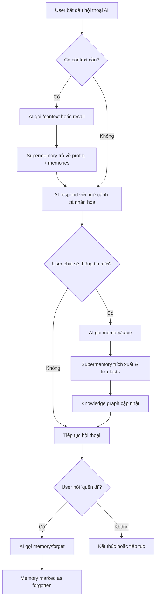
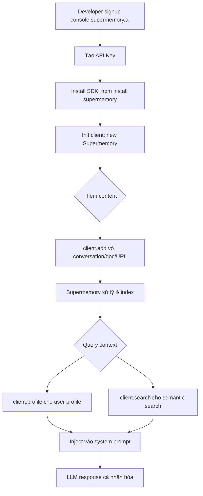

# User Requirements Document (URD)

## Supermemory — Memory & Context Engine for AI

| Metadata          | Value                                         |
|-------------------|-----------------------------------------------|
| **Product Name**  | Supermemory                                   |
| **Version**       | 4.0.0                                         |
| **Date**          | 2026-05-09                                    |
| **Status**        | Production                                    |

---

## 1. Giới Thiệu

### 1.1. Mục Đích

Tài liệu này mô tả các yêu cầu của người dùng đối với hệ thống Supermemory — lớp bộ nhớ và ngữ cảnh cho AI. Tài liệu tập trung vào **nhu cầu thực tế**, **kỳ vọng trải nghiệm**, và **workflow** của từng nhóm người dùng khi tương tác với sản phẩm.

### 1.2. Phạm Vi

Supermemory phục vụ hai nhóm người dùng chính:
1. **Người dùng AI tools** (End Users) — muốn AI nhớ họ giữa các cuộc hội thoại
2. **Nhà phát triển AI** (Developers) — muốn tích hợp memory vào ứng dụng AI

---

## 2. Nhóm Người Dùng (User Personas)

### 2.1. Persona 1: AI Power User (Người Dùng Cuối)

**Hồ sơ:**
- Sử dụng hàng ngày các AI assistants như Claude, Cursor, VS Code Copilot
- Không có kiến thức lập trình sâu
- Muốn trải nghiệm AI cá nhân hóa, liên tục giữa các phiên

**Nhu cầu chính:**
| ID | Nhu Cầu | Mức Ưu Tiên |
|----|---------|-------------|
| UR-U01 | AI phải nhớ sở thích, dự án, và các cuộc thảo luận trước đó giữa các phiên hội thoại | **Cao** |
| UR-U02 | Cài đặt đơn giản, một lệnh duy nhất để kích hoạt bộ nhớ cho AI client | **Cao** |
| UR-U03 | Có thể tổ chức bộ nhớ theo dự án/chủ đề riêng biệt | **Trung bình** |
| UR-U04 | AI tự động quên thông tin hết hạn hoặc không còn phù hợp | **Trung bình** |
| UR-U05 | Có thể xem, quản lý, và xóa bộ nhớ đã lưu | **Trung bình** |
| UR-U06 | Bộ nhớ phải hoạt động trên nhiều AI clients khác nhau (Claude, Cursor, VS Code) | **Cao** |
| UR-U07 | Có thể nói "quên đi" và AI thực sự quên thông tin đó | **Trung bình** |
| UR-U08 | Trực quan hóa đồ thị bộ nhớ để hiểu AI đã nhớ những gì | **Thấp** |

### 2.2. Persona 2: AI Developer (Nhà Phát Triển)

**Hồ sơ:**
- Xây dựng AI agents, chatbots, hoặc ứng dụng AI
- Thành thạo TypeScript/Python
- Cần tích hợp memory layer vào sản phẩm của mình

**Nhu cầu chính:**
| ID | Nhu Cầu | Mức Ưu Tiên |
|----|---------|-------------|
| UR-D01 | API đơn giản, ít bước để thêm memory vào ứng dụng AI | **Cao** |
| UR-D02 | Không cần tự quản lý vector DB, embedding pipeline, chunking strategy | **Cao** |
| UR-D03 | Tìm kiếm hybrid (RAG + Memory) trong một truy vấn duy nhất | **Cao** |
| UR-D04 | User profiles tự động cập nhật (~50ms latency) | **Cao** |
| UR-D05 | Hỗ trợ multi-tenant: mỗi user có bộ nhớ riêng biệt (container tags) | **Cao** |
| UR-D06 | SDKs cho TypeScript và Python với documentation đầy đủ | **Cao** |
| UR-D07 | Framework integrations sẵn có (Vercel AI SDK, LangChain, OpenAI, Mastra) | **Trung bình** |
| UR-D08 | Connectors tự động sync dữ liệu từ Google Drive, Notion, OneDrive, GitHub | **Trung bình** |
| UR-D09 | Xử lý multi-modal: PDFs, images (OCR), videos (transcription), code (AST-aware) | **Trung bình** |
| UR-D10 | Analytics và usage tracking (API calls, tokens, cost savings) | **Trung bình** |
| UR-D11 | API key management với RBAC | **Trung bình** |
| UR-D12 | Webhook hoặc real-time notifications khi dữ liệu thay đổi | **Thấp** |

### 2.3. Persona 3: Enterprise Team (Đội Enterprise)

**Hồ sơ:**
- Đội phát triển sản phẩm AI quy mô lớn
- Cần tuân thủ bảo mật, governance, và SLA
- Quản lý nhiều projects và users

**Nhu cầu chính:**
| ID | Nhu Cầu | Mức Ưu Tiên |
|----|---------|-------------|
| UR-E01 | Organization management với multi-user support | **Cao** |
| UR-E02 | Role-based access control (Owner, Admin, Editor, Viewer) | **Cao** |
| UR-E03 | Custom OAuth keys cho mỗi connector (Google Drive, Notion, OneDrive) | **Trung bình** |
| UR-E04 | LLM filtering customization (include/exclude items, custom prompts) | **Trung bình** |
| UR-E05 | Data isolation giữa các projects/spaces | **Cao** |
| UR-E06 | Usage analytics chi tiết (by API key, by time period, by operation type) | **Trung bình** |
| UR-E07 | Khả năng reset toàn bộ data khi cần | **Thấp** |
| UR-E08 | Content hashing để prevent duplicate processing | **Trung bình** |
| UR-E09 | Subscription tiers phù hợp (Pro, Scale, Enterprise) | **Cao** |

---

## 3. User Stories & Use Cases

### 3.1. Use Case UC-01: Lưu Và Nhớ Lại Thông Tin (End User)

**Actor:** AI Power User  
**Precondition:** User đã cài đặt Supermemory MCP/Plugin cho AI client  
**Trigger:** User chia sẻ thông tin trong hội thoại AI

**Luồng chính:**
1. User nói: *"Tôi thích sử dụng TypeScript và ưa thích functional patterns"*
2. AI tự động gọi tool `memory` với action `save`
3. Supermemory trích xuất facts: "User likes TypeScript", "User prefers functional patterns"
4. Facts được lưu vào knowledge graph với container tag của user
5. Trong cuộc hội thoại tiếp theo, user hỏi: *"Giúp tôi viết một function"*
6. AI tự động gọi tool `recall` với query liên quan
7. Supermemory trả về user profile + relevant memories
8. AI đề xuất code TypeScript theo functional pattern

**Luồng thay thế:**
- 2a. User nói "quên đi" → AI gọi `memory` với action `forget`
- 5a. User chuyển sang project khác → memories được scope bởi containerTag

### 3.2. Use Case UC-02: Tích Hợp Memory Vào AI App (Developer)

**Actor:** AI Developer  
**Precondition:** Developer có API key từ console.supermemory.ai  
**Trigger:** Developer muốn thêm personalized memory cho chatbot

**Luồng chính:**
1. Developer install SDK: `npm install supermemory`
2. Developer khởi tạo client: `new Supermemory()`
3. Sau mỗi cuộc hội thoại, developer gọi `client.add()` với conversation content
4. Khi user hỏi, developer gọi `client.profile()` để lấy user context
5. Developer inject profile vào system prompt
6. LLM trả về response cá nhân hóa dựa trên bộ nhớ

**Kết quả mong đợi:**
- Static profile chứa: sở thích lâu dài, thông tin cá nhân
- Dynamic profile chứa: dự án hiện tại, hoạt động gần đây
- Search results chứa: memories liên quan đến câu hỏi hiện tại

### 3.3. Use Case UC-03: Quản Lý Knowledge Base (Developer)

**Actor:** AI Developer  
**Precondition:** Developer đã có memories trong hệ thống

**Luồng chính:**
1. Developer upload tài liệu (PDF, webpage URL, text) qua `client.add()`
2. Supermemory tự động xử lý: extracting → chunking → embedding → indexing
3. Developer tìm kiếm: `client.search.memories({ q: "deployment guide" })`
4. Hệ thống trả về document chunks (RAG) + personalized memories (Memory)
5. Developer có thể filter theo metadata, containerTags, hoặc documentId

### 3.4. Use Case UC-04: Kết Nối Dữ Liệu Bên Ngoài (Developer/Enterprise)

**Actor:** AI Developer hoặc Enterprise Team  
**Precondition:** User có tài khoản Google Drive/Notion/OneDrive

**Luồng chính:**
1. User tạo connection qua API hoặc Console
2. Hệ thống cung cấp OAuth link cho authorization
3. User authorize access
4. Supermemory tự động sync documents (real-time webhooks)
5. Documents được xử lý và thêm vào knowledge graph
6. Cron job kiểm tra updates mỗi 4 giờ

### 3.5. Use Case UC-05: Trực Quan Hóa Memory Graph (End User/Developer)

**Actor:** AI Power User hoặc Developer  
**Precondition:** User có memories trong hệ thống

**Luồng chính:**
1. User mở Memory Graph Visualization (qua Console hoặc MCP App)
2. Hệ thống hiển thị interactive force-directed graph
3. Nodes hiển thị: Documents (loại, title) và Memories (content, version)
4. Edges hiển thị: Relationships (updates, extends, derives)
5. User có thể hover, click, zoom, drag để khám phá
6. User có thể filter theo project/container tag

### 3.6. Use Case UC-06: Context Injection (MCP Client User)

**Actor:** AI Power User sử dụng MCP-compatible client  
**Precondition:** User đã cấu hình Supermemory MCP server

**Luồng chính:**
1. User gõ `/context` trong AI client
2. MCP server gọi prompt `context` 
3. Hệ thống lấy user profile (static + dynamic)
4. Profile được inject vào conversation dưới dạng system message
5. AI ngay lập tức biết: user là ai, đang làm gì, ưa thích gì
6. Hệ thống cũng nhắc AI lưu thông tin mới vào Supermemory

---

## 4. Yêu Cầu Trải Nghiệm Người Dùng (UX Requirements)

### 4.1. Onboarding Experience

| ID | Yêu Cầu | Tiêu Chí Chấp Nhận |
|----|---------|---------------------|
| UX-01 | MCP install trong một lệnh duy nhất | `npx -y install-mcp@latest ... --client claude` hoạt động không cần tương tác |
| UX-02 | SDK quickstart trong 3 bước | Install → Init → First API call hoàn tất trong < 5 phút |
| UX-03 | Console signup và API key creation trực quan | User có API key trong < 2 phút từ khi đăng ký |

### 4.2. Daily Usage Experience

| ID | Yêu Cầu | Tiêu Chí Chấp Nhận |
|----|---------|---------------------|
| UX-04 | Memory hoạt động "vô hình" — user không cần làm gì thêm | AI tự động save/recall không cần lệnh rõ ràng |
| UX-05 | Profile retrieval cực nhanh | Latency < 100ms cho `client.profile()` |
| UX-06 | Search kết quả relevant và accurate | Benchmark score > 80% trên LongMemEval |
| UX-07 | Memory graph dễ khám phá và tương tác | Hover, click, zoom, drag smooth trên desktop |

### 4.3. Error Handling & Recovery

| ID | Yêu Cầu | Tiêu Chí Chấp Nhận |
|----|---------|---------------------|
| UX-08 | Lỗi API phải rõ ràng, actionable | Error response có `error` message + `details` |
| UX-09 | Retry tự động cho transient failures | SDK retry 3 lần với linear delay |
| UX-10 | Document processing failures không mất dữ liệu | Document status = `failed` nhưng content preserved |

---

## 5. Yêu Cầu Phi Chức Năng Từ Góc Nhìn Người Dùng

### 5.1. Performance

| ID | Yêu Cầu | Metric |
|----|---------|--------|
| NFR-U01 | Profile retrieval nhanh | < 100ms (p95) |
| NFR-U02 | Search response nhanh | < 500ms (p95) |
| NFR-U03 | Memory save xác nhận nhanh | < 200ms (p95) |
| NFR-U04 | Document processing reasonable | PDF 100 trang < 2 phút |

### 5.2. Reliability

| ID | Yêu Cầu | Metric |
|----|---------|--------|
| NFR-U05 | Hệ thống luôn available | Uptime > 99.9% |
| NFR-U06 | Không mất dữ liệu | Bộ nhớ đã lưu phải persistent |
| NFR-U07 | Content hashing prevent duplicates | Không có duplicate documents |

### 5.3. Security & Privacy

| ID | Yêu Cầu | Metric |
|----|---------|--------|
| NFR-U08 | Data isolation giữa users/orgs | Không user nào access data user khác |
| NFR-U09 | Secure credential handling | OAuth tokens encrypted, API keys hashed |
| NFR-U10 | Session management an toàn | Session cookie + CSRF protection |

### 5.4. Compatibility

| ID | Yêu Cầu | Metric |
|----|---------|--------|
| NFR-U11 | MCP hoạt động trên tất cả major AI clients | Claude, Cursor, Windsurf, VS Code, Claude Code, OpenCode, Hermes |
| NFR-U12 | SDKs hỗ trợ đa ngôn ngữ | TypeScript + Python |
| NFR-U13 | API tương thích backward | v3 endpoints stable |

---

## 6. User Workflow Diagrams

### 6.1. End User Memory Workflow

### 6.2. Developer Integration Workflow

---

## 7. Acceptance Criteria Matrix

| Requirement | Acceptance Criteria | Verification Method |
|-------------|--------------------|--------------------|
| UR-U01 | AI nhớ > 80% facts từ cuộc hội thoại trước | LongMemEval benchmark |
| UR-U02 | Cài đặt MCP hoàn tất trong 1 lệnh | Manual test |
| UR-D01 | Quickstart code chạy trong < 5 phút | Documentation walkthrough |
| UR-D03 | Hybrid search trả về cả docs + memories | API integration test |
| UR-D04 | Profile API < 100ms | Performance benchmark |
| UR-D05 | Container tags isolate data đúng | Multi-tenant test |
| UR-E01 | Organization CRUD hoạt động | Console UI test |
| UR-E02 | RBAC enforce đúng permissions | Security test |
