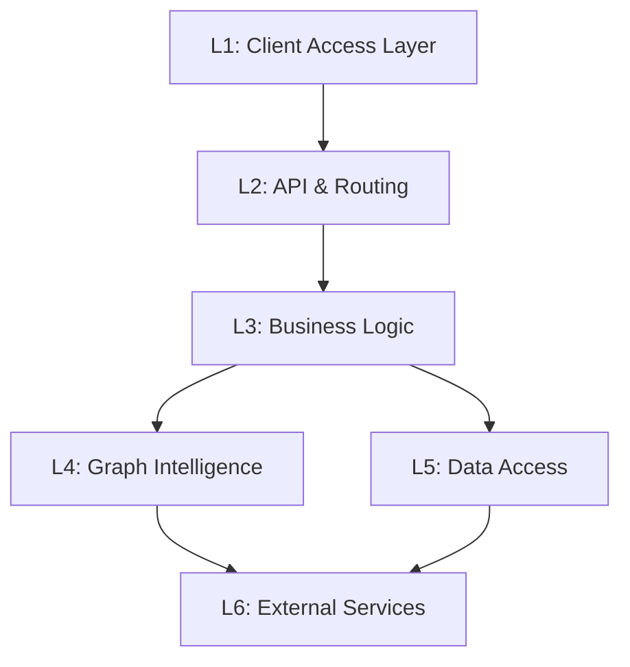

# Zep — Functional Layer Architecture Specification

> **Version**: 1.0  
> **Date**: 2026-05-07  
> **Source**: Derived from codebase analysis of `getzep/zep`

---

## 1. Tổng Quan Kiến Trúc Phân Tầng

Zep được tổ chức thành **6 tầng chức năng (functional layers)** từ cao xuống thấp. Mỗi tầng đảm nhận một vai trò rõ ràng trong việc cung cấp context engineering cho AI agents:

```
┌─────────────────────────────────────────────────────────────────┐
│  L1 — CLIENT ACCESS LAYER                                       │
│  Python SDK · TypeScript SDK · Go SDK · REST API · MCP Server   │
├─────────────────────────────────────────────────────────────────┤
│  L2 — API & ROUTING LAYER                                       │
│  chi Router · Middleware Stack · Request Validation              │
│  Route Handlers · Auth · CORS · Rate Limiting                   │
├─────────────────────────────────────────────────────────────────┤
│  L3 — BUSINESS LOGIC LAYER                                      │
│  Memory DAO (Get/Put) · Session DAO · User DAO                  │
│  Message DAO · Fact DAO · Search Service                        │
├─────────────────────────────────────────────────────────────────┤
│  L4 — GRAPH INTELLIGENCE LAYER                                  │
│  Graphiti Client · Graph Extraction · Fact Retrieval             │
│  Temporal Reasoning · Ontology · Reranking                      │
├─────────────────────────────────────────────────────────────────┤
│  L5 — DATA ACCESS LAYER                                         │
│  PostgreSQL Store · Migration System · Advisory Locks            │
│  bun ORM · Schema Management · Metadata Utils                   │
├─────────────────────────────────────────────────────────────────┤
│  L6 — EXTERNAL SERVICES & STORAGE                               │
│  PostgreSQL + pgvector · Neo4j · Graphiti Service                │
│  OpenAI/LLM Provider · OpenTelemetry                            │
└─────────────────────────────────────────────────────────────────┘
```

---

## 2. Dependency Flow



**Quy tắc phụ thuộc:**
- L1 → L2: SDK/Client gọi REST API endpoints
- L2 → L3: Route handlers delegate xuống DAO layer
- L3 → L4 + L5: Business logic gọi cả Graphiti client (L4) và PostgreSQL store (L5)
- L4, L5 → L6: Infrastructure adapters gọi external services
- **Ngoại lệ**: MCP Server (L1) gọi trực tiếp Zep Cloud API thay vì qua L2 local

---

## 3. Bảng Ánh Xạ Tầng — Thư Mục Mã Nguồn

| Layer | Path | Key Files | Trách nhiệm |
|---|---|---|---|
| L1 | `examples/` · `integrations/` · `mcp/` | SDK examples, zep_autogen, zep_crewai, zep_adk, zep_livekit, zep-mcp-server | Client SDKs, framework integrations, MCP tools |
| L2 | `legacy/src/api/` | routes.go, server_ce.go, apihandlers/, middleware/, handlertools/ | HTTP routing, middleware stack, request validation |
| L3 | `legacy/src/models/` · `legacy/src/store/memory_*.go` | memoryDAO, sessionDAO, messageDAO, userDAO, factDAO | Business logic, data orchestration |
| L4 | `legacy/src/lib/graphiti/` · `ontology/` | Graphiti HTTP client, default_ontology.py | Graph extraction, temporal reasoning, ontology |
| L5 | `legacy/src/store/` · `legacy/src/lib/pg/` | sessionstore, userstore, message, schema, migrations | PostgreSQL CRUD, ORM, schema management |
| L6 | External services | PostgreSQL, Neo4j, Graphiti service, OpenAI | Managed databases, LLM providers |

---

## 4. Chi Tiết Từng Tầng

### 4.1 L1 — Client Access Layer

**Trách nhiệm**: Cung cấp các điểm truy cập để ứng dụng tương tác với Zep.

#### 4.1.1 Official SDKs

| SDK | Package | Language | Install |
|---|---|---|---|
| Python | `zep-cloud` | Python 3.10+ | `pip install zep-cloud` |
| TypeScript | `@getzep/zep-cloud` | TS/JS | `npm install @getzep/zep-cloud` |
| Go | `zep-go/v3` | Go 1.21+ | `go get github.com/getzep/zep-go/v2` |

**Key Pattern — Async Client**:
```python
from zep_cloud.client import AsyncZep
zep = AsyncZep(api_key=os.getenv("ZEP_API_KEY"))
await zep.user.add(user_id="alice", first_name="Alice")
await zep.thread.create(user_id="alice", thread_id="thread_1")
await zep.thread.add_messages(thread_id="thread_1", messages=[...])
context = await zep.thread.get_user_context(thread_id="thread_1")
results = await zep.graph.search(user_id="alice", query="preferences")
```

#### 4.1.2 Framework Integrations

| Integration | Package | Interface | Storage Routing |
|---|---|---|---|
| AutoGen | `zep-autogen` | `autogen_core.memory.Memory` | message → Thread, text/json → Graph |
| CrewAI | `zep-crewai` | `ZepUserStorage` + `ZepGraphStorage` | Dual storage: per-user + shared KG |
| Google ADK | `zep-adk` | ADK memory interface | Standard routing |
| LiveKit | `zep-livekit` | LiveKit memory interface | Standard routing |

**CrewAI Dual Storage**:
- `ZepUserStorage(client, user_id, thread_id, facts_limit=20, entity_limit=5, mode="summary"|"raw_messages")`
- `ZepGraphStorage(client, graph_id)` — shared knowledge with custom ontologies
- Tool factories: `create_search_tool()`, `create_add_data_tool()`

#### 4.1.3 MCP Server

| Property | Value |
|---|---|
| Language | Go 1.21+ |
| Access Mode | Read-only (13 tools) |
| Transport | stdio (Claude Desktop/Cline) · HTTP Streamable (Claude Code) |
| Auth | `ZEP_API_KEY` environment variable |

**13 MCP Tools** (3 phases):

| Phase | Tools |
|---|---|
| Core Search | `search_graph`, `get_user_context`, `get_user`, `list_threads` |
| Graph Query | `get_user_nodes`, `get_user_edges`, `get_episodes` |
| Detail Retrieval | `get_thread_messages`, `get_node`, `get_edge`, `get_episode`, `get_node_edges`, `get_episode_mentions` |

#### 4.1.4 Examples

| Language | Examples |
|---|---|
| Python | `simple.py`, `advanced.py`, `user_example.py`, agent-memory, langgraph-agent, openai-agents-sdk, graph, chat_history, chunking, context-templates, elevenlabs, quickstart, dashboard |
| Go | `conversations.go`, `entity_types.go`, `user_graph.go`, chunking |
| TypeScript | graph, langgraph, memory, users, chunking, zep-graph-visualization |

---

### 4.2 L2 — API & Routing Layer

**Trách nhiệm**: HTTP routing, middleware pipeline, request validation, response formatting.

**Source**: `legacy/src/api/`

#### 4.2.1 Middleware Stack (thứ tự thực thi)

```
Request →
  1. CORS (AllowOriginFunc: allow all)
  2. Request Logging (proto, method, path, request_id, duration, status, response_size)
  3. Heartbeat (/healthz → 200 OK)
  4. Request Size Limiter (5MB = 5 << 20)
  5. Request ID Injection (X-Request-Id header or UUID)
  6. Context Timeout (30s)
  7. Real IP Extraction
  8. Clean Path
  9. Version Header (SendVersion)
  10. OpenTelemetry Tracing (otelchi)
→ Route Handler
```

#### 4.2.2 Route Map (`/api/v2`)

**Session Routes**:

| Method | Path | Handler |
|---|---|---|
| GET | `/sessions` | `GetSessionListHandler` |
| POST | `/sessions` | `CreateSessionHandler` |
| GET | `/sessions-ordered` | `GetOrderedSessionListHandler` |
| POST | `/sessions/search` | `SearchSessionsHandler` |
| GET | `/sessions/{sessionId}` | `GetSessionHandler` |
| PATCH | `/sessions/{sessionId}` | `UpdateSessionHandler` |

**Memory Routes**:

| Method | Path | Handler |
|---|---|---|
| GET | `/sessions/{id}/memory` | `GetMemoryHandler` |
| POST | `/sessions/{id}/memory` | `PostMemoryHandler` |
| DELETE | `/sessions/{id}/memory` | `DeleteMemoryHandler` |

**Message Routes**:

| Method | Path | Handler |
|---|---|---|
| GET | `/sessions/{id}/messages` | `GetMessagesForSessionHandler` |
| GET | `/sessions/{id}/messages/{uuid}` | `GetMessageHandler` |
| PATCH | `/sessions/{id}/messages/{uuid}` | `UpdateMessageMetadataHandler` |

**User Routes**:

| Method | Path | Handler |
|---|---|---|
| POST | `/users` | `CreateUserHandler` |
| GET | `/users` | `ListAllUsersHandler` |
| GET | `/users-ordered` | `ListAllOrderedUsersHandler` |
| GET | `/users/{userId}` | `GetUserHandler` |
| PATCH | `/users/{userId}` | `UpdateUserHandler` |
| DELETE | `/users/{userId}` | `DeleteUserHandler` |
| GET | `/users/{userId}/sessions` | `ListUserSessionsHandler` |

**Fact Routes**:

| Method | Path | Handler |
|---|---|---|
| GET | `/facts/{factUUID}` | `GetFactHandler` |
| DELETE | `/facts/{factUUID}` | `DeleteFactHandler` |

#### 4.2.3 Validation

- Custom validators: `alphanumeric_with_underscores`, `nonemptystrings`
- Registered via `go-playground/validator/v10`

---

### 4.3 L3 — Business Logic Layer

**Trách nhiệm**: Orchestration logic cho Memory, Session, User, và Search operations.

**Source**: `legacy/src/store/memory_*.go`, `legacy/src/models/`

#### 4.3.1 Memory DAO — Core Orchestrator

**PutMemory Flow** (message ingestion):
```
PutMemory(sessionID, messages)
  │
  ├── 1. sessionStore.Update(sessionID)
  │      └── if NotFound → sessionStore.Create(sessionID)
  │
  ├── 2. Check session.EndedAt → reject if ended (SessionEndedError)
  │
  ├── 3. messageDAO.CreateMany(messages) → INSERT INTO messages
  │
  └── 4. _initializeProcessingMemory()
         ├── graphiti.PutMemory(sessionID, messages, addPrefix=true)
         └── graphiti.PutMemory(userID, messages, addPrefix=true)  ← if user linked
```

**GetMemory Flow** (context retrieval):
```
GetMemory(sessionID, lastN)
  │
  ├── 1. messageDAO.GetLastN(max(lastN, 4))  → PostgreSQL
  │
  ├── 2. Determine groupID:
  │      └── session.UserID ?? session.SessionID
  │
  ├── 3. graphiti.GetMemory(groupID, maxFacts=5, last4Messages)
  │      └── Returns relevant Facts with valid_at/invalid_at
  │
  └── 4. Assemble: Memory{ messages[lastN:], relevantFacts }
```

**SearchSessions Flow**:
```
SearchSessions(query, limit)
  │
  ├── 1. Build groupIDs from query.UserID + query.SessionIDs
  ├── 2. graphiti.Search(groupIDs, text, maxFacts)
  └── 3. Map Graphiti facts → SessionSearchResult[]
```

#### 4.3.2 Session DAO

| Operation | Logic |
|---|---|
| Create | Insert session with `session_id`, optional `user_id`, `project_uuid` |
| Update | Patch metadata via JSONB merge; uses advisory locks for concurrency |
| Get | Select by `session_id` where `deleted_at IS NULL` |
| List | Ordered by `created_at` with pagination |
| End | Set `ended_at` timestamp; blocks future message ingestion |

#### 4.3.3 User DAO

| Operation | Logic |
|---|---|
| Create | Insert user with `user_id`, email, name, metadata |
| Update | Patch metadata with JSONB merge |
| Delete | Soft delete via `deleted_at` timestamp |
| ListSessions | Fetch all sessions where `user_id` matches |

#### 4.3.4 Concurrency Control

- **PostgreSQL Advisory Locks**: Hash of session ID → `pg_advisory_lock(hash)`
- **Retry Policy**: Exponential backoff 200ms → 30s, max 15 retries
- **Purpose**: Prevents race conditions on concurrent metadata updates

---

### 4.4 L4 — Graph Intelligence Layer

**Trách nhiệm**: Temporal knowledge graph management — extraction, storage, and retrieval of relationship-aware facts.

**Source**: `legacy/src/lib/graphiti/`, `ontology/`

#### 4.4.1 Graphiti Client Interface

| Method | Endpoint | Purpose |
|---|---|---|
| `PutMemory` | `POST /messages` | Ingest messages → extract entities/edges |
| `GetMemory` | `POST /get-memory` | Retrieve relevant facts for context |
| `Search` | `POST /search` | Semantic search across facts |
| `AddNode` | `POST /entity-node` | Add entity node to graph |
| `GetFact` | `GET /entity-edge/{uuid}` | Retrieve specific fact |
| `DeleteFact` | `DELETE /entity-edge/{uuid}` | Remove fact |
| `DeleteGroup` | `DELETE /group/{id}` | Remove all data for a group |
| `DeleteMessage` | `DELETE /episode/{uuid}` | Remove message episode |

**Group ID Strategy**: Messages grouped by session ID. With `addGroupIDPrefix=true`, episode UUIDs are prefixed `{groupID}-{messageUUID}` to namespace across groups.

#### 4.4.2 Ontology System

**Default Node Ontology** (`ontology/default_ontology.py`):

| Type | Priority | Classification Rule |
|---|---|---|
| `User` | 1 (Highest) | Singleton — Zep user from chat role |
| `Assistant` | 1 (Highest) | Singleton — AI assistant |
| `Preference` | 2 (Very High) | LOW threshold: "I want/like/prefer/choose X" |
| `Organization` | 3 (High) | Companies, institutions, groups |
| `Event` | 3 (High) | Time-bound activities |
| `Location` | 4 (Medium) | Check higher-priority types first |
| `Document` | 4 (Medium) | Content in various forms |
| `Topic` | 5 (Low) | Last resort before Object |
| `Object` | 6 (Lowest) | ONLY as absolute last resort |

**Edge Ontology**:
- `LOCATED_AT`: Entity → Location
- `OCCURRED_AT`: Event → Entity/Location
- Edge type map: `(Event, Entity) → [OCCURRED_AT]`, `(Entity, Location) → [LOCATED_AT]`

**Custom Ontology Extension**:
```python
from ontology.default_ontology import ZEP_NODE_ONTOLOGY
CUSTOM = {**ZEP_NODE_ONTOLOGY, "Product": ProductModel}
```

#### 4.4.3 Temporal Fact Model

```
Fact {
  uuid:       UUID
  name:       string          ← relationship label
  fact:       string          ← human-readable statement
  created_at: time.Time       ← when fact was extracted
  valid_at:   *time.Time      ← when fact became true
  invalid_at: *time.Time      ← when fact ceased to be true
  expired_at: *time.Time      ← when fact was superseded
}
```

**Temporal Reasoning**: `valid_at`/`invalid_at` enables agents to understand how relationships evolve over time — e.g., "Alice worked at Acme (2020–2023)" vs. "Alice works at Beta (2023–present)".

#### 4.4.4 Search & Reranking

| Reranker | Strategy | Use Case |
|---|---|---|
| `rrf` | Reciprocal Rank Fusion | Balanced multi-signal |
| `mmr` | Maximal Marginal Relevance | Diversity-focused |
| `cross_encoder` | Neural cross-encoder | Best accuracy, slower |
| `node_distance` | Graph proximity | Relationship-aware |
| `episode_mentions` | Episode frequency | Recency-aware |

**Search Scopes**: `edges` (facts), `nodes` (entities), `episodes` (temporal events)

**Search Filters**: `node_labels[]`, `edge_types[]`, `min_fact_rating`, `mmr_lambda`, `center_node_uuid`

---

### 4.5 L5 — Data Access Layer

**Trách nhiệm**: PostgreSQL CRUD operations, schema management, ORM, and migration system.

**Source**: `legacy/src/store/`, `legacy/src/lib/pg/`

#### 4.5.1 Store Architecture

| Store | Source File | Operations |
|---|---|---|
| `SessionStore` | `sessionstore_common.go` + `sessionstore_ce.go` | Create, Get, Update, List, ListOrdered |
| `UserStore` | `userstore_common.go` + `userstore_ce.go` | Create, Get, Update, Delete, List, ListOrdered |
| `MessageStore` | `message_common.go` + `message_ce.go` | CreateMany, GetLastN, Get, Update |
| `MemoryStore` | `memorystore_common.go` + `memorystore_ce.go` | Get, Create, SearchSessions |
| `SchemaStore` | `schema_common.go` + `schema_ce.go` | MigrateSchema, CreateSchema |

#### 4.5.2 Database Schema

**Tables**:

| Table | PK | Key Columns | Indexes |
|---|---|---|---|
| `users` | `uuid` | `user_id` (unique), `project_uuid`, `metadata` | `user_user_id_idx`, `user_email_idx` |
| `sessions` | `uuid` | `session_id` (unique), `user_id`, `project_uuid` | `session_user_id_idx`, composite `(session_id, project_uuid, deleted_at)` |
| `messages` | `uuid` | `session_id`, `role`, `role_type`, `content` | `memstore_session_id_idx`, composite `(session_id, project_uuid, deleted_at)` |

**Role Type Enum**: `norole`, `system`, `assistant`, `user`, `function`, `tool`

#### 4.5.3 ORM & Migration

- **ORM**: `uptrace/bun` — struct-based query builder for PostgreSQL
- **Migrations**: Applied at startup via `store.MigrateSchema()` → `migrations.Migrate()`
- **Metadata**: JSONB columns with merge-patch update strategy
- **Soft Deletes**: `deleted_at TIMESTAMPTZ` on all tables — never hard delete

#### 4.5.4 Utility Functions

| Utility | Purpose |
|---|---|
| `metadata_utils.go` | JSONB merge, advisory lock acquisition |
| `db_utils_ce.go` | Connection pool management, health checks |
| `purge_common.go` | Data purge operations (soft delete cascade) |

---

### 4.6 L6 — External Services & Storage

**Trách nhiệm**: Managed external services consumed by L4 and L5.

#### 4.6.1 Service Matrix

| Service | Technology | Version | Port | Purpose |
|---|---|---|---|---|
| Relational DB | PostgreSQL + pgvector | v0.5.1+ | 5432 | User, Session, Message storage |
| Graph DB | Neo4j | 5.22+ | 7474/7687 | Temporal knowledge graph |
| Graph Engine | Graphiti | 0.3 | 8003 | LLM-powered entity extraction |
| LLM Provider | OpenAI (via Graphiti) | — | — | Entity/relationship extraction |
| Observability | OpenTelemetry | — | — | Distributed tracing |

#### 4.6.2 Docker Compose Topology

```
┌──────────────────────────────────────────────────────┐
│                 zep-network (bridge)                  │
│                                                      │
│  ┌─────────┐     ┌───────────┐     ┌──────────────┐ │
│  │   zep   │────▶│ graphiti  │────▶│    neo4j     │ │
│  │ :8000   │     │  :8003    │     │ :7474/:7687  │ │
│  └────┬────┘     └───────────┘     └──────────────┘ │
│       │                                              │
│       ▼                                              │
│  ┌─────────┐                                        │
│  │postgres │                                        │
│  │  :5432  │                                        │
│  └─────────┘                                        │
└──────────────────────────────────────────────────────┘
```

**Health Check Dependencies**:
- `zep` → `graphiti` (healthy) + `db` (healthy)
- `graphiti` → `neo4j` (healthy)

#### 4.6.3 Configuration

| Config | Source | Key Settings |
|---|---|---|
| `zep.yaml` | File | log level/format, http host/port, postgres connection, graphiti URL, api_secret |
| `.env` | Environment | `OPENAI_API_KEY`, `ZEP_API_KEY`, `LOG_LEVEL` |
| Neo4j | Environment | `NEO4J_AUTH=neo4j/zepzepzep` |

---

## 5. Data Flow Tổng Hợp

### 5.1 Ingestion Flow: Client → Graph

```
Client SDK (L1)
  → REST API POST /sessions/{id}/memory (L2)
  → Middleware pipeline (auth, validation, logging) (L2)
  → PostMemoryHandler → memoryDAO.Create() (L3)
  → messageDAO.CreateMany() → PostgreSQL INSERT (L5 → L6)
  → graphiti.PutMemory() → Graphiti HTTP POST /messages (L4 → L6)
  → Graphiti extracts entities/edges → Neo4j upsert (L6)
```

### 5.2 Retrieval Flow: Graph → Client

```
Client SDK (L1)
  → REST API GET /sessions/{id}/memory?lastN=10 (L2)
  → GetMemoryHandler → memoryDAO.Get() (L3)
  → messageDAO.GetLastN() → PostgreSQL SELECT (L5 → L6)
  → graphiti.GetMemory(groupID, 4 messages) (L4 → L6)
  → Graphiti searches Neo4j → returns Facts (L6)
  → Assemble Memory{messages, facts} → JSON response (L3 → L2 → L1)
```

### 5.3 MCP Flow: AI Assistant → Graph (Read-Only)

```
AI Assistant (Claude)
  → MCP Client (stdio/HTTP) (L1)
  → MCP Server handler (L1)
  → Zep Go SDK v3 → Zep Cloud API (L1 → L2)
  → Context/Search response → formatted JSON (L1)
```

---

## 6. Cross-Cutting Concerns

| Concern | Module | Layer(s) |
|---|---|---|
| **Authentication** | API Key / Shared Secret | L2 |
| **Multi-Tenancy** | `project_uuid` on all entities | L3 + L5 |
| **Observability** | OpenTelemetry (`otelchi`), structured logging | L2 + L6 |
| **Health Monitoring** | `/healthz` endpoint (chi Heartbeat) | L2 |
| **Telemetry** | Anonymous usage events (opt-out) | L3 |
| **Concurrency** | PostgreSQL advisory locks | L5 |
| **Soft Deletes** | `deleted_at` on all entities | L5 |
| **Error Handling** | `zerrors` package (typed errors) | L3 |
| **Configuration** | `zep.yaml` + `.env` + environment variables | L2 + L6 |
| **Request Limiting** | 5MB payload, 30s timeout | L2 |

---

## 7. Eval & Benchmark Layers (Standalone)

Eval harness và benchmarks hoạt động như một hệ thống độc lập, sử dụng Zep Cloud API (L1 SDK):

```
┌─────────────────────────────────────────────────────────┐
│              Eval Harness Pipeline                       │
│                                                         │
│  Config Layer (config/)                                 │
│  ├── user_ingestion_config/    ← ontology, instructions │
│  ├── document_ingestion_config/                         │
│  ├── document_chunking_config/ ← chunk size, LLM model  │
│  └── evaluation_config/       ← search limits, prompts  │
│                                                         │
│  Execution Layer                                        │
│  ├── zep_ingest_users.py      → runs/users/{N}/        │
│  ├── zep_chunk_documents.py   → runs/chunk_sets/{N}/    │
│  ├── zep_ingest_documents.py  → runs/documents/{N}/     │
│  ├── zep_evaluate.py          → runs/evaluations/{N}/   │
│  └── zep_graph_inspect.py     → stdout                  │
│                                                         │
│  Metrics:                                               │
│  ├── PRIMARY: Context Completeness (COMPLETE/PARTIAL)   │
│  └── SECONDARY: Answer Accuracy (CORRECT/WRONG)         │
│                                                         │
│  Features: Decoupled ingestion, config snapshotting,    │
│  combinatorial eval (--user-run N --doc-run M),         │
│  retry with exponential backoff (8 retries, 5min max)   │
└─────────────────────────────────────────────────────────┘
```

**Benchmarks**:
- `benchmarks/locomo/` — LoCoMo long-context conversation benchmark
- `benchmarks/longmemeval/` — LongMemEval extended memory benchmark

---

*Document generated from functional layer analysis of `github.com/getzep/zep` repository.*
