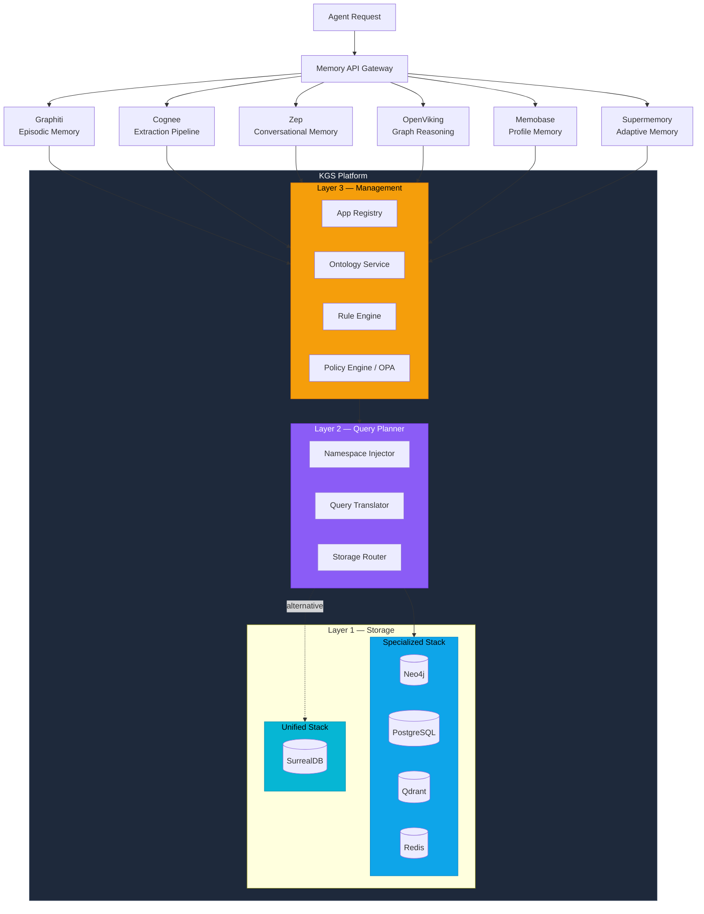

# Unified Cognitive Infrastructure Layer for Enterprise AI

## Tổng quan

Các mảnh ghép bạn nêu thực ra đang đại diện cho các lớp rất khác nhau trong bài toán "AI memory":

| Component      | Vai trò                                                                 |
| -------------- | ----------------------------------------------------------------------- |
| **Graphiti**   | Temporal knowledge graph + episodic memory                              |
| **Cognee**     | Memory orchestration / extraction pipeline                              |
| **Zep**        | Long-term memory + conversational context infra                         |
| **OpenViking** | Agentic knowledge workflows / graph reasoning layer                     |
| **Memobase**   | User profile-based long-term memory + event timeline                    |
| **Supermemory**| Living knowledge graph + auto-forgetting + external connectors          |
| **SurrealDB**  | Unified multi-model storage (graph + document + relational + vector)    |
| **KGS Platform** | Multi-tenant Knowledge Graph Service — 5 layers: Transport, Governance, Query & Intelligence, Sync & Processing, Storage (PG→Neo4j+Qdrant via Outbox CQRS) |

Nếu ghép đúng cách, bạn không tạo ra "một framework nữa", mà là:

> **"Unified Cognitive Infrastructure Layer for Enterprise AI"**

và đó là thị trường còn chưa có winner rõ ràng.

**KGS Platform** đóng vai trò **Structured Knowledge Backbone** — cung cấp hạ tầng graph-as-a-service cho mọi tenant, với ontology tùy biến, namespace isolation, rule engine, và access control tập trung. Đây là lớp kết nối giữa các memory engine (Graphiti, Cognee, Zep) với lớp storage (SurrealDB/Neo4j), đảm bảo mọi tri thức đều có schema, governance, và audit trail.

---

## Điểm mạnh của ý tưởng

### 1. Đúng hướng xu thế hậu-RAG

Enterprise AI hiện đang chuyển từ:

```
RAG → Agentic RAG → Persistent Memory Systems
```

Vấn đề lớn nhất hiện nay:

- Context window vẫn đắt
- Agent không nhớ dài hạn
- Memory fragmented
- Không có temporal reasoning
- Không có organizational memory
- Khó governance / audit
- **Không có schema enforcement cho knowledge graph** ← KGS giải quyết

Các hệ thống hiện tại thường chỉ làm tốt **một mảnh**:

| System            | Mạnh về                |
| ----------------- | ---------------------- |
| Zep               | Conversational memory  |
| Mem0              | Lightweight memory     |
| Graphiti          | Temporal graph memory  |
| Cognee            | Extraction pipeline    |
| Memobase          | User profile extraction, low-cost LLM |
| Supermemory       | Auto-forgetting, KG versioning, connectors |
| Neo4j stack       | Graph reasoning        |
| Weaviate/Pinecone | Retrieval              |
| LangGraph         | Orchestration          |
| **KGS Platform**  | **Multi-tenant graph governance & ontology** |

> **Không ai unify tốt toàn bộ stack.** KGS Platform chính là lớp governance + schema enforcement mà hệ thống đang thiếu.

### 2. Combination cực hợp logic về kiến trúc

Kiến trúc tổng thể khi tích hợp KGS Platform:

```
                    Applications / Agents
                            │
                     Memory API Gateway
                            │
            ┌──────────┬──────────┬──────────┬──────────┬──────────┐
            │          │          │          │          │          │
      Episodic    Semantic    Conversa-   Procedural  Profile   Adaptive
      (time)      (facts)     tional      (workflows) (user)    (KG+forget)
            │          │     (sessions)       │          │          │
          Graphiti   Cognee    Zep        OpenViking  Memobase  Supermemory
            │          │          │          │          │          │
            └──────────┴──────────┴──────────┴──────────┴──────────┘
                            │
  ╔═════════════════════════╧══════════════════════════════════╗
  ║              KGS Platform (5-Layer Architecture)           ║
  ╠════════════════════════════════════════════════════════════╣
  ║  L5 — Transport    gRPC/HTTP servers · Middleware · Workers║
  ╠════════════════════════════════════════════════════════════╣
  ║  L4 — Governance   Registry · Ontology · Rules · Policy   ║
  ╠════════════════════════════════════════════════════════════╣
  ║  L3 — Query & Intelligence                                ║
  ║    QueryPlanner · HybridSearch · Analytics · Projection    ║
  ║    Namespace · Guardrails · ViewResolver                   ║
  ╠════════════════════════════════════════════════════════════╣
  ║  L2 — Sync & Processing                                   ║
  ║    OutboxWorker · BatchHandler · Overlay · Lock · Reconcile║
  ╠════════════════════════════════════════════════════════════╣
  ║  L1 — Storage                                             ║
  ║  ┌─────────────────────────────┐  ┌────────────────────┐  ║
  ║  │ Specialized Stack           │  │ Unified (Planned)  │  ║
  ║  │  PostgreSQL (source-of-truth)│  │ SurrealDB          │  ║
  ║  │  Neo4j      (graph queries) │  │  graph + doc       │  ║
  ║  │  Qdrant     (vector search) │  │  + vector          │  ║
  ║  │  Redis      (cache/locks)   │  │  + realtime        │  ║
  ║  │  NATS       (event stream)  │  │                    │  ║
  ║  └─────────────────────────────┘  └────────────────────┘  ║
  ╚════════════════════════════════════════════════════════════╝
```

**KGS Platform 5-Layer Architecture (dựa trên code thực tế):**

- **L5 — Transport:** gRPC/HTTP servers (Kratos), auth middleware (API key→tenant), background WorkerServer (rule scheduler, outbox, overlay, reconcile)
- **L4 — Governance:** App Registry (lifecycle, API keys, quotas), Ontology Service (schema validation, constraint sync), Rule Engine (cron + event-driven), Policy Engine (OPA ABAC)
- **L3 — Query & Intelligence:** QueryPlanner (Cypher generation, batched traversal), Namespace injection, Guardrails (max depth/nodes), Hybrid Search (vector + text + centrality reranking), Analytics (coverage, traceability matrix, clustering), Projection (role-based views, PII masking)
- **L2 — Sync & Processing:** Outbox Worker (PG→Neo4j+Qdrant async fan-out), Batch Handler (bulk writes), Overlay graphs (commit/discard/conflict), Distributed locks (Redis), Reconciliation jobs
- **L1 — Storage:** PostgreSQL là **source-of-truth** (ACID), Neo4j + Qdrant là **read replicas** (synced via Outbox). Redis cho cache/locks, NATS cho event streaming. SurrealDB là alternative unified stack (planned)

> **Key Insight từ code:** Architecture thực tế là **Event-Driven CQRS** — write vào PostgreSQL, async fan-out tới Neo4j (graph queries) và Qdrant (vector search) qua Outbox pattern.

**So sánh hai Storage backend ngang hàng:**

| Tiêu chí         | Specialized Stack (Neo4j+Postgres+Qdrant+Redis) | Unified Stack (SurrealDB)             |
| ---------------- | ------------------------------------------------ | ------------------------------------- |
| Graph queries    | Neo4j — Cypher, mature, battle-tested            | SurrealDB — graph native, đang mature |
| Vector search    | Qdrant — chuyên biệt, high performance           | SurrealDB — vector native, built-in   |
| Metadata/Config  | PostgreSQL — ACID, relational, enterprise        | SurrealDB — document + relational     |
| Cache/Streaming  | Redis — pub/sub, TTL, streams                    | SurrealDB — realtime subscriptions    |
| Infra complexity | Cao (4 engines cần sync)                         | Thấp (1 engine duy nhất)             |
| Enterprise trust | Rất cao (proven stack)                           | Đang xây dựng                         |
| Scaling          | Mỗi engine scale độc lập                         | Scale đồng nhất                       |

> **Chiến lược:** Query Planner (Layer 2) abstract hóa storage backend. Cả hai stack có thể chạy song song hoặc chuyển đổi dần mà không ảnh hưởng Layer 3 (Management) và các memory engines phía trên.

### 3. Enterprise đang rất cần "Memory Governance"

**Đây mới là vàng.** Không phải retrieval. Mà là:

- AI nhớ cái gì?
- Expire khi nào?
- Provenance từ đâu?
- Ai tạo?
- Tenant isolation?
- PII handling?
- Audit trail?
- Memory poisoning detection?
- Confidence score?
- Temporal validity?

Nếu bạn giải được **Memory Governance + Context Orchestration** thì đây là category enterprise-grade thực sự.

**KGS Platform đã implement sẵn nhiều capability governance:**

| Governance Need          | KGS Feature                                           |
| ------------------------ | ----------------------------------------------------- |
| Tenant isolation         | Namespace labels `{APP_ID}__{Type}` trên Neo4j        |
| Schema enforcement       | Ontology Service + JSON Schema validation             |
| Access control           | OPA-based ABAC policies per app                       |
| Audit trail              | Rule execution history + event outbox                 |
| Provenance tracking      | Namespace metadata trong mỗi node/edge response       |
| Confidence score         | Edge properties (`confidence`, `impact_weight`)       |
| Memory lifecycle         | App lifecycle (ACTIVE → SUSPENDED → DELETED)          |

### 4. Có thể tạo "Context OS"

Đây là hướng rất mạnh. Thay vì:

> ❌ "Database cho embeddings"

Thì:

> ✅ "Operating system cho AI cognition"

Bao gồm:

- Memory lifecycle
- Context compression
- Temporal reasoning
- Semantic graph
- Conflict resolution
- Belief revision
- Agent shared memory
- Hierarchical memory
- Multi-agent synchronization
- **Schema-driven knowledge validation** ← KGS Ontology Service
- **Policy-driven access control** ← KGS Policy Engine

**Đây là moat lớn hơn nhiều so với vector DB.**

---

## KGS Platform — Chi tiết tích hợp

### Tổng quan KGS

KGS (Knowledge Graph Service) là một nền tảng **graph-as-a-service** cho phép nhiều ứng dụng độc lập (tenants) đăng ký và sử dụng hạ tầng graph chung, trong khi vẫn duy trì sự cô lập hoàn toàn về dữ liệu, ontology, rules và access control.

### Core Components (5-Layer — từ code)

> Chi tiết đầy đủ: [ARCHITECTURE.md](architecture/ARCHITECTURE.md)

| Layer | Package(s)           | Component                     | Technology            |
| ----- | -------------------- | ----------------------------- | --------------------- |
| L5    | `server/`, `service/`| gRPC/HTTP, Auth Middleware, Workers | Go + Kratos      |
| L4    | `biz/registry*`      | App Registry (lifecycle, keys, quotas) | Go + GORM (PG)  |
| L4    | `biz/ontology*`      | Ontology Service (schema validation)   | Go + GORM (PG)  |
| L4    | `biz/rules*`         | Rule Engine (cron + event-driven)      | Go + gocron     |
| L4    | `biz/policy*`        | Policy Engine (ABAC)                   | Go + OPA        |
| L3    | `biz/query_planner*` | Query Planner (Cypher generation)      | Go Internal     |
| L3    | `biz/namespace*`     | Namespace isolation                    | Go Internal     |
| L3    | `search/`            | Hybrid Search (vector+text+centrality) | Go + Qdrant     |
| L3    | `analytics/`         | Coverage, traceability, clustering     | Go + Neo4j      |
| L3    | `projection/`        | Role-based views, PII masking          | Go + GORM (PG)  |
| L2    | `outbox/`            | Outbox Worker (PG→Neo4j+Qdrant sync)  | Go + GORM       |
| L2    | `batch/`             | Batch Handler (bulk writes)            | Go              |
| L2    | `overlay/`           | Overlay graphs (commit/conflict)       | Go + Redis+NATS |
| L2    | `lock/`              | Distributed locks                      | Go + Redis      |
| L1    | `data/`              | PG, Neo4j, Qdrant, Redis, NATS, OPA   | Go drivers      |

### Multi-tenancy: Shared Graph + Namespace Isolation

Mỗi tenant không có database riêng. Tất cả nodes và edges trong Neo4j đều mang nhãn namespace:

```
Format:  {APP_ID}__{EntityType}

Ví dụ BA Agent System (app_id = 'ba_agent'):
  (:ba_agent__Requirement { req_id: 'REQ-001', ... })
  (:ba_agent__UseCase     { uc_id:  'UC-001',  ... })

Ví dụ một app khác (app_id = 'crm_app'):
  (:crm_app__Contact  { contact_id: 'C-001', ... })
  (:crm_app__Deal     { deal_id:    'D-001', ... })
```

> Platform tự động inject namespace prefix vào mọi Cypher query. App developer không bao giờ thấy hoặc cần tự gõ prefix này.

### Isolation Guarantees

| Threat                               | Mechanism bảo vệ                                     | Layer          |
| ------------------------------------ | ---------------------------------------------------- | -------------- |
| App A đọc data App B                 | Namespace label filter trong mọi query               | Query Planner  |
| App A tạo node label của App B       | Label inject bởi platform, client không set           | Graph Service  |
| App A gửi raw Cypher chứa label khác | Raw Cypher không cho phép, chỉ whitelist operations   | KGS Service    |
| API Key App A dùng app_id App B      | API Key hash → app_id lookup trong Registry           | Auth Middleware|
| App A traverse edge sang App B       | labelFilter trong traversal giới hạn prefix           | Query Planner  |

### Graph API — Các operations chính

| Method | Endpoint                                | Mô tả                            | Auth Scope    |
| ------ | --------------------------------------- | --------------------------------- | ------------- |
| POST   | `/v1/graph/nodes`                       | Tạo node mới theo ontology       | `graph:write` |
| GET    | `/v1/graph/nodes/{node_id}`             | Lấy node theo ID                 | `graph:read`  |
| POST   | `/v1/graph/edges`                       | Tạo edge giữa 2 nodes            | `graph:write` |
| GET    | `/v1/graph/nodes/{node_id}/context`     | Lấy context subgraph xung quanh  | `graph:read`  |
| GET    | `/v1/graph/nodes/{node_id}/impact`      | Phân tích tác động (downstream)   | `graph:read`  |
| GET    | `/v1/graph/nodes/{node_id}/coverage`    | Phân tích bao phủ (upstream)      | `graph:read`  |

### Ontology Validation Flow

Mỗi khi App Service gọi Graph API để tạo/cập nhật node hoặc edge:

```
Incoming Request
     │
     ▼
1. Auth: API Key → App Context (app_id, scopes)
     │
     ▼
2. Namespace Injection: label = '{app_id}__{type_name}'
     │
     ▼
3. Ontology Lookup: load entity/relation type từ cache (Redis, TTL=5min)
     │
     ▼
4. JSON Schema Validation: validate payload theo properties schema
     │                          └─ 422 nếu fail
     ▼
5. Relation Whitelist Check: from_type + to_type trong allowed pairs?
     │                          └─ 403 nếu fail
     ▼
6. Access Policy Check (OPA): role có quyền write entity type này?
     │                          └─ 403 nếu fail
     ▼
7. Execute Cypher (namespaced)
     │
     ▼
8. Emit Event → Outbox → Downstream (Vector DB, Rule Engine)
```

### Tích hợp KGS với Memory Engines



**Flow tích hợp (3-Layer):**

1. **Memory engines** (Graphiti, Cognee, Zep, OpenViking, Memobase, Supermemory) extract & process knowledge
2. **Layer 3 (Management):** Validate ontology, check ABAC policies, trigger rule engine
3. **Layer 2 (Query Planner):** Inject namespace, translate query, route tới storage backend
4. **Layer 1 (Storage):** Execute trên Specialized Stack (Neo4j+Postgres+Qdrant+Redis) hoặc Unified Stack (SurrealDB)
5. **Rule Engine** (Layer 3) triggers async enrichment via Redis Streams hoặc SurrealDB realtime

---

## Các vấn đề cực khó (và là nơi startup chết)

### 1. Semantic Consistency

Đây là vấn đề **lớn nhất**. Ví dụ:

| Thời điểm     | Thông tin                |
| ------------- | ------------------------ |
| User A        | "John is CTO"           |
| 2 tuần sau    | "John stepped down"     |

Memory system phải:

- Invalidate fact cũ
- Preserve historical truth
- Maintain temporal lineage

> Đây là lý do **Graphiti** rất đáng giá.

**KGS contribution:** Rule Engine có thể detect temporal conflicts qua scheduled Cypher rules, tự động flag hoặc deprecate facts cũ khi có fact mới mâu thuẫn.

### 2. Memory Explosion

Enterprise memory tăng cực nhanh. Nếu mọi interaction đều lưu:

- Token cost tăng
- Retrieval noise tăng
- Graph degenerates

Bạn sẽ cần:

- Salience scoring
- Memory decay
- Summarization hierarchy
- Episodic consolidation

> Giống **hippocampus** thật.

**KGS contribution:** Quota system trong App Registry giới hạn `max_nodes` per app. Rule Engine có thể implement memory decay policies (auto-archive nodes cũ hơn N ngày).

### 3. Context Assembly Latency

Realtime agent không thể query graph → vector → relational → temporal rồi merge chậm **2–5 giây**.

Bạn cần:

- Precomputed semantic neighborhoods
- Hot memory cache
- Retrieval plans
- Adaptive context packing

> Đây là nơi nhiều hệ **fail ở production**.

**KGS contribution:** API `GET /v1/graph/nodes/{id}/context` với `depth` param cho phép precomputed neighborhood queries. Redis cache (TTL=5min) cho ontology lookups giảm latency đáng kể.

### 4. Multi-tenant Isolation

Enterprise sẽ hỏi ngay:

> *"Can one agent leak memory across tenants?"*

Nếu architecture không clean => **chết deal**.

**KGS contribution:** Đây chính là **core strength** của KGS Platform:

- Namespace labels prevent cross-tenant data access
- API Key → app_id binding tại Auth layer
- Query Planner auto-inject namespace vào mọi Cypher query
- Raw Cypher bị cấm — chỉ whitelist operations
- OPA policies enforce attribute-based access control

### 5. Agent Interoperability

Nếu bạn support:

- LangChain
- LangGraph
- CrewAI
- AutoGen
- OpenAI Agents SDK
- MCP
- Claude tools

...thì adoption sẽ tăng mạnh. **Memory layer phải "framework agnostic".**

**KGS contribution:** KGS expose REST/gRPC API chuẩn, bất kỳ agent framework nào cũng có thể gọi trực tiếp qua HTTP. API Key-based auth đơn giản hóa integration.

---

## Định vị chiến lược tốt nhất

| Đừng bán là                   | Nên bán là                                           |
| ----------------------------- | ---------------------------------------------------- |
| ❌ "AI memory database"       | ✅ "Enterprise Cognitive Infrastructure"              |
| ❌ "RAG platform"             | ✅ "Persistent Context Platform for AI Agents"        |
| ❌ "Graph database wrapper"   | ✅ "Knowledge Governance Platform with built-in Memory Engine" |

---

## Moat thực sự nằm ở đâu

Không phải DB. Không phải graph. Mà là:

### 1. Memory Orchestration Engine

- Merge memories
- Resolve conflicts
- Temporal compression
- Salience ranking
- Adaptive retrieval

### 2. User Profile Engine

- Structured profile extraction (topic/sub_topic/content)
- Buffer-based batch processing (fixed 3 LLM calls)
- Profile merge (YOLO) — cost-efficient profile evolution
- < 100ms context retrieval via pre-computed profiles + Redis cache

### 3. Adaptive Memory Engine

- Living knowledge graph with version control
- Automatic forgetting (time-based, contradiction, noise)
- Memory relations: updates / extends / derives
- Static vs Dynamic memory classification
- #1 trên LongMemEval, LoCoMo, ConvoMem benchmarks

### 4. Context Compiler

Đây là **cực kỳ mạnh**.

```
Input:  task + user + org + time + policies
Output: optimized context package
```

> Đây là thứ các agent platform đều thiếu.

**KGS enhancement:** Context API (`/context`, `/impact`, `/coverage`) cung cấp nguyên liệu thô cho Context Compiler. Kết hợp với Ontology metadata và Memobase user profiles để filter context theo schema-aware rules. Supermemory connectors (Google Drive, Notion, GitHub) mở rộng nguồn dữ liệu context.

### 5. Cognitive Policies

Enterprise sẽ thích:

- Memory TTL
- Retention policy
- GDPR forget
- Role-scoped memory
- Confidential memory classes

**KGS enhancement:** OPA policies + Rule Engine + App lifecycle management = production-ready cognitive policies. Rego policies cho phép define fine-grained rules như "role X chỉ được read entity type Y". Supermemory auto-forgetting bổ sung memory decay policies tự động.

### 6. Knowledge Graph Governance (KGS-specific moat)

Đây là moat mà **chưa ai trong market có**:

- **Ontology-as-config** — thay đổi schema không cần redeploy
- **Namespace isolation** — multi-tenant graph trên shared infrastructure
- **Rule-driven enrichment** — tự động tạo edges, validate consistency
- **Policy-driven access** — ABAC per entity type, per tenant
- **Onboarding workflow** — tenant tự đăng ký, khai báo ontology, bắt đầu dùng

---

## Storage Strategy: Dual-backend qua Layer 1

KGS Layer 1 cung cấp **hai backend ngang hàng**, được abstract bởi Layer 2 (Query Planner):

### Specialized Stack (Production hiện tại)

| Engine     | Vai trò                                     | Đặc điểm                         |
| ---------- | ------------------------------------------- | -------------------------------- |
| Neo4j      | Graph database (namespaced labels)          | Cypher, mature, battle-tested    |
| PostgreSQL | Config & metadata (registry, ontology)      | ACID, relational, enterprise     |
| Qdrant     | Vector search, semantic similarity          | High-perf ANN, filtering         |
| Redis      | Cache, event streams, pub/sub               | Fast TTL cache, streams          |

### Unified Stack (Long-term alternative)

| Engine     | Thay thế                                    | Đặc điểm                         |
| ---------- | ------------------------------------------- | -------------------------------- |
| SurrealDB  | Neo4j + PostgreSQL + Qdrant + Redis         | Multi-model, 1 engine duy nhất  |

> **Chiến lược:** Layer 2 (Query Planner + Storage Router) abstract hóa cả hai stack. Layer 3 (Management) và các memory engines không cần biết storage backend nào đang active. Có thể chạy hybrid hoặc migrate dần.

**Lộ trình migration:**

| Phase     | Storage                                      | Trade-off                        |
| --------- | -------------------------------------------- | -------------------------------- |
| v1 (Now)  | Neo4j + PostgreSQL + Redis                   | Proven, nhưng nhiều infra        |
| v1.5      | + Qdrant cho vector search                   | Thêm semantic retrieval          |
| v2        | + SurrealDB chạy song song (hybrid)          | Evaluate real-world perf         |
| v3+       | SurrealDB thay thế dần Specialized Stack     | Nếu SurrealDB đủ mature          |

---

## Điều tôi sẽ làm nếu build thật

### MVP Strategy

> **MVP KHÔNG nên làm full platform ngay.**

Sai lầm phổ biến: *"all-in-one AI operating system"* => quá rộng.

**Entry wedge tốt hơn:** "Shared Memory Layer for AI Agents"

API kiểu:

```python
memory.store()       # → KGS Graph API (POST /v1/graph/nodes)
memory.recall()      # → KGS Context API (GET /v1/graph/nodes/{id}/context)
memory.evolve()      # → KGS Rule Engine (triggered on write)
memory.invalidate()  # → KGS Graph API (update node status)
memory.timeline()    # → Graphiti temporal query
memory.profile()     # → Memobase Context API (GET /api/v1/users/context/{id})
memory.forget()      # → Supermemory auto-forget + cascading delete
```

Rồi:

- Plug vào Claude / OpenAI / LangGraph / CrewAI
- Support MCP
- Có dashboard observability

### Phased Rollout (Updated with KGS)

| Phase   | Focus                                | KGS Role                                       |
| ------- | ------------------------------------ | ---------------------------------------------- |
| Phase 1 | Conversational + profile memory      | Zep + Memobase + KGS namespace isolation       |
| Phase 2 | Graph + adaptive memory              | Graphiti + Supermemory + KGS ontology + rules   |
| Phase 3 | Organizational memory                | KGS multi-tenant + OPA policies + connectors   |
| Phase 4 | Autonomous memory optimization       | KGS Rule Engine + auto-forgetting + SurrealDB  |

### Tenant Onboarding Flow (via KGS)

```
Step 1 → POST /v1/apps                    (Register tenant)
Step 2 → POST /v1/apps/{id}/keys          (Issue API key)
Step 3 → POST /v1/ontology/entity-types   (Define schema)
Step 4 → POST /v1/ontology/relation-types (Define relations)
Step 5 → POST /v1/rules                   (Setup rules)
Step 6 → POST /v1/policies                (Setup ABAC)
Step 7 → Use Graph API                    (Production ready!)
```

---

## Insight quan trọng

Enterprise không thực sự muốn: *"AI nhớ mọi thứ"*

Họ muốn: **"AI nhớ đúng thứ đúng lúc"**

=> **Context quality > Memory quantity.**

Nếu bạn optimize được:

- Relevance
- Compression
- Temporal accuracy
- Governance
- **Schema-driven knowledge quality** ← KGS Ontology
- **Policy-driven access control** ← KGS ABAC

...thì giá trị cực lớn.

---

## Đánh giá tổng thể

| Tiêu chí                      | Điểm   |
| ------------------------------ | ------ |
| Technical vision               | 9/10   |
| Market timing                  | 9/10   |
| Difficulty                     | 10/10  |
| Khả năng tạo moat             | Rất cao |
| KGS Platform readiness        | 7/10   |
| Integration complexity         | 8/10   |

Rất cao **nếu** bạn giải quyết:

- Orchestration
- Context assembly
- Governance ← **KGS Platform đã có foundation**
- Interoperability
- **Ontology standardization** ← KGS đang build

---

## Quyết định thiết kế & Trade-offs

| Quyết định              | Lựa chọn                          | Lý do                                                   | Trade-off                                     |
| ----------------------- | --------------------------------- | -------------------------------------------------------- | --------------------------------------------- |
| Multi-tenancy           | Shared graph + namespace (KGS)    | Tối ưu chi phí Neo4j; dễ migrate sang separate DB sau   | Isolation là logical, không physical          |
| Raw Cypher cho app      | KHÔNG cho phép                    | Bảo mật namespace; tránh app bypass guardrails            | App mất flexibility, phải dùng query builder  |
| Ontology storage        | PostgreSQL (không dùng Neo4j)     | Ontology là config, cần ACID                              | Thêm 1 store cần sync                        |
| Rule execution          | Async (Redis Streams)             | Không block Graph API; dễ retry/scale                     | Delay giữa event và rule execution            |
| Access Control          | OPA (Open Policy Agent)           | Mature, auditable, Rego language linh hoạt                | Cần maintain OPA bundle sync                  |
| AI Storage              | SurrealDB (alongside Neo4j)       | Multi-model giảm infra complexity cho vectors/docs        | Ecosystem chưa mature                         |
| Memory engines          | Graphiti + Cognee + Zep + OV + Memobase + SM | Mỗi engine chuyên biệt 1 memory type         | Integration complexity cao (6 engines)        |
| Profile engine          | Memobase (buffer-based)           | Fixed 3 LLM calls, < 100ms, cost-efficient                | Không có graph reasoning                      |
| Adaptive engine         | Supermemory (versioned KG)        | #1 benchmarks, auto-forgetting, connectors                 | Cloud-first architecture                      |
| Graph governance        | KGS Platform                      | Centralized schema + policy enforcement                   | Thêm 1 hop cho mỗi write operation           |

---

## Kết luận

Cá nhân tôi nghĩ đây là **hướng cực đáng theo** vì:

- Context engineering sẽ lớn ngang prompt engineering
- AI agents sẽ cần persistent cognition
- Enterprise memory infra chưa có winner rõ ràng
- Vector DB đang commoditize rất nhanh
- **Knowledge Graph governance là uncharted territory** — KGS Platform cho ta first-mover advantage

Và nếu làm đúng, bạn không cạnh tranh với Pinecone hay Weaviate. Bạn đang tạo:

> **"AWS Lambda layer cho AI cognition"**

hoặc:

> **"Redis + Kubernetes của AI memory"**

với **KGS Platform** là **Kubernetes control plane** — quản lý multi-tenant knowledge workloads, enforce policies, và orchestrate graph operations across the entire cognitive infrastructure.

---

## Tài liệu tham chiếu

| Document                                                                 | Nội dung                                     |
| ------------------------------------------------------------------------ | -------------------------------------------- |
| [KGS Architecture](kgs_platform/ARCHITECTURE.md)                        | Zero-Trust Microservices Architecture        |
| [KGS API Specification](kgs_platform/APISPEC.md)                        | REST/gRPC API endpoints chi tiết             |
| [KGS Platform Architecture](kgs_platform/kgs_platform_architecture.md)  | Full design spec (12 phần)                   |
| [KGS Implementation Plan](kgs_platform/kgs_implementation_plan.md)      | Lộ trình triển khai chi tiết                 |
| [KGS Implementation Progress](kgs_platform/kgs_implementation_progress.md) | Tiến độ hiện tại                          |