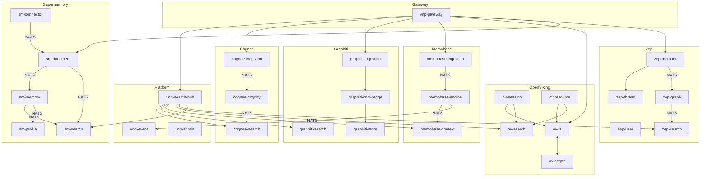

# VNP Memory — Service Compatibility Matrix

> **Version**: 1.0 | **Date**: 2026-05-09  
> **Source**: `/specs/00-architecture-overview.md` + individual engine specs  
> **Total**: 35 services across 6 engines + 3 platform services

---

## 1. Engine Overview

| Engine | Services | Primary Domain | Key Differentiator |
|--------|----------|---------------|-------------------|
| **Cognee** | 3 | Semantic KG + RAG | 15 retrieval strategies, multi-modal ingestion |
| **Graphiti** | 4 | Episodic Temporal KG | Bi-temporal model, entity/edge resolution, community detection |
| **Memobase** | 3 | User Profile Memory | YOLO merge, buffer zone FSM, 3 fixed LLM calls |
| **OpenViking** | 6 | Procedural Context DB | VikingFS, tiered context (L0/L1/L2), envelope encryption |
| **Zep** | 6 | Context Engineering | Sub-200ms latency, Graphiti-powered KG, MCP 13 tools |
| **Supermemory** | 9 | Adaptive KG Memory | Forgetting curve, multi-source connectors, container tags |

---

## 2. Functional Compatibility Matrix

### 2.1 Ingestion / Data Input

| Capability | Cognee | Graphiti | Memobase | OpenViking | Zep | Supermemory |
|-----------|--------|----------|----------|------------|-----|-------------|
| **Text ingestion** | `cognee-ingestion` | `graphiti-ingestion` | `memobase-ingestion` | `ov-resource` | `zep-memory` | `sm-document` |
| **File upload (PDF/DOCX)** | `cognee-ingestion` | — | — | `ov-resource` | — | `sm-document` |
| **URL scraping** | `cognee-ingestion` | — | — | — | — | — |
| **Chat/conversation** | — | `graphiti-ingestion` | `memobase-ingestion` | `ov-session` | `zep-memory` | — |
| **Episode/event** | — | `graphiti-ingestion` | — | — | `zep-memory` | — |
| **External connectors** | — | — | — | — | — | `sm-connector` |
| **Streaming upload** | `cognee-ingestion` | `graphiti-ingestion` | — | `ov-resource` | — | `sm-document` |
| **Dataset management** | `cognee-ingestion` | — | — | — | — | `sm-project` |

### 2.2 Knowledge Processing (LLM-intensive)

| Capability | Cognee | Graphiti | Memobase | OpenViking | Zep | Supermemory |
|-----------|--------|----------|----------|------------|-----|-------------|
| **Entity extraction** | `cognee-cognify` | `graphiti-knowledge` | — | — | `zep-graph` | `sm-memory` |
| **Relationship extraction** | `cognee-cognify` | `graphiti-knowledge` | — | — | `zep-graph` | `sm-memory` |
| **Entity resolution/dedup** | `cognee-cognify` | `graphiti-knowledge` | — | — | `zep-graph` | — |
| **Profile extraction** | — | — | `memobase-engine` | — | — | `sm-profile` |
| **Community detection** | `cognee-cognify` | `graphiti-knowledge` | — | — | — | — |
| **Memory extraction** | — | — | — | `ov-session` | `zep-graph` | `sm-memory` |
| **Temporal annotation** | — | `graphiti-knowledge` | — | — | `zep-graph` | — |
| **Forgetting/decay** | — | — | — | — | — | `sm-memory` |
| **Chunking** | `cognee-cognify` | — | — | `ov-resource` | — | `sm-document` |
| **Embedding generation** | `cognee-cognify` | `graphiti-knowledge` | — | `ov-resource` | `zep-graph` | `sm-document` |

### 2.3 Search / Retrieval

| Capability | Cognee | Graphiti | Memobase | OpenViking | Zep | Supermemory |
|-----------|--------|----------|----------|------------|-----|-------------|
| **Vector similarity** | `cognee-search` | `graphiti-search` | — | `ov-search` | `zep-search` | `sm-search` |
| **Full-text search** | `cognee-search` | `graphiti-search` | — | `ov-search` | `zep-search` | `sm-search` |
| **Graph traversal** | `cognee-search` | `graphiti-search` | — | — | `zep-search` | — |
| **Hybrid (vector+text)** | `cognee-search` | `graphiti-search` | — | `ov-search` | `zep-search` | `sm-search` |
| **RAG completion** | `cognee-search` | — | — | — | — | `sm-search` |
| **Reranking** | `cognee-search` | `graphiti-search` | — | `ov-search` | `zep-search` | `sm-search` |
| **Profile search** | — | — | `memobase-context` | — | — | `sm-profile` |
| **Hierarchical retrieval** | — | — | — | `ov-search` | — | — |
| **Temporal filtering** | — | `graphiti-search` | — | — | `zep-search` | — |
| **Hotness scoring** | — | — | — | `ov-search` | — | — |
| **Context assembly** | — | — | `memobase-context` | — | `zep-memory` | — |

### 2.4 Storage / Data Management

| Capability | Cognee | Graphiti | Memobase | OpenViking | Zep | Supermemory |
|-----------|--------|----------|----------|------------|-----|-------------|
| **Graph CRUD** | `cognee-cognify` | `graphiti-store` | — | — | `zep-graph` | `sm-memory` |
| **File CRUD** | `cognee-ingestion` | — | — | `ov-fs` | — | `sm-document` |
| **User CRUD** | — | — | — | `ov-admin` | `zep-user` | `sm-auth` |
| **Session/thread** | — | — | — | `ov-session` | `zep-thread` | — |
| **Profile CRUD** | — | — | `memobase-context` | — | `zep-user` | `sm-profile` |
| **Blob/buffer** | — | — | `memobase-ingestion` | — | — | — |
| **Object storage** | `cognee-ingestion` | — | — | `ov-fs` | — | `sm-document` |
| **Encryption** | — | — | — | `ov-crypto` | — | — |

### 2.5 Administration / Platform

| Capability | Cognee | Graphiti | Memobase | OpenViking | Zep | Supermemory |
|-----------|--------|----------|----------|------------|-----|-------------|
| **Tenant management** | via vnp-admin | via vnp-admin | via vnp-admin | `ov-admin` | `zep-admin` | `sm-auth` |
| **API key management** | via vnp-admin | via vnp-admin | via vnp-admin | `ov-admin` | `zep-admin` | `sm-auth` |
| **Health aggregation** | via vnp-admin | via vnp-admin | via vnp-admin | `ov-admin` | `zep-admin` | — |
| **RBAC** | — | — | — | `ov-admin` | `zep-admin` | `sm-auth` |
| **Analytics/billing** | — | — | — | — | — | `sm-analytics` |
| **Project/spaces** | — | — | — | — | `zep-admin` | `sm-project` |
| **MCP server** | via gateway | via gateway | via gateway | via gateway | via gateway | `sm-mcp` |

---

## 3. Infrastructure Compatibility Matrix

### 3.1 Database Backend Usage

| Backend | Cognee | Graphiti | Memobase | OpenViking | Zep | Supermemory |
|---------|--------|----------|----------|------------|-----|-------------|
| **PostgreSQL** | ✅ Metadata, datasets | ✅ Job state | ✅ Profiles, blobs, events | — | ✅ Users, sessions, messages | ✅ All tables |
| **pgvector** | ✅ Chunk embeddings | — | ✅ Event embeddings | — | ✅ Message vectors | ✅ Vector search |
| **Neo4j** | ✅ Knowledge graph | ✅ Episodic graph | — | — | ✅ Temporal KG | — |
| **Qdrant** | ✅ Entity embeddings | — | — | — | — | — |
| **Redis** | ✅ Search cache | ✅ Search cache | ✅ Profile cache | ✅ Search/session cache | ✅ Session/fact cache | ✅ Session/rate limit |
| **MinIO/S3** | ✅ Raw files | — | — | — | — | ✅ File uploads |
| **VikingFS** | — | — | — | ✅ Native filesystem | — | — |
| **Embedded VectorDB** | — | — | — | ✅ Hybrid search | — | — |

### 3.2 Shared `pkg/` Adapter Usage

| Adapter | Cognee | Graphiti | Memobase | OpenViking | Zep | Supermemory |
|---------|--------|----------|----------|------------|-----|-------------|
| `pkg/adapters/graphdb/` | ✅ | ✅ | — | — | ✅ | — |
| `pkg/adapters/vectordb/` | ✅ | — | ✅ | ✅ | ✅ | ✅ |
| `pkg/adapters/llm/` | ✅ | ✅ | ✅ | ✅ | ✅ | ✅ |
| `pkg/adapters/embedder/` | ✅ | ✅ | — | ✅ | ✅ | ✅ |
| `pkg/adapters/reranker/` | ✅ | ✅ | — | ✅ | ✅ | ✅ |
| `pkg/adapters/vlm/` | — | — | — | ✅ | — | — |
| `pkg/adapters/kms/` | — | — | — | ✅ | — | — |
| `pkg/adapters/storage/` | ✅ | — | — | — | — | ✅ |
| `pkg/viking/` | — | — | — | ✅ | — | — |
| `pkg/vikingfs/` | — | — | — | ✅ | — | — |
| `pkg/parse/` | — | — | — | ✅ | — | — |
| `pkg/tokenizer/` | — | — | ✅ | — | — | — |
| `pkg/prompt/` | ✅ | ✅ | ✅ | — | — | — |

### 3.3 NATS JetStream Streams

| Stream | Subjects | Publishers | Subscribers |
|--------|----------|-----------|-------------|
| `cognee` | 2 | cognee-ingestion, cognee-cognify | cognee-cognify, cognee-search |
| `graphiti` | 3 | graphiti-ingestion, graphiti-knowledge | graphiti-search |
| `memobase` | 4 | memobase-ingestion, memobase-engine | memobase-engine, memobase-context, vnp-event |
| `openviking` | 6 | ov-fs, ov-session, ov-resource, ov-crypto | ov-fs, ov-search |
| `zep` | 6 | zep-memory, zep-graph, zep-thread, zep-user | zep-graph, zep-search, zep-memory, zep-thread |
| `supermemory` | 6 | sm-document, sm-memory, sm-connector, sm-auth | sm-memory, sm-search, sm-profile, sm-document, sm-analytics |
| `admin` | 2 | vnp-admin | All services |

---

## 4. Cross-Engine Integration Points

### 4.1 Search Hub Fan-Out (vnp-search-hub)

The unified `memory.recall()` fans out to **6 search services** simultaneously:

```
vnp-search-hub.Recall(query, tenant_id)
  │
  ├── cognee-search.Search()           → Semantic KG results
  ├── graphiti-search.HybridSearch()   → Temporal episodic results
  ├── memobase-context.GetContext()     → User profile context
  ├── ov-search.HierarchicalSearch()   → Tiered procedural context
  ├── zep-search.GraphSearch()         → Temporal facts + context
  ├── sm-search.HybridSearch()         → Adaptive KG results
  │
  └── Merge + Rerank (RRF/MMR/Cross-Encoder) + Dedup
```

### 4.2 Memory Store Auto-Routing (vnp-gateway)

| Data Type | Target Engine | Target Service |
|-----------|--------------|----------------|
| `semantic` | Cognee | cognee-ingestion |
| `episodic` | Graphiti | graphiti-ingestion |
| `conversational` | Memobase | memobase-ingestion |
| `profile` | Memobase | memobase-ingestion |
| `procedural` | OpenViking | ov-resource |
| `context` | Zep | zep-memory |
| `document` | Supermemory | sm-document |
| `auto` | Gateway classifies → route | — |

---

## 5. Functional Overlap Analysis

### 5.1 High Overlap Areas (Consolidation Candidates)

| Capability | Overlapping Engines | Recommended Strategy |
|-----------|-------------------|---------------------|
| **Entity extraction** | Cognee, Graphiti, Zep, Supermemory | Shared LLM pipeline via `pkg/adapters/llm/`, engine-specific prompts |
| **Vector search** | All 6 engines | Shared `pkg/adapters/vectordb/` interface, engine-specific collections |
| **Reranking** | Cognee, Graphiti, OpenViking, Zep, Supermemory | Shared `pkg/adapters/reranker/` with pluggable strategies |
| **User/tenant CRUD** | OpenViking, Zep, Supermemory | `vnp-admin` as primary; engine-specific admins for extended metadata |
| **Profile management** | Memobase, Supermemory | Memobase as primary profile engine; Supermemory for adaptive traits |
| **Graph DB operations** | Cognee, Graphiti, Zep | Shared `pkg/adapters/graphdb/` with Neo4j; separated by namespace |

### 5.2 Unique Capabilities (No Overlap)

| Capability | Engine | Service | Uniqueness |
|-----------|--------|---------|------------|
| **15 retrieval strategies** | Cognee | cognee-search | Broadest retrieval strategy set |
| **Bi-temporal model** | Graphiti | graphiti-store | `valid_at`/`invalid_at` on edges |
| **Buffer Zone FSM** | Memobase | memobase-ingestion | Token-aware batching before LLM |
| **YOLO merge (3 fixed LLM calls)** | Memobase | memobase-engine | Cost-predictable profile extraction |
| **VikingFS + tiered context** | OpenViking | ov-fs, ov-search | L0/L1/L2 progressive context loading |
| **Envelope encryption** | OpenViking | ov-crypto | Per-file AES-256-GCM |
| **Sub-200ms context assembly** | Zep | zep-memory | Synchronous path optimized for agents |
| **Fact ontology** | Zep | zep-graph | Node priority hierarchy |
| **Forgetting curve** | Supermemory | sm-memory | Ebbinghaus-inspired memory decay |
| **External connectors** | Supermemory | sm-connector | GDrive, Notion, OneDrive sync |
| **Container tags/spaces** | Supermemory | sm-project | Document organization via spaces |

### 5.3 Complementary Pairings

| Pairing | Integration Pattern | Value |
|---------|-------------------|-------|
| **Cognee + Graphiti** | Cognee builds semantic KG; Graphiti adds temporal dimension | Full knowledge lifecycle: static + evolving facts |
| **Memobase + Zep** | Memobase profiles feed into Zep context assembly | Rich user context for agent conversations |
| **Memobase + Supermemory** | Memobase for conversation profiles; Supermemory for document profiles | Complete user understanding across channels |
| **OpenViking + Cognee** | OpenViking stores procedural context; Cognee indexes for semantic search | Code + docs unified search |
| **Zep + Graphiti** | Zep uses Graphiti as its KG backend | Temporal reasoning with agent-optimized access |
| **Supermemory + Cognee** | Supermemory connectors feed Cognee for KG construction | External knowledge → structured KG |

---

## 6. Multi-Tenancy Isolation Map

| Engine | Isolation Key | DB Mechanism | gRPC Metadata |
|--------|--------------|-------------|---------------|
| **Cognee** | `tenant_id` | PostgreSQL RLS, Neo4j namespace | `x-tenant-id` |
| **Graphiti** | `group_id` | Neo4j property filter | `x-group-id` |
| **Memobase** | `project_id` | Composite PK, DB partition | `x-project-id` |
| **OpenViking** | `account_id` | Namespace isolation, RBAC | `x-account-id` |
| **Zep** | `project_uuid` | Advisory locks, schema-based | `x-project-uuid` |
| **Supermemory** | `org_id` | WHERE org_id filter | `x-org-id` |
| **Platform** | `tenant_id` | Propagated from gateway | `x-tenant-id` |

> **Gateway maps**: All isolation keys are resolved from the JWT/API key at the Gateway level and mapped to the engine-specific key via gRPC metadata propagation.

---

## 7. Port Allocation Summary

| Engine | gRPC Range | Health Range |
|--------|-----------|-------------|
| Gateway | 8080-8082 | 8083 |
| Cognee | 9011-9013 | 9091-9093 |
| Graphiti | 9021-9024 | 9094-9097 |
| Memobase | 9031-9033 | 9098-9100 |
| Platform | 9041-9042, 9050 | 9101-9103 |
| OpenViking | 9051-9056 | 9104-9109 |
| Zep | 9061-9066 | 9110-9115 |
| Supermemory | 9071-9079 | 9116-9124 |

---

## 8. Dependency Graph (Service-Level)


