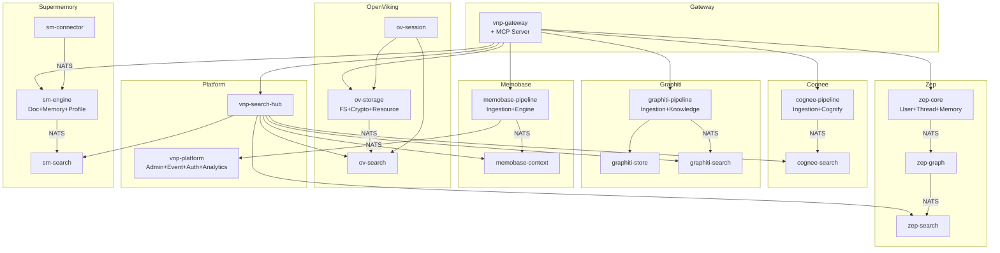

# VNP Memory — Service Consolidation Proposal

> **Version**: 1.0 | **Date**: 2026-05-10  
> **Source**: `service-compatibility-matrix.md` + `specs/architecture/`  
> **Current**: 35 services + 1 Gateway | **Target**: 18 services + 1 Gateway  
> **Reduction**: 47% fewer services, 100% feature preservation

---

## 1. Executive Summary

Phân tích compatibility matrix cho thấy 35 services hiện tại có **overlap đáng kể** ở 6 functional areas: entity extraction, vector search, reranking, admin/auth, profile management, và ingestion pipeline. Đề xuất consolidate thành **18 services** theo nguyên tắc:

1. **Merge by functional overlap** — các services cùng capability gộp lại
2. **Preserve unique differentiators** — mỗi engine giữ domain logic riêng biệt
3. **Unify cross-cutting concerns** — Admin, Auth, MCP, Analytics gộp vào Platform
4. **Maintain Clean Architecture** — sub-packages thay vì separate binaries

### Impact Summary

| Metric | Before | After | Change |
|--------|--------|-------|--------|
| Total services | 35 | 18 | -48.6% |
| gRPC ports needed | 35 | 18 | -48.6% |
| Docker containers (dev) | 35 | 18 | -48.6% |
| NATS streams | 7 | 5 | -28.6% |
| Infrastructure DBs | 6 | 4 | -33.3% |
| Unique capabilities preserved | 11 | 11 | 0% |

---

## 2. Consolidation Analysis

### 2.1 Overlap Heatmap (từ Compatibility Matrix §5.1)

| Overlap Area | Services Involved | Overlap Level |
|-------------|-------------------|---------------|
| Entity/Relationship Extraction | cognee-cognify, graphiti-knowledge, zep-graph, sm-memory | 🔴 HIGH |
| Vector + Hybrid Search | cognee-search, graphiti-search, ov-search, zep-search, sm-search | 🔴 HIGH |
| Reranking (RRF/MMR/CrossEncoder) | cognee-search, graphiti-search, ov-search, zep-search, sm-search | 🔴 HIGH |
| Admin / Auth / RBAC | ov-admin, zep-admin, zep-user, sm-auth, sm-project, vnp-admin | 🔴 HIGH |
| Ingestion Pipeline | cognee-ingestion, graphiti-ingestion, memobase-ingestion, sm-document | 🟡 MEDIUM |
| Profile Management | memobase-context, sm-profile, zep-user | 🟡 MEDIUM |
| Document/File CRUD | cognee-ingestion, ov-fs, sm-document | 🟡 MEDIUM |
| Graph DB Operations | cognee-cognify, graphiti-store, zep-graph | 🟡 MEDIUM |
| MCP Server | vnp-gateway (MCP), sm-mcp | 🟢 LOW |
| Session/Thread | ov-session, zep-thread | 🟢 LOW |

### 2.2 Unique Capabilities (MUST Preserve)

| Capability | Engine | Cannot Merge Because |
|-----------|--------|---------------------|
| 15 retrieval strategies | Cognee | Broadest strategy set, domain-specific |
| Bi-temporal model (valid_at/invalid_at) | Graphiti | Unique temporal reasoning |
| Buffer Zone FSM | Memobase | Token-aware batching, unique FSM |
| YOLO merge (3 fixed LLM calls) | Memobase | Cost-predictable extraction |
| VikingFS + tiered context (L0/L1/L2) | OpenViking | Go-native filesystem, unique |
| Envelope encryption (AES-256-GCM) | OpenViking | Per-file encryption, KMS |
| Sub-200ms context assembly | Zep | Synchronous path optimization |
| Fact ontology + node priority | Zep | Unique priority hierarchy |
| Forgetting curve (Ebbinghaus) | Supermemory | Memory decay, unique |
| External connectors (GDrive/Notion) | Supermemory | OAuth2 sync, unique |
| Saga pipeline orchestration | Graphiti | Compensating actions, unique |

---

## 3. Proposed Consolidated Architecture

### 3.1 Service Map: 35 → 18

| # | Consolidated Service | Merges From | gRPC Port | Domain |
|---|---------------------|-------------|-----------|--------|
| 0 | `vnp-gateway` | (unchanged + absorb sm-mcp) | 8081 | Routing, Auth, MCP |
| | **Cognee (Semantic KG)** | | | |
| 1 | `cognee-pipeline` | cognee-ingestion + cognee-cognify | 9011 | Ingestion + KG build |
| 2 | `cognee-search` | (unchanged) | 9013 | 15 retrieval strategies |
| | **Graphiti (Episodic KG)** | | | |
| 3 | `graphiti-pipeline` | graphiti-ingestion + graphiti-knowledge | 9021 | Episode pipeline + LLM |
| 4 | `graphiti-store` | (unchanged) | 9024 | Graph DB abstraction |
| 5 | `graphiti-search` | (unchanged) | 9022 | Hybrid search |
| | **Memobase (Profile Memory)** | | | |
| 6 | `memobase-pipeline` | memobase-ingestion + memobase-engine | 9031 | Buffer + Profile extraction |
| 7 | `memobase-context` | (unchanged) | 9033 | Context assembly |
| | **OpenViking (Procedural Context)** | | | |
| 8 | `ov-storage` | ov-fs + ov-crypto + ov-resource | 9051 | FS + Encryption + Ingestion |
| 9 | `ov-search` | (unchanged) | 9052 | Hierarchical retrieval |
| 10 | `ov-session` | (unchanged) | 9053 | Session lifecycle, WM v2 |
| | **Zep (Context Engineering)** | | | |
| 11 | `zep-core` | zep-user + zep-thread + zep-memory | 9061 | User + Thread + Memory |
| 12 | `zep-graph` | (unchanged) | 9064 | KG extraction, temporal |
| 13 | `zep-search` | (unchanged) | 9065 | Semantic search |
| | **Supermemory (Adaptive KG)** | | | |
| 14 | `sm-engine` | sm-document + sm-memory + sm-profile | 9071 | Doc + Memory + Profile |
| 15 | `sm-search` | (unchanged) | 9073 | Hybrid search + RAG |
| 16 | `sm-connector` | (unchanged) | 9075 | External sync |
| | **Platform (Cross-Engine)** | | | |
| 17 | `vnp-platform` | vnp-admin + vnp-event + ov-admin + zep-admin + sm-auth + sm-analytics + sm-project | 9050 | Unified admin + events |
| 18 | `vnp-search-hub` | (unchanged) | 9042 | Cross-engine recall |

### 3.2 Consolidation Rationale

#### 🔵 Pattern A: Pipeline Merge (Ingestion + Processing → Single Service)

**Rationale**: Ingestion và processing luôn sequential (NATS event giữa chúng). Merge giảm network hop, giảm latency, giữ ordering guarantee.

| Consolidated | Before | Merge Logic |
|-------------|--------|-------------|
| `cognee-pipeline` | cognee-ingestion + cognee-cognify | Ingestion triggers cognify immediately; same DB dependencies (PostgreSQL + Neo4j + Qdrant) |
| `graphiti-pipeline` | graphiti-ingestion + graphiti-knowledge | Saga orchestrator calls knowledge RPCs locally instead of gRPC cross-service |
| `memobase-pipeline` | memobase-ingestion + memobase-engine | Buffer flush → engine processing is single workflow; both need PostgreSQL + LLM |

**Internal Structure** (example `cognee-pipeline`):
```
services/cognee-pipeline/internal/
├── domain/
│   ├── ingestion/      # Dataset, DataItem entities
│   └── cognify/        # Pipeline, Job entities
├── usecase/
│   ├── ingest/         # IngestFile, IngestText, IngestUrl
│   └── cognify/        # TriggerCognify, pipeline stages
├── adapter/
│   ├── grpc/           # CogneeIngestionService + CogneeCognifyService (2 gRPC services, 1 binary)
│   └── repository/
└── infra/
```

#### 🟢 Pattern B: Functional Merge (Tightly Coupled CRUD → Single Service)

| Consolidated | Before | Merge Logic |
|-------------|--------|-------------|
| `zep-core` | zep-user + zep-thread + zep-memory | PutMemory đã gọi zep-thread.UpsertSession synchronously; user/thread/memory cùng PostgreSQL schema |
| `ov-storage` | ov-fs + ov-crypto + ov-resource | ov-fs luôn gọi ov-crypto cho encrypt/decrypt; ov-resource gọi ov-fs để write. Tight coupling |
| `sm-engine` | sm-document + sm-memory + sm-profile | Document creates memory, memory updates profile — linear chain |

**Internal Structure** (example `zep-core`):
```
services/zep-core/internal/
├── domain/
│   ├── user/           # User entity, metadata
│   ├── thread/         # Thread/session entity
│   └── memory/         # Message, ContextAssembly
├── usecase/
│   ├── user/           # CreateUser, UpdateUser, DeleteUser
│   ├── thread/         # CreateThread, EndThread
│   └── memory/         # PutMemory, GetMemory (sub-200ms path)
├── adapter/grpc/
│   ├── user_handler.go     # ZepUserService
│   ├── thread_handler.go   # ZepThreadService  
│   └── memory_handler.go   # ZepMemoryService
```

> **Key**: Mỗi consolidated service vẫn expose **multiple gRPC service definitions** (backward compatible proto). Chỉ deploy 1 binary thay vì 2-3.

#### 🟣 Pattern C: Platform Unification (Admin/Auth/Event → Single Platform Service)

| Before (7 services) | After (1 service) | Sub-domain |
|---------------------|-------------------|------------|
| vnp-admin | `vnp-platform` | `.admin` — Tenant, User, APIKey, Health |
| vnp-event | `vnp-platform` | `.event` — Timeline, semantic search |
| ov-admin | `vnp-platform` | `.ov` — Account/Agent CRUD (proxied) |
| zep-admin | `vnp-platform` | `.zep` — Project mgmt (proxied) |
| sm-auth | `vnp-platform` | `.auth` — JWT, RBAC, Org (merged into admin) |
| sm-analytics | `vnp-platform` | `.analytics` — Usage tracking |
| sm-project | `vnp-platform` | `.project` — Spaces, tags |

**Rationale**: 
- ov-admin, zep-admin, sm-auth đều làm cùng việc: User/API Key/RBAC CRUD
- vnp-admin đã là unified admin — engine-specific admin services chỉ thêm metadata
- sm-analytics + sm-project là lightweight, không cần standalone process

#### 🟠 Pattern D: Gateway Absorption (MCP Server)

| Before | After | Rationale |
|--------|-------|-----------|
| sm-mcp (standalone) | Absorbed into vnp-gateway | Gateway đã có MCP endpoint (`8082`). sm-mcp chỉ là thin proxy → sm-memory/sm-search/sm-profile. Gateway MCP tools cover all engines, not just Supermemory |

---

## 4. Eliminated Services & Migration Path

| Eliminated Service | Absorbed Into | Migration Strategy |
|-------------------|---------------|-------------------|
| `cognee-ingestion` | `cognee-pipeline` | Move ingestion domain/usecase as sub-package |
| `cognee-cognify` | `cognee-pipeline` | Move cognify domain/usecase as sub-package |
| `graphiti-ingestion` | `graphiti-pipeline` | Saga orchestrator becomes local function calls |
| `graphiti-knowledge` | `graphiti-pipeline` | LLM processing co-located with orchestrator |
| `memobase-ingestion` | `memobase-pipeline` | Buffer FSM + engine in same process |
| `memobase-engine` | `memobase-pipeline` | YOLO merge pipeline is local |
| `ov-fs` | `ov-storage` | Core filesystem package |
| `ov-crypto` | `ov-storage` | Envelope encryption co-located with FS |
| `ov-resource` | `ov-storage` | Parse + ingest → FS write is linear |
| `ov-admin` | `vnp-platform` | Admin sub-domain |
| `zep-user` | `zep-core` | User CRUD co-located with thread/memory |
| `zep-thread` | `zep-core` | Thread lifecycle co-located |
| `zep-admin` | `vnp-platform` | Admin sub-domain |
| `sm-document` | `sm-engine` | Document → memory → profile chain |
| `sm-memory` | `sm-engine` | Core engine logic |
| `sm-profile` | `sm-engine` | Profile updates from memory events |
| `sm-mcp` | `vnp-gateway` | MCP tools registered in gateway |
| `sm-auth` | `vnp-platform` | Auth unified |
| `sm-analytics` | `vnp-platform` | Analytics sub-domain |
| `sm-project` | `vnp-platform` | Project/spaces sub-domain |

---

## 5. Revised NATS JetStream Streams

| Stream | Before (Subjects) | After (Subjects) | Change |
|--------|-------------------|-------------------|--------|
| `cognee` | 2 (inter-service) | 1 (`cognee.pipeline.completed`) | Internal events become function calls |
| `graphiti` | 3 (inter-service) | 1 (`graphiti.episode.completed`) | Saga steps become local |
| `memobase` | 4 | 2 (`memobase.pipeline.completed`, `memobase.profile.changed`) | Buffer→engine is local |
| `openviking` | 6 | 4 (fs↔search events preserved) | crypto events are local |
| `zep` | 6 | 4 (memory→graph→search preserved) | user/thread events are local |
| `supermemory` | 6 | 3 (`sm.engine.*`, `sm.connector.synced`) | doc→memory→profile is local |
| `admin` | 2 | 2 (unchanged) | — |
| **Total** | **29 subjects** | **17 subjects** | **-41%** |

---

## 6. Revised Infrastructure Dependencies

### 6.1 Database Consolidation

| Backend | Before | After | Strategy |
|---------|--------|-------|----------|
| PostgreSQL + pgvector | Used by 5 engines | Used by all (primary) | **Keep** — primary relational + vector |
| Neo4j | Cognee + Graphiti + Zep | Cognee + Graphiti + Zep | **Keep** — graph-native queries |
| Qdrant | Cognee only | **Remove** | Migrate to pgvector (consolidate vector backends) |
| Redis | All engines | All engines | **Keep** — cache + rate limit |
| MinIO/S3 | Cognee + Supermemory | Cognee + Supermemory | **Keep** — object storage |
| VikingFS | OpenViking only | OpenViking only | **Keep** — unique, no overlap |

> **Key Decision**: Loại bỏ Qdrant, chuyển Cognee entity embeddings sang pgvector. Giảm 1 infrastructure dependency. pgvector đã được dùng bởi Memobase, Zep, Supermemory — đủ performance cho use case.

### 6.2 Revised Port Allocation

| Engine | gRPC Ports | Health Ports |
|--------|-----------|-------------|
| Gateway | 8080-8082 | 8083 |
| Cognee | 9011, 9013 | 9091, 9093 |
| Graphiti | 9021-9022, 9024 | 9094-9096 |
| Memobase | 9031, 9033 | 9098, 9100 |
| OpenViking | 9051-9053 | 9104-9106 |
| Zep | 9061, 9064-9065 | 9110, 9113-9114 |
| Supermemory | 9071, 9073, 9075 | 9116, 9118, 9120 |
| Platform | 9042, 9050 | 9102-9103 |

---

## 7. Multi-Tenancy Simplification

### Before: 6 isolation keys

| Engine | Key | Mapping |
|--------|-----|---------|
| Cognee | `tenant_id` | Direct |
| Graphiti | `group_id` | Alias |
| Memobase | `project_id` | Alias |
| OpenViking | `account_id` | Alias |
| Zep | `project_uuid` | Alias |
| Supermemory | `org_id` | Alias |

### After: Unified `tenant_id` with engine-specific aliases

```go
// pkg/tenant/resolver.go
type TenantContext struct {
    TenantID   string // canonical, from JWT/APIKey
    EngineAliases map[string]string // engine → engine-specific key
}

// Gateway resolves once, propagates via gRPC metadata
// Each engine reads its alias from TenantContext
func (tc *TenantContext) ForEngine(engine string) string {
    if alias, ok := tc.EngineAliases[engine]; ok {
        return alias
    }
    return tc.TenantID
}
```

---

## 8. Revised Dependency Graph



---

## 9. Implementation Phases

### Phase 1: Platform Unification (Week 1-2)

**Priority**: 🔴 P0 — Highest ROI, eliminates 7 services

| Task | Services Affected | Effort |
|------|------------------|--------|
| Merge vnp-admin + vnp-event into `vnp-platform` | 2 → 1 | 3d |
| Absorb ov-admin, zep-admin → vnp-platform sub-domains | 2 → 0 | 2d |
| Absorb sm-auth, sm-analytics, sm-project → vnp-platform | 3 → 0 | 3d |
| Absorb sm-mcp → vnp-gateway MCP tools | 1 → 0 | 1d |
| Update gateway routing + proto imports | — | 1d |

**Deliverable**: 35 → 27 services

### Phase 2: Pipeline Merges (Week 3-4)

**Priority**: 🟡 P1 — Reduces latency, simplifies NATS

| Task | Services Affected | Effort |
|------|------------------|--------|
| Merge cognee-ingestion + cognee-cognify → `cognee-pipeline` | 2 → 1 | 3d |
| Merge graphiti-ingestion + graphiti-knowledge → `graphiti-pipeline` | 2 → 1 | 4d |
| Merge memobase-ingestion + memobase-engine → `memobase-pipeline` | 2 → 1 | 3d |

**Deliverable**: 27 → 24 services

### Phase 3: Functional Merges (Week 5-6)

**Priority**: 🟡 P1 — Eliminates tight gRPC coupling

| Task | Services Affected | Effort |
|------|------------------|--------|
| Merge zep-user + zep-thread + zep-memory → `zep-core` | 3 → 1 | 4d |
| Merge ov-fs + ov-crypto + ov-resource → `ov-storage` | 3 → 1 | 4d |
| Merge sm-document + sm-memory + sm-profile → `sm-engine` | 3 → 1 | 3d |

**Deliverable**: 24 → 18 services ✅

### Phase 4: Infrastructure Consolidation (Week 7-8)

**Priority**: 🟢 P2 — Reduces ops burden

| Task | Effort |
|------|--------|
| Migrate Cognee embeddings from Qdrant → pgvector | 3d |
| Unify tenant isolation keys via `pkg/tenant/resolver.go` | 2d |
| Update Docker Compose + Kubernetes manifests | 2d |
| Update NATS stream configurations | 1d |
| End-to-end integration testing | 3d |

---

## 10. Risk Assessment

| Risk | Impact | Mitigation |
|------|--------|-----------|
| Performance regression (merged services) | 🟡 Medium | Bulkhead pattern separates CPU-intensive LLM calls from fast-path CRUD |
| Proto backward compatibility | 🟢 Low | Merged services expose same gRPC service definitions (multiple services per binary) |
| Qdrant → pgvector migration | 🟡 Medium | Benchmark pgvector HNSW vs Qdrant before migration; fallback to keep Qdrant |
| Deployment complexity during transition | 🟡 Medium | Feature flags: `CONSOLIDATED_MODE=true` to gradually switch routing |
| Memory footprint of merged services | 🟢 Low | Go is efficient; merged binaries share connection pools → net reduction |

---

## 11. Benefits Summary

### Operational

- **48.6% fewer services** to deploy, monitor, and maintain
- **41% fewer NATS subjects** — simpler event topology
- **33% fewer infrastructure dependencies** (drop Qdrant)
- **17 fewer gRPC ports** to manage

### Performance

- **Eliminated network hops** within pipelines (ingestion → processing)
- **Local function calls** replace gRPC for tightly coupled flows
- **Shared connection pools** within merged services
- **Reduced NATS publish/subscribe overhead** for internal events

### Developer Experience

- **Fewer repos/dirs** to navigate
- **Clearer domain boundaries** — each service maps 1:1 to a logical domain
- **Simpler local dev** — 18 containers vs 35 containers
- **Faster CI/CD** — fewer build targets

### Architecture Quality

- **Maintained Clean Architecture** — sub-packages preserve layer isolation
- **100% feature preservation** — no capability dropped
- **Proto backward compatibility** — clients don't need to change
- **Cleaner dependency graph** — fewer cross-service dependencies

---

## Appendix A: Revised Service Directory Structure

```
vnp-memory/services/
├── vnp-gateway/           # Gateway + MCP (absorbs sm-mcp)
├── cognee-pipeline/       # Ingestion + Cognify
├── cognee-search/         # 15 retrieval strategies
├── graphiti-pipeline/     # Episode pipeline + LLM knowledge
├── graphiti-store/        # Graph DB abstraction
├── graphiti-search/       # Hybrid search
├── memobase-pipeline/     # Buffer Zone + YOLO engine
├── memobase-context/      # Context assembly < 100ms
├── ov-storage/            # VikingFS + Crypto + Resource ingestion
├── ov-search/             # Hierarchical retrieval + hotness
├── ov-session/            # 2-phase commit, WM v2
├── zep-core/              # User + Thread + Memory (sub-200ms)
├── zep-graph/             # KG extraction, temporal reasoning
├── zep-search/            # Semantic search + 5 reranking
├── sm-engine/             # Document + Memory + Profile engine
├── sm-search/             # Hybrid search + RAG
├── sm-connector/          # External sync (GDrive/Notion)
├── vnp-platform/          # Unified Admin + Event + Auth + Analytics
└── vnp-search-hub/        # Cross-engine recall orchestrator
```

## Appendix B: Proto Compatibility Strategy

```protobuf
// Merged services register MULTIPLE gRPC services on same server
// Example: cognee-pipeline registers both:
//   - CogneeIngestionService (from api/proto/cognee/ingestion/v1/)
//   - CogneeCognifyService   (from api/proto/cognee/cognify/v1/)
// 
// Gateway routing unchanged:
//   /cognee.ingestion.v1.CogneeIngestionService/* → cognee-pipeline:9011
//   /cognee.cognify.v1.CogneeCognifyService/*     → cognee-pipeline:9011

// No proto changes needed. Only gateway route targets change.
```
