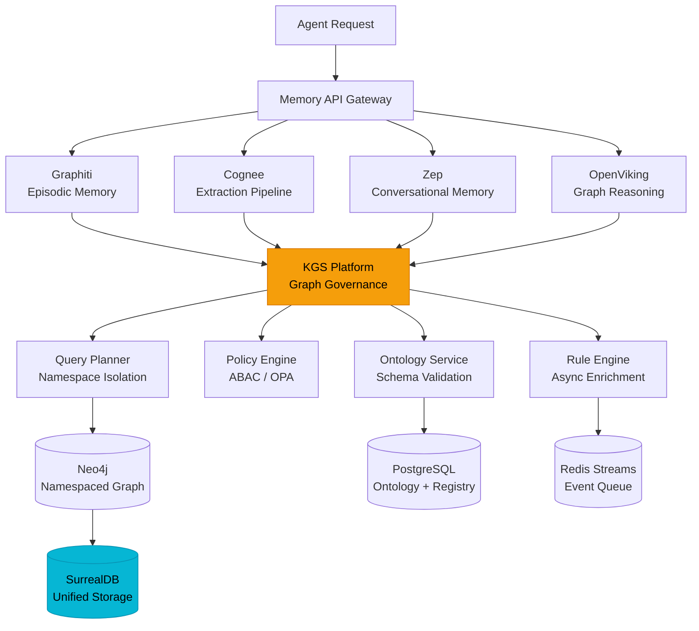

# Unified Cognitive Infrastructure Layer for Enterprise AI

## Tổng quan

Các mảnh ghép bạn nêu thực ra đang đại diện cho các lớp rất khác nhau trong bài toán "AI memory":

| Component      | Vai trò                                                                 |
| -------------- | ----------------------------------------------------------------------- |
| **Graphiti**   | Temporal knowledge graph + episodic memory                              |
| **Cognee**     | Memory orchestration / extraction pipeline                              |
| **Zep**        | Long-term memory + conversational context infra                         |
| **OpenViking** | Agentic knowledge workflows / graph reasoning layer                     |
| **SurrealDB**  | Unified multi-model storage (graph + document + relational + vector)    |
| **KGS Platform** | Multi-tenant Knowledge Graph Service — namespace isolation, ontology, rule engine, ABAC |

Nếu ghép đúng cách, bạn không tạo ra "một framework nữa", mà là:

> **"Unified Cognitive Infrastructure Layer for Enterprise AI"**

và đó là thị trường còn chưa có winner rõ ràng.

**KGS Platform** đóng vai trò **Structured Knowledge Backbone** — cung cấp hạ tầng graph-as-a-service cho mọi tenant, với ontology tùy biến, namespace isolation, rule engine, và access control tập trung. Đây là lớp kết nối giữa các memory engine (Graphiti, Cognee, Zep) với lớp storage (SurrealDB/Neo4j), đảm bảo mọi tri thức đều có schema, governance, và audit trail.

---

## Điểm mạnh của ý tưởng

### 1. Đúng hướng xu thế hậu-RAG

Enterprise AI hiện đang chuyển từ:

```
RAG → Agentic RAG → Persistent Memory Systems
```

Vấn đề lớn nhất hiện nay:

- Context window vẫn đắt
- Agent không nhớ dài hạn
- Memory fragmented
- Không có temporal reasoning
- Không có organizational memory
- Khó governance / audit
- **Không có schema enforcement cho knowledge graph** ← KGS giải quyết

Các hệ thống hiện tại thường chỉ làm tốt **một mảnh**:

| System            | Mạnh về                |
| ----------------- | ---------------------- |
| Zep               | Conversational memory  |
| Mem0              | Lightweight memory     |
| Graphiti          | Temporal graph memory  |
| Cognee            | Extraction pipeline    |
| Neo4j stack       | Graph reasoning        |
| Weaviate/Pinecone | Retrieval              |
| LangGraph         | Orchestration          |
| **KGS Platform**  | **Multi-tenant graph governance & ontology** |

> **Không ai unify tốt toàn bộ stack.** KGS Platform chính là lớp governance + schema enforcement mà hệ thống đang thiếu.

### 2. Combination cực hợp logic về kiến trúc

Kiến trúc tổng thể khi tích hợp KGS Platform:

```
                 Applications / Agents
                         |
                  Memory API Gateway
                         |
          ┌──────────────┼──────────────┐
          |              |              |
    Episodic Layer  Semantic Layer  Procedural Layer
     (events/time)   (facts/docs)    (workflows)
          |              |              |
        Graphiti      Zep/Cognee     OpenViking
          |              |              |
          └──────────────┼──────────────┘
                         |
              ┌──────────┴──────────┐
              |                     |
        KGS Platform          SurrealDB
    (Graph Governance)     (Unified Storage)
    ┌─────────────────┐
    │ App Registry    │
    │ Ontology Svc    │
    │ Graph API       │
    │ Rule Engine     │
    │ Policy (ABAC)   │
    │ Query Planner   │
    └────────┬────────┘
             |
     Neo4j (Namespaced)
     PostgreSQL (Metadata)
     Redis (Cache/Streams)
```

**Vai trò của KGS Platform trong kiến trúc:**

- **Graph Governance Layer** — mọi memory write từ Graphiti/Cognee/OpenViking đều đi qua KGS để enforce ontology, namespace isolation, và access policies
- **Multi-tenant Backbone** — mỗi app/agent đăng ký tenant riêng, dữ liệu hoàn toàn isolated
- **Rule Engine** — tự động enrich và kiểm tra consistency trên graph (async via Redis Streams)

SurrealDB là lựa chọn rất thông minh cho **unified storage** vì:

- Graph native
- Document native
- Vector native
- Realtime
- Multi-model

=> Giảm complexity rất mạnh.

Nếu dùng Neo4j + Postgres + Qdrant + Redis:

- Infra nightmare
- Sync nightmare
- Tenancy nightmare

> **Tuy nhiên**, KGS Platform hiện sử dụng Neo4j + PostgreSQL + Redis. Lộ trình dài hạn có thể migrate sang SurrealDB để đơn giản hóa infra, hoặc giữ song song nếu cần từng engine chuyên biệt.

### 3. Enterprise đang rất cần "Memory Governance"

**Đây mới là vàng.** Không phải retrieval. Mà là:

- AI nhớ cái gì?
- Expire khi nào?
- Provenance từ đâu?
- Ai tạo?
- Tenant isolation?
- PII handling?
- Audit trail?
- Memory poisoning detection?
- Confidence score?
- Temporal validity?

Nếu bạn giải được **Memory Governance + Context Orchestration** thì đây là category enterprise-grade thực sự.

**KGS Platform đã implement sẵn nhiều capability governance:**

| Governance Need          | KGS Feature                                           |
| ------------------------ | ----------------------------------------------------- |
| Tenant isolation         | Namespace labels `{APP_ID}__{Type}` trên Neo4j        |
| Schema enforcement       | Ontology Service + JSON Schema validation             |
| Access control           | OPA-based ABAC policies per app                       |
| Audit trail              | Rule execution history + event outbox                 |
| Provenance tracking      | Namespace metadata trong mỗi node/edge response       |
| Confidence score         | Edge properties (`confidence`, `impact_weight`)       |
| Memory lifecycle         | App lifecycle (ACTIVE → SUSPENDED → DELETED)          |

### 4. Có thể tạo "Context OS"

Đây là hướng rất mạnh. Thay vì:

> ❌ "Database cho embeddings"

Thì:

> ✅ "Operating system cho AI cognition"

Bao gồm:

- Memory lifecycle
- Context compression
- Temporal reasoning
- Semantic graph
- Conflict resolution
- Belief revision
- Agent shared memory
- Hierarchical memory
- Multi-agent synchronization
- **Schema-driven knowledge validation** ← KGS Ontology Service
- **Policy-driven access control** ← KGS Policy Engine

**Đây là moat lớn hơn nhiều so với vector DB.**

---

## KGS Platform — Chi tiết tích hợp

### Tổng quan KGS

KGS (Knowledge Graph Service) là một nền tảng **graph-as-a-service** cho phép nhiều ứng dụng độc lập (tenants) đăng ký và sử dụng hạ tầng graph chung, trong khi vẫn duy trì sự cô lập hoàn toàn về dữ liệu, ontology, rules và access control.

### Core Components

| Component        | Trách nhiệm                                | Technology            |
| ---------------- | ------------------------------------------- | --------------------- |
| Service Layer    | Interface gRPC/HTTP, Auth, Middleware       | Go + Kratos           |
| App Registry     | Quản lý app lifecycle, API key, quota       | Go + GORM (PostgreSQL)|
| Ontology Service | CRUD ontology, validation schema per app    | Go + GORM (PostgreSQL)|
| Graph API        | CRUD nodes/edges, namespaced Cypher         | Go + Neo4j Driver     |
| Rule Engine      | Quản lý và chạy Cypher rules (async)        | Go + Redis Streams    |
| Policy Engine    | Evaluate access policies (ABAC)             | Go + OPA              |
| Query Planner    | Translate generic query → namespaced Cypher | Go Internal           |

### Multi-tenancy: Shared Graph + Namespace Isolation

Mỗi tenant không có database riêng. Tất cả nodes và edges trong Neo4j đều mang nhãn namespace:

```
Format:  {APP_ID}__{EntityType}

Ví dụ BA Agent System (app_id = 'ba_agent'):
  (:ba_agent__Requirement { req_id: 'REQ-001', ... })
  (:ba_agent__UseCase     { uc_id:  'UC-001',  ... })

Ví dụ một app khác (app_id = 'crm_app'):
  (:crm_app__Contact  { contact_id: 'C-001', ... })
  (:crm_app__Deal     { deal_id:    'D-001', ... })
```

> Platform tự động inject namespace prefix vào mọi Cypher query. App developer không bao giờ thấy hoặc cần tự gõ prefix này.

### Isolation Guarantees

| Threat                               | Mechanism bảo vệ                                     | Layer          |
| ------------------------------------ | ---------------------------------------------------- | -------------- |
| App A đọc data App B                 | Namespace label filter trong mọi query               | Query Planner  |
| App A tạo node label của App B       | Label inject bởi platform, client không set           | Graph Service  |
| App A gửi raw Cypher chứa label khác | Raw Cypher không cho phép, chỉ whitelist operations   | KGS Service    |
| API Key App A dùng app_id App B      | API Key hash → app_id lookup trong Registry           | Auth Middleware|
| App A traverse edge sang App B       | labelFilter trong traversal giới hạn prefix           | Query Planner  |

### Graph API — Các operations chính

| Method | Endpoint                                | Mô tả                            | Auth Scope    |
| ------ | --------------------------------------- | --------------------------------- | ------------- |
| POST   | `/v1/graph/nodes`                       | Tạo node mới theo ontology       | `graph:write` |
| GET    | `/v1/graph/nodes/{node_id}`             | Lấy node theo ID                 | `graph:read`  |
| POST   | `/v1/graph/edges`                       | Tạo edge giữa 2 nodes            | `graph:write` |
| GET    | `/v1/graph/nodes/{node_id}/context`     | Lấy context subgraph xung quanh  | `graph:read`  |
| GET    | `/v1/graph/nodes/{node_id}/impact`      | Phân tích tác động (downstream)   | `graph:read`  |
| GET    | `/v1/graph/nodes/{node_id}/coverage`    | Phân tích bao phủ (upstream)      | `graph:read`  |

### Ontology Validation Flow

Mỗi khi App Service gọi Graph API để tạo/cập nhật node hoặc edge:

```
Incoming Request
     │
     ▼
1. Auth: API Key → App Context (app_id, scopes)
     │
     ▼
2. Namespace Injection: label = '{app_id}__{type_name}'
     │
     ▼
3. Ontology Lookup: load entity/relation type từ cache (Redis, TTL=5min)
     │
     ▼
4. JSON Schema Validation: validate payload theo properties schema
     │                          └─ 422 nếu fail
     ▼
5. Relation Whitelist Check: from_type + to_type trong allowed pairs?
     │                          └─ 403 nếu fail
     ▼
6. Access Policy Check (OPA): role có quyền write entity type này?
     │                          └─ 403 nếu fail
     ▼
7. Execute Cypher (namespaced)
     │
     ▼
8. Emit Event → Outbox → Downstream (Vector DB, Rule Engine)
```

### Tích hợp KGS với Memory Engines



**Flow tích hợp:**

1. **Memory engines** (Graphiti, Cognee, Zep, OpenViking) extract & process knowledge
2. **KGS Platform** validate ontology, enforce namespace, check policies
3. **Neo4j** stores structured graph data (namespaced labels)
4. **SurrealDB** provides unified vector + document + graph storage for unstructured/semi-structured data
5. **Rule Engine** triggers async enrichment rules (e.g., auto-link related entities, detect conflicts)

---

## Các vấn đề cực khó (và là nơi startup chết)

### 1. Semantic Consistency

Đây là vấn đề **lớn nhất**. Ví dụ:

| Thời điểm     | Thông tin                |
| ------------- | ------------------------ |
| User A        | "John is CTO"           |
| 2 tuần sau    | "John stepped down"     |

Memory system phải:

- Invalidate fact cũ
- Preserve historical truth
- Maintain temporal lineage

> Đây là lý do **Graphiti** rất đáng giá.

**KGS contribution:** Rule Engine có thể detect temporal conflicts qua scheduled Cypher rules, tự động flag hoặc deprecate facts cũ khi có fact mới mâu thuẫn.

### 2. Memory Explosion

Enterprise memory tăng cực nhanh. Nếu mọi interaction đều lưu:

- Token cost tăng
- Retrieval noise tăng
- Graph degenerates

Bạn sẽ cần:

- Salience scoring
- Memory decay
- Summarization hierarchy
- Episodic consolidation

> Giống **hippocampus** thật.

**KGS contribution:** Quota system trong App Registry giới hạn `max_nodes` per app. Rule Engine có thể implement memory decay policies (auto-archive nodes cũ hơn N ngày).

### 3. Context Assembly Latency

Realtime agent không thể query graph → vector → relational → temporal rồi merge chậm **2–5 giây**.

Bạn cần:

- Precomputed semantic neighborhoods
- Hot memory cache
- Retrieval plans
- Adaptive context packing

> Đây là nơi nhiều hệ **fail ở production**.

**KGS contribution:** API `GET /v1/graph/nodes/{id}/context` với `depth` param cho phép precomputed neighborhood queries. Redis cache (TTL=5min) cho ontology lookups giảm latency đáng kể.

### 4. Multi-tenant Isolation

Enterprise sẽ hỏi ngay:

> *"Can one agent leak memory across tenants?"*

Nếu architecture không clean => **chết deal**.

**KGS contribution:** Đây chính là **core strength** của KGS Platform:

- Namespace labels prevent cross-tenant data access
- API Key → app_id binding tại Auth layer
- Query Planner auto-inject namespace vào mọi Cypher query
- Raw Cypher bị cấm — chỉ whitelist operations
- OPA policies enforce attribute-based access control

### 5. Agent Interoperability

Nếu bạn support:

- LangChain
- LangGraph
- CrewAI
- AutoGen
- OpenAI Agents SDK
- MCP
- Claude tools

...thì adoption sẽ tăng mạnh. **Memory layer phải "framework agnostic".**

**KGS contribution:** KGS expose REST/gRPC API chuẩn, bất kỳ agent framework nào cũng có thể gọi trực tiếp qua HTTP. API Key-based auth đơn giản hóa integration.

---

## Định vị chiến lược tốt nhất

| Đừng bán là                   | Nên bán là                                           |
| ----------------------------- | ---------------------------------------------------- |
| ❌ "AI memory database"       | ✅ "Enterprise Cognitive Infrastructure"              |
| ❌ "RAG platform"             | ✅ "Persistent Context Platform for AI Agents"        |
| ❌ "Graph database wrapper"   | ✅ "Knowledge Governance Platform with built-in Memory Engine" |

---

## Moat thực sự nằm ở đâu

Không phải DB. Không phải graph. Mà là:

### 1. Memory Orchestration Engine

- Merge memories
- Resolve conflicts
- Temporal compression
- Salience ranking
- Adaptive retrieval

### 2. Context Compiler

Đây là **cực kỳ mạnh**.

```
Input:  task + user + org + time + policies
Output: optimized context package
```

> Đây là thứ các agent platform đều thiếu.

**KGS enhancement:** Context API (`/context`, `/impact`, `/coverage`) cung cấp nguyên liệu thô cho Context Compiler. Kết hợp với Ontology metadata để filter context theo schema-aware rules.

### 3. Cognitive Policies

Enterprise sẽ thích:

- Memory TTL
- Retention policy
- GDPR forget
- Role-scoped memory
- Confidential memory classes

**KGS enhancement:** OPA policies + Rule Engine + App lifecycle management = production-ready cognitive policies. Rego policies cho phép define fine-grained rules như "role X chỉ được read entity type Y".

### 4. Knowledge Graph Governance (KGS-specific moat)

Đây là moat mà **chưa ai trong market có**:

- **Ontology-as-config** — thay đổi schema không cần redeploy
- **Namespace isolation** — multi-tenant graph trên shared infrastructure
- **Rule-driven enrichment** — tự động tạo edges, validate consistency
- **Policy-driven access** — ABAC per entity type, per tenant
- **Onboarding workflow** — tenant tự đăng ký, khai báo ontology, bắt đầu dùng

---

## Storage Strategy: Dual-engine Approach

| Layer                | Engine      | Dữ liệu                                    | Lý do                           |
| -------------------- | ----------- | ------------------------------------------- | -------------------------------- |
| Structured Knowledge | Neo4j       | Entities, relations, namespaced graph       | Mature graph engine, Cypher      |
| Config & Metadata    | PostgreSQL  | App registry, ontology, rules, policies     | ACID, relational, enterprise     |
| Event Streaming      | Redis       | Rule triggers, cache, streams               | Fast, pub/sub, TTL cache         |
| Unified AI Storage   | SurrealDB   | Vectors, documents, semantic search         | Multi-model, reduce infra        |

> **Chiến lược:** KGS Platform quản lý structured knowledge (Neo4j + PostgreSQL), SurrealDB xử lý unstructured/semi-structured data (vectors, documents). Hai engine bổ sung cho nhau thay vì cạnh tranh.

**Lộ trình migration tiềm năng:**

| Phase     | Storage                                | Trade-off                        |
| --------- | -------------------------------------- | -------------------------------- |
| v1 (Now)  | Neo4j + PostgreSQL + Redis             | Proven stack, nhưng nhiều infra  |
| v2        | + SurrealDB cho vectors/docs           | Hybrid, giảm dependency          |
| v3+       | Evaluate SurrealDB thay thế Neo4j      | Nếu SurrealDB đủ mature          |

---

## Điều tôi sẽ làm nếu build thật

### MVP Strategy

> **MVP KHÔNG nên làm full platform ngay.**

Sai lầm phổ biến: *"all-in-one AI operating system"* => quá rộng.

**Entry wedge tốt hơn:** "Shared Memory Layer for AI Agents"

API kiểu:

```python
memory.store()       # → KGS Graph API (POST /v1/graph/nodes)
memory.recall()      # → KGS Context API (GET /v1/graph/nodes/{id}/context)
memory.evolve()      # → KGS Rule Engine (triggered on write)
memory.invalidate()  # → KGS Graph API (update node status)
memory.timeline()    # → Graphiti temporal query
```

Rồi:

- Plug vào Claude / OpenAI / LangGraph / CrewAI
- Support MCP
- Có dashboard observability

### Phased Rollout (Updated with KGS)

| Phase   | Focus                                | KGS Role                                       |
| ------- | ------------------------------------ | ---------------------------------------------- |
| Phase 1 | Conversational memory                | Zep + KGS namespace isolation                  |
| Phase 2 | Graph memory                         | Graphiti + KGS ontology + rule engine           |
| Phase 3 | Organizational memory                | KGS multi-tenant + OPA policies                |
| Phase 4 | Autonomous memory optimization       | KGS Rule Engine auto-enrichment + SurrealDB    |

### Tenant Onboarding Flow (via KGS)

```
Step 1 → POST /v1/apps                    (Register tenant)
Step 2 → POST /v1/apps/{id}/keys          (Issue API key)
Step 3 → POST /v1/ontology/entity-types   (Define schema)
Step 4 → POST /v1/ontology/relation-types (Define relations)
Step 5 → POST /v1/rules                   (Setup rules)
Step 6 → POST /v1/policies                (Setup ABAC)
Step 7 → Use Graph API                    (Production ready!)
```

---

## Insight quan trọng

Enterprise không thực sự muốn: *"AI nhớ mọi thứ"*

Họ muốn: **"AI nhớ đúng thứ đúng lúc"**

=> **Context quality > Memory quantity.**

Nếu bạn optimize được:

- Relevance
- Compression
- Temporal accuracy
- Governance
- **Schema-driven knowledge quality** ← KGS Ontology
- **Policy-driven access control** ← KGS ABAC

...thì giá trị cực lớn.

---

## Đánh giá tổng thể

| Tiêu chí                      | Điểm   |
| ------------------------------ | ------ |
| Technical vision               | 9/10   |
| Market timing                  | 9/10   |
| Difficulty                     | 10/10  |
| Khả năng tạo moat             | Rất cao |
| KGS Platform readiness        | 7/10   |
| Integration complexity         | 8/10   |

Rất cao **nếu** bạn giải quyết:

- Orchestration
- Context assembly
- Governance ← **KGS Platform đã có foundation**
- Interoperability
- **Ontology standardization** ← KGS đang build

---

## Quyết định thiết kế & Trade-offs

| Quyết định              | Lựa chọn                          | Lý do                                                   | Trade-off                                     |
| ----------------------- | --------------------------------- | -------------------------------------------------------- | --------------------------------------------- |
| Multi-tenancy           | Shared graph + namespace (KGS)    | Tối ưu chi phí Neo4j; dễ migrate sang separate DB sau   | Isolation là logical, không physical          |
| Raw Cypher cho app      | KHÔNG cho phép                    | Bảo mật namespace; tránh app bypass guardrails            | App mất flexibility, phải dùng query builder  |
| Ontology storage        | PostgreSQL (không dùng Neo4j)     | Ontology là config, cần ACID                              | Thêm 1 store cần sync                        |
| Rule execution          | Async (Redis Streams)             | Không block Graph API; dễ retry/scale                     | Delay giữa event và rule execution            |
| Access Control          | OPA (Open Policy Agent)           | Mature, auditable, Rego language linh hoạt                | Cần maintain OPA bundle sync                  |
| AI Storage              | SurrealDB (alongside Neo4j)       | Multi-model giảm infra complexity cho vectors/docs        | Ecosystem chưa mature                         |
| Memory engines          | Graphiti + Cognee + Zep           | Mỗi engine chuyên biệt 1 memory type                     | Integration complexity cao                    |
| Graph governance        | KGS Platform                      | Centralized schema + policy enforcement                   | Thêm 1 hop cho mỗi write operation           |

---

## Kết luận

Cá nhân tôi nghĩ đây là **hướng cực đáng theo** vì:

- Context engineering sẽ lớn ngang prompt engineering
- AI agents sẽ cần persistent cognition
- Enterprise memory infra chưa có winner rõ ràng
- Vector DB đang commoditize rất nhanh
- **Knowledge Graph governance là uncharted territory** — KGS Platform cho ta first-mover advantage

Và nếu làm đúng, bạn không cạnh tranh với Pinecone hay Weaviate. Bạn đang tạo:

> **"AWS Lambda layer cho AI cognition"**

hoặc:

> **"Redis + Kubernetes của AI memory"**

với **KGS Platform** là **Kubernetes control plane** — quản lý multi-tenant knowledge workloads, enforce policies, và orchestrate graph operations across the entire cognitive infrastructure.

---

## Tài liệu tham chiếu

| Document                                                                 | Nội dung                                     |
| ------------------------------------------------------------------------ | -------------------------------------------- |
| [KGS Architecture](kgs_platform/ARCHITECTURE.md)                        | Zero-Trust Microservices Architecture        |
| [KGS API Specification](kgs_platform/APISPEC.md)                        | REST/gRPC API endpoints chi tiết             |
| [KGS Platform Architecture](kgs_platform/kgs_platform_architecture.md)  | Full design spec (12 phần)                   |
| [KGS Implementation Plan](kgs_platform/kgs_implementation_plan.md)      | Lộ trình triển khai chi tiết                 |
| [KGS Implementation Progress](kgs_platform/kgs_implementation_progress.md) | Tiến độ hiện tại                          |