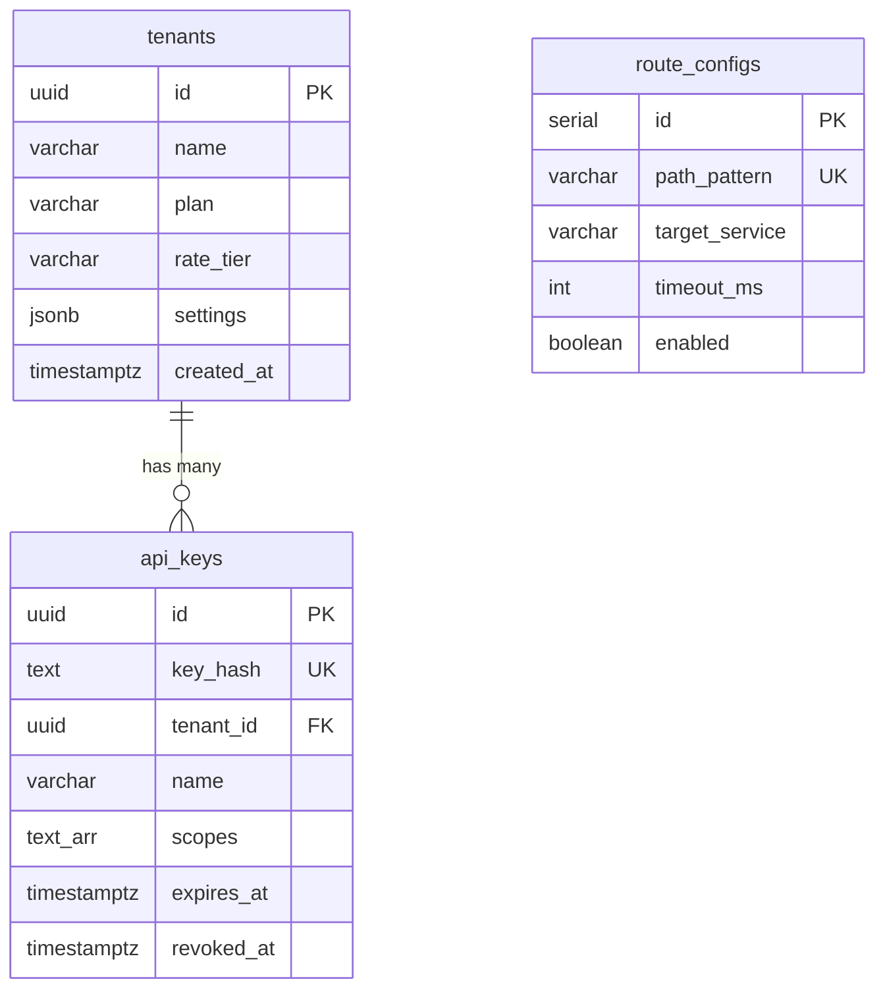

# vnp-gateway — Data Model

> **Database**: PostgreSQL (config/keys), Redis (rate-limit/cache)

## 1. Tables

The gateway is primarily stateless. Minimal persistence is used for API key resolution and tenant configuration.

### 1.1 `api_keys` (PostgreSQL)

| Column | Type | Constraints | Description |
|--------|------|-------------|-------------|
| `id` | UUID | PK | Key ID |
| `key_hash` | TEXT | UNIQUE, NOT NULL | SHA-256 hash of API key |
| `key_prefix` | VARCHAR(12) | NOT NULL | First 8 chars for display (`vnp_abc1...`) |
| `tenant_id` | UUID | FK → tenants, NOT NULL | Owning tenant |
| `name` | VARCHAR(255) | NOT NULL | Human-readable name |
| `scopes` | TEXT[] | NOT NULL | Permitted API scopes |
| `rate_tier` | VARCHAR(20) | DEFAULT 'free' | Rate limit tier |
| `expires_at` | TIMESTAMPTZ | NULL | Expiration (NULL = never) |
| `last_used_at` | TIMESTAMPTZ | NULL | Last usage timestamp |
| `created_at` | TIMESTAMPTZ | DEFAULT now() | Creation timestamp |
| `revoked_at` | TIMESTAMPTZ | NULL | Revocation timestamp |

### 1.2 `tenants` (PostgreSQL)

| Column | Type | Constraints | Description |
|--------|------|-------------|-------------|
| `id` | UUID | PK | Tenant ID |
| `name` | VARCHAR(255) | NOT NULL | Organization name |
| `plan` | VARCHAR(20) | DEFAULT 'free' | Subscription plan |
| `rate_tier` | VARCHAR(20) | DEFAULT 'free' | Rate limit tier |
| `settings` | JSONB | DEFAULT '{}' | Tenant-specific settings |
| `created_at` | TIMESTAMPTZ | DEFAULT now() | |
| `suspended_at` | TIMESTAMPTZ | NULL | Suspension timestamp |

### 1.3 `route_configs` (PostgreSQL)

| Column | Type | Constraints | Description |
|--------|------|-------------|-------------|
| `id` | SERIAL | PK | |
| `path_pattern` | VARCHAR(255) | UNIQUE | Route pattern (e.g., `/v1/cognee/*`) |
| `target_service` | VARCHAR(100) | NOT NULL | Target gRPC service name |
| `timeout_ms` | INT | DEFAULT 30000 | Request timeout |
| `rate_limit` | INT | NULL | Override rate limit |
| `circuit_threshold` | INT | DEFAULT 5 | Failure threshold |
| `enabled` | BOOLEAN | DEFAULT true | Route enabled flag |

## 2. Entity-Relationship Diagram



## 3. Redis Data Structures

| Key Pattern | Type | TTL | Purpose |
|-------------|------|-----|---------|
| `rl:{tenant_id}:{endpoint}` | Sorted Set | 60s | Sliding window rate limit |
| `apikey:{prefix}` | Hash | 5min | API key cache (avoid DB lookup) |
| `health:{service}` | String | 30s | Service health cache |
| `cb:{service}` | String | — | Circuit breaker state |

## 4. Index Strategy

```sql
CREATE INDEX idx_api_keys_hash ON api_keys (key_hash);
CREATE INDEX idx_api_keys_tenant ON api_keys (tenant_id) WHERE revoked_at IS NULL;
CREATE INDEX idx_tenants_plan ON tenants (plan) WHERE suspended_at IS NULL;
CREATE INDEX idx_route_configs_pattern ON route_configs (path_pattern) WHERE enabled = true;
```

## 5. Migration History

| Version | Date | Description |
|---------|------|-------------|
| 1.0.0 | 2026-05-09 | Initial schema: tenants, api_keys, route_configs |
