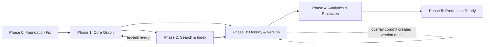

# Kế hoạch triển khai: AI Knowledge Graph Service (ai-kg-service)

> **Ngày lập:** 05/03/2026 (cập nhật DOC 4 compliance: 05/03/2026)  
> **Tham chiếu:** [LLD](lld_ai_kg_service.md) | [API Specs v1.1](ai_kg_service_api_specs.md) | [Coverage Assessment](lld_coverage_ai_kg_service.md) | [DOC 4 Compliance](doc4_compliance_review.md)  
> **Hiện trạng:** ~25–28% hoàn thành (scaffolding + basic CRUD)  
> **Mục tiêu:** Production-ready 100%

---

## Tổng quan tiếp cận

Kế hoạch chia thành **6 Phase**, mỗi phase có tiêu chí **Definition of Done (DoD)** rõ ràng. Tuân thủ nguyên tắc:

1. **Dependency-first** — build infrastructure layer trước, business logic sau
2. **Vertical slice** — mỗi feature hoàn chỉnh từ proto → service → biz → data → test
3. **Incremental delivery** — mỗi phase deliverable & testable độc lập

```
Phase 0: Foundation Fix   ─── 1 tuần  ─── Fix stubs + auth + namespace
Phase 1: Core Graph       ─── 2 tuần  ─── Batch + Lock + Graph algorithms
Phase 2: Search & Index   ─── 2 tuần  ─── Qdrant + Hybrid search
Phase 3: Overlay & Version ── 2 tuần  ─── Overlay lifecycle + versioning
Phase 4: Analytics & Projection ─ 1.5 tuần ─ Coverage + Traceability + RBAC
Phase 5: Production Ready ─── 1.5 tuần ─── Observability + Deploy + E2E test
                                  ────────
                              Tổng: ~10 tuần
```

---

## Phase 0: Foundation Fix (Tuần 1)

> **Mục tiêu:** Sửa các stub/mock hiện tại, biến kgs-platform thành service hoạt động thực sự

### P0.1 — Fix Graph Service Handlers (Stubs → Real Logic)

**Vấn đề:** `service/graph.go` — `CreateNode()`, `GetNode()`, `CreateEdge()` return `&Reply{}` rỗng, không gọi biz layer.

**Tasks:**

| #      | Task                                             | Files                | Chi tiết                                                                                               |
| ------ | ------------------------------------------------ | -------------------- | ------------------------------------------------------------------------------------------------------ |
| P0.1.1 | Wire biz logic vào `CreateNode` handler          | `service/graph.go`   | Parse `properties_json` → gọi `uc.CreateNode()` → map result vào `CreateNodeReply`                     |
| P0.1.2 | Wire biz logic vào `GetNode` handler             | `service/graph.go`   | Gọi `uc.GetNode()` (cần thêm method mới vào biz) → map vào `GetNodeReply`                              |
| P0.1.3 | Wire biz logic vào `CreateEdge` handler          | `service/graph.go`   | Parse request → gọi `uc.CreateEdge()` → map vào `CreateEdgeReply`                                      |
| P0.1.4 | Fix hardcoded `"demo-app"` trong tất cả handlers | `service/graph.go`   | Extract `AppContext` từ `ctx.Value(middleware.AppContextKey)` thay vì hardcode                         |
| P0.1.5 | Map `map[string]any` → protobuf `GraphReply`     | `service/graph.go`   | Implement converter cho `GetContext/GetImpact/GetCoverage/GetSubgraph` — hiện return empty             |
| P0.1.6 | Thêm `GetNode` vào biz layer                     | `biz/graph.go`       | Implement `GraphUsecase.GetNode(ctx, appID, nodeID)` — query Neo4j by `app_id + id`                    |
| P0.1.7 | Thêm `GetNode` vào data layer                    | `data/graph_node.go` | Implement `graphRepo.GetNode(ctx, appID, nodeID)` — Cypher `MATCH (n {app_id: $app_id, id: $node_id})` |

**DoD:** Tất cả 7 Graph RPCs (`CreateNode`, `GetNode`, `CreateEdge`, `GetContext`, `GetImpact`, `GetCoverage`, `GetSubgraph`) hoạt động end-to-end qua HTTP + gRPC. Test bằng `test_api.sh` PASS.

---

### P0.2 — Fix Auth Middleware (Mock → Real Validation)

**Vấn đề:** `middleware/auth.go` hardcode `AppContext{AppID: "mock-app-id"}`, không validate API key thực sự.

**Tasks:**

| #      | Task                                 | Files                                   | Chi tiết                                                                                                          |
| ------ | ------------------------------------ | --------------------------------------- | ----------------------------------------------------------------------------------------------------------------- |
| P0.2.1 | Lookup API key trong Redis/Postgres  | `middleware/auth.go`, `biz/registry.go` | Parse `Authorization: Bearer <key>` → hash key → lookup trong `api_keys` table → check `is_revoked`, `expires_at` |
| P0.2.2 | Cache API key validation trong Redis | `middleware/auth.go`                    | Set `kgs:apikey:<hash>` với TTL 5min                                                                              |
| P0.2.3 | Inject real `AppContext` vào context | `middleware/auth.go`                    | `AppContext{AppID: app.AppID, Scopes: apiKey.Scopes, TenantID: ""}`                                               |
| P0.2.4 | Skip auth cho Registry endpoints     | `middleware/auth.go`                    | Whitelist: `POST /v1/apps`, `GET /v1/apps`, `POST /v1/apps/*/keys`                                                |

**DoD:** API calls với invalid key → `401`, valid key → `AppContext` populated, expired/revoked key → `401`.

---

### P0.3 — Fix RateLimiter Middleware (No-op → Redis Sliding Window)

**Vấn đề:** `middleware/ratelimit.go` — body comment hoàn toàn, không thực thi.

**Tasks:**

| #      | Task                                                 | Files                                        | Chi tiết                                                                  |
| ------ | ---------------------------------------------------- | -------------------------------------------- | ------------------------------------------------------------------------- |
| P0.3.1 | Implement Redis sliding window rate limiter          | `middleware/ratelimit.go`                    | Key: `kgs:ratelimit:<appID>:<minute>`, Lua script cho atomic inc + expire |
| P0.3.2 | Read quota limit từ `Quota` table                    | `middleware/ratelimit.go`, `biz/registry.go` | Default: 1000 req/min. Override per app từ `quotas` table                 |
| P0.3.3 | Return `429 ERR_RATE_LIMIT` với `Retry-After` header | `middleware/ratelimit.go`                    | Header `Retry-After: <seconds>`                                           |

**DoD:** Over-limit requests → `429` with `Retry-After`. Under-limit → pass through. Unit test for sliding window logic.

---

### P0.4 — Namespace Foundation

**Vấn đề:** Không có `tenantId` trong bất kỳ data model hay query nào.

**Tasks:**

| #      | Task                                          | Files                                                             | Chi tiết                                                                                                     |
| ------ | --------------------------------------------- | ----------------------------------------------------------------- | ------------------------------------------------------------------------------------------------------------ |
| P0.4.1 | Thêm `TenantID` vào `AppContext`              | `middleware/auth.go`                                              | Nếu JWT có claim `tenant_id`, extract ra. Nếu không, dùng `default`                                          |
| P0.4.2 | Tạo package `internal/namespace/`             | `biz/namespace.go` (mới)                                          | `func ComputeNamespace(appID, tenantID string) string` → `"graph/{appID}/{tenantID}"`                        |
| P0.4.3 | Propagate namespace vào tất cả Cypher queries | `data/graph_node.go`, `data/graph_edge.go`, `data/graph_query.go` | Thêm `tenant_id` property vào `CREATE` và `MATCH` queries                                                    |
| P0.4.4 | Thêm namespace vào GORM models                | `biz/ontology.go`, `biz/rules.go`                                 | Thêm `TenantID` field, thêm vào index compound `(app_id, tenant_id)`                                         |
| P0.4.5 | Tạo Namespace Enforcement Middleware          | `middleware/namespace.go` (mới)                                   | Validate `X-KG-Namespace` header match `AppContext.AppID + TenantID` — prevent cross-tenant                  |
| P0.4.6 | Xử lý `X-Org-ID` header (DOC 4 §2)            | `middleware/auth.go`, `biz/namespace.go`                          | Parse `X-Org-ID` → inject vào `AppContext.OrgID`. Namespace: `graph/{orgID}/{appId}/{tenantId}` khi có OrgID |

**DoD:** Mọi data access scoped to `(app_id, tenant_id)`. Cross-tenant query → `403 ERR_FORBIDDEN`. Unit test cho `ComputeNamespace()`.

---

### P0.5 — Unit Tests cho Phase 0

| #      | Task                                        | Files                          | Chi tiết                                                     |
| ------ | ------------------------------------------- | ------------------------------ | ------------------------------------------------------------ |
| P0.5.1 | Unit test cho `CreateNode/GetNode` handlers | `service/graph_test.go`        | Mock biz layer, verify correct mapping proto ↔ domain        |
| P0.5.2 | Unit test cho Auth middleware               | `middleware/auth_test.go`      | Table-driven: valid key, invalid key, expired key, no header |
| P0.5.3 | Unit test cho RateLimiter                   | `middleware/ratelimit_test.go` | Mock Redis, test sliding window logic                        |
| P0.5.4 | Unit test cho Namespace                     | `biz/namespace_test.go`        | `ComputeNamespace` output format                             |

**Phase 0 Definition of Done (tổng):**

- [ ] Tất cả 7 Graph RPCs hoạt động end-to-end
- [ ] Auth middleware validate real API key
- [ ] Rate limiter enforce quota
- [ ] Namespace scope mọi query
- [ ] `test_api.sh` PASS
- [ ] Unit test coverage ≥ 80% cho code mới

---

## Phase 1: Core Graph Enhancement (Tuần 2–3)

> **Mục tiêu:** Lock manager, batch upsert, enhanced graph algorithms

### P1.1 — Lock Manager Package

Tạo `internal/lock/` cho multi-level locking (LLD §7.1).

| #      | Task                                                    | Files                         | Chi tiết                                                                                                                                                                                         |
| ------ | ------------------------------------------------------- | ----------------------------- | ------------------------------------------------------------------------------------------------------------------------------------------------------------------------------------------------ |
| P1.1.1 | Define `LockManager` interface                          | `internal/lock/lock.go`       | `AcquireNodeLock(ctx, ns, nodeID, ttl)`, `AcquireSubgraphLock(ctx, ns, rootID, depth, ttl)`, `AcquireVersionLock(ctx, ns, ttl)`, `AcquireNamespaceLock(ctx, ns, ttl)`, `Release(ctx, lockToken)` |
| P1.1.2 | Implement `RedisLockManager` (Redlock)                  | `internal/lock/redis_lock.go` | Dùng `go-redsync/redsync` — Redlock algorithm cho distributed lock                                                                                                                               |
| P1.1.3 | Lock key design                                         | `internal/lock/redis_lock.go` | Keys: `kgs:lock:node:{ns}:{nodeID}`, `kgs:lock:subgraph:{ns}:{rootID}`, `kgs:lock:version:{ns}`, `kgs:lock:ns:{ns}`                                                                              |
| P1.1.4 | Lock hierarchy enforcement                              | `internal/lock/redis_lock.go` | Node < Subgraph < Version < Namespace — prevent deadlock                                                                                                                                         |
| P1.1.5 | Integrate lock vào `GraphUsecase.CreateNode/CreateEdge` | `biz/graph.go`                | Acquire node lock trước write, release sau commit                                                                                                                                                |
| P1.1.6 | Unit test cho LockManager                               | `internal/lock/lock_test.go`  | Test concurrent acquisition, timeout, reentrant lock                                                                                                                                             |

**DoD:** Concurrent `CreateNode` calls serialize correctly. Lock timeout → retry 3x → return error.

---

### P1.2 — Batch Upsert Package

Tạo `internal/batch/` cho bulk entity operations (LLD §7.3).

| #      | Task                      | Files                            | Chi tiết                                                                                                                              |
| ------ | ------------------------- | -------------------------------- | ------------------------------------------------------------------------------------------------------------------------------------- |
| P1.2.1 | Define Batch API proto    | `api/graph/v1/graph.proto`       | Thêm `rpc BatchUpsertEntities(BatchUpsertRequest) returns (BatchUpsertReply)` với gateway `POST /v1/graph/entities/batch`             |
| P1.2.2 | Implement `BatchUsecase`  | `internal/batch/batch.go`        | Core logic: validate → dedup → bulk write → vector index                                                                              |
| P1.2.3 | Semantic dedup logic      | `internal/batch/dedup.go`        | Cosine similarity > 0.95 + same entityType → merge thay vì create mới. (Placeholder — cần Qdrant từ Phase 2)                          |
| P1.2.4 | Neo4j batch write         | `internal/batch/neo4j_writer.go` | `UNWIND $entities AS e CREATE (n:EntityType {app_id: $app_id, tenant_id: $tenant_id}) SET n += e.props` — batch 200 nodes/transaction |
| P1.2.5 | Proto + service handler   | `service/graph.go`               | Wire proto → `BatchUsecase.Execute()`                                                                                                 |
| P1.2.6 | Unit test cho batch logic | `internal/batch/batch_test.go`   | Table-driven: empty batch, max batch, duplicate detection, error handling                                                             |

**DoD:** `POST /v1/graph/entities/batch` accepts up to 1000 entities, returns `{created, updated, skipped}`. P95 < 1.5s for 1000 entities.

---

### P1.3 — Enhanced Graph Algorithms

Nâng cấp `QueryPlanner` và thêm GDS algorithms (LLD §7.5, §16.1).

| #      | Task                                  | Files                       | Chi tiết                                                                                                  |
| ------ | ------------------------------------- | --------------------------- | --------------------------------------------------------------------------------------------------------- |
| P1.3.1 | Add `label` filter vào Cypher queries | `biz/query_planner.go`      | Hỗ trợ filter by EntityType trong Context/Impact/Coverage                                                 |
| P1.3.2 | BFS batched traversal                 | `biz/query_planner.go`      | Replace single-hop queries với BFS multi-level (depth > 3 → batch per level)                              |
| P1.3.3 | Pagination support cho GraphReply     | `api/graph/v1/graph.proto`  | Thêm `int32 page_size`, `string page_token` vào traversal requests                                        |
| P1.3.4 | Neo4j GDS PageRank integration        | `data/graph_query.go`       | `CALL gds.pageRank.stream('kgs-graph-{ns}', {}) YIELD nodeId, score` — cache result trong Redis TTL 15min |
| P1.3.5 | Neo4j GDS DegreeCentrality            | `data/graph_query.go`       | `CALL gds.degree.stream(...)` cho topological analysis                                                    |
| P1.3.6 | Unit test cho enhanced query planner  | `biz/query_planner_test.go` | Verify BFS queries, pagination tokens                                                                     |

**DoD:** GetContext depth=5 → batched BFS. PageRank scores available. Pagination works for large result sets.

---

### P1.4 — Unit Tests cho Phase 1

| #      | Task                         | Files                          | Scope                                           |
| ------ | ---------------------------- | ------------------------------ | ----------------------------------------------- |
| P1.4.1 | Lock manager tests           | `internal/lock/lock_test.go`   | Concurrent lock, hierarchy enforcement, timeout |
| P1.4.2 | Batch upsert tests           | `internal/batch/batch_test.go` | Validation, batch splitting, error rollback     |
| P1.4.3 | Enhanced query planner tests | `biz/query_planner_test.go`    | BFS queries, pagination, label filters          |

**Phase 1 DoD:**

- [ ] LockManager hoạt động với Redlock
- [ ] Batch upsert ≤ 1000 entities/call
- [ ] BFS traversal có pagination
- [ ] GDS PageRank/Degree queries tích hợp
- [ ] Unit test coverage ≥ 80%

---

## Phase 2: Search & Vector Index (Tuần 4–5)

> **Mục tiêu:** Tích hợp Qdrant + Hybrid Search Pipeline

### P2.1 — Qdrant Client Integration

| #      | Task                         | Files                           | Chi tiết                                                                                                      |
| ------ | ---------------------------- | ------------------------------- | ------------------------------------------------------------------------------------------------------------- |
| P2.1.1 | Thêm Qdrant vào `conf.proto` | `internal/conf/conf.proto`      | `message Qdrant { string host = 1; int32 port = 2; string collection = 3; int32 vector_size = 4; }`           |
| P2.1.2 | Tạo Qdrant Go client wrapper | `internal/data/qdrant.go` (mới) | Wrap `qdrant-go` client: `UpsertVectors()`, `SearchVectors()`, `DeleteVectors()`, `BatchSearch()`             |
| P2.1.3 | Wire Qdrant vào Data layer   | `internal/data/data.go`         | Thêm Qdrant client init vào `NewData()`, add cleanup                                                          |
| P2.1.4 | Collection auto-creation     | `internal/data/qdrant.go`       | On startup: tạo collection `kgs-vectors-{appID}` nếu chưa tồn tại. Vector size = 1536 (OpenAI), cosine metric |
| P2.1.5 | Unit test cho Qdrant wrapper | `internal/data/qdrant_test.go`  | Mock gRPC client, test upsert/search/delete                                                                   |

**DoD:** Qdrant client connected, collection auto-created on startup. CRUD operations verified.

---

### P2.2 — Hybrid Search Package

Tạo `internal/search/` cho hybrid search pipeline (LLD §7.2).

| #      | Task                               | Files                                          | Chi tiết                                                                                                          |
| ------ | ---------------------------------- | ---------------------------------------------- | ----------------------------------------------------------------------------------------------------------------- |
| P2.2.1 | Define `SearchEngine` interface    | `internal/search/search.go`                    | `HybridSearch(ctx, ns, query, opts SearchOpts) ([]SearchResult, error)`                                           |
| P2.2.2 | Implement Semantic search (Qdrant) | `internal/search/vector.go`                    | Query → embedding (via ai-proxy) → Qdrant cosine search → top-K candidates                                        |
| P2.2.3 | Implement BM25 text search         | `internal/search/text.go`                      | Neo4j fulltext index: `CALL db.index.fulltext.queryNodes('kgs-fti-{ns}', $query) YIELD node, score`               |
| P2.2.4 | Implement Score Blending (RRF)     | `internal/search/blender.go`                   | Reciprocal Rank Fusion: `score = alpha * semantic + (1-alpha) * text`. Configurable `alpha`                       |
| P2.2.5 | Implement Graph Reranking          | `internal/search/reranker.go`                  | Boost by PageRank centrality: `finalScore = blendedScore * (1 + beta * centrality)`                               |
| P2.2.6 | Implement Filter engine            | `internal/search/filter.go`                    | Filter by `entityTypes`, `domains`, `minConfidence`, `provenanceTypes`                                            |
| P2.2.7 | Proto + service handler            | `api/graph/v1/graph.proto`, `service/graph.go` | Thêm `rpc HybridSearch(HybridSearchRequest) returns (HybridSearchReply)` → gateway `POST /v1/graph/search/hybrid` |
| P2.2.8 | Wire vào embeddings service        | `internal/search/vector.go`                    | Call `ai-proxy` gRPC service cho text → embedding                                                                 |
| P2.2.9 | Neo4j fulltext index creation      | `internal/data/graph_node.go`                  | On startup: `CREATE FULLTEXT INDEX kgs-fti-{ns} IF NOT EXISTS FOR (n:Entity) ON EACH [n.name, n.content]`         |

**DoD:** `POST /v1/graph/search/hybrid` → hybrid results ranked by `finalScore`. P95 < 500ms.

---

### P2.3 — Backfill Semantic Dedup trong Batch

| #      | Task                                | Files                            | Chi tiết                                                      |
| ------ | ----------------------------------- | -------------------------------- | ------------------------------------------------------------- |
| P2.3.1 | Wire Qdrant vào batch dedup         | `internal/batch/dedup.go`        | Phase 1 placeholder → real cosine similarity check via Qdrant |
| P2.3.2 | Auto-index vectors on entity create | `internal/batch/neo4j_writer.go` | Sau batch write Neo4j → batch upsert vectors vào Qdrant       |

---

### P2.4 — Unit Tests cho Phase 2

| #      | Task                | Files                             | Scope                                          |
| ------ | ------------------- | --------------------------------- | ---------------------------------------------- |
| P2.4.1 | Search engine tests | `internal/search/search_test.go`  | Mock Qdrant + Neo4j, verify blending + ranking |
| P2.4.2 | Blender tests       | `internal/search/blender_test.go` | Edge cases: alpha=0, alpha=1, empty results    |
| P2.4.3 | Filter tests        | `internal/search/filter_test.go`  | Combination filters, empty filter              |

**Phase 2 DoD:**

- [ ] Qdrant connected + collection auto-created
- [ ] Hybrid search: semantic + BM25 + rerank active
- [ ] Batch dedup sử dụng real Qdrant similarity
- [ ] Unit test coverage ≥ 80%

---

## Phase 3: Overlay & Versioning (Tuần 6–7)

> **Mục tiêu:** Session-based overlay graph + version management

### P3.1 — Overlay Package

Tạo `internal/overlay/` cho overlay lifecycle (LLD §7.4).

| #       | Task                                    | Files                                     | Chi tiết                                                                                                                                                      |
| ------- | --------------------------------------- | ----------------------------------------- | ------------------------------------------------------------------------------------------------------------------------------------------------------------- |
| P3.1.1  | Define `OverlayManager` interface       | `internal/overlay/overlay.go`             | `Create(ctx, ns, sessionID, baseVersion)`, `Get(ctx, overlayID)`, `Commit(ctx, overlayID, conflictPolicy)`, `Discard(ctx, overlayID)`                         |
| P3.1.2  | Overlay storage model                   | `internal/overlay/model.go`               | `OverlayGraph` struct: `ID`, `SessionID`, `BaseVersionID`, `Status` (ACTIVE/COMMITTED/DISCARDED), `EntitiesDelta[]`, `EdgesDelta[]`, `CreatedAt`, `ExpiresAt` |
| P3.1.3  | Overlay data store (Redis)              | `internal/overlay/redis_store.go`         | Key: `kgs:overlay:{overlayID}`, Value: serialized OverlayGraph, TTL: 1 hour                                                                                   |
| P3.1.4  | Overlay Create logic                    | `internal/overlay/overlay.go`             | Validate session → store initial empty overlay → return overlayID                                                                                             |
| P3.1.5  | Route writes to overlay                 | `biz/graph.go`                            | Nếu request có `overlay_id` → write vào overlay Redis store thay vì base graph                                                                                |
| P3.1.6  | Overlay Commit logic                    | `internal/overlay/commit.go`              | Read overlay deltas → check base drift (version changed?) → resolve conflicts → write to Neo4j base → create new version delta → cleanup overlay              |
| P3.1.7  | Conflict detection & resolution         | `internal/overlay/conflict.go`            | Compare overlay entities vs base. Policies: `KEEP_OVERLAY`, `KEEP_BASE`, `MERGE`, `REQUIRE_MANUAL`                                                            |
| P3.1.8  | Overlay Discard logic                   | `internal/overlay/overlay.go`             | Delete Redis key + cleanup                                                                                                                                    |
| P3.1.9  | Proto + service handler                 | `api/graph/v1/graph.proto`                | Thêm: `rpc CreateOverlay(...)`, `rpc CommitOverlay(...)`, `rpc DiscardOverlay(...)`                                                                           |
| P3.1.10 | NATS: SESSION_CLOSE → commit-or-discard | `internal/overlay/nats_listener.go` (mới) | Subscribe `SESSION_CLOSE` event → DOC 4 §8 logic: has writes → auto-commit, query-only → auto-discard                                                         |
| P3.1.11 | NATS: BUDGET_STOP → partial commit      | `internal/overlay/nats_listener.go`       | Subscribe `BUDGET_STOP` event → commit overlay với status=PARTIAL                                                                                             |

**DoD:** Full overlay lifecycle (create → write → commit/discard). Conflict resolution policy works. SESSION_CLOSE commit-or-discard (DOC 4 §8). BUDGET_STOP partial commit.

---

### P3.2 — Versioning Package

Tạo `internal/version/` cho version management (LLD §7.6).

| #      | Task                              | Files                          | Chi tiết                                                                                                                                                                                       |
| ------ | --------------------------------- | ------------------------------ | ---------------------------------------------------------------------------------------------------------------------------------------------------------------------------------------------- |
| P3.2.1 | Define `VersionManager` interface | `internal/version/version.go`  | `CreateDelta(ctx, ns, changes)`, `GetVersion(ctx, ns, versionID)`, `ListVersions(ctx, ns)`, `DiffVersions(ctx, ns, v1, v2)`, `Rollback(ctx, ns, targetVersion)`                                |
| P3.2.2 | Version delta model               | `internal/version/model.go`    | `VersionDelta`: `ID`, `ParentID`, `Namespace`, `EntitiesAdded[]`, `EntitiesModified[]`, `EntitiesDeleted[]`, `EdgesAdded[]`, `EdgesModified[]`, `EdgesDeleted[]`, `CreatedAt`, `CommitMessage` |
| P3.2.3 | PostgreSQL version store          | `internal/version/pg_store.go` | GORM model cho `graph_versions` table — linked list of deltas                                                                                                                                  |
| P3.2.4 | Create delta on overlay commit    | `internal/overlay/commit.go`   | After conflict resolution → call `VersionManager.CreateDelta()`                                                                                                                                |
| P3.2.5 | Diff computation                  | `internal/version/diff.go`     | Walk delta chain between v1 and v2, compute added/modified/deleted                                                                                                                             |
| P3.2.6 | GC Compaction                     | `internal/version/gc.go`       | Compact deltas older than N days into snapshots. Run as CronJob                                                                                                                                |
| P3.2.7 | Proto + service handler           | `api/graph/v1/graph.proto`     | Thêm: `rpc ListVersions(...)`, `rpc DiffVersions(...)`, `rpc RollbackVersion(...)`                                                                                                             |

**DoD:** Version chain maintains full history. Diff between any 2 versions. GC compacts old deltas.

---

### P3.3 — NATS JetStream Integration

| #      | Task                                       | Files                                | Chi tiết                                                        |
| ------ | ------------------------------------------ | ------------------------------------ | --------------------------------------------------------------- |
| P3.3.1 | Thêm NATS vào `conf.proto`                 | `internal/conf/conf.proto`           | `message NATS { string url = 1; string stream = 2; }`           |
| P3.3.2 | Tạo NATS client wrapper                    | `internal/data/nats.go` (mới)        | Publish + Subscribe helper                                      |
| P3.3.3 | Publish `OVERLAY_COMMIT` event (DOC 4 §5)  | `internal/overlay/commit.go`         | Topic: `overlay.committed.{tenantId}` — after successful commit |
| P3.3.4 | Publish `OVERLAY_DISCARD` event (DOC 4 §5) | `internal/overlay/overlay.go`        | Topic: `overlay.discarded.{tenantId}` — after discard           |
| P3.3.5 | Subscribe `SESSION_CLOSE` event (DOC 4 §8) | `internal/overlay/nats_listener.go`  | Topic: `session.close.{sessionId}` — commit-or-discard logic    |
| P3.3.6 | Subscribe `BUDGET_STOP` event (DOC 4 §8)   | `internal/overlay/nats_listener.go`  | Topic: `budget.stop.{sessionId}` — commit partial overlay       |
| P3.3.7 | Define NATS topic constants                | `internal/data/nats_topics.go` (mới) | Centralized topic patterns per DOC 4 Shared Contracts           |

**DoD:** NATS publish/subscribe hoạt động. OVERLAY_COMMIT + OVERLAY_DISCARD events published. SESSION_CLOSE triggers commit-or-discard. BUDGET_STOP triggers partial commit.

---

### P3.4 — Unit Tests cho Phase 3

| #      | Task                      | Files                               | Scope                                              |
| ------ | ------------------------- | ----------------------------------- | -------------------------------------------------- |
| P3.4.1 | Overlay lifecycle tests   | `internal/overlay/overlay_test.go`  | Create → commit, create → discard, expired overlay |
| P3.4.2 | Conflict resolution tests | `internal/overlay/conflict_test.go` | 4 policies, no conflict, multi-field conflict      |
| P3.4.3 | Version delta tests       | `internal/version/version_test.go`  | Create, diff, chain walk                           |
| P3.4.4 | GC compaction tests       | `internal/version/gc_test.go`       | Compact 10 deltas → 1 snapshot                     |

**Phase 3 DoD:**

- [ ] Overlay lifecycle complete (create/commit/discard)
- [ ] Version deltas tracked, diff works
- [ ] NATS: OVERLAY_COMMIT + OVERLAY_DISCARD events published (DOC 4 §5)
- [ ] NATS: SESSION_CLOSE → commit-or-discard (DOC 4 §8)
- [ ] NATS: BUDGET_STOP → partial commit (DOC 4 §8)
- [ ] GC compaction logic verified
- [ ] Unit test coverage ≥ 80%

---

## Phase 4: Analytics & Projection (Tuần 8–9)

> **Mục tiêu:** Coverage report, traceability matrix, RBAC projection

### P4.1 — Analytics Package

Tạo `internal/analytics/` cho graph analytics (LLD §7.8).

| #      | Task                                | Files                                | Chi tiết                                                                                                                            |
| ------ | ----------------------------------- | ------------------------------------ | ----------------------------------------------------------------------------------------------------------------------------------- |
| P4.1.1 | Define `AnalyticsEngine` interface  | `internal/analytics/analytics.go`    | `CoverageReport(ctx, ns, domain)`, `TraceabilityMatrix(ctx, ns, sources, targets, maxHops)`, `ClusterAnalysis(ctx, ns, entityType)` |
| P4.1.2 | Coverage report implementation      | `internal/analytics/coverage.go`     | Cypher: count entities per type per domain → compute % covered (has ≥ 1 outgoing edge)                                              |
| P4.1.3 | Traceability matrix implementation  | `internal/analytics/traceability.go` | Multi-hop BFS: `MATCH p=(s:SourceType)-[*1..{maxHops}]->(t:TargetType) WHERE s.app_id = $app_id RETURN s, t, relationships(p)`      |
| P4.1.4 | Cluster analysis (Louvain)          | `internal/analytics/cluster.go`      | `CALL gds.louvain.stream(...)` → group entities by community                                                                        |
| P4.1.5 | Proto + service handlers            | `api/graph/v1/graph.proto`           | Thêm: `rpc GetCoverageReport(...)`, `rpc GetTraceabilityMatrix(...)`                                                                |
| P4.1.6 | Cache analytics results trong Redis | `internal/analytics/cache.go`        | Key: `kgs:analytics:{type}:{ns}:{params_hash}`, TTL: 15min                                                                          |

**DoD:** Coverage report + Traceability matrix API hoạt động. Results cached trong Redis.

---

### P4.2 — Projection Package

Tạo `internal/projection/` cho role-based data projection (LLD §7.7).

| #      | Task                                 | Files                               | Chi tiết                                                                                                         |
| ------ | ------------------------------------ | ----------------------------------- | ---------------------------------------------------------------------------------------------------------------- |
| P4.2.1 | Define `ProjectionEngine` interface  | `internal/projection/projection.go` | `Apply(ctx, ns, role, rawData) → filteredData`                                                                   |
| P4.2.2 | View definition model (Postgres)     | `internal/projection/model.go`      | `ViewDefinition`: `ID`, `AppID`, `RoleName`, `AllowedEntityTypes`, `AllowedFields`, `PIIMaskFields`, `CreatedAt` |
| P4.2.3 | Replace `ViewResolver` stub          | `biz/view_resolver.go`              | Wire `ProjectionEngine` vào existing stub                                                                        |
| P4.2.4 | PII masking helper                   | `internal/projection/mask.go`       | Mask fields: `email` → `e***@***.com`, `phone` → `***-***-1234`                                                  |
| P4.2.5 | Apply projection vào Graph responses | `service/graph.go`                  | After biz layer returns data → apply projection → return filtered                                                |
| P4.2.6 | Proto + service handlers             | `api/graph/v1/graph.proto`          | CRUD APIs cho `ViewDefinition`                                                                                   |

**DoD:** Different roles see different fields. PII masking applied. ViewResolver no longer a stub.

---

### P4.3 — Unit Tests cho Phase 4

| #      | Task             | Files                           | Scope                                                  |
| ------ | ---------------- | ------------------------------- | ------------------------------------------------------ |
| P4.3.1 | Analytics tests  | `internal/analytics/*_test.go`  | Coverage computation, traceability BFS, cache behavior |
| P4.3.2 | Projection tests | `internal/projection/*_test.go` | Role filtering, PII masking, edge cases                |

**Phase 4 DoD:**

- [ ] Coverage report + Traceability matrix APIs
- [ ] Projection engine replaces ViewResolver stub
- [ ] PII masking hoạt động
- [ ] Unit test coverage ≥ 80%

---

## Phase 5: Production Ready (Tuần 9.5–10)

> **Mục tiêu:** Observability, deployment manifests, E2E tests

### P5.1 — Observability

| #      | Task                              | Files                         | Chi tiết                                                                                                                                                       |
| ------ | --------------------------------- | ----------------------------- | -------------------------------------------------------------------------------------------------------------------------------------------------------------- |
| P5.1.1 | Prometheus metrics middleware     | `middleware/metrics.go` (mới) | `kg_request_duration_ms{method, status}`, `kg_request_total{method, status}` — dùng `prometheus/client_golang`                                                 |
| P5.1.2 | Business metrics instrumentation  | Tất cả biz packages           | Thêm metrics: `kg_entity_write_total`, `kg_search_duration_ms`, `kg_overlay_count_active`, `kg_lock_acquire_duration_ms` theo LLD §14.1                        |
| P5.1.3 | OpenTelemetry tracing             | `middleware/tracing.go` (mới) | Kratos OTEL middleware + span annotations cho Neo4j, Qdrant, Redis calls                                                                                       |
| P5.1.4 | Health check endpoints            | `service/health.go` (mới)     | `GET /healthz` (liveness), `GET /readyz` (readiness — check Neo4j, PG, Redis, Qdrant connections)                                                              |
| P5.1.5 | Structured error codes (DOC 4 §6) | `biz/errors.go` (mới)         | Replace generic `errors.New()` → Kratos `errors.New(code, reason, message)` theo LLD §15 error table. Format: `{code, reason, message, metadata}` per DOC 4 §6 |

**DoD:** Prometheus metrics exposed at `/metrics`. Tracing spans visible in Jaeger. Health checks pass.

---

### P5.2 — Deployment Manifests

| #      | Task                           | Files                                | Chi tiết                                                      |
| ------ | ------------------------------ | ------------------------------------ | ------------------------------------------------------------- |
| P5.2.1 | Docker Compose dev environment | `docker-compose.dev.yml`             | kgs-platform + Neo4j + PG + Redis + Qdrant + OPA + NATS       |
| P5.2.2 | K8s Deployment + Service       | `deployment/k8s/kgs-platform.yaml`   | Deployment, Service, ConfigMap, Secret                        |
| P5.2.3 | K8s HPA                        | `deployment/k8s/hpa.yaml`            | Scale on CPU > 70% hoặc p95 latency > 500ms                   |
| P5.2.4 | K8s NetworkPolicy              | `deployment/k8s/networkpolicy.yaml`  | Only allow traffic from `ai-planner` namespace → kgs-platform |
| P5.2.5 | K8s CronJob cho GC             | `deployment/k8s/gc-cronjob.yaml`     | Daily 2am: compact old version deltas                         |

**DoD:** `docker-compose up -d` → full stack running. K8s manifests reviewed.

---

### P5.3 — Integration & E2E Tests

| #      | Task                          | Files                                        | Chi tiết                                                                                                                             |
| ------ | ----------------------------- | -------------------------------------------- | ------------------------------------------------------------------------------------------------------------------------------------ |
| P5.3.1 | Update integration test suite | `tests/integration/*.go`                     | Update existing tests + thêm tests cho: Batch, Search, Overlay, Version, Analytics                                                   |
| P5.3.2 | E2E Testcontainers setup      | `tests/e2e/main_test.go` (mới)               | Testcontainers: Neo4j + PG + Redis + Qdrant + OPA — full stack in Go test                                                            |
| P5.3.3 | E2E happy path test           | `tests/e2e/happy_path_test.go` (mới)         | Create app → issue key → create ontology → batch upsert entities → hybrid search → overlay → commit → version diff → coverage report |
| P5.3.4 | E2E error path test           | `tests/e2e/error_path_test.go` (mới)         | Auth failure, rate limit, overlay conflict, depth exceeded                                                                           |
| P5.3.5 | Performance benchmark         | `tests/benchmark/search_bench_test.go` (mới) | `BenchmarkHybridSearch`, `BenchmarkBatchUpsert` — validate SLA targets                                                               |

**Phase 5 DoD:**

- [ ] Prometheus + OTEL instrumented
- [ ] Health checks pass
- [ ] Docker Compose one-command startup
- [ ] K8s manifests ready
- [ ] E2E test suite PASS
- [ ] SLA benchmarks pass

---

## Tổng hợp theo Package

| Package                          | Phase | Files mới ước tính               | Priority |
| -------------------------------- | ----- | -------------------------------- | -------- |
| `middleware/auth.go` (fix)       | P0    | 0 (sửa)                          | 🔴 P0    |
| `middleware/ratelimit.go` (fix)  | P0    | 0 (sửa)                          | 🔴 P0    |
| `middleware/namespace.go`        | P0    | 1                                | 🔴 P0    |
| `service/graph.go` (fix)         | P0    | 0 (sửa)                          | 🔴 P0    |
| `biz/namespace.go`               | P0    | 1                                | 🔴 P0    |
| `internal/lock/`                 | P1    | 3                                | 🔴 P1    |
| `internal/batch/`                | P1    | 4                                | 🔴 P1    |
| `biz/query_planner.go` (enhance) | P1    | 0 (sửa)                          | 🟡 P2    |
| `internal/data/qdrant.go`        | P2    | 1                                | 🔴 P1    |
| `internal/search/`               | P2    | 6                                | 🔴 P1    |
| `internal/overlay/`              | P3    | 6                                | 🟡 P2    |
| `internal/version/`              | P3    | 5                                | 🟡 P2    |
| `internal/data/nats.go`          | P3    | 2 (nats.go + nats_topics.go)     | 🟡 P2    |
| `internal/analytics/`            | P4    | 5                                | 🟡 P3    |
| `internal/projection/`           | P4    | 4                                | 🟡 P3    |
| `middleware/metrics.go`          | P5    | 1                                | 🟢 P4    |
| `middleware/tracing.go`          | P5    | 1                                | 🟢 P4    |
| `tests/e2e/`                     | P5    | 4                                | 🟢 P4    |
| **Tổng**                         |       | **~46 files mới + 10 files sửa** |          |

---

## Dependencies giữa các Phase



> [!IMPORTANT]
> **Phase 0 là blocking.** Không thể bắt đầu Phase 1+ khi Graph APIs vẫn là stubs và Auth vẫn mock.

---

## Checklist tổng quan

- [ ] **Phase 0:** Fix stubs, auth, rate limiter, namespace (Tuần 1)
- [ ] **Phase 1:** Lock manager, batch upsert, GDS algorithms (Tuần 2–3)
- [ ] **Phase 2:** Qdrant integration, hybrid search pipeline (Tuần 4–5)
- [ ] **Phase 3:** Overlay lifecycle, versioning, NATS (Tuần 6–7)
- [ ] **Phase 4:** Analytics (coverage, traceability), RBAC projection (Tuần 8–9)
- [ ] **Phase 5:** Observability, K8s deployment, E2E tests (Tuần 9.5–10)
