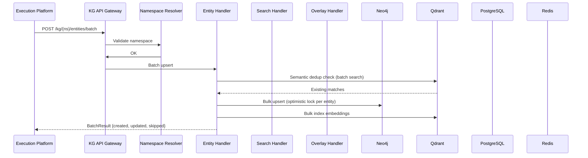
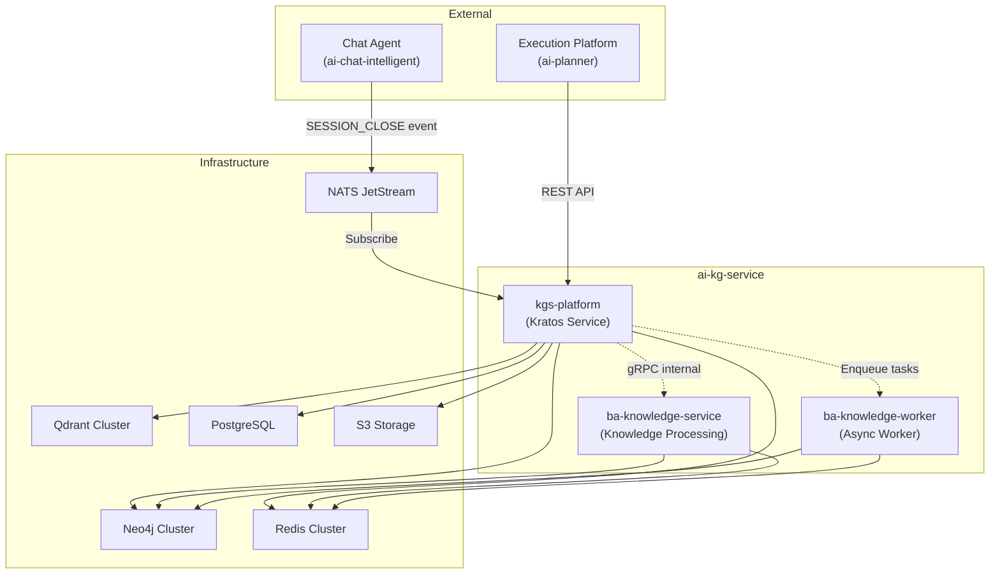

# LLD: AI Knowledge Graph Service (ai-kg-service)

> **Low-Level Design Document** — Version 1.0  
> Ngày: 05/03/2026  
> Tham chiếu: DOC 3 (KG Architecture), DOC 4 (Shared Contracts), DOC 7 (KG Implementation), DOC 8 (Deployment)

---

## 1. Tổng quan

### 1.1 Mục tiêu

`ai-kg-service` là dịch vụ Knowledge Graph (KG), chịu trách nhiệm **lưu trữ, truy vấn, và quản lý đồ thị tri thức** được trích xuất từ tài liệu doanh nghiệp. Service này là thành phần cuối cùng trong pipeline `Chat Agent → Execution Platform → KG Service`.

### 1.2 Yêu cầu thiết kế

| #   | Yêu cầu                     | Mô tả                                                                |
| --- | --------------------------- | -------------------------------------------------------------------- |
| R1  | **Multi-tenant isolation**  | Namespace per `appId + tenantId`, không cho phép cross-tenant access |
| R2  | **Versioning**              | Copy-on-write delta, snapshot + diff + restore                       |
| R3  | **Overlay graph**           | Session-scoped temporary writes, commit/discard lifecycle            |
| R4  | **Hybrid search**           | Vector (Qdrant) + Text (BM25) + Graph reranking (PageRank)           |
| R5  | **Role-based projection**   | Lọc entity/edge theo role + PII masking                              |
| R6  | **Multi-level locking**     | Node-level → Subgraph-level → Version-level → Namespace-level        |
| R7  | **Version GC + Compaction** | Tự động compact old deltas, tránh storage explosion                  |
| R8  | **Analytics**               | Coverage report, traceability matrix, cluster analysis               |

### 1.3 Cấu trúc Module

`ai-kg-service` bao gồm **3 module Go** triển khai dưới dạng submodule:

```
ai-kg-service/
├── kgs-platform/              # Kratos platform service — core KG engine
├── ba-knowledge-service/      # Knowledge processing (editor, generator, parser)
├── ba-knowledge-worker/       # Background worker (asynq task queue)
├── deployment/                # Docker configs
└── docs/                      # Documentation
```

| Module                   | Go Module                                                | Vai trò                                                                                        |
| ------------------------ | -------------------------------------------------------- | ---------------------------------------------------------------------------------------------- |
| **kgs-platform**         | `kgs-platform`                                           | Core KG engine: Graph CRUD, Ontology, Rule Engine, Access Control, Search, Overlay, Versioning |
| **ba-knowledge-service** | `github.com/blcvn/backend/services/ba-knowledge-service` | Knowledge processing: document parsing, content generation, graph editing, data sync           |
| **ba-knowledge-worker**  | `github.com/blcvn/backend/services/ba-knowledge-worker`  | Background worker: async build/parse tasks via asynq (Redis task queue)                        |

---

## 2. Kiến trúc tổng thể

### 2.1 Architecture Diagram

```
                    Execution Platform (ai-planner)
                              │
                              │ REST API (internal only)
                              ▼
┌─────────────────────────────────────────────────────────────────┐
│                     KG SERVICE API GATEWAY                      │
│                                                                 │
│  ┌──────────────┐     ┌──────────────┐     ┌──────────────┐    │
│  │  Namespace    │     │  Auth/JWT    │     │  Rate Limit  │    │
│  │  Resolver     │     │  Middleware   │     │  Guard       │    │
│  └──────┬───────┘     └──────┬───────┘     └──────┬───────┘    │
│         └──────────────┬─────┘──────────────┘                   │
│                        ▼                                        │
│  ┌──────────────────────────────────────────────────────────┐   │
│  │                   REQUEST ROUTER                         │   │
│  │                                                          │   │
│  │  ┌────────────┐  ┌────────────┐  ┌────────────────┐     │   │
│  │  │ Entity     │  │ Edge       │  │ Batch          │     │   │
│  │  │ CRUD       │  │ CRUD       │  │ Handler        │     │   │
│  │  └────────────┘  └────────────┘  └────────────────┘     │   │
│  │  ┌────────────┐  ┌────────────┐  ┌────────────────┐     │   │
│  │  │ Search     │  │ Traversal  │  │ Overlay        │     │   │
│  │  │ Handler    │  │ Handler    │  │ Handler        │     │   │
│  │  └────────────┘  └────────────┘  └────────────────┘     │   │
│  │  ┌────────────┐  ┌────────────┐  ┌────────────────┐     │   │
│  │  │ Version    │  │ Projection │  │ Analytics      │     │   │
│  │  │ Handler    │  │ Handler    │  │ Handler        │     │   │
│  │  └────────────┘  └────────────┘  └────────────────┘     │   │
│  └──────────────────────────────────────────────────────────┘   │
│                                                                 │
│  ┌──────────────────── STORAGE LAYER ──────────────────────┐    │
│  │  ┌──────────┐  ┌──────────┐  ┌───────────┐  ┌───────┐  │    │
│  │  │ Neo4j    │  │ Qdrant   │  │ Postgres  │  │ Redis │  │    │
│  │  │ (Graph)  │  │ (Vector) │  │ (Version/ │  │ (Lock │  │    │
│  │  │          │  │          │  │  Ontology) │  │ /Cache│  │    │
│  │  └──────────┘  └──────────┘  └───────────┘  └───────┘  │    │
│  └──────────────────────────────────────────────────────────┘    │
└─────────────────────────────────────────────────────────────────┘

                            │ NATS JetStream
                            ▼
                  ┌─────────────────────┐
                  │  ba-knowledge-worker│
                  │  (Asynq Task Queue) │
                  └─────────────────────┘
```

### 2.2 Component Interaction Flow



---

## 3. Package Structure Chi tiết

### 3.1 kgs-platform (Core KG Engine)

```
kgs-platform/
├── cmd/server/                 # Kratos main entry point
│   └── main.go
├── api/                        # Protobuf definitions
│   ├── graph/v1/               # Graph CRUD APIs (proto + generated)
│   ├── ontology/v1/            # Entity/Relation type management
│   ├── registry/v1/            # App registration, API keys, quotas
│   ├── rules/v1/               # Business rule engine
│   └── accesscontrol/v1/       # OPA policy management
├── internal/
│   ├── biz/                    # Business Logic (UseCase layer)
│   │   ├── graph.go            # GraphUsecase: CRUD, Context, Impact, Coverage, Subgraph
│   │   ├── query_planner.go    # QueryPlanner: safe Cypher generation
│   │   ├── ontology.go         # EntityType, RelationType (GORM models)
│   │   ├── registry.go         # App, APIKey, Quota, AuditLog
│   │   ├── rules.go            # Rule, RuleExecution, Policy
│   │   ├── opa_client.go       # OPA policy evaluation
│   │   ├── event_runner.go     # Event-driven rule execution
│   │   ├── rule_runner.go      # Scheduled rule execution (gocron)
│   │   ├── validator.go        # Input validation / guardrails
│   │   └── view_resolver.go    # Role-based view generation
│   ├── data/                   # Repository Layer
│   │   ├── graph_node.go       # Neo4j node CRUD
│   │   ├── graph_edge.go       # Neo4j edge CRUD
│   │   ├── graph_query.go      # Cypher query execution
│   │   ├── ontology.go         # GORM: EntityType/RelationType
│   │   ├── registry.go         # GORM: App/APIKey/Quota
│   │   ├── rules.go            # GORM: Rules/Policy
│   │   └── policy.go           # OPA policy storage
│   ├── service/                # gRPC/HTTP service handlers
│   └── server/                 # Kratos server setup (HTTP + gRPC)
└── configs/                    # Application configuration
```

### 3.2 Packages CẦN THÊM (theo thiết kế DOC 3 + DOC 7)

```
kgs-platform/internal/
├── namespace/                  # [NEW] Namespace resolver + enforcement middleware
│   ├── resolver.go             # appId+tenantId → storage namespace
│   └── middleware.go           # JWT claim ↔ namespace validation
├── search/                     # [NEW] Hybrid search engine
│   ├── vector/                 # Qdrant client wrapper
│   │   └── qdrant_client.go
│   ├── text/                   # BM25 text search (Neo4j fulltext index)
│   │   └── bm25_search.go
│   └── hybrid/                 # Score blending + reranking
│       └── hybrid_search.go
├── overlay/                    # [NEW] Overlay graph lifecycle
│   ├── service.go              # Create/Commit/Discard
│   ├── store.go                # Redis-backed overlay storage
│   └── conflict.go             # Conflict detection + resolution
├── version/                    # [NEW] Versioning engine
│   ├── store/
│   │   ├── delta_store.go      # VersionDelta CRUD (Postgres)
│   │   └── snapshot_store.go   # Snapshot CRUD (S3)
│   ├── diff/
│   │   └── diff_engine.go      # Version diff computation
│   └── gc/
│       └── compaction_job.go   # CronJob: compact old deltas
├── projection/                 # [NEW] Role-based projection
│   ├── engine.go               # Filter entities/edges by role rules
│   └── pii_masker.go           # PII property masking
├── lock/                       # [NEW] Multi-level lock manager
│   ├── node_lock.go            # Optimistic lock (version field)
│   ├── subgraph_lock.go        # Pessimistic lock set (sorted order)
│   └── redlock.go              # Redis distributed lock
├── analytics/                  # [NEW] Analytics engine
│   ├── coverage.go             # Domain coverage report
│   ├── traceability.go         # Traceability matrix
│   └── cluster.go              # Entity clustering
└── batch/                      # [NEW] Batch operations
    └── handler.go              # Bulk upsert entities/edges
```

### 3.3 ba-knowledge-service

```
ba-knowledge-service/
├── cmd/server/                 # Entry point
├── internal/
│   ├── editor/                 # Knowledge editing operations
│   │   └── validator/          # Edit validation rules
│   ├── event/                  # Event handling (Redis Stream / NATS)
│   ├── generators/             # Content generation (LLM-based)
│   │   ├── full/               # Full document generation
│   │   ├── index/              # Index/TOC generation
│   │   └── outline/            # Outline generation
│   ├── graph/                  # Graph operations wrapper
│   ├── parsers/                # Document parsing
│   │   └── prd/                # PRD-specific parser
│   ├── server/                 # Server setup
│   ├── sync/                   # Data synchronization
│   └── usecases/               # Business use cases
└── templates/                  # Prompt templates
    └── schema/                 # JSON Schema templates
```

### 3.4 ba-knowledge-worker

```
ba-knowledge-worker/
├── cmd/worker/                 # Asynq worker entry point
└── internal/
    ├── builder/                # Knowledge graph builders
    ├── parser/                 # Document parsers
    │   └── prd/                # PRD parser
    └── worker/                 # Asynq task handlers
```

---

## 4. Core Data Models

### 4.1 Entity (Graph Node)

```go
type Entity struct {
    AppID          string                 `json:"appId"`
    TenantID       string                 `json:"tenantId"`
    EntityID       string                 `json:"entityId"`       // UUID v4
    EntityType     string                 `json:"entityType"`     // e.g. Requirement, UseCase, Actor
    Name           string                 `json:"name"`
    Properties     map[string]interface{} `json:"properties"`
    Embedding      []float32              `json:"embedding"`      // vector for semantic search
    Confidence     float64                `json:"confidence"`     // 0.0–1.0
    SourceFile     string                 `json:"sourceFile"`
    ChunkID        string                 `json:"chunkId"`
    SkillID        string                 `json:"skillId"`
    VersionID      string                 `json:"versionId"`
    ProvenanceType ProvenanceType         `json:"provenanceType"` // EXTRACTED|GENERATED|MANUAL
    Domains        []string               `json:"domains"`
    Aliases        []string               `json:"aliases"`        // alternative names (từ merge)
    CreatedAt      time.Time              `json:"createdAt"`
    UpdatedAt      time.Time              `json:"updatedAt"`
    Version        int                    `json:"version"`        // optimistic lock
    IsDeleted      bool                   `json:"isDeleted"`      // soft delete
}
```

**Neo4j Node Schema:**

```cypher
CREATE (e:Entity {
    entityId: $entityId,
    appId: $appId,
    tenantId: $tenantId,
    entityType: $entityType,
    name: $name,
    confidence: $confidence,
    sourceFile: $sourceFile,
    chunkId: $chunkId,
    skillId: $skillId,
    versionId: $versionId,
    provenanceType: $provenanceType,
    version: $version,
    isDeleted: false,
    createdAt: datetime(),
    updatedAt: datetime()
})
```

**Indexes:**

```cypher
CREATE INDEX entity_tenant ON :Entity(appId, tenantId);
CREATE INDEX entity_type   ON :Entity(entityType);
CREATE INDEX entity_id     ON :Entity(entityId);
CREATE FULLTEXT INDEX entity_text FOR (e:Entity) ON EACH [e.name, e.description];
```

### 4.2 Edge (Graph Relationship)

```go
type Edge struct {
    AppID        string                 `json:"appId"`
    TenantID     string                 `json:"tenantId"`
    EdgeID       string                 `json:"edgeId"`
    FromEntityID string                 `json:"fromEntityId"`
    ToEntityID   string                 `json:"toEntityId"`
    RelationType string                 `json:"relationType"` // e.g. DEPENDS_ON, IMPLEMENTS
    Properties   map[string]interface{} `json:"properties"`
    Confidence   float64                `json:"confidence"`
    VersionID    string                 `json:"versionId"`
    CreatedAt    time.Time              `json:"createdAt"`
}
```

**Neo4j Relationship Schema:**

```cypher
MATCH (a:Entity {entityId: $fromId, tenantId: $tenantId})
MATCH (b:Entity {entityId: $toId, tenantId: $tenantId})
CREATE (a)-[r:RELATION {
    edgeId: $edgeId,
    relationType: $relationType,
    confidence: $confidence,
    versionId: $versionId,
    createdAt: datetime()
}]->(b)
```

### 4.3 GraphVersion (Copy-on-Write Delta)

```go
type GraphVersion struct {
    AppID           string        `json:"appId"`
    TenantID        string        `json:"tenantId"`
    VersionID       string        `json:"versionId"`       // UUID v4
    ParentVersionID string        `json:"parentVersionId"` // linked list
    CreatedAt       time.Time     `json:"createdAt"`
    IsSnapshot      bool          `json:"isSnapshot"`      // true = full snapshot
    Label           string        `json:"label"`           // optional human tag
    DeltaRef        string        `json:"deltaRef"`        // pointer to delta storage
}

type VersionDelta struct {
    BaseVersionID    string       `json:"baseVersionId"`
    AddedEntities    []Entity     `json:"addedEntities"`
    ModifiedEntities []EntityDiff `json:"modifiedEntities"`
    RemovedEntityIDs []string     `json:"removedEntityIds"`
    AddedEdges       []Edge       `json:"addedEdges"`
    RemovedEdgeIDs   []string     `json:"removedEdgeIds"`
}

type EntityDiff struct {
    EntityID string                 `json:"entityId"`
    Before   map[string]interface{} `json:"before"`
    After    map[string]interface{} `json:"after"`
    Delta    map[string]interface{} `json:"delta"`
}
```

**PostgreSQL Schema (version metadata):**

```sql
CREATE TABLE graph_versions (
    version_id       UUID PRIMARY KEY DEFAULT gen_random_uuid(),
    app_id           VARCHAR(64) NOT NULL,
    tenant_id        VARCHAR(64) NOT NULL,
    parent_version_id UUID REFERENCES graph_versions(version_id),
    is_snapshot      BOOLEAN DEFAULT FALSE,
    label            VARCHAR(255),
    delta_ref        TEXT,           -- S3 key or JSON blob
    created_at       TIMESTAMPTZ DEFAULT NOW(),
    INDEX idx_tenant_version (app_id, tenant_id, created_at DESC)
);
```

### 4.4 OverlayGraph

```go
type OverlayGraph struct {
    OverlayID     string        `json:"overlayId"`
    AppID         string        `json:"appId"`
    TenantID      string        `json:"tenantId"`
    SessionID     string        `json:"sessionId"`
    BaseVersionID string        `json:"baseVersionId"`
    TempEntities  []Entity      `json:"tempEntities"`
    TempEdges     []Edge        `json:"tempEdges"`
    Status        OverlayStatus `json:"status"` // CREATED|ACTIVE|COMMITTED|DISCARDED
    CreatedAt     time.Time     `json:"createdAt"`
    TTL           time.Duration `json:"ttl"`
}
```

**Redis Key:** `overlay:{namespace}:{overlayId}` — TTL = session TTL (default 1h)

---

## 5. Namespace & Multi-Tenant Isolation

### 5.1 Namespace Strategy

```go
// Storage namespace computation (DOC 4 §2 authoritative)
func computeNamespace(appID, tenantID string) string {
    return fmt.Sprintf("graph/%s/%s", appID, tenantID)
}

// TenantContext (from shared-contracts — DOC 4 §2)
// OrgID (optional) supported for enterprise multi-org tenancy

// Redis key structure
// overlay:{namespace}:{overlayId}    → overlay data
// lock:{namespace}:{entityId}        → entity-level lock
// cache:{namespace}:search:{hash}    → search result cache
```

### 5.2 Namespace Enforcement Middleware

```go
func namespaceMiddleware(next http.Handler) http.Handler {
    return http.HandlerFunc(func(w http.ResponseWriter, r *http.Request) {
        ns := r.Header.Get("X-KG-Namespace")
        claims := jwtFromContext(r.Context())

        // Validate: JWT claims.appId+tenantId MUST match requested namespace
        if !authorizeNamespace(claims, ns) {
            http.Error(w, "forbidden: namespace mismatch", 403)
            return
        }

        ctx := withNamespace(r.Context(), ns)
        next.ServeHTTP(w, r.WithContext(ctx))
    })
}
```

### 5.3 Neo4j Tenant Isolation

Mọi Cypher query PHẢI include `tenantId` trong WHERE clause:

```cypher
-- ✅ Đúng
MATCH (e:Entity {tenantId: $tenantId}) WHERE e.entityType = $type RETURN e

-- ❌ Sai — KHÔNG BAO GIỜ query không có tenantId
MATCH (e:Entity) WHERE e.entityType = $type RETURN e
```

---

## 6. API Contracts

### 6.1 REST API Endpoints

> **Network Policy:** KG Service chỉ nhận traffic từ Execution Platform (internal only). Browser/external → DENY.

#### Entity CRUD

| Method   | Endpoint                  | Mô tả                           | Caller         |
| -------- | ------------------------- | ------------------------------- | -------------- |
| `POST`   | `/kg/{ns}/entities`       | Tạo entity đơn lẻ               | KG Write Agent |
| `GET`    | `/kg/{ns}/entities/{id}`  | Lấy entity by ID                | KG Read Agent  |
| `PUT`    | `/kg/{ns}/entities/{id}`  | Update entity (optimistic lock) | KG Write Agent |
| `DELETE` | `/kg/{ns}/entities/{id}`  | Soft delete entity              | KG Write Agent |
| `POST`   | `/kg/{ns}/entities/batch` | Bulk upsert (max 1000)          | KG Write Agent |

#### Edge CRUD

| Method   | Endpoint               | Mô tả                  | Caller         |
| -------- | ---------------------- | ---------------------- | -------------- |
| `POST`   | `/kg/{ns}/edges`       | Tạo edge               | KG Write Agent |
| `POST`   | `/kg/{ns}/edges/batch` | Bulk create (max 5000) | KG Write Agent |
| `DELETE` | `/kg/{ns}/edges/{id}`  | Delete edge            | KG Write Agent |

#### Search

| Method | Endpoint                 | Mô tả                                  | Caller        |
| ------ | ------------------------ | -------------------------------------- | ------------- |
| `POST` | `/kg/{ns}/search/hybrid` | Hybrid search (vector + BM25 + rerank) | KG Read Agent |

#### Traversal

| Method | Endpoint                     | Mô tả                                        | Caller        |
| ------ | ---------------------------- | -------------------------------------------- | ------------- |
| `POST` | `/kg/{ns}/traverse/subgraph` | BFS subgraph extraction (depth configurable) | KG Read Agent |
| `POST` | `/kg/{ns}/traverse/impact`   | Impact analysis (upstream/downstream)        | KG Read Agent |

#### Overlay

| Method   | Endpoint                       | Mô tả                              | Caller                      |
| -------- | ------------------------------ | ---------------------------------- | --------------------------- |
| `POST`   | `/kg/{ns}/overlay`             | Create overlay (session-scoped)    | KG Write Agent              |
| `POST`   | `/kg/{ns}/overlay/{id}/commit` | Commit overlay → new version delta | KG Write Agent              |
| `DELETE` | `/kg/{ns}/overlay/{id}`        | Discard overlay                    | KG Write Agent / Chat Agent |

#### Projection & Analytics

| Method | Endpoint                     | Mô tả                            | Caller        |
| ------ | ---------------------------- | -------------------------------- | ------------- |
| `POST` | `/kg/{ns}/views`             | Create role-based projected view | KG Read Agent |
| `POST` | `/kg/{ns}/views/{id}/query`  | Query projected view             | KG Read Agent |
| `GET`  | `/kg/{ns}/coverage/{domain}` | Coverage report                  | Reflect Agent |
| `POST` | `/kg/{ns}/traceability`      | Traceability matrix              | Output Agent  |

#### Ontology & Registry (existing)

| Method | Endpoint                 | Mô tả             |
| ------ | ------------------------ | ----------------- |
| `POST` | `/v1/ontology/entities`  | Tạo Entity Type   |
| `POST` | `/v1/ontology/relations` | Tạo Relation Type |
| `POST` | `/v1/apps`               | Đăng ký app       |
| `POST` | `/v1/apps/{id}/keys`     | Phát hành API key |
| `POST` | `/v1/rules`              | Tạo business rule |
| `POST` | `/v1/policies`           | Tạo OPA policy    |

### 6.2 Request/Response Schemas

#### Batch Upsert Entities

**Request:** `POST /kg/{ns}/entities/batch`

```json
{
    "entities": [
        {
            "entityId": "uuid-v4",
            "entityType": "Requirement",
            "name": "FR-001 Payment Gateway Integration",
            "properties": { "priority": "HIGH", "status": "draft" },
            "embedding": [0.123, 0.456, ...],
            "confidence": 0.92,
            "sourceFile": "BRD_v2.pdf",
            "chunkId": "chunk-003",
            "skillId": "ba-payment-text",
            "provenanceType": "EXTRACTED",
            "domains": ["payment"]
        }
    ],
    "overlayId": "overlay-session-123",
    "conflictPolicy": "KEEP_OVERLAY"
}
```

**Response:**

```json
{
  "created": 45,
  "updated": 12,
  "skipped": 3,
  "conflicted": 2,
  "errors": []
}
```

#### Hybrid Search

**Request:** `POST /kg/{ns}/search/hybrid`

```json
{
  "query": "payment refund process",
  "topK": 20,
  "alpha": 0.5,
  "filters": {
    "entityTypes": ["Requirement", "UseCase"],
    "domains": ["payment"],
    "minConfidence": 0.65,
    "provenanceTypes": ["EXTRACTED"]
  }
}
```

**Response:**

```json
{
  "results": [
    {
      "entityId": "uuid",
      "entityType": "Requirement",
      "name": "FR-012 Refund Flow",
      "finalScore": 0.87,
      "semanticScore": 0.91,
      "textScore": 0.72,
      "centrality": 0.65,
      "provenanceType": "EXTRACTED"
    }
  ],
  "totalCandidates": 156,
  "searchDurationMs": 234
}
```

#### Overlay Commit

**Request:** `POST /kg/{ns}/overlay/{id}/commit`

```json
{
  "conflictPolicy": "KEEP_OVERLAY"
}
```

**Response:**

```json
{
  "newVersionId": "version-uuid",
  "entitiesCommitted": 58,
  "edgesCommitted": 124,
  "conflictsResolved": 3
}
```

---

## 7. Core Algorithms

### 7.1 Multi-Level Locking

| Level               | Scope                   | Mechanism                                             | Khi nào dùng                        |
| ------------------- | ----------------------- | ----------------------------------------------------- | ----------------------------------- |
| **Node-level**      | Single entity           | Optimistic lock (version field)                       | Default cho mọi entity write        |
| **Subgraph-level**  | Connected node set      | Pessimistic lock set (sorted order, prevent deadlock) | Write related entities + edges      |
| **Version-level**   | Entire version snapshot | Shared/Exclusive lock                                 | Snapshot creation                   |
| **Namespace-level** | Entire tenant graph     | Exclusive lock (heavy)                                | Schema migration, full rebuild ONLY |

**Node-level optimistic lock:**

```go
func (s *EntityStore) Upsert(ctx context.Context, e Entity) error {
    for attempt := 0; attempt < maxRetries; attempt++ {
        current, err := s.get(ctx, e.EntityID, e.TenantID)
        if err == ErrNotFound {
            return s.insert(ctx, e) // new entity
        }
        if current.Version != e.Version {
            e = resolveConflict(current, e) // merge policy
            e.Version = current.Version
        }
        // Atomic CAS
        affected := s.db.ExecCAS(
            `UPDATE entities SET properties=$1, version=version+1
             WHERE entity_id=$2 AND tenant_id=$3 AND version=$4`,
            e.Properties, e.EntityID, e.TenantID, e.Version)
        if affected == 1 { return nil }
        time.Sleep(jitter(50*time.Millisecond, attempt))
    }
    return ErrMaxRetriesExceeded
}
```

**Subgraph lock (sorted order → deadlock-free):**

```go
func acquireSubgraphLock(entityIDs []string) []Lock {
    sort.Strings(entityIDs) // consistent order
    locks := []Lock{}
    for _, id := range entityIDs {
        locks = append(locks, acquireLock(id, timeout=500*time.Millisecond))
    }
    return locks
}
```

### 7.2 Hybrid Search Pipeline

```
Phase 1: Candidate Generation (parallel)
    ├── Vector Search (Qdrant): cosine similarity, topK=100
    └── BM25 Text Search (Neo4j fulltext): topK=100

Phase 2: Merge & Deduplicate (by entityId)

Phase 3: Structural Filters
    ├── Entity type filter
    ├── Domain filter
    ├── Confidence threshold
    └── Provenance filter

Phase 4: Graph-Aware Reranking
    finalScore = 0.80 × (alpha × semanticScore + (1-alpha) × textScore)
               + 0.15 × pageRankCentrality
               + 0.05 × neighborRelevance
    if provenanceType == EXTRACTED: finalScore *= 1.10

Phase 5: Sort & Truncate to topK

Fallback: if empty AND filters applied → retry without filters
```

**Implementation:**

```go
func (s *SearchService) HybridSearch(ctx context.Context,
    req HybridSearchRequest) ([]SearchResult, error) {
    ns := namespaceFromCtx(ctx)

    // Phase 1: Parallel candidate generation
    var semantic, textual []SearchResult
    g, gctx := errgroup.WithContext(ctx)
    g.Go(func() error {
        embedding := s.embedder.Embed(req.Query)
        semantic, _ = s.vectorDB.Search(gctx, ns, embedding, topK=100)
        return nil
    })
    g.Go(func() error {
        textual, _ = s.textDB.BM25Search(gctx, ns, req.Query, topK=100)
        return nil
    })
    g.Wait()

    // Phase 2-5: Merge → Filter → Rerank → Sort → Truncate
    candidates := deduplicateByID(append(semantic, textual...))
    candidates = applyFilters(candidates, req.Filters)

    for i := range candidates {
        c := &candidates[i]
        semScore  := getSemanticScore(c.EntityID, semantic)
        textScore := getTextScore(c.EntityID, textual)
        centrality := s.graphDB.PageRank(ctx, ns, c.EntityID)
        neighborRel := s.computeNeighborRelevance(ctx, ns, c.EntityID, req.Query)

        alpha := req.Alpha
        c.FinalScore = alpha*semScore + (1-alpha)*textScore
        c.FinalScore = 0.80*c.FinalScore + 0.15*centrality + 0.05*neighborRel
        if c.ProvenanceType == EXTRACTED { c.FinalScore *= 1.10 }
    }

    sort.Slice(candidates, func(i,j int) bool {
        return candidates[i].FinalScore > candidates[j].FinalScore
    })
    if len(candidates) > req.TopK { candidates = candidates[:req.TopK] }

    // Fallback
    if len(candidates) == 0 && req.Filters != nil {
        return s.HybridSearch(ctx, HybridSearchRequest{Query:req.Query, TopK:req.TopK})
    }
    return candidates, nil
}
```

**Neo4j PageRank Query (GDS):**

```cypher
CALL gds.pageRank.stream('entity-graph-projection', {
    maxIterations: 20,
    dampingFactor: 0.85,
    nodeLabels: ['Entity'],
    relationshipTypes: ['RELATION']
})
YIELD nodeId, score
WHERE gds.util.asNode(nodeId).tenantId = $tenantId
  AND gds.util.asNode(nodeId).entityId = $entityId
RETURN score
```

### 7.3 Batch Upsert (Performance-Critical Path)

```go
func (b *BatchHandler) UpsertEntities(ctx context.Context,
    entities []Entity, ns Namespace, overlayID *string) BatchResult {

    // Step 1: Semantic dedup check
    embeddings := embedAll(entities) // parallel
    existing := b.vectorDB.BatchSearch(ctx, ns, embeddings, threshold=0.92)
    toInsert, toUpdate, toMerge := classifyEntities(entities, existing)

    // Step 2: Conflict resolution
    merged := resolveConflicts(toMerge, existing, ConflictPolicy)

    // Step 3: Write
    if overlayID != nil {
        // Overlay: no lock needed (session-scoped)
        b.overlayStore.AppendEntities(ctx, *overlayID, append(toInsert, merged...))
    } else {
        // Base graph: optimistic lock per entity
        b.entityStore.BulkUpsert(ctx, ns, append(toInsert, merged...))
    }

    // Step 4: Update vector index
    b.vectorDB.BulkIndex(ctx, ns, append(toInsert, merged...))

    return BatchResult{
        Created: len(toInsert), Updated: len(merged),
        Skipped: len(toUpdate), Conflicted: countConflicts(toMerge, existing),
    }
}
```

### 7.4 Overlay Commit Protocol

```go
func (o *OverlayService) Commit(ctx context.Context, overlayID string,
    policy ConflictPolicy) (string, error) {
    overlay := o.load(overlayID)
    if overlay.Status != ACTIVE {
        return "", ErrOverlayNotActive
    }

    // Check for base version drift
    currentBase := o.getCurrentVersion(overlay.TenantID)
    if currentBase.VersionID != overlay.BaseVersionID {
        diff := o.diffVersions(overlay.BaseVersionID, currentBase.VersionID)
        overlapping := findOverlap(diff, overlay.TempEntities)
        if len(overlapping) > 0 {
            switch policy {
            case KEEP_OVERLAY:   // overlay wins
            case KEEP_BASE:      overlay.TempEntities = removeOverlapping(...)
            case MERGE:          overlay.TempEntities = mergeEntities(...)
            case REQUIRE_MANUAL: return "", &ConflictError{Conflicts: overlapping}
            }
        }
    }

    // Create version delta
    delta := VersionDelta{
        BaseVersionID: currentBase.VersionID,
        AddedEntities: overlay.TempEntities,
        AddedEdges:    overlay.TempEdges,
    }
    newVersionID := o.versionStore.CreateDelta(overlay.TenantID, delta)
    overlay.Status = COMMITTED
    o.save(overlay)
    return newVersionID, nil
}
```

**Conflict Policies:**

| Policy           | Mô tả                                                 |
| ---------------- | ----------------------------------------------------- |
| `KEEP_OVERLAY`   | Overlay data overwrites base changes                  |
| `KEEP_BASE`      | Discard overlapping overlay entities                  |
| `MERGE`          | Field-level merge (newer timestamp wins per property) |
| `REQUIRE_MANUAL` | Return 409 ConflictError with conflict details        |

### 7.5 Graph Traversal

**Subgraph Extraction (BFS):**

```go
func (t *TraversalService) Subgraph(ctx context.Context,
    ns Namespace, rootID string, depth int,
    nodeTypes, edgeTypes []string) (*SubgraphResult, error) {

    visited := map[string]bool{rootID: true}
    queue   := []string{rootID}
    entities, edges := []Entity{}, []Edge{}

    for d := 0; d < depth && len(queue) > 0; d++ {
        nextQueue := []string{}
        // Batch fetch per level (single Cypher query)
        neighbors, edgesOut := t.graphDB.GetNeighborsBatch(ctx, ns, queue, edgeTypes)
        for _, e := range edgesOut {
            if !visited[e.ToEntityID] {
                neighbor := neighbors[e.ToEntityID]
                if len(nodeTypes) == 0 || contains(nodeTypes, neighbor.EntityType) {
                    visited[e.ToEntityID] = true
                    nextQueue = append(nextQueue, e.ToEntityID)
                    entities = append(entities, neighbor)
                    edges = append(edges, e)
                }
            }
        }
        queue = nextQueue
    }
    return &SubgraphResult{Root: rootID, Entities: entities, Edges: edges}, nil
}
```

**Cypher cho BFS batch:**

```cypher
MATCH (root:Entity {entityId: $rootId, tenantId: $tenantId})
      -[r:RELATION*1..$depth]->(neighbor:Entity {tenantId: $tenantId})
WHERE r.relationType IN $edgeTypes
  AND neighbor.entityType IN $nodeTypes
  AND neighbor.isDeleted = false
RETURN neighbor, r
```

### 7.6 Version GC & Compaction

```go
type RetentionPolicy struct {
    KeepNamedSnapshots bool          // forever (hoặc explicit TTL)
    KeepRecentDeltas   int           // default: 50 versions gần nhất
    CompactOlderThan   time.Duration // default: 7 ngày
    CompactThreshold   int           // compact khi > N old deltas
}

// CronJob: chạy 2:00 AM daily, per tenant batch
func (gc *VersionGC) Compact(ctx context.Context, tenantID string) error {
    policy := gc.getPolicy(tenantID)
    versions := gc.listVersions(tenantID,
        olderThan: time.Now().Add(-policy.CompactOlderThan),
        excludeSnapshots: true, excludeNamed: true)

    if len(versions) <= policy.CompactThreshold { return nil }

    // Merge old deltas → single snapshot
    merged := gc.mergeDeltas(versions)
    snapshotID := gc.storeAsSnapshot(tenantID, merged)
    gc.relinkChildren(versions[len(versions)-1].VersionID, snapshotID)
    return gc.deleteDeltas(versions)
}
```

### 7.7 Role-Based Projection

```go
var defaultProjectionRules = map[string]ProjectionRule{
    "BA": {
        IncludeEntityTypes: []string{"Requirement","UseCase","Actor","BusinessRule","Risk"},
        IncludeEdgeTypes:   []string{"DEPENDS_ON","CONFLICTS_WITH","TRACED_TO"},
        ExcludeProperties:  []string{"internal_code","implementation_detail"},
        MinConfidence:      0.70,
    },
    "DEV": {
        IncludeEntityTypes: []string{"APIEndpoint","DataModel","Integration","NFR","Sequence"},
        IncludeEdgeTypes:   []string{"CALLS","IMPLEMENTS","EXTENDS"},
        ExcludeProperties:  []string{"stakeholder_name","business_justification"},
        MinConfidence:      0.65,
    },
    "PO": {
        IncludeEntityTypes: []string{"Epic","UserStory","Feature","Stakeholder"},
        IncludeEdgeTypes:   []string{"PART_OF","BLOCKS","DELIVERS_VALUE_TO"},
        MinConfidence:      0.60,
    },
    "DESIGNER": {
        IncludeEntityTypes: []string{"UserFlow","Screen","Persona","Interaction"},
        IncludeEdgeTypes:   []string{"NAVIGATES_TO","TRIGGERED_BY"},
        MinConfidence:      0.65,
    },
}
```

---

## 8. Cross-Service Integration

### 8.1 Event Bus (NATS JetStream)

| Event             | Direction             | Topic                          | Mô tả                                 |
| ----------------- | --------------------- | ------------------------------ | ------------------------------------- |
| `OVERLAY_COMMIT`  | KG → NATS (publish)   | `overlay.committed.{tenantId}` | Notify downstream khi commit overlay  |
| `OVERLAY_DISCARD` | KG → NATS (publish)   | `overlay.discarded.{tenantId}` | Notify khi discard overlay            |
| `SESSION_CLOSE`   | NATS → KG (subscribe) | `session.close.{sessionId}`    | Auto-discard overlay on session end   |
| `BUDGET_STOP`     | NATS → KG (subscribe) | `budget.stop.{sessionId}`      | Commit partial overlay on budget stop |

### 8.1.1 SESSION_CLOSE Subscription Handler (DOC 4 §8)

```go
func (o *OverlayService) HandleSessionClose(evt SessionCloseEvent) error {
    overlayID := o.findOverlayBySession(evt.SessionID)
    if overlayID == "" {
        return nil // no overlay for this session
    }

    overlay := o.load(overlayID)
    if overlay.Status != ACTIVE {
        return nil // already committed/discarded
    }

    if len(overlay.TempEntities) > 0 || len(overlay.TempEdges) > 0 {
        // Session had write operations → commit overlay
        _, err := o.Commit(ctx, overlayID, KEEP_OVERLAY)
        if err != nil {
            // Fallback: discard on commit failure
            o.Discard(ctx, overlayID)
        }
    } else {
        // Query-only session → discard overlay
        o.Discard(ctx, overlayID)
    }
    return nil
}
```

### 8.1.2 OVERLAY_COMMIT Event Publisher (DOC 4 §5)

```go
// Published after successful overlay commit
type OverlayCommitEvent struct {
    EventID     string    `json:"event_id"`
    EventType   string    `json:"event_type"` // "OVERLAY_COMMIT"
    AppID       string    `json:"app_id"`
    TenantID    string    `json:"tenant_id"`
    SessionID   string    `json:"session_id"`
    OverlayID   string    `json:"overlay_id"`
    VersionID   string    `json:"version_id"`  // new version created
    EntitiesAdded int     `json:"entities_added"`
    EdgesAdded    int     `json:"edges_added"`
    Timestamp   time.Time `json:"timestamp"`
}

// Call after Commit() succeeds:
func (o *OverlayService) publishCommitEvent(overlay OverlayGraph, newVersionID string) {
    evt := OverlayCommitEvent{
        EventID:   uuid.New().String(),
        EventType: "OVERLAY_COMMIT",
        AppID:     overlay.AppID,
        TenantID:  overlay.TenantID,
        SessionID: overlay.SessionID,
        OverlayID: overlay.OverlayID,
        VersionID: newVersionID,
        EntitiesAdded: len(overlay.TempEntities),
        EdgesAdded:    len(overlay.TempEdges),
        Timestamp: time.Now(),
    }
    o.nats.Publish("overlay.committed."+overlay.TenantID, evt)
}
```

### 8.2 Session–Overlay Binding Rules

```
ON SESSION START:
  → Do NOT create overlay (lazy creation)

ON FIRST WRITE COMMAND (EXTRACT|GENERATE|COMPARE with KG write):
  → overlayID = POST /kg/{ns}/overlay { session_id, base_version: current }
  → Store overlayID in ChatSession.KGOverlayID

ON SESSION CLOSE (normal) — via SESSION_CLOSE event:
  → EXTRACT/GENERATE tasks → commit overlay + publish OVERLAY_COMMIT
  → QUERY-only tasks       → discard overlay + publish OVERLAY_DISCARD

ON SESSION TIMEOUT:
  → Overlay auto-discards via Redis TTL

ON BUDGET_STOP mid-execution:
  → If partial extraction: commit with status=PARTIAL + publish OVERLAY_COMMIT
```

---

## 9. Ontology & Rule Engine (Existing)

### 9.1 Ontology Service

Quản lý schema của đồ thị — EntityType, RelationType — lưu trữ trong PostgreSQL via GORM:

```go
type EntityType struct {
    ID          uint   `gorm:"primaryKey"`
    AppID       string
    TenantID    string
    Name        string // e.g. "Requirement", "UseCase"
    Description string
    Properties  JSONField // allowed property schema
    Domain      string
    CreatedAt   time.Time
}

type RelationType struct {
    ID           uint   `gorm:"primaryKey"`
    AppID        string
    TenantID     string
    Name         string // e.g. "DEPENDS_ON", "IMPLEMENTS"
    FromType     string // source entity type
    ToType       string // target entity type
    Cardinality  string // ONE_TO_ONE|ONE_TO_MANY|MANY_TO_MANY
    CreatedAt    time.Time
}
```

### 9.2 Rule Engine

Business rules chạy event-driven hoặc scheduled (gocron):

- **Event-driven**: Khi entity/edge thay đổi → evaluate rules tự động
- **Scheduled**: CronJob kiểm tra consistency, coverage, conflicts

### 9.3 Access Control (OPA)

OPA policy evaluation cho fine-grained access control:

```go
func (c *OPAClient) Evaluate(ctx context.Context, input OPAInput) (bool, error) {
    // input = { action, resource, subject (tenant+role) }
    // Policy decides: allow/deny
}
```

---

## 10. Configuration Reference

| Config Key                     | Default | Mô tả                                    |
| ------------------------------ | ------- | ---------------------------------------- |
| `lock.node_timeout_ms`         | 500     | Node-level lock acquire timeout          |
| `lock.subgraph_timeout_ms`     | 2000    | Subgraph lock acquire timeout            |
| `version.retain_recent_deltas` | 50      | Keep last N deltas                       |
| `version.compact_after_days`   | 7       | Compact deltas older than N days         |
| `version.compact_threshold`    | 100     | Compact khi delta count > N              |
| `search.semantic_candidates`   | 100     | Top-K semantic candidates before rerank  |
| `search.text_candidates`       | 100     | Top-K BM25 candidates before rerank      |
| `search.default_alpha`         | 0.5     | Semantic/text blend (0=text, 1=semantic) |
| `overlay.default_ttl`          | 1h      | Auto-discard overlay if not committed    |
| `batch.max_entities`           | 1000    | Max entities per batch upsert            |
| `batch.max_edges`              | 5000    | Max edges per batch create               |
| `server.http_port`             | 8080    | HTTP server port                         |
| `server.grpc_port`             | 9090    | gRPC server port                         |

---

## 11. Technology Stack

| Component                 | Technology                 | Vai trò                                             |
| ------------------------- | -------------------------- | --------------------------------------------------- |
| **Application Framework** | Go + Kratos v2             | HTTP/gRPC server, middleware                        |
| **DI**                    | Wire (google/wire)         | Compile-time dependency injection                   |
| **Graph DB**              | Neo4j (neo4j-go-driver/v5) | Entity/Edge storage, Cypher queries, GDS algorithms |
| **Vector DB**             | Qdrant (gRPC client)       | Embedding storage, HNSW cosine similarity search    |
| **Relational DB**         | PostgreSQL + GORM          | Version metadata, Ontology, Registry, Rules, Audit  |
| **Cache/Lock**            | Redis (6+ nodes cluster)   | Overlay store, lock manager, entity cache           |
| **Message Bus**           | NATS JetStream             | Overlay events, session events                      |
| **Task Queue**            | Asynq (Redis-based)        | Background tasks (ba-knowledge-worker)              |
| **Policy Engine**         | OPA (Open Policy Agent)    | Fine-grained access control                         |

---

## 12. Deployment Architecture

### 12.1 Kubernetes Resources

```yaml
Namespace: document-intelligence

Deployments:
  kg-service:           replicas: 3-6 (HPA: CPU > 70%)
  ba-knowledge-worker:  replicas: 2-4 (HPA: queue depth)

StatefulSets:
  neo4j-cluster:        3 nodes (1 primary + 2 read replica)
  qdrant-cluster:       3 nodes (sharded by tenantId hash)
  redis-cluster:        6 nodes (3 primary + 3 replica)
  postgresql:           1 primary + 1 replica

CronJobs:
  kg-gc-compaction:     schedule: '0 2 * * *' (2:00 AM daily)
  result-store-gc:      schedule: '*/30 * * * *' (every 30min)

Ingress:
  kg-service:           /api/v1/kg → kg-service:8080 (internal only)

NetworkPolicies:
  execution-platform → kg-service: ALLOW
  chat-agent → kg-service: DENY (qua Execution only)
  external → kg-service: DENY
```

### 12.2 Resource Requirements (per pod)

| Component           | CPU Request | CPU Limit | Memory Request | Memory Limit |
| ------------------- | ----------- | --------- | -------------- | ------------ |
| kg-service          | 500m        | 2000m     | 512Mi          | 2Gi          |
| ba-knowledge-worker | 250m        | 1000m     | 256Mi          | 1Gi          |
| Neo4j               | 2000m       | 4000m     | 4Gi            | 8Gi          |
| Qdrant              | 1000m       | 2000m     | 2Gi            | 4Gi          |
| Redis               | 500m        | 1000m     | 1Gi            | 2Gi          |

---

## 13. SLA Targets

| Operation                  | P50   | P95   | P99   | Ghi chú                  |
| -------------------------- | ----- | ----- | ----- | ------------------------ |
| Entity batch upsert (1000) | 500ms | 1.5s  | 3s    | Including vector index   |
| Hybrid search              | 200ms | 500ms | 800ms | Parallel semantic + text |
| Subgraph depth 3           | 100ms | 300ms | 600ms | BFS batched              |
| Coverage report            | 300ms | 800ms | 1.5s  | Full version scan        |
| Overlay commit             | 200ms | 600ms | 1s    | Delta creation           |
| Traceability matrix        | 500ms | 1.5s  | 3s    | BFS multi-hop            |

---

## 14. Observability

### 14.1 Prometheus Metrics

```
# Entity operations
kg_entity_write_duration_ms{operation="upsert|batch|delete", tenantId}
kg_entity_write_total{operation, status="success|failure", tenantId}

# Search
kg_search_duration_ms{searchType="hybrid|vector|text", tenantId}
kg_search_candidates_total{phase="semantic|text|reranked", tenantId}

# Overlay
kg_overlay_count_active{tenantId}
kg_overlay_commit_duration_ms{tenantId}
kg_overlay_conflict_total{policy, tenantId}

# Version
kg_version_delta_count{tenantId}
kg_version_gc_duration_ms{tenantId}

# Lock
kg_lock_acquire_duration_ms{level="node|subgraph|version", tenantId}
kg_lock_contention_total{level, tenantId}
```

### 14.2 OpenTelemetry Tracing Spans

```
kg.search.hybrid
  ├── kg.search.vector      (Qdrant query)
  ├── kg.search.text        (BM25 query)
  ├── kg.search.rerank      (PageRank + blending)
  └── kg.search.filter

kg.entity.batch_upsert
  ├── kg.dedup.semantic      (Qdrant batch search)
  ├── kg.entity.bulk_write   (Neo4j batch)
  └── kg.vector.bulk_index   (Qdrant upsert)

kg.overlay.commit
  ├── kg.version.diff        (check base drift)
  ├── kg.conflict.resolve    (apply policy)
  └── kg.version.create_delta
```

---

## 15. Error Handling

| Error Code                | HTTP | Retryable | Mô tả                                           |
| ------------------------- | ---- | --------- | ----------------------------------------------- |
| `ERR_UNAUTHORIZED`        | 401  | No        | Invalid JWT hoặc expired                        |
| `ERR_FORBIDDEN`           | 403  | No        | Tenant scope violation / cross-namespace        |
| `ERR_SCHEMA_INVALID`      | 400  | No        | Invalid entity/edge schema                      |
| `ERR_SESSION_CONFLICT`    | 409  | Yes       | Optimistic lock version mismatch                |
| `ERR_OVERLAY_CONFLICT`    | 409  | No        | Overlay commit conflict (cần manual resolution) |
| `ERR_RATE_LIMIT`          | 429  | Yes       | Too many requests                               |
| `ERR_TIMEOUT`             | 408  | Yes       | Request timeout                                 |
| `ERR_SERVICE_UNAVAILABLE` | 503  | Yes       | Downstream service down (Neo4j, Qdrant)         |
| `ERR_INVALID_SKILL`       | 400  | No        | Skill not found                                 |

**Failure Recovery:**

| Failure                 | Detection                  | Recovery                                                               |
| ----------------------- | -------------------------- | ---------------------------------------------------------------------- |
| Neo4j down              | REST timeout / 503         | Circuit breaker OPEN → queue writes (5min buffer) → replay on recovery |
| Qdrant down             | gRPC error                 | Degrade to text-only search → alert ops                                |
| Overlay commit conflict | ConflictError returned     | Present conflicts + apply default policy (`KEEP_OVERLAY`)              |
| Lock timeout            | `context.DeadlineExceeded` | Release locks → retry 3x → return error                                |

---

## 16. Implementation Roadmap

### Phase 1: Graph Algorithms & Cypher (Core)

- [ ] Replace `DegreeCentrality` mock → real `CALL gds.degree.stream(...)` Neo4j GDS queries
- [ ] Implement `PageRank` for hybrid search reranking
- [ ] Traceability pathfinding Cypher: `MATCH p=(source)-[*1..5]->(target) RETURN p`
- [ ] Complex Cypher cho overlay merge vào base graph

### Phase 2: Packages mới (theo DOC 3 + DOC 7)

- [ ] `internal/search/` — Hybrid search engine (Qdrant integration, BM25, score blending)
- [ ] `internal/overlay/` — Overlay lifecycle (create/commit/discard, conflict resolution)
- [ ] `internal/version/` — Versioning engine (delta store, snapshot, diff, GC compaction)
- [ ] `internal/projection/` — Role-based projection + PII masking
- [ ] `internal/lock/` — Multi-level lock manager (Redlock)
- [ ] `internal/batch/` — Batch upsert handler (semantic dedup, bulk write, vector index)
- [ ] `internal/analytics/` — Coverage, traceability matrix, clustering

### Phase 3: External Integrations

- [ ] Qdrant Go/gRPC client integration cho HNSW cosine similarity search
- [ ] NATS JetStream cho `OVERLAY_COMMIT`, `OVERLAY_DISCARD`, `SESSION_CLOSE` events
- [ ] S3 client cho snapshot storage (large version blobs)

### Phase 4: Application Framework

- [ ] Protobuf definitions cho KG service APIs
- [ ] Wire DI cho tất cả packages mới
- [ ] Kratos middleware: namespace enforcement, JWT validation, request validation

### Phase 5: Observability & Production

- [ ] OpenTelemetry tracing instrumentation
- [ ] Prometheus metrics cho tất cả operations
- [ ] K8s deployment manifests + HPA + network policies
- [ ] KG GC CronJob deployment
- [ ] E2E integration tests (Testcontainers: Neo4j + Qdrant + Redis + Postgres)

---

## 17. Dependency Map



---

## 18. Tham chiếu tài liệu

| Tài liệu                                      | Nội dung liên quan                                                       |
| --------------------------------------------- | ------------------------------------------------------------------------ |
| [DOC 3: KG Architecture](doc3_kg.md)          | Core data model, locking, overlay, versioning, hybrid search, projection |
| [DOC 4: Shared Contracts](doc4_contracts.md)  | TenantContext, API contracts, event bus, error codes                     |
| [DOC 7: KG Implementation](doc7_kg_impl.md)   | Package structure, batch upsert, traversal, analytics                    |
| [DOC 8: Deployment](doc8_deploy.md)           | Service mesh, failure scenarios, SLA, K8s topology                       |
| [Implementation Plan](implementation_plan.md) | 4-phase production roadmap                                               |
| [Research Overview](research_overview.md)     | Gap analysis, current implementation status                              |

---

## 19. Kế hoạch Test

### 19.1 Tổng quan chiến lược test

```
┌──────────────────────────────────────────────────────────────┐
│                        TEST PYRAMID                          │
│                                                              │
│                      ┌──────────┐                            │
│                      │   E2E    │  ← Integration Test Script │
│                      │  (Go)   │    (post-deploy local)      │
│                    ┌─┴──────────┴─┐                          │
│                    │  Integration  │  ← Testcontainers        │
│                    │  (optional)   │    (Phase 5 roadmap)     │
│                  ┌─┴──────────────┴─┐                        │
│                  │    Unit Tests     │  ← Mock + Table-driven │
│                  │  (biz/data/svc)   │    go test ./...       │
│                  └──────────────────┘                         │
└──────────────────────────────────────────────────────────────┘
```

| Loại test                   | Scope                                    | Công cụ                                        | Khi nào chạy                               |
| --------------------------- | ---------------------------------------- | ---------------------------------------------- | ------------------------------------------ |
| **Unit Test**               | Mỗi package (biz, data, service)         | `testify/mock`, `testify/assert`, table-driven | Khi phát triển, CI/CD pipeline             |
| **Integration Test Script** | Full API service (local deploy)          | Go `net/http`, `testing`                       | Sau khi deploy local (`docker-compose up`) |
| **E2E Testcontainers**      | Full stack (Neo4j + Qdrant + Redis + PG) | `testcontainers-go`                            | Phase 5 roadmap (nâng cao)                 |

---

### 19.2 Unit Tests — Mock Interface Pattern

#### 19.2.1 Nguyên tắc

1. **Interface-based mocking**: Mọi dependency ngoại vi (`GraphRepo`, `OPAClient`, `Redis`, `Qdrant`) đều qua interface → dễ mock
2. **Table-driven tests**: Mỗi function test dùng `[]struct{ name, input, want, wantErr }` để cover nhiều case
3. **Testify**: Sử dụng `github.com/stretchr/testify/mock` cho mock, `testify/assert` cho assertion
4. **Naming**: File `<module>_test.go` cùng thư mục, function `Test<Layer>_<Method>_<Scenario>`

#### 19.2.2 Mock Definitions

```go
// internal/biz/mocks_test.go

package biz

import (
    "context"
    "github.com/stretchr/testify/mock"
)

// MockGraphRepo mocks GraphRepo interface
type MockGraphRepo struct {
    mock.Mock
}

func (m *MockGraphRepo) CreateNode(ctx context.Context, appID, label string, properties map[string]any) (map[string]any, error) {
    args := m.Called(ctx, appID, label, properties)
    if args.Get(0) == nil {
        return nil, args.Error(1)
    }
    return args.Get(0).(map[string]any), args.Error(1)
}

func (m *MockGraphRepo) CreateEdge(ctx context.Context, appID, relationType, sourceNodeID, targetNodeID string, properties map[string]any) (map[string]any, error) {
    args := m.Called(ctx, appID, relationType, sourceNodeID, targetNodeID, properties)
    if args.Get(0) == nil {
        return nil, args.Error(1)
    }
    return args.Get(0).(map[string]any), args.Error(1)
}

func (m *MockGraphRepo) ExecuteQuery(ctx context.Context, cypher string, params map[string]any) (map[string]any, error) {
    args := m.Called(ctx, cypher, params)
    if args.Get(0) == nil {
        return nil, args.Error(1)
    }
    return args.Get(0).(map[string]any), args.Error(1)
}

// MockOPAClient mocks OPA policy evaluation
type MockOPAClient struct {
    mock.Mock
}

func (m *MockOPAClient) EvaluatePolicy(ctx context.Context, appID, action, resource string) (bool, error) {
    args := m.Called(ctx, appID, action, resource)
    return args.Bool(0), args.Error(1)
}
```

#### 19.2.3 Unit Test — Biz Layer (GraphUsecase)

```go
// internal/biz/graph_test.go

package biz

import (
    "context"
    "errors"
    "testing"

    "github.com/go-kratos/kratos/v2/log"
    "github.com/stretchr/testify/assert"
    "github.com/stretchr/testify/mock"
)

func TestGraphUsecase_CreateNode(t *testing.T) {
    tests := []struct {
        name          string
        appID         string
        label         string
        properties    map[string]any
        opaAllowed    bool
        opaErr        error
        repoResult    map[string]any
        repoErr       error
        wantResult    map[string]any
        wantErr       bool
        wantErrMsg    string
    }{
        {
            name:       "success — OPA allowed, repo creates node",
            appID:      "app-001",
            label:      "User",
            properties: map[string]any{"username": "alice", "age": 25},
            opaAllowed: true,
            repoResult: map[string]any{"id": "node-uuid-1", "label": "User"},
            wantResult: map[string]any{"id": "node-uuid-1", "label": "User"},
        },
        {
            name:       "denied — OPA rejects",
            appID:      "app-001",
            label:      "User",
            properties: map[string]any{"username": "bob"},
            opaAllowed: false,
            wantErr:    true,
            wantErrMsg: "access denied",
        },
        {
            name:       "error — OPA evaluation failure",
            appID:      "app-001",
            label:      "User",
            properties: map[string]any{},
            opaErr:     errors.New("opa service unavailable"),
            wantErr:    true,
            wantErrMsg: "opa service unavailable",
        },
        {
            name:       "error — repo failure",
            appID:      "app-001",
            label:      "User",
            properties: map[string]any{"username": "charlie"},
            opaAllowed: true,
            repoErr:    errors.New("neo4j connection refused"),
            wantErr:    true,
            wantErrMsg: "neo4j connection refused",
        },
    }

    for _, tt := range tests {
        t.Run(tt.name, func(t *testing.T) {
            mockRepo := new(MockGraphRepo)
            mockOPA := new(MockOPAClient)

            // Setup OPA mock
            mockOPA.On("EvaluatePolicy", mock.Anything, tt.appID, "CREATE_NODE", tt.label).
                Return(tt.opaAllowed, tt.opaErr)

            // Setup Repo mock (only if OPA passes)
            if tt.opaAllowed && tt.opaErr == nil {
                mockRepo.On("CreateNode", mock.Anything, tt.appID, tt.label, tt.properties).
                    Return(tt.repoResult, tt.repoErr)
            }

            uc := &GraphUsecase{
                repo: mockRepo,
                opa:  mockOPA,
                log:  log.NewHelper(log.DefaultLogger),
            }

            result, err := uc.CreateNode(context.Background(), tt.appID, tt.label, tt.properties)

            if tt.wantErr {
                assert.Error(t, err)
                assert.Contains(t, err.Error(), tt.wantErrMsg)
            } else {
                assert.NoError(t, err)
                assert.Equal(t, tt.wantResult, result)
            }
        })
    }
}

func TestGraphUsecase_GetContext(t *testing.T) {
    tests := []struct {
        name       string
        depth      int
        direction  string
        repoResult map[string]any
        repoErr    error
        wantErr    bool
    }{
        {
            name:       "success — depth 1, BOTH direction",
            depth:      1,
            direction:  "BOTH",
            repoResult: map[string]any{"nodes": []string{"n1", "n2"}},
        },
        {
            name:    "error — depth exceeds max",
            depth:   100, // ValidateDepth should reject
            wantErr: true,
        },
        {
            name:      "error — repo failure",
            depth:     2,
            direction: "OUT",
            repoErr:   errors.New("query timeout"),
            wantErr:   true,
        },
    }

    for _, tt := range tests {
        t.Run(tt.name, func(t *testing.T) {
            mockRepo := new(MockGraphRepo)
            planner := NewQueryPlanner() // real planner (unit under test includes planning)

            if tt.repoResult != nil || tt.repoErr != nil {
                mockRepo.On("ExecuteQuery", mock.Anything, mock.Anything, mock.Anything).
                    Return(tt.repoResult, tt.repoErr)
            }

            uc := &GraphUsecase{
                repo:    mockRepo,
                planner: planner,
                log:     log.NewHelper(log.DefaultLogger),
            }

            result, err := uc.GetContext(context.Background(), "app-001", "node-1", tt.depth, tt.direction)

            if tt.wantErr {
                assert.Error(t, err)
            } else {
                assert.NoError(t, err)
                assert.NotNil(t, result)
            }
        })
    }
}
```

#### 19.2.4 Unit Test — Guardrails (Validator)

```go
// internal/biz/validator_test.go

package biz

import (
    "testing"

    "github.com/stretchr/testify/assert"
)

func TestValidateDepth(t *testing.T) {
    tests := []struct {
        name    string
        depth   int
        wantErr bool
    }{
        {"valid depth 1", 1, false},
        {"valid depth 5", 5, false},
        {"valid max depth 10", 10, false},
        {"invalid depth 0", 0, true},
        {"invalid negative depth", -1, true},
        {"invalid exceeds max", 11, true},
    }
    for _, tt := range tests {
        t.Run(tt.name, func(t *testing.T) {
            err := ValidateDepth(tt.depth)
            if tt.wantErr {
                assert.Error(t, err)
            } else {
                assert.NoError(t, err)
            }
        })
    }
}

func TestValidateNodeCount(t *testing.T) {
    tests := []struct {
        name    string
        count   int
        wantErr bool
    }{
        {"valid count 1", 1, false},
        {"valid count 100", 100, false},
        {"invalid count 0", 0, true},
        {"invalid exceeds max 1001", 1001, true},
    }
    for _, tt := range tests {
        t.Run(tt.name, func(t *testing.T) {
            err := ValidateNodeCount(tt.count)
            if tt.wantErr {
                assert.Error(t, err)
            } else {
                assert.NoError(t, err)
            }
        })
    }
}
```

#### 19.2.5 Unit Test — QueryPlanner

```go
// internal/biz/query_planner_test.go

package biz

import (
    "strings"
    "testing"

    "github.com/stretchr/testify/assert"
)

func TestQueryPlanner_BuildContextQuery(t *testing.T) {
    planner := NewQueryPlanner()

    tests := []struct {
        name      string
        label     string
        direction string
        wantParts []string // expected substrings in generated Cypher
    }{
        {
            name:      "BOTH direction",
            direction: "BOTH",
            wantParts: []string{"MATCH", "RETURN"},
        },
        {
            name:      "OUT direction",
            direction: "OUT",
            wantParts: []string{"MATCH", "->"},
        },
    }
    for _, tt := range tests {
        t.Run(tt.name, func(t *testing.T) {
            cypher := planner.BuildContextQuery(tt.label, tt.direction)
            assert.NotEmpty(t, cypher)
            for _, part := range tt.wantParts {
                assert.True(t, strings.Contains(cypher, part),
                    "expected cypher to contain %q, got: %s", part, cypher)
            }
        })
    }
}

func TestQueryPlanner_BuildImpactQuery(t *testing.T) {
    planner := NewQueryPlanner()
    cypher := planner.BuildImpactQuery("", 3)
    assert.NotEmpty(t, cypher)
    assert.Contains(t, cypher, "MATCH")
}

func TestQueryPlanner_BuildCoverageQuery(t *testing.T) {
    planner := NewQueryPlanner()
    cypher := planner.BuildCoverageQuery("", 5)
    assert.NotEmpty(t, cypher)
    assert.Contains(t, cypher, "MATCH")
}

func TestQueryPlanner_BuildSubgraphQuery(t *testing.T) {
    planner := NewQueryPlanner()
    cypher := planner.BuildSubgraphQuery()
    assert.NotEmpty(t, cypher)
}
```

#### 19.2.6 Unit Test — Packages MỚI (khi phát triển)

| Package                   | File test                | Test cases chính                                                                             |
| ------------------------- | ------------------------ | -------------------------------------------------------------------------------------------- |
| `internal/search/hybrid/` | `hybrid_search_test.go`  | Merge & dedup, filter pipeline, rerank score calculation, fallback khi empty, alpha blending |
| `internal/overlay/`       | `service_test.go`        | Create overlay, commit success, commit with conflict (4 policies), discard, TTL expiry       |
| `internal/overlay/`       | `conflict_test.go`       | `KEEP_OVERLAY`, `KEEP_BASE`, `MERGE`, `REQUIRE_MANUAL` — mỗi policy 1 test case              |
| `internal/version/store/` | `delta_store_test.go`    | Create delta, list deltas, get delta by ID                                                   |
| `internal/version/diff/`  | `diff_engine_test.go`    | Diff 2 versions: added/modified/removed entities                                             |
| `internal/version/gc/`    | `compaction_job_test.go` | Compact khi > threshold, skip khi < threshold, giữ named snapshots                           |
| `internal/projection/`    | `engine_test.go`         | Filter entity by role (BA/DEV/PO/DESIGNER), min confidence check                             |
| `internal/projection/`    | `pii_masker_test.go`     | Mask PII fields, preserve non-PII fields                                                     |
| `internal/lock/`          | `node_lock_test.go`      | Acquire success, release, CAS retry on version mismatch                                      |
| `internal/lock/`          | `subgraph_lock_test.go`  | Sorted order acquisition (deadlock prevention), timeout                                      |
| `internal/batch/`         | `handler_test.go`        | Batch classify (insert/update/merge), semantic dedup, max batch size validation              |
| `internal/analytics/`     | `coverage_test.go`       | Coverage percentage calculation, empty graph                                                 |
| `internal/analytics/`     | `traceability_test.go`   | Trace matrix generation, multi-hop paths                                                     |
| `internal/namespace/`     | `resolver_test.go`       | Compute namespace string, validate tenant isolation                                          |
| `internal/namespace/`     | `middleware_test.go`     | Valid JWT → pass, mismatched namespace → 403, missing header → 400                           |

#### 19.2.7 Lệnh chạy Unit Test

```bash
# Chạy tất cả unit tests trong kgs-platform
cd services/ai-kg-service/kgs-platform
go test ./internal/... -v -count=1
go test ./internal/... -cover     # xem coverage

# Chạy test cho package cụ thể
go test ./internal/biz/... -v -run TestGraphUsecase
go test ./internal/biz/... -v -run TestValidateDepth

# Generate coverage report HTML
go test ./internal/... -coverprofile=coverage.out
go tool cover -html=coverage.out -o coverage.html
```

---

### 19.3 Integration Test Script (Golang) — Post-Deploy Local

> **Mục đích:** Sau khi deploy service local (`docker-compose up`), chạy script Go để kiểm tra end-to-end tất cả API endpoints hoạt động đúng.

#### 19.3.1 Cấu trúc file

```
ai-kg-service/
├── tests/
│   └── integration/
│       ├── main_test.go         # TestMain setup + cleanup
│       ├── registry_test.go     # App Registry API tests
│       ├── ontology_test.go     # Ontology API tests
│       ├── graph_test.go        # Graph CRUD + traversal tests
│       ├── rules_test.go        # Rule Engine tests
│       ├── accesscontrol_test.go # Access Control (OPA) tests
│       └── helpers.go           # Shared HTTP client, assert helpers
│       └── go.mod               # Separate module for integration tests
```

#### 19.3.2 Shared Helpers

```go
// tests/integration/helpers.go

package integration

import (
    "bytes"
    "encoding/json"
    "fmt"
    "io"
    "net/http"
    "os"
    "testing"
    "time"

    "github.com/stretchr/testify/require"
)

var baseURL string

func init() {
    baseURL = os.Getenv("KGS_BASE_URL")
    if baseURL == "" {
        baseURL = "http://localhost:8000"
    }
}

// APIClient wraps http.Client with convenience methods
type APIClient struct {
    client  *http.Client
    baseURL string
    apiKey  string
    t       *testing.T
}

func NewAPIClient(t *testing.T) *APIClient {
    return &APIClient{
        client: &http.Client{
            Timeout: 10 * time.Second,
        },
        baseURL: baseURL,
        t:       t,
    }
}

func (c *APIClient) SetAPIKey(key string) {
    c.apiKey = key
}

// DoJSON sends a JSON request and decodes the response
func (c *APIClient) DoJSON(method, path string, body any, out any) *http.Response {
    c.t.Helper()

    var reqBody io.Reader
    if body != nil {
        b, err := json.Marshal(body)
        require.NoError(c.t, err, "marshal request body")
        reqBody = bytes.NewReader(b)
    }

    url := fmt.Sprintf("%s%s", c.baseURL, path)
    req, err := http.NewRequest(method, url, reqBody)
    require.NoError(c.t, err, "create request")

    req.Header.Set("Content-Type", "application/json")
    req.Header.Set("Accept", "application/json")
    if c.apiKey != "" {
        req.Header.Set("Authorization", "Bearer "+c.apiKey)
    }

    resp, err := c.client.Do(req)
    require.NoError(c.t, err, "send request to %s %s", method, path)

    if out != nil && resp.StatusCode < 300 {
        defer resp.Body.Close()
        err = json.NewDecoder(resp.Body).Decode(out)
        require.NoError(c.t, err, "decode response from %s %s", method, path)
    }

    return resp
}

// AssertStatus checks HTTP status code
func AssertStatus(t *testing.T, resp *http.Response, expected int) {
    t.Helper()
    require.Equal(t, expected, resp.StatusCode,
        "expected status %d, got %d", expected, resp.StatusCode)
}
```

#### 19.3.3 TestMain — Setup & Cleanup

```go
// tests/integration/main_test.go

package integration

import (
    "fmt"
    "net/http"
    "os"
    "testing"
    "time"
)

func TestMain(m *testing.M) {
    // Wait for service to be ready (max 30s)
    ready := waitForService(baseURL+"/v1/apps", 30*time.Second)
    if !ready {
        fmt.Fprintf(os.Stderr, "❌ KGS service not ready at %s\n", baseURL)
        os.Exit(1)
    }
    fmt.Printf("✅ KGS service ready at %s\n", baseURL)

    code := m.Run()
    os.Exit(code)
}

func waitForService(url string, timeout time.Duration) bool {
    deadline := time.Now().Add(timeout)
    client := &http.Client{Timeout: 2 * time.Second}
    for time.Now().Before(deadline) {
        resp, err := client.Get(url)
        if err == nil && resp.StatusCode < 500 {
            resp.Body.Close()
            return true
        }
        time.Sleep(1 * time.Second)
    }
    return false
}
```

#### 19.3.4 Test — App Registry

```go
// tests/integration/registry_test.go

package integration

import (
    "testing"

    "github.com/stretchr/testify/assert"
    "github.com/stretchr/testify/require"
)

func TestRegistry_FullLifecycle(t *testing.T) {
    client := NewAPIClient(t)

    // --- Step 1: Create Application ---
    t.Run("CreateApp", func(t *testing.T) {
        var result map[string]any
        resp := client.DoJSON("POST", "/v1/apps", map[string]any{
            "app_name":    "Integration Test App",
            "description": "Created by Go integration test",
            "owner":       "test-runner",
        }, &result)
        AssertStatus(t, resp, 200)

        appID, ok := result["app_id"].(string)
        require.True(t, ok, "response must contain app_id")
        assert.NotEmpty(t, appID)

        // Save for subsequent tests
        t.Setenv("TEST_APP_ID", appID)
    })

    // --- Step 2: List Applications ---
    t.Run("ListApps", func(t *testing.T) {
        var result any
        resp := client.DoJSON("GET", "/v1/apps", nil, &result)
        AssertStatus(t, resp, 200)
        assert.NotNil(t, result)
    })

    // --- Step 3: Issue API Key ---
    var apiKey, keyHash string
    t.Run("IssueAPIKey", func(t *testing.T) {
        appID := "Integration Test App" // fallback
        // Tạo app trước rồi dùng appID

        var createResult map[string]any
        client.DoJSON("POST", "/v1/apps", map[string]any{
            "app_name":    "Key Test App",
            "description": "For API key test",
            "owner":       "test-runner",
        }, &createResult)

        if id, ok := createResult["app_id"].(string); ok {
            appID = id
        }

        var keyResult map[string]any
        resp := client.DoJSON("POST", "/v1/apps/"+appID+"/keys", map[string]any{
            "name":        "Test Key",
            "scopes":      "all",
            "ttl_seconds": 3600,
        }, &keyResult)
        AssertStatus(t, resp, 200)

        apiKey, _ = keyResult["api_key"].(string)
        keyHash, _ = keyResult["key_hash"].(string)
        require.NotEmpty(t, apiKey, "api_key must be returned")
        require.NotEmpty(t, keyHash, "key_hash must be returned")

        // Set API key for subsequent tests
        client.SetAPIKey(apiKey)
    })

    // --- Step 4: Revoke API Key ---
    t.Run("RevokeAPIKey", func(t *testing.T) {
        if keyHash == "" {
            t.Skip("no key_hash from previous step")
        }
        resp := client.DoJSON("DELETE", "/v1/keys/"+keyHash, nil, nil)
        // Accept 200 or 204
        assert.True(t, resp.StatusCode >= 200 && resp.StatusCode < 300,
            "expected 2xx, got %d", resp.StatusCode)
    })
}
```

#### 19.3.5 Test — Ontology

```go
// tests/integration/ontology_test.go

package integration

import (
    "testing"

    "github.com/stretchr/testify/assert"
)

// setupAuthClient creates an app + API key, returns an authenticated client
func setupAuthClient(t *testing.T) *APIClient {
    t.Helper()
    client := NewAPIClient(t)

    var appResult map[string]any
    client.DoJSON("POST", "/v1/apps", map[string]any{
        "app_name": "Ontology Test App",
        "description": "For ontology integration test",
        "owner": "test-runner",
    }, &appResult)

    appID, _ := appResult["app_id"].(string)
    if appID == "" {
        t.Fatal("failed to create test app")
    }

    var keyResult map[string]any
    client.DoJSON("POST", "/v1/apps/"+appID+"/keys", map[string]any{
        "name": "Ontology Key", "scopes": "all", "ttl_seconds": 3600,
    }, &keyResult)

    apiKey, _ := keyResult["api_key"].(string)
    if apiKey == "" {
        t.Fatal("failed to issue API key")
    }

    client.SetAPIKey(apiKey)
    return client
}

func TestOntology_EntityAndRelationType(t *testing.T) {
    client := setupAuthClient(t)

    // --- Create Entity Type ---
    t.Run("CreateEntityType", func(t *testing.T) {
        resp := client.DoJSON("POST", "/v1/ontology/entities", map[string]any{
            "name":        "Requirement",
            "description": "Business requirement entity",
            "schema":      `{"type":"object","properties":{"priority":{"type":"string"},"status":{"type":"string"}}}`,
        }, nil)
        assert.True(t, resp.StatusCode >= 200 && resp.StatusCode < 300,
            "create entity type: expected 2xx, got %d", resp.StatusCode)
    })

    // --- Create Relation Type ---
    t.Run("CreateRelationType", func(t *testing.T) {
        resp := client.DoJSON("POST", "/v1/ontology/relations", map[string]any{
            "name":              "DEPENDS_ON",
            "description":       "Dependency relationship between requirements",
            "properties_schema": `{"type":"object","properties":{"strength":{"type":"number"}}}`,
            "source_types":      []string{"Requirement"},
            "target_types":      []string{"Requirement"},
        }, nil)
        assert.True(t, resp.StatusCode >= 200 && resp.StatusCode < 300,
            "create relation type: expected 2xx, got %d", resp.StatusCode)
    })
}
```

#### 19.3.6 Test — Graph CRUD & Traversal

```go
// tests/integration/graph_test.go

package integration

import (
    "fmt"
    "testing"

    "github.com/stretchr/testify/assert"
    "github.com/stretchr/testify/require"
)

func TestGraph_FullCRUDAndTraversal(t *testing.T) {
    client := setupAuthClient(t)

    var node1ID, node2ID string

    // --- Create Node 1 ---
    t.Run("CreateSourceNode", func(t *testing.T) {
        var result map[string]any
        resp := client.DoJSON("POST", "/v1/graph/nodes", map[string]any{
            "label":           "Requirement",
            "properties_json": `{"name":"FR-001","priority":"HIGH","status":"draft"}`,
        }, &result)
        AssertStatus(t, resp, 200)

        // Extract node ID (field name may vary: id, node_id, uid)
        for _, key := range []string{"id", "node_id", "uid"} {
            if v, ok := result[key]; ok {
                node1ID = fmt.Sprintf("%v", v)
                break
            }
        }
        require.NotEmpty(t, node1ID, "source node ID must be returned")
    })

    // --- Create Node 2 ---
    t.Run("CreateTargetNode", func(t *testing.T) {
        var result map[string]any
        resp := client.DoJSON("POST", "/v1/graph/nodes", map[string]any{
            "label":           "Requirement",
            "properties_json": `{"name":"FR-002","priority":"MEDIUM","status":"approved"}`,
        }, &result)
        AssertStatus(t, resp, 200)

        for _, key := range []string{"id", "node_id", "uid"} {
            if v, ok := result[key]; ok {
                node2ID = fmt.Sprintf("%v", v)
                break
            }
        }
        require.NotEmpty(t, node2ID, "target node ID must be returned")
    })

    // --- Get Node ---
    t.Run("GetNode", func(t *testing.T) {
        if node1ID == "" {
            t.Skip("no node1ID")
        }
        var result map[string]any
        resp := client.DoJSON("GET", "/v1/graph/nodes/"+node1ID, nil, &result)
        AssertStatus(t, resp, 200)
        assert.NotNil(t, result)
    })

    // --- Create Edge ---
    t.Run("CreateEdge", func(t *testing.T) {
        if node1ID == "" || node2ID == "" {
            t.Skip("missing node IDs")
        }
        resp := client.DoJSON("POST", "/v1/graph/edges", map[string]any{
            "source_node_id":  node1ID,
            "target_node_id":  node2ID,
            "relation_type":   "DEPENDS_ON",
            "properties_json": `{"strength": 0.9}`,
        }, nil)
        assert.True(t, resp.StatusCode >= 200 && resp.StatusCode < 300,
            "create edge: expected 2xx, got %d", resp.StatusCode)
    })

    // --- Get Context (Neighborhood) ---
    t.Run("GetContext", func(t *testing.T) {
        if node1ID == "" {
            t.Skip("no node1ID")
        }
        var result map[string]any
        resp := client.DoJSON("GET",
            fmt.Sprintf("/v1/graph/nodes/%s/context?depth=1&direction=BOTH", node1ID),
            nil, &result)
        AssertStatus(t, resp, 200)
    })

    // --- Get Impact (Downstream) ---
    t.Run("GetImpact", func(t *testing.T) {
        if node1ID == "" {
            t.Skip("no node1ID")
        }
        var result map[string]any
        resp := client.DoJSON("GET",
            fmt.Sprintf("/v1/graph/nodes/%s/impact?max_depth=3", node1ID),
            nil, &result)
        AssertStatus(t, resp, 200)
    })

    // --- Get Coverage (Upstream) ---
    t.Run("GetCoverage", func(t *testing.T) {
        if node2ID == "" {
            t.Skip("no node2ID")
        }
        var result map[string]any
        resp := client.DoJSON("GET",
            fmt.Sprintf("/v1/graph/nodes/%s/coverage", node2ID),
            nil, &result)
        AssertStatus(t, resp, 200)
    })
}
```

#### 19.3.7 Test — Rule Engine

```go
// tests/integration/rules_test.go

package integration

import (
    "testing"

    "github.com/stretchr/testify/assert"
)

func TestRuleEngine_CreateRule(t *testing.T) {
    client := setupAuthClient(t)

    resp := client.DoJSON("POST", "/v1/rules", map[string]any{
        "name":          "Dependency Cycle Check",
        "description":   "Detect circular dependencies in requirement graph",
        "trigger_type":  "SCHEDULED",
        "cron":          "0 */6 * * *",
        "cypher_query":  "MATCH p=(n:Requirement)-[:DEPENDS_ON*2..5]->(n) RETURN p LIMIT 10",
        "action":        "LOG",
        "payload_json":  "{}",
    }, nil)
    assert.True(t, resp.StatusCode >= 200 && resp.StatusCode < 300,
        "create rule: expected 2xx, got %d", resp.StatusCode)
}
```

#### 19.3.8 Test — Access Control

```go
// tests/integration/accesscontrol_test.go

package integration

import (
    "testing"

    "github.com/stretchr/testify/assert"
)

func TestAccessControl_PolicyCRUD(t *testing.T) {
    client := setupAuthClient(t)

    // --- Create Policy ---
    t.Run("CreatePolicy", func(t *testing.T) {
        resp := client.DoJSON("POST", "/v1/policies", map[string]any{
            "name":        "Graph Read Policy",
            "description": "Allow reading graph nodes for users with read scope",
            "rego_content": `package kgs.authz

default allow = false

allow {
    input.user.scopes[_] == "read"
}`,
        }, nil)
        assert.True(t, resp.StatusCode >= 200 && resp.StatusCode < 300,
            "create policy: expected 2xx, got %d", resp.StatusCode)
    })

    // --- List Policies ---
    t.Run("ListPolicies", func(t *testing.T) {
        var result any
        resp := client.DoJSON("GET", "/v1/policies", nil, &result)
        AssertStatus(t, resp, 200)
        assert.NotNil(t, result)
    })
}
```

#### 19.3.9 Lệnh chạy Integration Test

```bash
# Bước 1: Deploy service local
cd services/ai-kg-service
docker-compose up -d   # hoặc docker compose up -d

# Bước 2: Chờ service ready rồi chạy test
cd tests/integration

# Chạy tất cả integration tests
go test -v -count=1 -timeout 120s ./...

# Chạy test cho module cụ thể
go test -v -run TestRegistry ./...
go test -v -run TestGraph ./...
go test -v -run TestOntology ./...

# Chạy với custom base URL
KGS_BASE_URL=http://192.168.1.100:8000 go test -v ./...

# Chạy với race detector
go test -v -race -count=1 ./...
```

#### 19.3.10 go.mod cho Integration Test Module

```
// tests/integration/go.mod

module ai-kg-service/tests/integration

go 1.22

require (
    github.com/stretchr/testify v1.9.0
)
```

---

### 19.4 Test Coverage Targets

| Layer           | Package                         | Coverage mục tiêu | Ghi chú                              |
| --------------- | ------------------------------- | ----------------- | ------------------------------------ |
| **Biz**         | `internal/biz/`                 | ≥ 80%             | Core business logic, OPA integration |
| **Biz**         | `internal/biz/validator.go`     | 100%              | Guardrails — critical safety         |
| **Biz**         | `internal/biz/query_planner.go` | ≥ 90%             | Cypher generation correctness        |
| **Search**      | `internal/search/hybrid/`       | ≥ 85%             | Score blending, filter pipeline      |
| **Overlay**     | `internal/overlay/`             | ≥ 85%             | Conflict resolution correctness      |
| **Version**     | `internal/version/`             | ≥ 80%             | Delta/snapshot lifecycle             |
| **Lock**        | `internal/lock/`                | ≥ 80%             | Deadlock prevention logic            |
| **Projection**  | `internal/projection/`          | ≥ 85%             | Role filtering, PII masking          |
| **Batch**       | `internal/batch/`               | ≥ 80%             | Dedup, classify, max size validation |
| **Integration** | `tests/integration/`            | N/A               | API endpoint coverage (all 5 groups) |

---

### 19.5 CI/CD Pipeline Integration

```yaml
# .github/workflows/kg-service-test.yml (tham khảo)

name: KG Service Tests
on:
  push:
    paths: ['services/ai-kg-service/**']
  pull_request:
    paths: ['services/ai-kg-service/**']

jobs:
  unit-tests:
    runs-on: ubuntu-latest
    steps:
      - uses: actions/checkout@v4
      - uses: actions/setup-go@v5
        with:
          go-version: '1.22'
      - name: Run unit tests
        working-directory: services/ai-kg-service/kgs-platform
        run: |
          go test ./internal/... -v -count=1 -race -coverprofile=coverage.out
          go tool cover -func=coverage.out

  integration-tests:
    runs-on: ubuntu-latest
    needs: unit-tests
    services:
      postgres:
        image: postgres:15
        env:
          POSTGRES_USER: neo4j
          POSTGRES_PASSWORD: test_password
          POSTGRES_DB: kgs_platform
        ports: ['5432:5432']
      redis:
        image: redis:7
        ports: ['6379:6379']
      neo4j:
        image: neo4j:5
        env:
          NEO4J_AUTH: neo4j/test_password
        ports: ['7687:7687', '7474:7474']
    steps:
      - uses: actions/checkout@v4
      - uses: actions/setup-go@v5
        with:
          go-version: '1.22'
      - name: Start KGS service
        working-directory: services/ai-kg-service/kgs-platform
        run: |
          go build -o server ./cmd/server/
          ./server &
          sleep 5
      - name: Run integration tests
        working-directory: services/ai-kg-service/tests/integration
        env:
          KGS_BASE_URL: http://localhost:8000
        run: go test -v -count=1 -timeout 120s ./...
```
