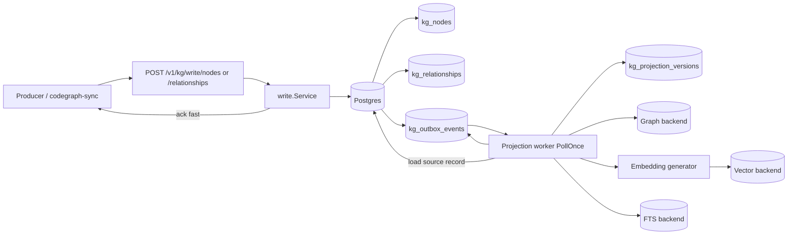
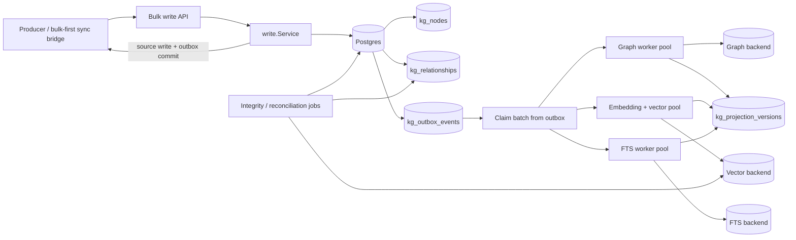

# Pipeline Flow Diagram

## Current State

```mermaid
flowchart LR
    Producer[Producer / codegraph-sync]
    WriteAPI[POST /v1/kg/write/nodes or /relationships]
    WriteSvc[write.Service]
    Pg[(Postgres)]
    Nodes[(kg_nodes)]
    Rels[(kg_relationships)]
    Outbox[(kg_outbox_events)]
    Versions[(kg_projection_versions)]
    Worker[Projection worker PollOnce]
    Graph[(Graph backend)]
    Embed[Embedding generator]
    Vector[(Vector backend)]
    FTS[(FTS backend)]

    Producer --> WriteAPI --> WriteSvc --> Pg
    Pg --> Nodes
    Pg --> Rels
    Pg --> Outbox
    WriteSvc -->|ack fast| Producer

    Worker --> Outbox
    Outbox --> Worker
    Worker -->|load source record| Pg
    Worker --> Graph
    Worker --> Embed --> Vector
    Worker --> FTS
    Worker --> Versions
```

## Target State

```mermaid
flowchart LR
    Producer[Producer / bulk-first sync bridge]
    BulkAPI[Bulk write API]
    WriteSvc[write.Service]
    Pg[(Postgres)]
    Nodes[(kg_nodes)]
    Rels[(kg_relationships)]
    Outbox[(kg_outbox_events)]
    Versions[(kg_projection_versions)]
    Claim[Claim batch from outbox]
    GraphPool[Graph worker pool]
    VectorPool[Embedding + vector pool]
    FTSPool[FTS worker pool]
    Graph[(Graph backend)]
    Vector[(Vector backend)]
    FTS[(FTS backend)]
    Jobs[Integrity / reconciliation jobs]

    Producer --> BulkAPI --> WriteSvc --> Pg
    Pg --> Nodes
    Pg --> Rels
    Pg --> Outbox
    WriteSvc -->|source write + outbox commit| Producer

    Outbox --> Claim
    Claim --> GraphPool --> Graph
    Claim --> VectorPool --> Vector
    Claim --> FTSPool --> FTS
    GraphPool --> Versions
    VectorPool --> Versions
    FTSPool --> Versions

    Jobs --> Pg
    Jobs --> Rels
    Jobs --> Vector
```

