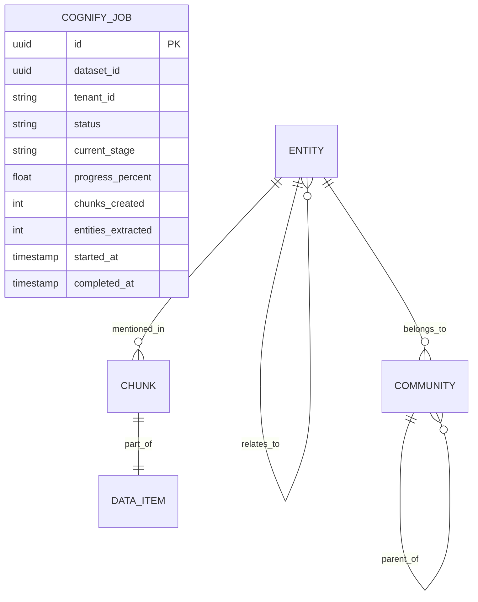

# cognee-cognify — Data Model

> **Database**: Neo4j (knowledge graph), Qdrant (vectors), PostgreSQL (pipeline state)

## PostgreSQL Tables

### `cognify_jobs`

| Column | Type | Constraints | Description |
|--------|------|------------|-------------|
| `id` | UUID | PK | Job unique identifier |
| `dataset_id` | UUID | NOT NULL, INDEX | Target dataset |
| `tenant_id` | VARCHAR(64) | NOT NULL, INDEX | Tenant isolation key |
| `status` | VARCHAR(20) | NOT NULL | PENDING / RUNNING / COMPLETED / FAILED / CANCELLED |
| `current_stage` | VARCHAR(30) | | Current pipeline stage name |
| `progress_percent` | DECIMAL(5,2) | DEFAULT 0 | Pipeline progress (0.0 - 100.0) |
| `error_message` | TEXT | | Error details if failed |
| `chunks_created` | INT | DEFAULT 0 | Metrics: chunks produced |
| `entities_extracted` | INT | DEFAULT 0 | Metrics: entities found |
| `relationships_extracted` | INT | DEFAULT 0 | Metrics: relationships found |
| `entities_deduplicated` | INT | DEFAULT 0 | Metrics: entities merged |
| `communities_found` | INT | DEFAULT 0 | Metrics: communities detected |
| `embeddings_generated` | INT | DEFAULT 0 | Metrics: embeddings produced |
| `started_at` | TIMESTAMPTZ | | Job start time |
| `completed_at` | TIMESTAMPTZ | | Job completion time |
| `created_at` | TIMESTAMPTZ | NOT NULL, DEFAULT NOW() | Record creation time |

## Neo4j Graph Model

### Node Labels

| Label | Properties | Description |
|-------|-----------|-------------|
| `Entity` | `id, name, type, description, tenant_id, dataset_id` | Named entities (Person, Org, Concept) |
| `Chunk` | `id, text, index, dataset_id, tenant_id, source_item_id` | Text chunks from documents |
| `Community` | `id, name, summary, level, tenant_id, dataset_id` | Graph communities with summaries |
| `DataItem` | `id, dataset_id, tenant_id, source` | Ingested data item references |

### Relationship Types

| Type | From → To | Properties | Description |
|------|-----------|-----------|-------------|
| `RELATES_TO` | Entity → Entity | `description, weight, tenant_id` | Semantic relationship |
| `PART_OF` | Chunk → DataItem | `position` | Chunk belongs to data item |
| `MENTIONS` | Chunk → Entity | `count, positions` | Entity mentioned in chunk |
| `BELONGS_TO` | Entity → Community | `level` | Community membership |
| `PARENT_OF` | Community → Community | `level` | Hierarchical community nesting |

## Qdrant Collections

### `cognee_chunks`

| Field | Type | Description |
|-------|------|-------------|
| `id` | UUID | Chunk ID |
| `vector` | float[1536] | Embedding vector (text-embedding-3-large) |
| `text` | string | Chunk text content |
| `dataset_id` | UUID | Parent dataset |
| `tenant_id` | string | Tenant isolation |
| `source_item_id` | UUID | Source data item |

### `cognee_entities`

| Field | Type | Description |
|-------|------|-------------|
| `id` | UUID | Entity ID |
| `vector` | float[1536] | Entity description embedding |
| `name` | string | Entity name |
| `type` | string | Entity type (Person, Organization, etc.) |
| `description` | string | Entity description |
| `dataset_id` | UUID | Parent dataset |
| `tenant_id` | string | Tenant isolation |

## Entity-Relationship Diagram

## Migration History

| Version | Date | Description |
|---------|------|-------------|
| 1.0.0 | 2026-05-09 | Initial schema: cognify_jobs table, Neo4j labels, Qdrant collections |
