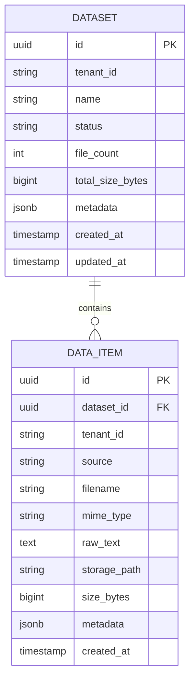

# cognee-ingestion — Data Model

> **Database**: PostgreSQL (metadata), MinIO/S3 (file storage), Redis (cache)

## Tables

### `datasets`

| Column | Type | Constraints | Description |
|--------|------|------------|-------------|
| `id` | UUID | PK, DEFAULT gen_random_uuid() | Dataset unique identifier |
| `tenant_id` | VARCHAR(64) | NOT NULL, INDEX | Tenant isolation key |
| `name` | VARCHAR(255) | NOT NULL | Dataset display name |
| `status` | VARCHAR(20) | NOT NULL, DEFAULT 'PENDING' | PENDING / READY / COGNIFYING / ERROR |
| `file_count` | INT | NOT NULL, DEFAULT 0 | Number of data items |
| `total_size_bytes` | BIGINT | NOT NULL, DEFAULT 0 | Total size of all items |
| `metadata` | JSONB | DEFAULT '{}' | Custom metadata key-value pairs |
| `created_at` | TIMESTAMPTZ | NOT NULL, DEFAULT NOW() | Creation timestamp |
| `updated_at` | TIMESTAMPTZ | NOT NULL, DEFAULT NOW() | Last update timestamp |

### `data_items`

| Column | Type | Constraints | Description |
|--------|------|------------|-------------|
| `id` | UUID | PK, DEFAULT gen_random_uuid() | Item unique identifier |
| `dataset_id` | UUID | NOT NULL, FK → datasets.id | Parent dataset |
| `tenant_id` | VARCHAR(64) | NOT NULL, INDEX | Tenant isolation key |
| `source` | VARCHAR(20) | NOT NULL | FILE / TEXT / URL |
| `filename` | VARCHAR(512) | | Original filename (for FILE source) |
| `mime_type` | VARCHAR(128) | | MIME type (application/pdf, text/plain, etc.) |
| `raw_text` | TEXT | | Extracted text content |
| `storage_path` | VARCHAR(1024) | | MinIO/S3 object key for raw file |
| `size_bytes` | BIGINT | NOT NULL, DEFAULT 0 | File/content size |
| `metadata` | JSONB | DEFAULT '{}' | Item-level metadata |
| `created_at` | TIMESTAMPTZ | NOT NULL, DEFAULT NOW() | Creation timestamp |

## Entity-Relationship Diagram



## Index Strategy

| Table | Index | Columns | Type | Purpose |
|-------|-------|---------|------|---------|
| `datasets` | `idx_datasets_tenant` | `tenant_id` | B-tree | Tenant isolation queries |
| `datasets` | `idx_datasets_tenant_name` | `tenant_id, name` | B-tree, UNIQUE | Unique name per tenant |
| `datasets` | `idx_datasets_status` | `status` | B-tree | Filter by status |
| `data_items` | `idx_items_dataset` | `dataset_id` | B-tree | List items per dataset |
| `data_items` | `idx_items_tenant` | `tenant_id` | B-tree | Tenant isolation queries |
| `data_items` | `idx_items_source` | `source` | B-tree | Filter by source type |

## Row-Level Security

```sql
ALTER TABLE datasets ENABLE ROW LEVEL SECURITY;
CREATE POLICY tenant_isolation ON datasets
  USING (tenant_id = current_setting('app.tenant_id'));

ALTER TABLE data_items ENABLE ROW LEVEL SECURITY;
CREATE POLICY tenant_isolation ON data_items
  USING (tenant_id = current_setting('app.tenant_id'));
```

## Migration History

| Version | Date | Description |
|---------|------|-------------|
| 1.0.0 | 2026-05-09 | Initial schema: datasets + data_items tables |
