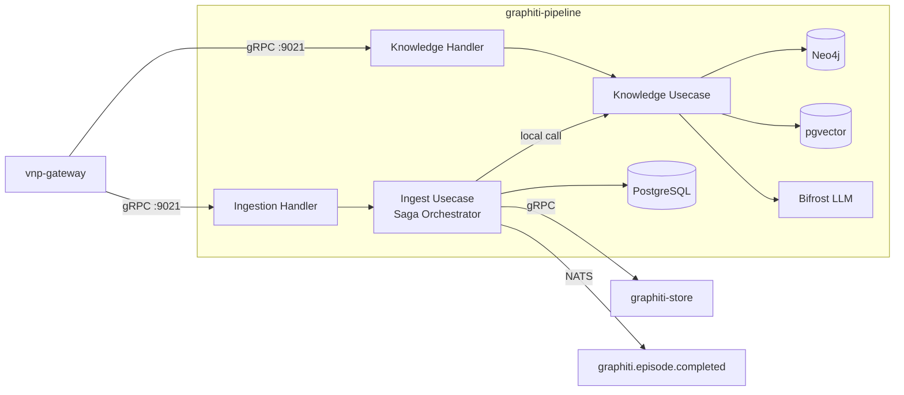

# graphiti-pipeline — Architecture

> **Pattern**: Pipeline Merge (Saga Orchestrator + Knowledge Extraction → Single Binary)

---

## Internal Layer Structure

```
services/graphiti-pipeline/
├── cmd/server/main.go
├── internal/
│   ├── domain/
│   │   ├── ingestion/      # Episode, IngestionJob, SagaState, Speaker
│   │   └── knowledge/      # Entity, Edge, Community, Embedding, TemporalWindow
│   ├── usecase/
│   │   ├── ingest/         # IngestEpisode, BulkIngest (saga orchestrator)
│   │   │                   # Saga steps call knowledge usecases LOCALLY
│   │   └── knowledge/      # ExtractEntities, ResolveEntities, ExtractEdges,
│   │                       # ResolveEdges, GenerateEmbedding, UpdateCommunity
│   ├── adapter/
│   │   ├── grpc/
│   │   │   ├── ingestion_handler.go    # GraphitiIngestionService (proto unchanged)
│   │   │   └── knowledge_handler.go    # GraphitiKnowledgeService (proto unchanged)
│   │   ├── repository/
│   │   │   ├── postgres/   # Episode, Job, SagaState tables
│   │   │   ├── neo4j/      # Entity, Edge, Community graph operations
│   │   │   └── pgvector/   # Entity/edge embeddings
│   │   └── event/nats/
│   │       ├── publisher.go   # Emit: graphiti.episode.completed
│   │       └── subscriber.go  # (none — graphiti-pipeline is a source)
│   └── infra/
│       ├── config/config.go
│       ├── server/grpc.go     # Register both gRPC services on :9021
│       ├── llm/bifrost.go     # LLM adapter for extraction
│       └── wire/wire.go
├── docs/
└── specs/
```

## Key Design Decisions

1. **Saga steps become local calls**: The 6-step saga (ExtractEntities → ResolveEntities → ExtractEdges → ResolveEdges → GenerateEmbedding → UpdateCommunity) previously required 6 cross-service gRPC calls from graphiti-ingestion to graphiti-knowledge. Now they are local function calls within the same binary.
2. **Compensating actions preserved**: Each saga step still has a compensation function for rollback. The pattern is unchanged, only the transport (gRPC → local) is different.
3. **graphiti-store remains separate**: The graph DB abstraction layer is shared between graphiti-pipeline and graphiti-search. It stays as an independent service.
4. **Per-group_id serialization**: Maintained via advisory locks + semaphore to ensure episode ordering within a group.

## External Dependencies

| Dependency | Purpose |
|-----------|---------|
| PostgreSQL + pgvector | Episode metadata, saga state, entity/edge embeddings |
| Neo4j | Knowledge graph storage (entities, edges, communities) |
| graphiti-store (gRPC) | Graph DB abstraction layer (shared with graphiti-search) |
| NATS | Emit `graphiti.episode.completed` → graphiti-search reindex |
| Bifrost (LLM) | Entity/edge extraction, deduplication, resolution |

## Component Diagram



## Known Limitations

- LLM calls are CPU/memory intensive — need bulkhead pattern to isolate from fast-path CRUD
- Neo4j driver connection pool shared between ingestion and knowledge — monitor under load
- Bi-temporal queries (valid_at/invalid_at ranges) require careful indexing strategy
