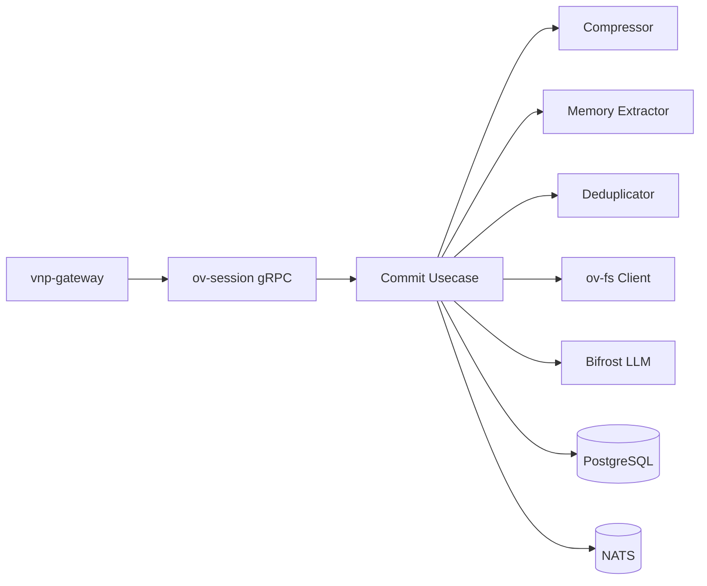

# ov-session — Service Architecture

> **Group**: OpenViking | **Pattern**: 4-layer Clean Architecture

## Layer Structure

```
services/ov-session/
├── cmd/server/main.go
├── internal/
│   ├── domain/
│   │   ├── model/
│   │   │   ├── session.go               # Session, SessionMeta, SessionStatus
│   │   │   ├── message.go               # Message, MessageRole, ToolCall
│   │   │   ├── working_memory.go        # WorkingMemory v2 struct
│   │   │   ├── memory.go               # CandidateMemory, MemoryCategory
│   │   │   └── compression.go          # SessionCompression, ExtractionStats
│   │   ├── repository/
│   │   │   ├── session_repo.go          # SessionRepository interface
│   │   │   └── message_repo.go          # MessageRepository interface
│   │   ├── event.go                     # SessionCommitted, MemoryExtracted
│   │   └── errors.go                    # SessionNotFound, AlreadyCommitted
│   ├── usecase/
│   │   ├── session_lifecycle.go         # Create, AddMessage, GetMessages
│   │   ├── commit.go                    # 2-phase commit (archive + extract)
│   │   ├── compressor.go               # v1 (legacy) + v2 (template) compressor
│   │   ├── memory_extractor.go          # LLM memory extraction (5 categories)
│   │   ├── memory_deduplicator.go       # Semantic dedup (CREATE/MERGE/SKIP/ARCHIVE)
│   │   ├── working_memory.go            # WM v2 CRUD
│   │   ├── port/
│   │   │   ├── input.go                # SessionUseCase, CommitUseCase
│   │   │   └── output.go              # FileWriterPort, LLMPort, EventPublisherPort
│   │   └── dto/
│   ├── adapter/
│   │   ├── grpc/handler.go              # OvSessionService gRPC
│   │   ├── event/publisher.go           # NATS publisher
│   │   └── client/
│   │       ├── fs_client.go             # ov-fs gRPC client (archive/memory write)
│   │       └── llm_client.go            # Bifrost LLM client
│   └── infra/
│       ├── persistence/
│       │   ├── session_repo.go          # PostgreSQL session repository
│       │   └── message_repo.go          # Message persistence
│       ├── config/config.go
│       └── wire/wire.go
```

## Key Design Decisions

### 2-Phase Commit (from `session.py` 107KB)

Phase 1 — **Archive**: SessionCompressor summarizes conversation, writes compressed archive to ov-fs.

Phase 2 — **Extract**: MemoryExtractor (LLM) extracts categorized memories, MemoryDeduplicator detects duplicates, writes unique memories to ov-fs.

### Memory Deduplication (from `memory_deduplicator.py`)

| Decision | Action |
|----------|--------|
| `CREATE` | New unique memory → write to ov-fs |
| `MERGE` | Similar existing memory → merge content |
| `SKIP` | Exact duplicate → discard |
| `ARCHIVE` | Outdated existing memory → mark archived |

### Compressor Versioning (from `compressor_v2.py`)

- **v1**: Legacy — simple concatenation + LLM summarization
- **v2**: Template system with structured extraction (facts, decisions, errors)

### Working Memory v2

Structured document that evolves during a session. Updated after each message. Persisted in PostgreSQL.

## External Dependencies

- **ov-fs**: Archive and memory file storage
- **Bifrost (LLM)**: Memory extraction, session compression
- **PostgreSQL**: Session metadata, messages, WM state
- **NATS JetStream**: Event publishing

## Component Diagram



## Known Limitations

- Memory extraction uses 2+ LLM calls per commit (cold-path, async preferred)
- Working Memory v2 schema may evolve — use JSONB for flexibility
- Compressor v2 requires prompt templates in `pkg/prompt/`
