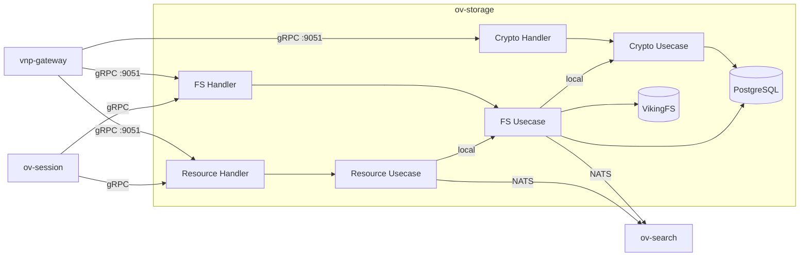

# ov-storage — Architecture

> **Pattern**: Functional Merge (Tightly Coupled FS + Crypto + Resource → Single Binary)

---

## Internal Layer Structure

```
services/ov-storage/
├── cmd/server/main.go
├── internal/
│   ├── domain/
│   │   ├── fs/         # File, Directory, PathLock, VikingURI, TieredLevel
│   │   ├── crypto/     # EncryptionKey, EnvelopeEncryption, KMSBackend
│   │   └── resource/   # Resource, ParseResult, WatchEvent, ParserType
│   ├── usecase/
│   │   ├── fs/         # ReadFile (calls crypto.Decrypt locally), WriteFile (calls crypto.Encrypt)
│   │   │               # Tree, Grep, Glob, Watch, PathLock management
│   │   ├── crypto/     # Encrypt, Decrypt, RotateKey, GetKeyMetadata
│   │   └── resource/   # Ingest (parse → write to FS locally), Watch, Refresh
│   ├── adapter/
│   │   ├── grpc/
│   │   │   ├── fs_handler.go        # OvFsService (proto unchanged)
│   │   │   ├── crypto_handler.go    # OvCryptoService (proto unchanged)
│   │   │   └── resource_handler.go  # OvResourceService (proto unchanged)
│   │   ├── repository/
│   │   │   └── postgres/   # File metadata, path index, key metadata
│   │   ├── storage/
│   │   │   └── vikingfs/   # VikingFS implementation (Go-native)
│   │   └── event/nats/
│   │       └── publisher.go   # ov.content.written, ov.content.deleted, ov.resource.ingested
│   └── infra/
│       ├── config/config.go
│       ├── server/grpc.go     # Register 3 gRPC services on :9051
│       ├── parser/            # tree-sitter, markdown, PDF parsers
│       └── wire/wire.go
```

## Key Design Decisions

1. **Transparent encryption**: ov-fs.ReadFile now calls crypto.Decrypt locally instead of cross-service gRPC. Same for WriteFile → Encrypt. Zero-change to caller behavior.
2. **Resource → FS local**: resource.Ingest parses content and calls fs.WriteFile locally — eliminates gRPC hop.
3. **`ov.crypto.key.rotated` becomes internal**: No longer emitted as NATS event since rotation is handled within same binary.
4. **External events preserved**: `ov.content.written`, `ov.content.deleted` → ov-search for index updates. `ov.resource.ingested` → ov-search for new content indexing.

## External Dependencies

| Dependency | Purpose |
|-----------|---------|
| PostgreSQL | File metadata, path index, encryption key metadata |
| VikingFS | Go-native filesystem (tiered L0/L1/L2 storage) |
| NATS | Content change events → ov-search |

## Component Diagram



## Known Limitations

- VikingFS is Go-native custom implementation — no third-party ecosystem
- PathLock contention under high concurrency — advisory locks may become bottleneck
- Key rotation requires re-encrypting all files — long-running operation needs background worker
