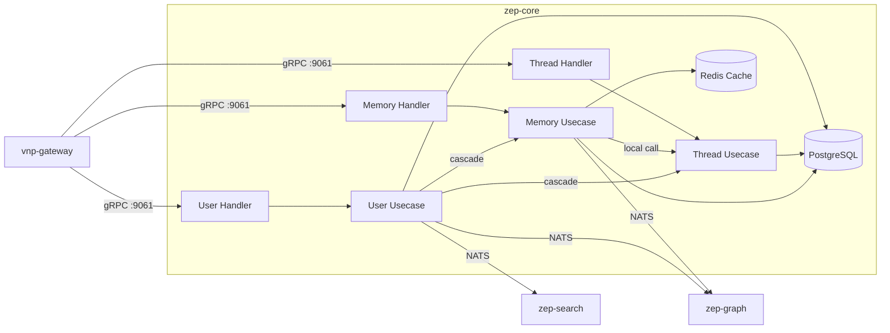

# zep-core — Architecture

> **Pattern**: Functional Merge (Tightly Coupled User + Thread + Memory → Single Binary)

---

## Internal Layer Structure

```
services/zep-core/
├── cmd/server/main.go
├── internal/
│   ├── domain/
│   │   ├── user/       # User, UserMetadata (JSONB merge-patch)
│   │   ├── thread/     # Thread, Session, ended_at lifecycle
│   │   └── memory/     # Message, ContextAssembly, FactOverlay
│   ├── usecase/
│   │   ├── user/       # CreateUser, UpdateUser, DeleteUser (cascade), ListUsers
│   │   ├── thread/     # CreateThread, EndThread, ListThreads, UpsertSession
│   │   └── memory/     # PutMemory (calls thread.UpsertSession LOCALLY), GetMemory
│   │                   # GetMemory: context assembly with fact overlay (sub-200ms)
│   ├── adapter/
│   │   ├── grpc/
│   │   │   ├── user_handler.go      # ZepUserService (proto unchanged)
│   │   │   ├── thread_handler.go    # ZepThreadService (proto unchanged)
│   │   │   └── memory_handler.go    # ZepMemoryService (proto unchanged)
│   │   ├── repository/
│   │   │   └── postgres/   # users, threads, messages tables (shared schema)
│   │   └── event/nats/
│   │       └── publisher.go   # zep.memory.messages.ingested, zep.user.deleted
│   └── infra/
│       ├── config/config.go
│       ├── server/grpc.go     # Register 3 gRPC services on :9061
│       └── wire/wire.go
```

## Key Design Decisions

1. **PutMemory hot path optimized**: `PutMemory` previously called `zep-thread.UpsertSession` via gRPC — now local function call. Expected latency improvement: -30-50ms per request.
2. **Sub-200ms context assembly**: `GetMemory` assembles context from messages + facts + metadata. All data in same PostgreSQL → single query round-trip.
3. **JSONB metadata merge-patch**: User/thread metadata updates use PostgreSQL advisory locks + JSONB merge-patch. Concurrency-safe within single binary.
4. **Cascade deletion**: `DeleteUser` cascades to threads and messages via local transaction (previously required cross-service coordination).

## External Dependencies

| Dependency | Purpose |
|-----------|---------|
| PostgreSQL + pgvector | Users, threads, messages, fact embeddings |
| Redis | Recent context cache, rate limiting |
| NATS | `zep.memory.messages.ingested` → zep-graph (KG extraction) |
|       | `zep.user.deleted` → zep-graph, zep-search (cascade) |

## Component Diagram



## Performance Requirements

- **PutMemory**: ≤ 200ms p95 (MUST — critical for real-time conversations)
- **GetMemory**: ≤ 200ms p95 (context assembly with fact overlay)
- **Connection pool**: Shared across user/thread/memory — reduces total PostgreSQL connections

## Known Limitations

- Fact ontology is managed by zep-graph, not zep-core — fact data replicated via NATS events
- Advisory lock contention on hot users — may need distributed lock for horizontal scaling
